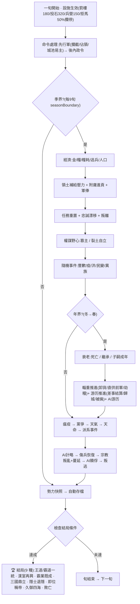
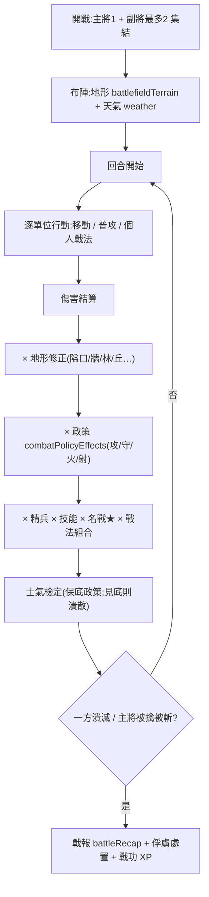
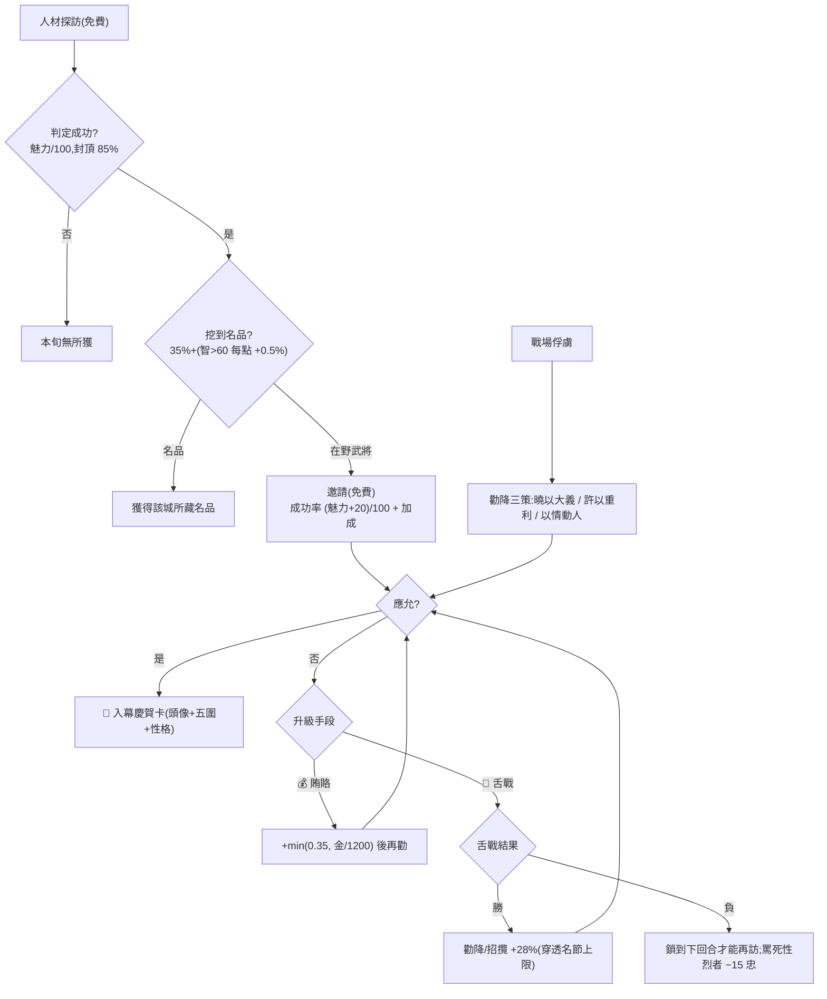
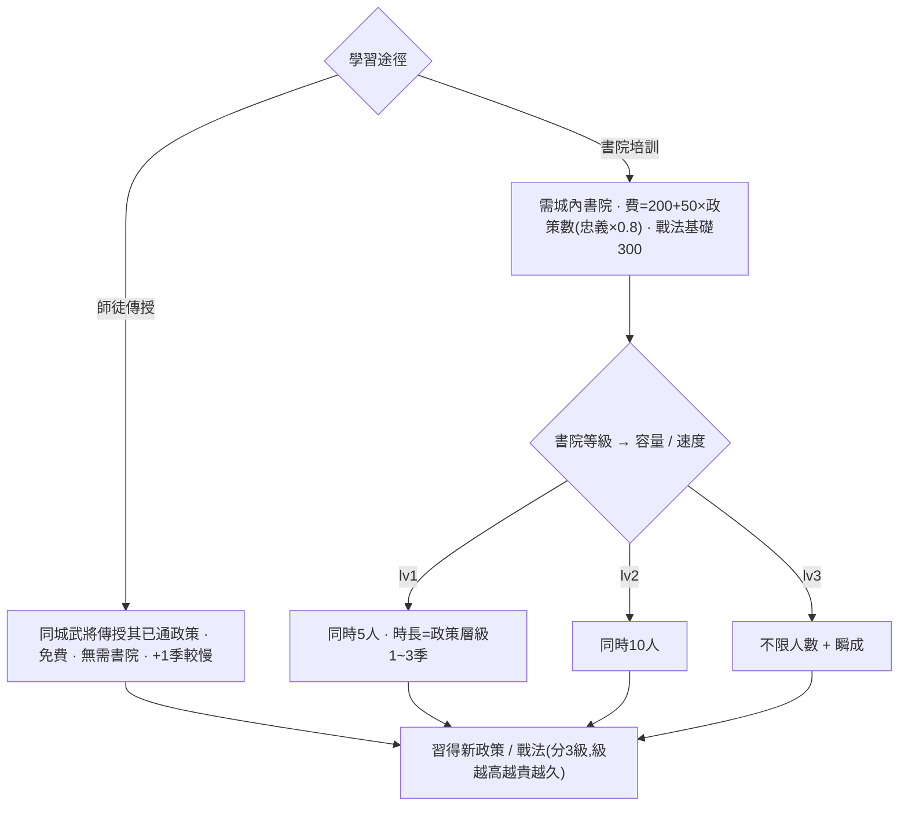
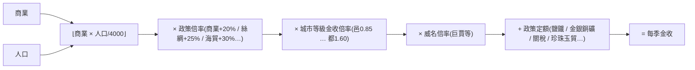

# 三國志大師 · 全功能攻略與設計文檔

> 一份「真相源」:既是玩家攻略(怎麼玩),也是設計/數值文檔(每個數字是多少)。
> 所有數值以 `src/game/` 代碼為準;改了機制請同步更新本文。
> 全十一章 + 流程圖 + 附錄已成 ✅。新增/改動機制時請同步更新對應章節。

---

## 目錄(所有遊戲內容地圖,74 個系統)

| # | 章節 | 涵蓋系統 | 狀態 |
|---|---|---|---|
| 速 | [速查總表 Quick Reference](#速查總表-quick-reference) | 一頁掃完所有關鍵常數 / 公式 / 成本 / 機率 | ✅ |
| 1 | [城市・內政・經濟](#第一章-城市內政經濟) | citySize, economy, commands, civicEvents, market(行情/榷場/馬市/鐵市), buildings, autoBuild, policyEffects, forging, specialties, specialtyEvents, tradeRoutes, convoy | ✅ |
| 2 | [武將・成長・家族](#第二章-武將成長家族) | growth, officerGrade, gradeCombat, officerFate, traitEffects, personality, biography, posthumous, aging, officerGen, family, retinues, wishes, rapport, relationshipEffects, career, codex, peerage, honorifics | ✅ |
| 3 | [人才・招攬・舌戰](#第三章-人才招攬舌戰) | commands(search), officerFate, debate, wordWar, commonerTalent | ✅ |
| 4 | [軍事指揮・委任](#第四章-軍事指揮委任) | muster, legion, governor, governorEval, advisor | ✅ |
| 5 | [戰術戰鬥](#第五章-戰術戰鬥) | tactical, combat, formations, stratagems, weather, battlefieldTerrain, personalTactics, weaponTypes, namedMaps, damagePredict, battleRecap, fogOfWar | ✅ |
| 6 | [單挑](#第六章-單挑) | duel, gauntlet | ✅ |
| 7 | [外交・謀略・天子](#第七章-外交謀略天子) | diplomacy, coalition, schemes, aiSchemes, ambition, espionage, expedition, foreignRealm, intrigue, courtFactions, factionEvents, emperor, imperialEffects, mandate, appointmentEffects, clans, statecraft | ✅ |
| 8 | [事件・天命・異族・宗教](#第八章-事件天命異族宗教) | events, historicalEvents, customEvents, factionEvents, religion, tribes | ✅ |
| 9 | [元遊戲・收藏・分享](#第九章-元遊戲收藏分享) | achievements, deedTitles, dailyChallenge, leaderboard, mods, powerHistory, historyBook, romance, sound, voiceLines, dialogueRoll | ✅ |
| 10 | [AI](#第十章-ai) | ai, aiBuild, aiCourt, aiAppointments, aiSchemes, aiRansom, aiWishesFlavor | ✅ |
| 11 | [核心流程・勝敗・培訓・其他模式](#第十一章-核心流程勝敗培訓其他模式) | resolution, endings, training, succession, objectives, hotSeat, spectator, heroMode, customOfficer, eventEditor, randomScenario, dynasties | ✅ |
| 圖 | [流程圖 Flowcharts](#流程圖-flowcharts) | 核心循環視覺化:結算順序 / 戰鬥管線 / 招攬升級 / 培訓 / 金收公式 | ✅ |

---

## 速查總表 Quick Reference

> 全部關鍵常數 / 公式 / 成本 / 機率一頁掃完;細節見對應章節。數值以 `src/game/` 代碼為準。

### 核心常數

| 常數 | 值 | 出處 |
|---|---|---|
| 屬性上限 STAT_CAP | 150 | growth |
| 升級經驗門檻(9 級) | 100 / 250 / 500 / 900 / 1500 / 2500 / 3800 / 5500 / 8000 | growth |
| 升級成長 | 每升一級長 1 圍(偏向缺口最大者),+1(25% 機率 +2),封頂該圍潛能 | growth |
| 潛能上限推算 | latent = min(150, 起始 + max(8, ⌊(150−起始)×25%⌋)) | growth |
| 品階(6 檔) | 鐵→銅→銀→金→白金→鑽石;評分 = 最高圍×0.55 + 均值×0.45 + √威望 | officerGrade |
| 轉生突破 | 滿 9 級可突破,費 800×(1+次數),潛能 +6/次,最多 5 次 | growth |
| 成年出仕 | 14 歲 | family |
| 子嗣潛能 | 起始 +25(5% 機率神童暴漲) | family |
| 義結門檻 | 好感 100 | rapport |
| 糧耗 | 0.25 /兵/季 | economy |
| 求賢令來投 | 35% /季;庶民五圍 30~70(12% 暗藏明珠 +15~35,封頂 98),忠誠 80 | commonerTalent |

### 城市・經濟

| 項 | 公式 / 值 |
|---|---|
| 金收 /季 | (⌊商業 × 人口/4000⌋ × 政策倍 × 等級倍 × 威名倍 × **品階理政倍** × **特產倍** + 政策定額) × **稅率** × **通膨** |
| 糧收 /秋 | ⌊農業 × 人口/1000⌋ × 等級糧倍 × 特產倍 × **天時倍(旱0.55/雨1.1)** + 義倉 |
| 度支淨金 /季 | 稅入 + 名產商路 + 通商條約 + 食邑 + 官署常俸 − **俸祿**;負則算府庫見底季數 |
| 鑄錢 | 即入 `1000 + 首都商業×30` 金,通脹 +18(漸消) |
| 勸募(募捐) | 即入 `Σ⌊(商業×12 + 人口/3000)×民忠/100⌋` 金,各城民忠 −8,**一年一次** |
| 富商借餉 | 即入本金 `clamp(Σ(商業×18+人口/2500), 2000, 25000)`;欠 `本×1.25`,分 8 季自首都償;債未清不可再借,付不出分期則首都民忠 −1 |
| 等級門檻(人口) | 邑 0 / 鎮 3萬 / 城 8萬 / 大城 16萬 / 都 28萬 |
| 人口承載力(上限) | ⌊(30,000 + 農業 × 1,500) × 民政倍(安民坊/水利,最多 ×1.3)⌋;對齊等級表(都=28萬),農業 ~167 達都,大都會 ~45–70 萬封頂 |
| 流民池 attrition | 未安置流民每季 −15%(無餘容也有界) |
| 治所 /首都 | 每季 +3 民忠 + 禁軍宿衛(+⌊人口×0.4%⌋ 兵);開局可選治所;**首遷免費**、之後 −800 金;失守 → 自動遷都 + 全境 −8 忠;AI 會戰略遷都 |
| 州牧(玩家專屬) | 委一將牧整州:該州己方各城每季 民忠 +1(治才≥80 則 +2)、金 +⌊政治/12⌋。治才=政×0.6+魅×0.4。不占用武將 |
| 攻城人口戰損 | 城陷 −20% 人口(四成化流民逃原主鄰城) |
| 流民池 | 萎縮城外溢半數入池;每季池中半數按「餘容×民忠×輕稅」分配給民忠 ≥50 之城 |
| 農商上限 econCap | 90 / 140 / 190 / 250 / 320(隨等級) |
| 命令增益 | ⌊有效屬性/14⌋ + ⌊max(0,有效屬性−70)/10⌋ + 1 + 隨機(0~1)(豐政 ×1.5 / 災異 −1~3) |
| 市易現價(spot) | 每金換糧 = 10 × 季節(秋1.3/冬.7/春.95/夏1.05) × 缺糧.6/滿溢1.25 × (1+商業/400),夾 4~22 |
| 市易價差・滑點 | 價差 10%×(1−商業/500),地板 3%;大單滑點 ≤50%(深度 買 2500+商×40 / 賣 6000+商×80) |
| 平糴平糶 | 常平倉 +.12/級、平準署 +.08/級(封頂 .6):平抑季節/缺糧波動、收窄價差、減滑點 |
| 榷場(borderTrade) | 通好接壤鄰邦互市,按對方行情定價;關稅 12%→市舶司每級減,地板 4% |
| 馬市・戰馬 | 產馬地(`horse`特產)每季育馬 ⌊40×徵兵倍×(.6+忠/200)⌋,單城封頂 6000;產地價賤;駐馬抬募兵上限;可隨輜重運送 |
| 鐵市・鐵 | 冶鐵地(`iron`特產)每季煉鐵 ⌊45×min(1.5,商倍)×(.6+忠/200)⌋,封頂 8000;產地價賤;存鐵≥300 鍛造 −30%金(耗鐵300);可隨輜重運送。買進轉賣≈打平(無現金泵) |
| 採藥・藥材 | 藥地(`herb`特產)每季採藥 ⌊35×發展度權重×(.6+忠/200)⌋,封頂 4000;季交時加速傷兵康復(耗藥)、瀕死救治、抑疫(§1.9) |
| 名產發展度 | 「興名產作坊」每級 +15% 名產之利與物資產出(0–5);費 ⌊(600+600×級)×(1−min(.3,商/400))⌋,需民忠≥40(§1.9) |
| 專營/壟斷・禁運 | 控天下某物資 ≥60% ×1.3、≥85% ×1.6;鹽鐵專營等政策金收隨持有產地放大;專營可禁運敵國(腰斬其控制力)(§1.9) |
| 名物萃京 | 每季按所控名產**種類數**(d×40+d²×6)+ 發展度 + **品類廣度**(cd²×12,涵蓋四類愈全愈肥),把商利匯入首都(需求側,§1.10) |
| 名產商路・互通有無 | 同主、**陸鄰或漕運**(港對港,×1.15)、≥1 名產則通商,雙方各得基準×稀有×發展:**跨類**(兵甲/糧鹽/工巧/藥石四類)85 > **同類異產** 55 > **同產** 35 > **單方** 40(§1.10) |
| 商路風險・護商 | 任一端鄰交惡之敵(關係≤−25)×0.45、民心<40(盜匪)×0.7,疊乘;任一端有**驛傳**則緩解(×0.8/×0.85);前線商路戰時自萎(§1.10) |
| 輜重直供前線 | 車隊可直送在野/圍城我軍,糧/援兵卸入該軍解孤軍深入;AI 亦前運糧秣接濟圍城之師(帶 ≤1500 後方護衛)(§1.10) |
| 主動劫糧(烏巢) | 派輕騎截劫偵見之敵糧道(其最近城為我城即可見);騎兵≥護糧則焚糧掠金擒將(損隨抵抗縮放),不及則被拒(損35%);**AI 亦對稱劫你糧道**,反制=配押運/謹慎/漕運(§1.10) |
| 名產↔戰鬥/武將 | 専才坐鎮(對口專才駐城 ×1.35)、戰陣藥營(藥材陣前降傷一級,耗120/人)、名駒入廄(名馬城牧得赤兔等坐騎)、匠籍神品(冶鐵城鍛造神品率+)(§1.9) |

### 內政命令成本(金)

| 命令 | 金 | 命令 | 金 |
|---|---|---|---|
| 人材探訪 | 0 | 鎮守 | 150 |
| 賑濟 | 糧(非金) | 民忠安撫・巡查肅貪 | 200 |
| 屯田 | 250 | 練兵 | 300 |
| 農業 / 商業開発・興学 | 300 | 徵兵 | 500 |
| 城壁修築・招撫流民・治水 | 400 | 出陣 | 100 |
| 大農政 / 大商政 | 1100 | 大築城 | 1400 |
| 城壁強化 | 1500 | | |

### 招攬・勸降・舌戰

| 項 | 值 |
|---|---|
| 在野招攬成功率 | (君主魅力 + 20) / 100 + 性格/出身/威名/羈絆加成(高潔 −10%) |
| 人材探訪 | 成功率 = 魅力/100(封頂 85%);先 35%+ 機率挖名品,否則出在野 |
| 賄賂 | +min(0.35, 金/1200) |
| 舌戰 | 勝 +28%(一次,穿透名節上限);負則鎖到下回合 |
| 勸降「曉以大義」對高潔上限 | 0.15 → 0.35 |
| 舌戰傷害 | 剋 ×1.6 / 被剋 ×0.5;口才 = 智×0.7 + 魅×0.3 |
| 游历腳程 | 來回 ≈ 單程 × 2 季;`speedMul` 0.7–1.4×(智 +勤奮快、懶惰/謹慎慢) |
| 游历歷練 | 歸城得 XP:城內 10+單程季×4;遠使 20+單程季×6,偏向差事屬性 |
| 游历探索 | 必開眼 18 旬;另擲 賢才 / 奇遇(金200–800・糧300–1100)/ 民心(+3~6) |
| 游历出使 | 外交關係 +12~25(無被擒之險) |
| 游历策反/刺探 | 成功 ≈ (智/魅) 適性 vs 守將忠;刺探開眼 30 旬+破壞;被擒險 8–55%(才高則低) |
| 遠使異域 | 單程 5–12 季;西域/倭/扶南/大秦+10 異族;得金/奇珍/異族兵/天命,降異族 aggression |
| 遠使凶險 | 該邦凶險 − 使才/300;遇劫空手受傷;凶險 ≥0.45(天竺/安息/大秦)或殞於道 |
| 絲路商路 | 遠使通成開常駐商路,每季入金 = 單程季×40(高昌200…大秦400);AI 亦遠使 |
| 途中際遇 | 在途每季 ~14%:出途斷橋/風沙 +1旬;歸途商旅 +金 / 盜匪 失金 |
| 遠邦關係 | 0–100,成功遠使 +18;降凶險 關係/400、提回報檔 關係/250 |
| 反向來使 | 已通商邦每季 6%+關係/500 遣使來朝,奉貢金(商利×2)+天命 |
| 異域義從 | 邊城 foreignAux 守備加成 = 1+min(0.15, aux/20000);關係≥50 可借兵成軍 |

### 戰鬥・單挑

| 項 | 值 |
|---|---|
| 單挑相剋 | 攻環 斬>劈>掃>斬;每招被一式防剋(劈←架、斬←閃、掃←格),另二式擋下 |
| 車輪戰疲勞 | 每場 −8 武力(封頂 −30),氣力續用累積 |
| 政策戰鬥加成 | 軍学 +10% 攻、弩兵 +30% 射、馬鎧 −20% 受傷…(全表見附錄) |
| 戰法熟練度 | 持有 ≥4/8/12 條 → 戰力 ×1.03 / 1.06 / 1.10 |
| 練度守城 | 守備加成 = 1+練度×0.0025(滿練 +25%)、守方減損 = 1−練度×0.0015(滿練 −15%);由 練兵/演習 累積,每季 −2(見 §1.3) |

### 培訓

| 項 | 值 |
|---|---|
| 書院政策費 | 200 + 50 × 已有政策數(忠義者 ×0.8) |
| 書院戰法費 | 基礎 300 |
| 書院容量 | lv1 5 人 / lv2 10 人 / lv3 ∞ + 瞬成 |
| 師徒傳授 | 免費、無需書院,+1 季較慢 |

### 衰老・結局

| 項 | 值 |
|---|---|
| 史實武將死亡率 | 卒年後 min(1, 0.3 + (當年 − 卒年) × 0.15) |
| 虛構/子嗣死亡率 | 60 歲後 (歲 − 60) × 0.05 |
| 生死設定(設定→遊戲) | 武將壽命 史實/虛構不老/全員不老 · 不會戰死(改負傷或被俘) · 起死回生(每年冬末 5%，至多 2 人，現身故鄉回復壯年) |
| 結局(9 種) | 王道一統 / 霸道一統 / 漢室再興 / 霸業既成 / 三國鼎立 / 隱士退隱 / 即位稱帝 / 久御四海 / 敗亡 |
| 開局設定(新局精靈/設定面板) | AI 強度 1–5(攻擊門檻 ×0.6–1.45 + 戰術 ±0.16) · AI 起始兵力 ×0.8/1/1.2 · 戰鬥難度(獨立) · 起始國力 ×0.7/1/1.4 · 經濟 起始稅率+通脹 · 壽命長短 ×1.6/1/0.5 · 在野登場 ×0.6/1/1.4 · 單挑頻率 ×0.5/1/2 · 天災頻率 ×0.5/1/1.7 · 新武將登場 0/.05/.12/.25/季 · 虛構人才庫 0/20/50 · 初始外交 逐鹿/亂世/結盟 · 鐵人模式 · 勝利條件 自由/統一/稱霸/三分 · 武將位置 歷史/隨機 · 戰霧 |

---

## 第一章 城市・內政・經濟

### 1.1 城市等級(citySize.ts)

城市等級**純看人口、實時自動升降**,不需手動、不花錢。

| 等級 | 人口門檻 | 農商上限 econCap | 防御上限 statCap | 兵力上限 | 金收倍率 | 糧收倍率 | 建築格 |
|---|---|---|---|---|---|---|---|
| 邑 Hamlet | 0 | 90 | 60 | 15,000 | ×0.85 | ×0.85 | 12 |
| 鎮 Town | 30,000 | 140 | 80 | 40,000 | ×1.00 | ×1.00 | 19 |
| 城 City | 80,000 | 190 | 100 | 85,000 | ×1.15 | ×1.15 | 28 |
| 大城 Large | 160,000 | 250 | 130 | 140,000 | ×1.35 | ×1.30 | 35 |
| 都 Capital | 280,000 | 320 | 160 | 250,000 | ×1.60 | ×1.50 | 44 |

- **承載力(人口上限)= ⌊(30,000 + 農業 × 1,500) × 民政倍⌋**:農業決定一城能養多少人,人口向此上限**邏輯成長**(越接近上限漲得越慢),超過則流民外遷拉回。所以升「大城/都」是**對農業的投資**,而非乾等。**刻意對齊等級表(都 = 28 萬),避免巨城失控(RoTK 體感):農業 ~167 才達「都」,即使滿級農政大都會也壓在 ~60–70 萬以內。**(實機 30 年模擬:最大城穩定在 ~45 萬、全圖人口溫和成長 +32%/30 年。)安民坊/水利提高承載力上限(最多 +30%,`growthAdd × 6`)。饑荒/民變仍無視上限照樣萎縮。**城內面板人口列顯示「承載力 N (X%)」進度條 + 飽和提示**。
- **升格/降格事件**:人口跨過門檻時跳出戰報 —— 升格 +2 民忠(民心歸附),降格示警。
- **AI 經營對等**:AI 在城市未滿承載力且有餘錢時會主動跑「招撫流民」催人口,並在升「城」後改用二級內政(大農政/大商政/大築城)—— AI 也會把城養大、吃 tier 解鎖,單機難度不因這套系統而塌。AI 亦會在**糧道吃緊時屯田**(`兵≥2000 且 糧<兵×4`)、**前線要塞練兵**(`兵≥3000 且 練度<60`)。
- **委任太守對等(governor.ts)**:玩家委任的太守不再只會五道基礎令 —— 現按「**平亂(撫民/賑濟)→ 肅貪(貪腐≥40)→ 補軍 → 屯田(糧緊)→ 開發落後支柱(滿城餘錢用大政)→ 城壁/練兵/招撫流民/治水**」的優先序施政,委任城發展得與 AB 自營城一樣深。
- **大軍規模 + AI 建軍**:兵力上限整體上調(邑15k/鎮40k/城85k/大城140k/**都250k**;與人口/承載力解耦,不動人口),AI 主動把守軍補到**上限的 ×0.75(前線)/×0.5(後方)**(非只在快空時補),後方餘兵由增援運往前線。募兵吞吐上調(每次 `魅力×50+800`、`sizeMax=上限/8`、`pop/60`),每兵抽 1.4 民(大軍不抽乾城、人口不必上調)。糧耗(0.25/兵)是天然上限 —— 大軍須有大農業餵養。(實機 30 年:全圖兵力 ~55–70 萬,最強城可養 **~8–15 萬**(實機見 北平 15.3 萬)大軍。)
- 升「城」(8 萬)解鎖二級內政:大農政、大商政、大築城、城壁強化。
- **城格解鎖建築(BUILDING_MIN_SIZE)**:大型工程需城市夠大才能興建,玩家與 AI 皆受限(自動建造佇列會等城市夠大再起工),把「升城」變成**質變獎勵**:
  - 城 City:市舶司、鴻臚館、軍器監、甕城、藏書閣、樓船署
  - 大城 Large:太學、平準署、烽燧
  - 都 Capital:武學堂
- **治所/首都(force.capitalCityId)**:
  - **開局選治所**:多城勢力可在新局精靈「開局設定」步驟,以下拉選單指定起始治所(免費;單城勢力不顯示)。
  - **遊戲中遷都**:城內面板「遷都至此」按鈕,可遷至任一本軍城池(`relocateCapital`)。**首次遷都免費**(`capitalMoveUsed`,每局一次),之後每次 800 金;新都 +5 忠、舊都 −3 忠。城內面板頂端對治所顯示「★治所」徽記。
  - **治所效益**:政令外交所出之地,每季 **+3 民忠**(向心)+ **禁軍宿衛**(民忠 ≥40 時每季 +⌊人口 ×0.4%⌋ 兵,封頂於兵力上限)—— 治所自帶守軍,愈難攻克,選都/守都有戰略分量。
  - **AI 戰略遷都**:AI 會主動把治所遷往**更大、更安全(非前線)**的內陸城(治所價值 ≥1.4× 才遷,避免反覆橫跳)。
  - **失都**:治所被攻陷時自動遷往本軍最大城,且**全境民忠 −8**(失都動搖)。
- **攻城人口戰損(兵燹)**:城池被攻陷時人口 **−20%**(戰死+流亡),其中四成化為**流民**逃往原主鄰城(若有)。故攻下的大城會殘破、可能暫時跌格,須休養或重建 —— 與焦土/重建(§see 焦土)連成一線。
- **流民池(refugees.ts)**:全局**流民**池在各勢力間共享。每季饑荒/民變使萎縮城**外溢人口的一半**注入池中;池中**半數**按「餘容 × 民忠 × 輕稅吸引」分配給歡迎流民的城(民忠 ≥50 才吸納);**未安置者每季 −15% 流散**(即使天下城池皆滿,池也有界,不會無限膨脹)。富庶輕稅之國因此能**被動吸走**他國暴政逼走的人口。度支簿(財政面板)顯示「天下流民」存量。
- **建築格 = 該城可同時擁有的自建建築總數的硬上限**(邑12 → 都44),玩家與 AI 皆受限;格滿時只能升級既有建築,無法再蓋新設施 —— 養大城市才能容納更多建築。升級既有建築不佔新格。目前可建類型共 41 種(都城上限 44 留有餘裕);3D 城景(30×19 網格)的地基數依建築類型數自動裁切,每種建築各一棟,不留空地基。
- **建築加成皆已接入模擬**:商業/農業類乘季度金糧收、城防類加攻城守備(樓船署限水戰)、徵兵/兵力上限類提高每季徵兵、書院/太學/武學堂/藏書閣類加速武將歷練、水利抗旱、安民坊增人口、市舶司增通商歲入、驛傳增運量、招賢館增招攬、諜報司/烽燧/斥候營調諜報成功率、傷兵營加速療傷、道觀抗邪教、將作監降建築造價/工期、酒肆增武將情誼、牢城抗離反割據、軍器監精煉折價+機率精煉+2階、平準署消通膨、鴻臚館強外交。
- `loyaltyCap` 恒為 100。

### 1.2 季度收支(economy.ts,每季結算一次)

- **金收** = (⌊商業 × (人口 / 4000)⌋ × 政策倍率 × 等級金收倍率 × 威名倍率 × **品階理政倍** × **特產倍** + 政策定額) × **稅率倍** × **通膨倍**
  - 例:商業 25、人口 10 萬 → 25 × 25 = 625 金/季(邑級再 ×0.85),再依下列各乘數調整。
  - **+1 商業 ≈ +(人口/4000) 金/季**(10 萬人口 ≈ +25 金/季)。
  - **品階理政倍**:駐城最高品階文官每高一檔 +3%(金牌 ≈ +6%、鑽石 ≈ +12%)。
  - **特產倍**:該城若有名產(蜀錦/鹽/名馬…)永久加成,見 §1.9。
  - **稅率倍**:輕稅 ×0.7(+2 民忠)/ 常稅 ×1.0 / 重稅 ×1.4(−3 民忠)。
  - **通膨倍**:鑄小錢等推高通膨,稅入最多縮 −40%(僅玩家勢力結算)。
- **糧收**(僅秋季) = ⌊農業 × (人口 / 1000)⌋ × 等級糧收倍率 × 特產倍 × **天時倍** + 義倉額外糧。
  - **天時倍**(weather.ts):旱災 ×0.55、久雨 ×1.1、其餘 ×1.0。旱災另使該城**民忠 −2**(饑荒之憂)。
- **糧耗** = ⌈兵力 × 0.25⌉ /季。糧不足 → 逃兵(缺多少糧按 0.25/兵折算開小差)。
- **人口增減**(僅秋季):民忠高 + 糧有盈餘 → 增長;反之萎縮。增長受**承載力**封頂(見 §1.1),越接近上限漲越慢,超過則外遷。升級全靠人口,故「**衝農業拉高承載力** + 囤糧 + 保民忠 + 招撫流民」是升城四件套。
- **通商條約收入**:每份同盟/互不侵犯的通商條約,雙方各得 **200 金/季**(交戰期間休眠)。

#### 度支簿 — 全境收支總帳(BudgetModal,`realmBudget()`)

度支簿不再只列各城「毛稅入」,而是把每城稅入/秋收與**勢力層級的金流**一起結算成一張損益表,底線即為真實**淨收支**(與季結算引擎用同一批函式,不是估算):

- **金 · 收支**:稅入(各城)+ 名產商路 + 通商條約 + 食邑 + 官署常俸 − **俸祿(軍餉)**。
  - **俸祿**:每名在籍武將依其將軍號領常俸(見 §6 將軍號譜系的 stipend),每季自首都府庫支出;府庫不足則欠餉,全軍忠誠 −2。**這是過去面板看不到的最大支出項**。
  - 食邑(§6 爵位)與官署常俸(§6 九卿/尚書台)逐季入首都,亦計入收入。
- **糧 · 收支**:秋收(各城,僅秋季)+ 食邑糧 + 官署糧 − 兵糧(`兵×0.25/季`)。
- **府庫見底倒計時**:若淨金/淨糧為負,面板算出「府庫/存糧 X 季見底」紅字預警。
- **府庫沿革**:記錄最近 8 季季末府庫金,繪迷你折線,看出國本是增是耗(含戰費等所有開銷,比單看預算更實)。
- **天時入帳**:預測直接讀當季天氣 —— 旱災時秋收欄按 ×0.55 顯示,不再固定晴天高估。
- **應急籌款**兩杠杆:
  - **鑄錢**:即入一筆金(`1000 + 首都商業×30`),代價是通脹 +18(蝕日後稅入,漸消)。
  - **勸募(募捐)**:向民間募款,即入 `Σ⌊(商業×12 + 人口/3000) × 民忠/100⌋` 金,代價是**各城民忠 −8**;**一年一次**(隔 4 季)。富而民安之國募得多,怨聲載道之國募得少。

### 1.3 內政命令(commands.ts)

每名武將每季可下一道令。增益 = `⌊有效屬性/14⌋ + ⌊max(0,有效屬性−70)/10⌋ + 1 + 隨機(0~1)`,有效屬性 = 武將屬性 × 性格契合 × 官職加成。

- **70 以上有精英尾巴**:每超 10 點再 +1,讓政治/魅力 90+ 的名臣明顯勝過 60 的庸吏(舊版 20 一檔,80 與 60 同基礎,「頂級文官優勢有限」已修正)。
- **良吏豐政**:小機率暴政(機率隨屬性升,基礎 6%~ 上限約 12%),該季增益 ×1.5,報告裡自然顯示為更大的 +N。
- **災異(與豐政對稱)**:勸農/興商/築城三項基礎令有小機率不進反退(蝗旱/市亂火患/失火坍塌,設施 −1~3)。風險基礎 ~4%,**民忠跌破 60 後攀升至 ~14%**,能吏(政治/魅力>70)可壓低。**大政令(大農/大商/大築)不再完全免疫**:以 ~0.35× 的折減風險運作,但一旦出事設施倒退加倍(大工程一旦失敗,虧得更慘)。
- **天時聯動**:當季天氣會撥動結果 —— **旱**令災異 +6%(久旱蝗起、木乾易燃)、**雨**令災異 −1%;**旱年賑濟 ×1.5**(饑時放糧最得人心)。
- **滿倉轉用(到頂不空轉)**:基礎開發令撞到該等級上限時不再空耗一季 —— **勸農**到頂改囤餘糧(+糧)、**興商**到頂經市得利(+金)、**築城**到頂改在城上閱武練兵(+練度)。升城前頂級文官仍有去處。
- 勸農/興商/築城/撫民/賑濟 共用此增益曲線。

| 命令 | 費用 | 屬性 | 上限 | 等級要求 | 說明 |
|---|---|---|---|---|---|
| 農業開発 | 300 | 政治 | econCap | — | 勸農,提升秋收糧 |
| 商業開発 | 300 | 政治 | econCap | — | 興商,提升金收 |
| 城壁修築 | 400 | 政治 | statCap | — | 提升城防,守城減損 |
| 徴兵 | 500 | 魅力 | 兵力上限 | — | 徵募,耗人口(每兵 −2 人口) |
| 民忠安撫 | 200 | 魅力 | 100 | — | 提升民忠;**近上限遞減**(民忠≤60 全效,之後按 (100−民忠)/40 衰減,單靠撫民難拉滿) |
| 賑濟 | **糧** | 魅力 | 100 | — | 開倉放糧:耗**糧**(≈人口×2%,最低 500)換大幅民忠,**不受撫民遞減**可拉滿;空倉則無法施行;**旱年民感尤深 ×1.5** |
| 巡查肅貪 | 200 | 政治 | 貪腐→0 | — | 追贓:**回收金隨累積貪腐放大**(`商業×1.5 + 政治×2 + 貪腐×8 + 貪腐×商業×0.15`)+ 民忠(不受撫民遞減);並把**貪腐壓回**(每次清 `max(8,政治/6)`,積重者一次掃不盡) |
| 屯田 | 250 | 統率 | — | — | 軍士耕屯:出**糧**(`√兵力×(8+統×0.15)`)**不耗民口**,墾田另小增農業;空城無兵可耕。**民忠<35 時 ~20% 兵怨逃屯**(逃散、收成減半)。養大軍、護前線糧道的支柱;`治軍嚴整`(鐵律/武勇/宿將)+20% |
| 練兵 | 300 | 統率 | 練度 0→100 | — | 操演守軍,**練度 +N**(近上限遞減);練度給**守城防禦力加成**(滿練 +25%)+**守方減損**(滿練 −15%),皆守城時生效,每季自然 −2 緩降。與 **演習**(亦 +3 練度)互補;`治軍嚴整` +20% |
| 興学 | 300 | 知力 | — | — | 講學:**在城所有武將獲 XP 爆發**(`10+智×0.4`,書院/太學再 ×xpMul);文教之城育才更快 |
| 治水 | 400 | 政治 | floodWorks 0→3 | — | 修堤:堤工 +1(與**堤防**建築疊加至洪災免疫上限 3,見 §1.6 堤防)+ 水利惠農小增;堤工+堤防已達 3 則無效 |
| 人材探訪 | **0** | 魅力 | — | — | 免費!成功率 = 魅力/100(封頂85%) |
| 招撫流民 | 400 | 魅力 | — | — | 加人口 → 推動升城;**城越大吸引越低**(邑×1.0→都×0.4),魅力<80 民忠 −1 |
| 鎮守 | 150 | 統率 | — | — | 驅逐外圍敵軍 + 城防小增 |
| 大農政 | 1100 | 政治 | econCap | 城+ | 3× 勸農,**一季完成(省行動,金有溢價)** |
| 大商政 | 1100 | 政治 | econCap | 城+ | 3× 興商,一季完成 |
| 大築城 | 1400 | 政治 | statCap | 城+ | 3× 築城,一季完成 |
| 城壁強化 | 1500 | 政治 | wallTier 1→3 | 城+ | 城牆層級,T2 +18% / T3 +40% 守備 |
| 出陣 | 100 | 統率 | — | — | 行軍至鄰城 |

- **性格契合**:⭐ 相宜(≥1.15× 加成)/ ⚠ 相剋(≤0.85× 折扣)。派對性格的人。
- **屬性回報**:14 一檔起步、70 以上每 10 點再 +1,名臣回報明顯;噪音收緊為 0~1,高手既高又穩。
- **大政令取捨**:效果 3× 但金有溢價(大農/商 1100>3×300、大築 1400>3×400),賺的是「一個行動名額辦三季的事」,缺金時基礎令仍有價值。
- **貪腐(corruption,0~100)**:富庶大城若久不稽查,**貪腐逐季滋生**(≈ `(0.6 + 商業/120 − min(0.6, 在城最高政治/130)) × 性格倍`,越富越長;能吏**壓得慢但壓不死**(政治抵減封頂 0.6);`贪婪/饕餮` ×1.5、`清廉/節儉/鐵律` ×0.5)。**蝕金收**最多 −40%(滿腐時 `金收×0.6`);**貪腐 ≥60 另咬民忠 −1/季**(貪墨生怨)。**過 50/75 時季報跳警告**,提醒去巡查。**巡查肅貪**一掃即把它壓回並追回贓款 —— 越拖越肥,掃一次的回收也越大。
- **練度(drill,0~100)**:由 **練兵** 令與 **演習** 累積,**守城時加防禦力**(每點 +0.25%,滿練 +25%)+**守方減損**(每點 −0.15%,滿練 −15%),每季自然 −2,鬆懈即退。前線要塞值得常練。
- **選將可多選**:一次勾多員一起委派,人材探訪免費可全城齊出。
- **協同施政(assistantOfficerIds)**:勾 2–3 員時,除了「分別委派」(各下一道令、各付一份金、產出線性疊加),還可選「**協同施政**」——**最契合者主政、其餘襄助**,只付**一份**金,襄助者按 **0.5× / 0.3×** 遞減把自己的(性格調整後)屬性加進主政者的有效屬性。產出比「分別委派」少(遞減 < 線性)但**省金**,且**襄助者亦得內政歷練**(名臣帶新人邊做邊學)。權衡:急著一季把關鍵城某項衝上限、或想省金練新人 → 協同;純要產出最大且不缺金 → 分別委派。襄助者同標記為忙(`task`),取消主政令即釋放全部。AI 暫不使用協同(玩家專屬)。

#### 內政事件(civicEvents.ts) — 把數字變成故事

每季結算後,各城至多觸發**一樁內政事件**(視狀態與機率),讓貪腐/練度/屯田不只是後台數字,而是季報裡會記得的瞬間:

- **貪腐醜聞**(貪腐 ≥55,機率隨貪腐升):貪官攜公帑潛逃 —— 失金(`200+貪腐×12`)、民忠 −4、貪腐被揭 −10(但未根治)。這是**放任貪腐的懲罰**,提醒你去巡查肅貪。
- **校場揚威**(練度 ≥80,~15%):大閱校場,軍威赫赫,民忠 +2。練到頂的正向回饋。
- **屯田豐收**(秋季 + 守軍 ≥8000 + 農業 ≥60,~20%):屯田大熟,軍糧充盈(`+守軍×6%` 糧)。軍屯重鎮的豐收獎勵。

事件自動結算、寫入季報(AI 城同享)。30 年模擬中「屯田豐收」自然觸發數十次;醜聞/揚威多由玩家極端局面(疏於肅貪、刻意練滿)引出。

### 1.4 城內理政入口(城內 3D 地圖)

進城點對應建築即可下令、當場看數值:

- **屯田 田畝** → 勸農 / 大農政 / **治水**(顯示 農業 X/econCap)
- **市集 商坊** → 興商 / 大商政(顯示 商業 X/econCap)
- **府衙 治所** → 民忠安撫 / 賑濟 / 巡查肅貪 / 招撫流民 / **興学**
- **兵營 校場** → 徵兵 / 屯田 / 練兵 / **鎮守**
- **酒樓** → 人材探訪
- **城牆 城門** → 城壁修築 / **大築城** / 城壁強化

低於建築所需城格的二級令(大築城等)按鈕自動隱藏。**所有非 march 的內政令現皆有城內 3D 入口**,與大地圖指令面板對齊(兩個入口並存)。

- **施政預覽(下令前看回報)**:可量化的令(勸農/興商/築城/大農政等/撫民/徵兵/練兵),指令按鈕直接標出**城中最佳在野文武**約可得的增益(如「勸農 +5」);府衙理政的武將清單亦逐員列出該員的預估值(`≈ 農業 +N`),擇人不再憑感覺。預估為**期望值**(去隨機、去暴政災異、計入個性契合與官爵理政倍),實際結算仍有 ±1 浮動與良吏豐政暴擊。
- **自建建築可點閱**:城內玩家自蓋的建築(書院/市舶司/軍器監…)點之即顯示其類別、等級與**已接入模擬的加成說明**;**文教類**(書院/太學/藏書閣/武學堂)可就地下**興学**,並顯示在城武將員數(興学講學的受益面)。
- **地標報時/瞭望**:鐘樓・鼓樓點之**報時**(當前年・季 + 在城武將數);寶塔**登高瞭望**最近一座異旗之城(方位 + 城名 + 所屬,四鄰皆我則報「邊塵不驚」);園林記在城雅集之眾 —— 城景地標皆可點、皆有活文本。
- **府衙就地度支**:點府衙除理政外,直接顯示**本城季度損益**(季金稅入 / 季糧淨收 / 人口季變,與季結算同一引擎 `tickCityEconomy`,非估算),不必回平面度支簿。
- **府衙治所/遷都**:府衙卡對治所顯示「★ 本城為治所」徽記;非治所則就地給「遷都至此」鈕(`relocateCapital`,首遷免費、之後 800 金)。
- **市集就地市易**:點市集可金⇄糧**互市**(`tradeFood`),浮卡顯示本城當季糧價(`foodRate`,隨季節/存糧/商業浮動)與各檔買賣即時報價。
- **一鍵委派**:城景頂欄按鈕(有閒置武將時顯示),把城中閒置武將按需求×適性自動派活(`autoAssignIdle`);委任太守自理之城不計入。

#### 城景視覺(數值/狀態看得見)

城內 3D 不只隨季節換裝,城市的**天時與狀態**亦直接反映在畫面上 —— 一眼讀出這城出了什麼事:

- **天時進城**(`weatherKind`):**旱災** → 天光發黃、揚塵粒子、農田枯黃(青翠度 ×0.32);**久雨** → 斜落雨絲 + 天色壓暗轉灰;**大風** → 風捲塵屑。(原本只有「季節」換光與落雪/落葉/花瓣,真正的天氣只影響數值、不進畫面。)
- **焦土殘破**(`city.ruined`):被攻陷化焦土之城顯現斷壁殘垣、黑煙柱、行人/燈火盡滅、天光黯淡褪色 —— 攻城兵燹一望可知,與「攻城人口戰損」「重建」連成一線。
- **★治所**:本軍治所府衙上方升一面**鎏金華蓋 + 高桅大旗**,遠看即知都城;府衙浮標亦轉為「★ 治所」。
- **城壁等級**(`wallTier` 1/2/3):城牆隨等級**變高變厚**,三級堅城(合肥/長安/洛陽式)另加石腰線,巍然如壁。
- **名產風物**(§1.9 特產):有名產之城,市集旁陳一垛貨物並掛名產字標(蜀錦/鹽/名馬…),呼應其商利/糧產加成。
- **駐軍旌旗**:校場按守軍規模列旗(每 ~1.2 萬兵一面、封頂八面),大軍駐城旌旗如林。
- **施政中**(讀 `pendingCommands`):本城**已下而未結算**的令,對應地標即活起來 —— 屯田有田間出工、校場操演列槍、城牆搭起腳手架、府衙官民聚理、市集興販、酒樓訪賢;各帶脈動光環與「…中」字標,一眼看出這季城裡在忙什麼、忙在何處。
- **城景音效**(`playSfx`,合成音、可於設定關閉):進城開城聲、退出 whoosh、點地標 click、開理政面板、委派(徵兵鳴鐘/付費施政錢響/免費差事輕擊)、市易錢響、一鍵委派鳴鐘、遷都鳴鑼、建城/升級夯擊 —— 城內操作皆有聲回饋,疊在原有城市環境音之上。

#### 慶典彈窗(里程碑圖/影)

達成里程碑時全屏彈出一張慶典圖(或短片),配victory 音與淡入動畫,點/「繼續」/逾時(5秒)收起。事件入 `popupQueue`(`pushPopup`/`dismissPopup`),於 `MapScreen` 全局掛載 `CelebrationPopup`,故大地圖/城內皆會顯示。目前觸發:**遷都成功**(`capital-set`)、**升城**(`city-upgrade-<等級>`,季結算偵測玩家城跨級晉升)、**城內建築竣工**(`building-complete`,季結算偵測 level 0→≥1)、**訪賢得士**(`officer-recruited`,招攬/勸降來投)、**堅城落成**(`wall-citadel`,城壁強化至 3 級)。

- **素材約定**:每個 key 對應 `public/popups/<key>.png`(圖)或 `<key>.mp4`(影)。**檔案缺失時自動降級為樣式卡**,不報錯 —— 系統先行,素材後補即自動點亮。已知 key 與建議畫面見 `public/popups/README.md` 與 `src/ui/popups/assets.ts`。
- **擴充**:任何動作呼叫 `pushPopup({ key, media, titleZh, titleEn, captionZh?, captionEn? })` 即可加新慶典(竣工、名將登場、統一…)。

### 1.5 市易(market.ts)

城內「市易」金糧互市,**現價(spot)** = 每金可換糧數,範圍 4~22:

- 季節:秋 ×1.3(穀賤)、冬 ×0.7(穀貴)、春 ×0.95、夏 ×1.05。
- 缺糧之城(存糧 < 兵×2)價漲(×0.6);糧倉滿溢(> 兵×8)價跌(×1.25)。
- 商業越高現價越好(+商業/400)。

**價差(spread)**:基礎雙向抽一成,但**商業越旺價差越窄**(商業/500,最多 −60%,地板 3%)——商賈雲集、買賣都更划算。來回倒手仍必虧,要靠真實價差套利。

**大單走價(price depth)**:市場非無限流動。一筆訂單相對該城「市場深度」越大,越會把價格推向不利的一側——**大買壓低拿到的糧/金、大賣壓低賣出的金/糧**(單筆最多滑點 50%)。深度隨商業增厚(買:2500+商業×40 金;賣:6000+商業×80 糧)。這堵死了「在便宜城無限刷糧再運走倒賣」的舊套路——要分批、分城、分季節。

**平糴平糶(常平倉 / 平準署)**:這兩棟建築的 `priceStability`(常平倉 +0.12/級、平準署 +0.08/級,合計上限 0.6)實際接入市易——**把季節/缺糧的價格擺動拉回中性、收窄價差、並減弱大單滑點**。囤了常平倉的城是穩定的糴糶樞紐,適合做大宗中轉而不被滑點吃掉。

**行情(marketOutlook)**:市易浮卡顯示**現價檔位**(穀賤/平/穀貴,以商業中性價為基準)、**來季走向**(↓賤/→平/↑貴,由季節係數推算)、與**衝擊預警**——兵臨城下(圍城需求暴增)、新遭災歉(`lastReport` famine/flood)、旱情(`weather`)各出一條 ⚠。讓你預判而非事後才發現糧價已飆。

**榷場(borderTrade)**:與**接壤且通好**(同盟/互不侵犯)的鄰邦城市互市——**糴**(向對方買糧)或**糶**(賣糧給對方),按**對方城**的行情定價(可套對方的穀賤穀貴),另收**榷場關稅**(基礎 12%,本城 `市舶司` tradeMul 每級遞減,地板 4%);糧與金在兩城府庫間即時轉移。對方不會把自家駐軍糧/府庫掏空(留兵×2 糧緩衝、金不足則拒交)。外交與經濟首次打通——盟友的糧荒是你的生意。**AI 雙向使用**:糧倉滿溢的 AI 城會把餘糧透過榷場**賣給**接壤通好缺糧鄰邦;反之,**缺糧**的 AI 城也會主動向有餘糧的通好鄰邦**籴糧**(僅 AI↔AI,不會擅動玩家府庫)。友邦經濟互通,不再一邊爛穀一邊餓殍。

**馬市(horseRate / buyHorses / sellHorses)**:**戰馬**是第二種商品。涼州/幽州/并州等**產馬之地**(`horse` 特產)每季育馬(`馬廄/牧苑` 增產,民忠加成,單城上限 6000),價賤(每金換馬多);非產地價貴。同樣套用滑點/價差/平抑模型。**用途**:駐城戰馬抬高該城**募兵上限**(騎兵戰備,接 `recruit-troops` 的 sizeMax);餘馬可在馬市賣現。AI 會在馬多錢少時拋售餘馬(保持流動性)。**戰馬可隨輜重(convoy)運往他城**(算入載量、按途耗折損、到城併入存欄並受 6000 上限封頂)。**經濟模型**:買進再轉賣≈打平(兩道價差+滑點+途耗吃掉差價,**無現金泵**);真正的價值是把**免費育出的馬**運到江南前線「抬募兵」或脫手——產馬地的隱藏現金作物與騎兵兵源。**常運糧道(standing route)現也自動運餘馬餘鐵**:設了常運的城,每季把餘糧、產馬地的餘馬、冶鐵地的餘鐵一併裝車自動發運,免去手動派車。AI 則以**馬政調度**(抽象即時)把產馬城的餘馬分到自家最缺馬的城,使 AI 前線也養得起騎兵。

**鐵市(ironRate / buyIron / sellIron)**:**鐵**是第三種商品,與戰馬同構。宛城/巴西/涪城/彭城等**冶鐵之饒**(`iron` 特產)每季煉鐵 ⌊45×min(1.5,商業倍)×(.6+忠/200)⌋,單城封頂 8000,產地價賤、他處價貴。**用途**:城中存鐵 ≥300 時**鍛造打折**(鐵料自給,費金 −30%、耗鐵 300);更有**鐵料配方**直接以鐵為材料鍛兵(§1.8,無上限)。AI 同樣拋售餘鐵;鐵亦可隨輜重運送。把鐵從產地運到設有鐵工坊的鍛造重鎮,即可長期廉價鍛兵。

- **實戰**:秋天賣餘糧換金仍是前期最大的隱藏現金來源,但別一次傾倉——分批賣、或在商業/常平倉高的城賣,滑點與價差都更小。產馬邊城靠馬市與募兵雙收;與盟友開榷場可把對方的災荒變現。

### 1.6 城市建築(buildings.ts,城內 3D 自建)

在空地基上建造,每級乘法加成(與默認地標建築分開)。每種建築每城各蓋一棟;**同時可擁有的建築數受城市「建築格」上限約束**(邑12 → 都44,見上表;現有 41 種)。**所有加成皆實際接入季度模擬與戰鬥**(非僅顯示)。

| 建築 | 效果 |
|---|---|
| 兵營 | 徵兵速度 +10%/級、兵力上限 +5%/級 |
| 市場 | 商業金收 +12%/級(最高 +60%) |
| 錢莊 | 商業金收 +15%/級(最高 +75%,比市場更猛) |
| 鐵工坊 | 徵兵 +8%、商業 +3% /級;鍛造前置 |
| 馬廄 | 徵兵 +8%/級、兵力上限 +8%/級 |
| 武庫 | 城防 +8/級、兵力上限 +4%/級 |
| 工房 | 城防 +6/級、徵兵 +4%/級 |
| 驛站 | 商業 +8%/級、兵力上限 +4%/級(傳驛轉運) |
| 太學 | 武將經驗 +12%/級、民忠 +1/季/級(高階書院) |
| 甕城 | 城防 +12/級、抗離間 +20%/級(重門禦敵) |
| 常平倉 | 農業 +10%/級、商業 +5%/級;**市易平抑** +0.12/級(平糴平糶:收窄價差、減弱季節/缺糧波動與大單滑點,見 §1.5) |
| 演武場 | 徵兵 +6%/級、武將經驗 +8%/級 |
| 水利 | 農業 +8%/級;抗旱(三級約抵旱災減產 3/4) |
| 招賢館 | 招攬在野武將成功率 +8%/級、武將經驗 +6%/級 |
| 諜報司 | 敵方對本城謀略成功率 −15%/級、抗離間提升 |
| 驛傳 | 出征補給運量 +15%/級、兵力上限 +3%/級 |
| 安民坊 | 人口成長加快、民忠 +1/季/級 |
| 市舶司 | 對外/盟約通商歲入 +10%/級、商業 +4%/級 |
| 武學堂 | 武將經驗 +15%/級 |
| 糧倉署 | 兵力上限 +6%/級、徵兵 +3%/級 |
| 譙樓 | 城防 +10/級、抗滲透(離間抵抗)提升 |
| 傷兵營 | 駐城武將養傷恢復加快、民忠 +1/季/級 |
| 道觀 | 邪教蔓延對本城民心侵蝕 −30%/級、民忠 +1/季/級 |
| 將作監 | 本城其他建築造價 −10%/級、工期加快 |
| 酒肆 | 同城武將情誼成長 +50%/級、民忠 +1/季、商業 +3% /級 |
| 牢城 | 駐城武將離反/割據傾向降低、抗煽動 /級 |
| 牧苑 | 兵力上限 +5%/級、徵兵 +5%/級(騎兵) |
| 藏書閣 | 武將經驗 +10%/級、抗離間 /級 |
| 烽燧 | 城防 +8/級、敵方謀略成功率降低 /級 |
| 軍器監 | 精煉折價 −10%/級、機率一次精煉 +2 階 |
| 平準署 | 都城通脹回落加快 +2/季/級、商業 +3%/級;**市易平抑** +0.08/級(平準:同常平倉效果,見 §1.5) |
| 鴻臚館 | 外交關係變動加成 +15%/級、商業 +3%/級 |
| 樓船署 | 水戰城防 +10/級、徵兵 +3%/級(限臨水城) |
| 斥候營 | 本城發動諜報成功率 +10%/級、抗煽動 /級 |
| 書院 | 武將培訓、招攬機率 |
| 寺院 | 民忠 + 抗離間 |
| 屯田(農場) | 秋收糧 |
| 城壁 | 城防 |
| 船渠 | 造船前置(限臨水城) |
| 義倉 | 饑荒 −20%/級、糧損 −25%/級 |
| 醫館 | 瘟疫 −25%/級(發生與死傷) |
| 堤防 | 洪災 −1/3/級,三級免疫(可由 **治水** 內政令以人力堤工疊加至此上限,見 §1.3) |

> 乘法建築(市場/義倉等)長期碾壓「硬戳」內政;發展到中期應優先補關鍵建築。建築格有限,小城需取捨;養成「都」(44 格)才能蓋齊各路設施(現有 41 種,地基依類型數自動裁切)。

#### 1.6.1 建築群方略(同類協同/district set bonus)

每種建築歸屬一個**類別**(7 類);同城**同類別建築越多,該類別全部建築的效果一齊遞增**——獎勵「專業化城市」(經濟都、軍事重鎮)。玩家與 AI 同享(只看類別與數量,不依位置)。

- **協同倍率**:每多一棟同類(超過第一棟)+6%,封頂 **+36%**(同類 7 棟以上)。對該類建築所有等級制效果生效。
- **七類與成員**(共 41 種):
  - **經濟**(7):市場·錢莊·驛站·市舶司·平準署·鴻臚館·將作監
  - **農政**(4):屯田·義倉·常平倉·水利
  - **軍務**(9):兵營·鐵工坊·馬廄·工房·演武場·糧倉署·牧苑·軍器監·驛傳
  - **城防**(7):城壁·船渠·武庫·甕城·譙樓·烽燧·樓船署
  - **文教**(5):書院·太學·招賢館·武學堂·藏書閣
  - **民政**(8):寺院·醫館·堤防·安民坊·傷兵營·道觀·酒肆·牢城
  - **諜報**(2):諜報司·斥候營
- **策略**:把一座大城堆滿同類(如「軍務」9 棟 → 全軍務 +36%)遠強於平均亂蓋;但需大城建築格 + 取捨其他類別。建造選單會即時顯示「○○群 ×N → 同類 +X%」。
- 注:協同只放大走 `buildingBonuses` 管線的效果;義倉/醫館/堤防的災害減免仍按等級計(但它們照樣計入農政/民政群,助益同類鄰居)。

#### 1.6.2 地利親和(specialty affinity)

城市**特產**對應一個建築類別;該類建築在此城**效果 +10%、造價 −15%**(`SPECIALTY_AFFINITY`):名馬/鐵 → 軍務;鹽鐵絲錦珠銅漆象 → 經濟;稻麥橘魚 → 農政;木材 → 城防;藥材 → 民政。把對的產業蓋在對的地利上,和群方略疊加(地利 ×10% × 同類群 ×N%)。建造選單標「◆地利」。

#### 1.6.3 治國理念 × 建築群(statecraft)

勢力**理念**偏好兩個類別,該類建築 **+10%**(`STATECRAFT_FAVORED_CATEGORIES`):法家→經濟·城防;儒家→文教·民政;道家→農政·民政;兵家→軍務·農政。把「治國路線」和「城市專業化」連動(目前接入季度經濟與徵兵;戰鬥城防暫不計理念)。

#### 1.6.4 建築前置(prerequisites)

高階建築需先建基礎(同城、level≥1,`BUILDING_PREREQ`):太學/武學堂/藏書閣←書院;常平倉←義倉;軍器監/將作監←鐵工坊;樓船署←船渠;市舶司/鴻臚館←市場;平準署←錢莊;甕城/譙樓←城壁;烽燧←譙樓;糧倉署/演武場←兵營;道觀←寺院;傷兵營←醫館;斥候營←諜報司。玩家與 AI 皆受限;建造選單對未解鎖者標「需先建○○」。

#### 1.6.5 城建興廢(building events,buildingEvents.ts)

每季每城小機率發生**火災/坍塌/兵災**(隨機一棟建築掉一級;level1 毀為空地基),或**名匠投效/豐功**(隨機一棟免費 +1 級)。城中有**譙樓/烽燧/將作監**(瞭望與修繕)時災害機率大減。讓蓋好的城仍有起伏,而非一勞永逸。

> **建築成就**(跨遊戲):奠基立業(首座建築)、富甲天下(一城經濟群 7 種齊)、兵甲重鎮(軍務群 9 種齊)、百業俱興(一城七類俱備)、天下第一城(一城 30+ 建築)。

### 1.7 缺錢自救清單(實戰速查)

**穩定開源**
1. **市易賣糧**:秋天穀賤勿賣、看浮卡「來季↑貴」再出手;**分批賣、挑商業/常平倉高的城**賣,少吃滑點與價差。
2. 富城 **蓋市場/錢莊**(+12%/+15% /級複利);**巨賈/能臣** 威名武將駐錢城(+6~15% 收入)。
3. **委任太守** 自動施政,省手動花費;**人材探訪免費** + 多選,別省這一步。

**新財源(市易深化後)**
4. **榷場賣糧**:把餘糧賣給**接壤通好**鄰邦,按對方行情(挑對方穀貴的城),`市舶司` 還能壓低關稅 —— 常比本城市易更划算。
5. **馬市/鐵市現金作物**:產馬地/冶鐵地把**免費產出**的馬/鐵(可隨輜重)運去「他處價貴」的城脫手,穩定外快;產出也抬募兵/降鍛造成本。
6. **巡查肅貪追贓**:富庶大城貪腐越肥,掃一次**追回的贓款**越多 —— 一筆常被忽略的即時現金。
7. **熔毀雜物**:鐵工坊城把藏寶池平庸名品**熔回金+鐵**(見 §1.8),神兵級一件回 500 金/320 鐵,鐵還能再省鍛造金。

**奪取 / 應急**
8. **攻城掠金**:打下敵城得其國庫(最暴力的開源)。
9. **度支簿應急三招**(先看府庫見底倒計時再決定):
   - **鑄錢** —— 即入金,代價通脹(漸消)。
   - **勸募** —— 即入金(隨國力/民忠),代價民忠 −8/城,一年一次。
   - **富商借餉**(`borrowWarFunds`)—— 借一大筆現金(本金隨全境商業,2000~25000),**分 8 季自首都自動償還本+息 ≈25%**;債未清不可再借,首都付不出當季分期則 民忠 −1(信用受損)。要急用、且預期戰後能回血時最划算。

### 1.8 鍛造合成(forging.ts,153 配方)

在建有 **鐵工坊**(foundry)的城,花金 + **獻祭已有名品 或 耗鐵**,按配方鍛出指定名品(store `forgeItem`)。

- **材料(兩種計價)**:
  - *獻祭式*:配方所需名品須在該城「藏寶池」裡,鍛成後消耗;**每件名品全局唯一,故此式有材料上限**。
  - *鐵料配方*(`ironCost`):**只花金 + 鐵、零獻祭**。鐵可再生(每季煉、可買賣、可運),故此式**不受唯一名兵數量限制**——要加多少配方都行。第 8 批(20 兵器)、第 9 批(16 甲冑)、第 10 批名馬皆用此式;第 10 批兵書/寶物則為**委金**(純金、空獻祭)。
  - *其他裝備槽*:第 10 批 12 件填上**名馬/兵書/寶物**(照夜玉獅子、烏騅馬、遁甲天書、將苑、九錫、鎮國神璽…),皆 `forgeOnly`,各帶騎戰戰法/政策。
- **工坊門檻**:配方分 lv1~3,鐵工坊(每級 500 金 / 3 季 / 上限 4 級)須達標等級才能開鍛。
- **鐵料自給(獻祭式專屬折扣)**:獻祭式配方若城中存鐵 ≥300,費金 −30%、耗鐵 300(見 §1.6 鐵市)。鐵料配方不疊此折扣(鐵本身已是材料)。

**配方分兩類:**

**① 工具升階(5 條)** —— 把既有的寶物/兵書/坐騎精製成更好的同類:玄甲(鎖子連環甲)、孟德新書(孫子兵法)、翡翠玉珮(玉珮)、七星燈(太極圖+玉璧)、斑馬符(虎符)。

**② 鍛造專屬兵器(120 把,`forgeOnly`)** —— **原創兵器,只能鍛、地圖撿不到、武將不自帶,與野區/武將持有的歷史名兵零重複**(`computeLostItems` 跳過 `forgeOnly`)。每把各有定位,多帶一條**戰法 / 性格 / 陣型**。前 30 把為原創命名;第 4 批(下表末 10 把)取材**武俠 / 歷代名兵**;第 5~7 批(各 20 把,見表後)取材**水滸 / 封神 / 西遊 / 神話 / 古龍 / 說岳 / 楊家將 / 隋唐 / 山海經 / 歐洲 / 日本 / 異域**;**第 8 批 20 把為鐵料配方**(希臘 / 北歐神話 + 異域 + 山海經 + 水滸,金+鐵無獻祭)。各大批分別抽成 `FORGE_BATCH_5…_8` 陣列展開,避開 TS2590:

| 成品 | 武/統/智 | 金 | 工坊 | 附帶 | 材料 |
|---|---|---|---|---|---|
| 百鍊烏金刀 | 武7 統3 | 900 | 1 | —(入門刀) | 寒月刀 + 鳳嘴刀 |
| 鎮魂蟠龍槍 | 武8 統5 | 1500 | 2 | 長蛇陣(陣) | 蟠龍棍 + 鐵脊蛇矛 |
| 流星追風槊 | 武8 統4 | 1400 | 2 | 千里奔襲(戰法·騎) | 三尖兩刃刀 + 鳳嘴刀 |
| 玄武重盾斧 | 武7 統6 | 1400 | 2 | 鐵壁(戰法·守) | 開山斧 + 龍鱗鎧 |
| 燭龍焚天槍 | 武9 智3 | 1600 | 2 | 火攻(戰法) | 蟠龍棍 + 三尖兩刃刀 |
| 追魂奪命爪 | 武9 智2 | 1500 | 2 | 鷹擊(戰法) | 峨眉刺 + 飛鏢 |
| 碧波蛟龍叉 | 武8 智4 | 1500 | 2 | 水戰(戰法·水) | 禪杖 + 鉤鐮槍 |
| 九霄落雷弓 | 武6 智5 | 1600 | 2 | 火矢(戰法·弓) | 蒙古複合弓 + 燕青弩 |
| 驚鴻照影劍 | 武7 魅5 | 1600 | 2 | 獨行(戰法·單挑) | 龍淵劍 + 工布劍 |
| 裂山玄鐵錘 | 武12 統2 智−2 | 2000 | 3 | 陷陣突擊(戰法) | 開山斧 + 流金鎚 |
| 驚雷貫日弩 | 武6 智5 | 1700 | 3 | 萬箭齊發(戰法·弓) | 連弩 + 烏金弓 |
| 七星龍淵劍 | 武6 智6 | 1900 | 3 | 老謀(性格·智將) | 雌雄一對劍 + 太極圖 |
| 奪命柳葉飛刀 | 武9 智2 | 1600 | 3 | 飛刀暗器(戰法) | 雙鐵戟 + 雌雄一對劍 |
| 裂石狼牙錘 | 武11 統2 | 2000 | 3 | 突進(戰法) | 丈八鐵矛 + 鐵鐧 |
| 玄冰寒鐵戟 | 武9 統4 | 1800 | 3 | 偃月陣(陣) | 畫戟 + 玄鐵重劍 |
| 百獸狻猊盾 | 武6 統7 | 1700 | 3 | 方圓陣(陣·守) | 乾坤圈 + 障刀 |
| 太白宣花斧 | 武10 統2 | 1800 | 3 | 狼牙(戰法) | 月牙鏟 + 春秋大刀 |
| 鎮岳乾坤鞭 | 武8 統5 | 1700 | 3 | 流星錘(戰法) | 七節鞭 + 流星鞭 |
| 天樞北斗槍 | 武9 智3 | 1900 | 3 | 七星陣(陣) | 八卦盤龍棍 + 柳葉矛 |
| 撼天震地槊 | 武10 統3 | 2000 | 3 | 錐行陣(陣) | 齊眉棍 + 苗刀 |
| 裂風偃月刀 | 武10 統2 | 1900 | 3 | 騎戰(戰法·騎) | 雁翎刀 + 大食彎刀 |
| 赤血修羅戰斧 | 武11 統2 | 2000 | 3 | 背水死戰(戰法) | 鬼頭刀 + 牛尾刀 |
| 幽冥奪魄槍 | 武9 智3 | 1700 | 3 | 設伏(戰法) | 三稜箭 + 辟閭劍 |
| 轟雷神火銃 | 武7 智4 | 1800 | 3 | 火器齊射(戰法·銃) | 三眼銃 + 鳥銃 |
| 驚濤裂岸戟 | 武9 統4 | 1800 | 3 | 雁行陣(陣) | 鳳翅鎏金钂 + 儀刀 |
| 七殺破軍刀 | 武11 統2 | 2000 | 3 | 殲滅追擊(戰法) | 滿洲腰刀 + 楊志寶刀 |
| 誅仙伏魔劍 | 武8 智5 | 1900 | 3 | 不戰而屈(戰法) | 豪曹劍 + 純鉤劍 |
| 降龍伏虎杖 | 武9 統4 | 1700 | 3 | 山地戰(戰法) | 三節棍 + 打狗棒 |
| 泰阿鎮國劍 | 武8 智4 魅4 | 2200 | 3 | 忠義(性格) | 泰山劍 + 橫刀 |
| 太一鎮嶽戟 | 武11 統4 | 2400 | 3 | 八陣(陣·封頂) | 骨穿雙戟 + 雙鐵戟 |
| 孔雀翎〔古龍〕 | 武8 智4 | 2200 | 3 | 暗器(戰法) | 柳葉刀 + 鈴鐺刀 |
| 離別鉤〔古龍〕 | 武9 智2 | 1800 | 3 | 虛招(戰法) | 環首刀 + 斬馬劍 |
| 圓月彎刀〔古龍〕 | 武9 統2 | 1800 | 3 | 速決(戰法) | 倭刀 + 唐刀 |
| 金蛇劍〔金庸〕 | 武8 智4 | 1900 | 3 | 詭道(戰法) | 鹿盧劍 + 馬騰寶劍 |
| 長生劍〔古龍〕 | 武6 智5 魅4 | 1900 | 3 | 攻心(戰法) | 李白佩劍 + 諸葛瞻佩劍 |
| 越王勾踐劍〔史〕 | 武8 統5 | 2200 | 3 | 以逸待勞(戰法) | 巨闕劍 + 勝邪劍 |
| 梨花槍〔楊家〕 | 武10 統3 | 1900 | 3 | 鶴翼陣(陣) | 麥鐵杖 + 三板斧 |
| 擂鼓甕金錘〔說唐〕 | 武13 統1 智−2 | 2400 | 3 | 破圍(戰法) | 八瓣金錘 + 宣花斧 |
| 五鉤神飛亮銀槍〔隋唐〕 | 武10 智4 | 2000 | 3 | 回馬槍(戰法) | 尉遲恭鐵鞭 + 韓當寶刀 |
| 虎蹲炮〔戚繼光〕 | 武6 智5 | 1800 | 3 | 火炮殺人(戰法) | 火銃 + 抬槍 |

> 設計:歷史名兵(青龍/方天等)維持「武將自帶 / 野區搜得到」不變;**鍛造另起這 120 把原創兵器**,定位全面(猛將錘斧 / 智將劍 / 弓弩 / 火器 / 騎槍 / 水戰叉 / 守城盾 / 單挑劍 / 各式陣法 / 賦性格政策),與既有名品零重複。第 4 批取材**武俠 / 歷代名兵**,第 5~7 批取材**水滸 / 封神 / 西遊 / 神話 / 古龍 / 說岳 / 楊家將 / 隋唐 / 山海經 / 歐洲 / 日本 / 異域**,第 8 批為**鐵料配方**(希臘 / 北歐神話 + 異域 + 山海經 + 水滸;詳見表後)—— 全挑池中尚未占用的名字。獻祭式把開局散落的雜兵器熔進去、鐵料式靠存鐵直造,皆可炼出獨一無二的鍛造神兵。
>
> *物品池去重*:先前併同清掉物品池裡 **30 組同名重複**(刪 29 件、重指其引用、另把鐵脊蛇矛/大將軍印兩組改名區分),全池已無重名。

**第 5 批 · 名著 / 異域(20 把,皆 lv3,工坊代碼為簡省抽成 `FORGE_BATCH_5` 陣列展開以避開 TS2590)**:

- **水滸(6)**:呼延灼雙鞭(連環)、索超金蘸斧(死戰)、董平雙槍(雙槍)、公孫勝松紋古定劍(五雷)、盧俊義渾鐵點鋼槍(全勝)、史進四竅八環刀(車懸陣)。
- **封神(5)**:番天印(隕擊)、陰陽鏡(咒殺)、金蛟剪(合圍)、戮仙劍(誅仙·斬將)、五火神焰扇(借風縱火)。
- **西遊 / 神話(4)**:降妖寶杖(三才陣)、東皇鐘(攝魂)、昊天塔(龜甲守)、神農鼎(賦醫藥政策)。
- **古龍 / 歷代 / 異域(5)**:碧玉刀〔古龍〕(賦仁慈)、多情環〔古龍〕(連環)、瀝泉神矛〔岳飛〕(追擊)、天龍破城戟(持久攻城)、馬其頓長矛(疊陣)。

> 取名全部挑**池中尚未占用**者(魚腸/湛盧/軒轅/莫邪/吳鉤/陌刀/打狗棒/屠龍 等已存在的一律排除);材料用池裡 40 件未被任何配方占用的雜兵器,一一對應、互不搶料。

**第 6 批 · 說岳 / 楊家 / 隋唐 / 山海經 / 異域(20 把,皆 lv3,抽成 `FORGE_BATCH_6` 陣列)**:

- **說岳 / 楊家(8)**:高寵鏨金槍(重騎)、岳雲銀錘(虎踞)、牛皋雙鐧(鼓舞)、楊再興神槍(死戰)、陸文龍雙槍(輕騎)、嚴成方金錘(鋒矢陣)、楊家金刀(魚鱗陣)、楊七郎鐵蒺藜(陷阱)。
- **隋唐好漢(4)**:八卦梅花亮銀錘〔裴元慶〕(居高)、禹王槊〔伍雲召〕(背水陣)、棗陽槊〔單雄信〕(夜戰)、瓦面金裝鐧〔秦瓊〕(義氣)。
- **山海經異獸(5)**:饕餮吞天斧(焦土)、窮奇噬魂槍(蠱毒)、梼杌裂地錘(五行陣)、相柳九首戟(十面埋伏)、應龍喚雨矛(水攻)。
- **異域(3)**:烏茲鋼刀〔天竺〕(詭詐)、維京戰斧(劫掠)、奧斯曼彎刀(却月陣)。

> 同樣全挑未占用名;材料取池中剩下的 40 件雜兵器(避開歐冶子湛盧/魚腸/干將/莫邪/太阿等名劍,免得熔名器),程序化一一配對。

**第 7 批 · 封神 / 歐洲 / 日本 / 山海經 / 水滸(20 把,皆 lv3,抽成 `FORGE_BATCH_7`)**:

- **封神剩餘(4)**:陷仙劍(八門)、絕仙劍(奇門遁甲)、混元金斗(七擒)、落魂鐘(五雷)。
- **歐洲騎士(5)**:十字軍聖劍(賦虔信)、圓桌斷鋼劍〔Excalibur〕(王道)、雙手巨劍(豹狼)、晨星流星錘(散開陣)、瑞士長戟(四象陣)。
- **日本名刀(4)**:童子切安綱〔天下五劍〕(以靜制動)、鬼丸國綱〔五劍〕(反制)、蜻蛉切〔三名槍〕(半渡擊)、日本號〔三名槍〕(溫酒奪槍)。
- **山海經(4)**:夔牛震天槌(衡軛陣)、鯤鵬擊浪槊(水形)、鳳凰涅槃弓(火鴉)、刑天干戚(賦魯莽·至死不屈)。
- **水滸 / 五代(3)**:關勝大刀(鴛鴦陣)、花榮穿楊弓(齊射)、王彥章鐵槍(斷糧)。

> 此批起池中**未占用的雜兵器材料告罄**(僅餘 23 件),故放寬為**每件材料最多供 2 配方**(`useCount<2`,新料優先);仍全挑未占用名、避開名劍當料。

**第 8 批 · 鐵料配方(20 把,皆 lv3,`FORGE_BATCH_8`)** —— **金 + 鐵、零獻祭**,徹底擺脫唯一名兵的材料上限:

- **希臘神話(4)**:波塞頓三叉戟(堰水)、阿瑞斯戰矛(激勵)、宙斯雷霆(祈雷)、阿喀琉斯之矛(金鐘罩)。
- **北歐神話(3)**:雷神之錘〔Mjolnir〕、永恆之槍〔Gungnir〕、提爾斷劍。
- **異域(5)**:大馬士革彎刀、波斯彎刀、羅馬短劍(龜甲陣)、村正妖刀(嗜血傷主)、突厥狼牙箭。
- **山海經(4)**:燭九陰幽冥劍(韜光)、帝江渾沌錘(離間)、九尾噬魂刀(美人計)、旱魃焚天鞭(火牛)。
- **水滸(4)**:雷橫朴刀、朱仝美髯刀(義釋)、龐萬春神臂弩(連弩)、鄧元覺寶杖(鐵布衫)。

> `ironCost = 400 + 戰力×20`(神兵級約耗鐵 700),`goldCost` 1500 起。鐵料配方面板顯示「鐵 N」並按城中存鐵亮/灰。

**第 9 批 · 鍛造甲冑(16 件,鐵料鑄甲,`FORGE_BATCH_9`)** —— 填上新的 **armor 裝備槽**(見 §2.2 裝備養成),統率為主、戰鬥**真減傷**,皆金+鐵直鑄:

- **玄鐵重鎧(鐵壁)/百鍊鐵甲(方圓)/烏金連環鎧(龜甲)** 等重甲;**四象神甲**套(青龍鱗甲/白虎銀鎧/朱雀火甲/玄武重甲);**賽唐猊獸面鎧〔徐寧〕/羅馬板甲/維京鎖甲/不動明王甲(金鐘罩)/麒麟寶甲** 等。
- 多帶**防禦向戰法/陣型**(鐵壁/方圓/龜甲/藤甲/金鐘罩/鶴翼…);可精煉/突破/鑲嵌,亦可湊**四象神甲、重鎧鐵衛**套。

**工匠手藝(主匠品質)**:鍛造由**駐城智力最高的武將**主持。成品**自帶 +N 精煉**(神品):智 ≥75 給 +1、≥92 再 +1;**巧思**(inventive)之士保底 +1;**軍器監**(refineUpgradeChance)抬高神品掷骰機率;常規封頂 +3,另有 **神品暴擊**(巧思 7% / 否則 4%)可破頂多鑄 1 階(`forgeQualityPlus`)。好鐵還要好匠 —— 神將坐鎮鑄出的兵器比白板強一截,且開爐有暴擊期待。

**鑄法圖譜(研發解鎖)**:配方不再開局全開。開局即會 = **lv≤1 基礎鑄法**(玄甲/孟德新書/翡翠玉珮 + 入門兵器**百鍊烏金刀**)+ **兩條樸素 lv2**(七星燈、斑馬符)——讓剛蓋好的 lv2 工坊有東西可造;**其餘鍛造專屬神兵(鎮魂蟠龍槍/裂山玄鐵錘/太一鎮嶽戟等)須研發習得**(`knownRecipes`,未習得者面板顯示 🔒、不可鍛)。研發來源:**鐵工坊 lv≥2 且有巧思之士駐守**時,每季有機會(22%+4%/級)鑽研出一張該工坊能造的新圖譜(季結算 `discoverableRecipe`,於季報通報)。神兵從「有錢就造」變成「先求得鑄法」,與 §2.3 巧思性格、§3 訪賢串成一線。

**熔毀(拆解回收)**:鐵工坊城可把藏寶池的散物**熔回鐵 + 金**(`dismantleItem` / `dismantleYield`):依品階(神兵 320 鐵 / 500 金、寶器 200/280、良具 120/140)再乘精煉加成(1 + 0.25×N)。回收的鐵直接餵「存鐵 ≥300 打折」循環,也是 §1.7 缺錢自救的一條現金來源 —— 開局幾十件平庸名品終於有去處。

### 1.9 特產名物(specialties.ts,15 物 · 57 城)

部分城池有**招牌特產**,給該城永久的金或糧加成(自動生效):成都**蜀錦** +20% 商利;鹽 +18% 金;名馬 +12% 金;稻米 +15% 糧;宿麥 +12% 糧;另有絲帛、珍珠、犀象、漆器、魚鹽、藥材、銅、木材等。特產直接乘進 §1.2 的金收/糧收公式,是「該占哪座城」的隱性權重。

除金/糧倍率外,**15 種名產各有戰略角色**(staple 稻/麥/橘/魚僅為金糧倍率,無下游):

| 角色 | 名產 | 下游(自動生效) |
|---|---|---|
| 戰馬 | 馬 | 育戰馬(§1.2 馬市),抬騎兵募兵上限 |
| 鐵 | 鐵 | 煉鐵餵鍛造(§1.8) |
| **藥材** | 藥(漢中/陰平/武都) | 每季採藥囤 `medicine`(封頂 4000);加速**傷兵康復**、瀕死救治、**抑制瘟疫**損失(§5/§6 傷病) |
| **軍糧** | 鹽 | **醃漬軍糧**:降全軍**兵糧耗**(foodUpkeepMul),圍城更耐久 |
| **木料** | 木材 | **造船**折扣(金 + 工期,§1.10/水軍) |
| **錢** | 銅(丹陽) | **鑄錢**入金更厚(mintMul)、**抑通脹**(每季額外消脹) |
| **名品** | 絲/錦/珠/象/漆 | **外交進貢**更重(招撫異族 §3)、**天命**每季微增(都城聲望) |

**名產發展度(specialtyDev 0–5)**:於該城「**興名產作坊**」投金(BuildingsPanel 按鈕,需民忠 ≥ 40,費 ⌊(600+600×級)×(1−min(.3,商業/400))⌋),每級令名產之利 + 戰略物資產出 **+15%**(蜀錦 +20% → 上看 +35%)。

**名產 ↔ 戰鬥/武將連結:**
- **専才坐鎮**:在名產城駐一名**對口專才**(`馬政`駐產馬地、`医術`駐藥地、`巨賈/行會/絲綢`駐鹽銅絲城…),該名產之利與物資產出再 **×1.35**(economy.ts `ROLE_SPECIALIST_POLICIES`,城內政策面板顯示「専才坐鎮」)。讓「**派誰**」也有講究。
- **戰陣藥營**:野戰時,擁藥材的一方在陣前救治重傷將領——**危→重、重→輕**降一級並縮短復原(每名耗 120 藥),於是更少將領因傷而亡(接 §4 瀕死)。讓整條藥材鏈在決戰一刻兌現。
- **名駒入廄**:發展度 ≥2 的`名馬`城每季有機會(dev2≈10%…dev5≈19%)**牧得名駒**(赤兔/的盧/汗血…,優先該城原產),入藏寶池可賜予武將,一統最多一匹/季。
- **匠籍神品**:在`冶鐵`名產城鍛造,神品(精煉暴擊)機率 +(0.1 + 發展度×0.05)——宛城/巴西之匠籍出精品。

**名產版圖・專營・禁運**(度支簿「名產版圖」面板):
- **版圖**:統計本勢力對每種戰略物資的**產地數/天下總數**與**控制力**(產地數 × 發展度權重)。
- **專營(share ≥ 60%)×1.3 / 壟斷(≥ 85%)×1.6**:握有天下多數產地者,該物資的全國加成再乘一個壟斷倍率(管仲、桑弘羊鹽鐵之利)。**鹽鐵專營等政策**(§1.3)的金收也隨實際持有該產地而**放大**(`名產所恃`,約 4 個加權產地 ≈ 翻倍)。
- **禁運**:握有專營(≥60%)者可對敵國行禁運,**腰斬**對方該物資的控制力(其依賴你的精製品/匠籍)。AI 亦會挾專營禁榷敵國;失去專營則禁運自動失效。

**名物盛衰(specialtyEvents.ts)**:每季約 20%(隨天災頻率)觸發一樁區域事件,擊中某名產城——**馬瘟**(斃馬)、**礦脈崩**、**蝗災**(歉收 + 流亡)、**珠枯/鹽涸/錢壞/蠶災**(該季商利驟減);或**豐年/盛市**(育馬、煉鐵、採藥、糧/金大進)。鼓勵分散押注、別把雞蛋全押一種名產。

### 1.10 商路與輜重(tradeRoutes.ts / convoy.ts)

- **名產商路**:同主、且至少一方有名產的兩城自動通商——**陸鄰**(相鄰)或**水路**(漕運一跳可達的兩港,即使無陸界,溢價 ×1.15「遠物為貴」)。每季雙方各得基準金,再乘**稀有度**與**發展度**:
  - **互通有無分類**:名產分四類——**兵甲**(馬/鐵/木/銅)、**糧鹽**(稻/麥/橘/魚/鹽)、**工巧名品**(絲/錦/漆/珠/象)、**藥石**(藥材)。基準金按互補程度分級:**跨類** 85(真互通有無,如馬⇄稻、藥⇄錦)> **同類異產** 55(如稻⇄麥,相競多於相補)> **同產** 35 > **單方有產** 40。獎勵在相鄰/同海湊出**多元跨類**的名產群。
  - **商路風險(可被切斷)**:商路不再是白拿。任一端**鄰有交惡之敵**(關係 ≤ −25,兵燹害商)收益 ×0.45;任一端**民心 < 40**(盜匪橫行)×0.7;兩者疊乘。是值得**防守**的東西——前線商路在戰時自然萎縮,內地安路才肥。
  - **護商(保路)**:任一端建有**驛傳**(`supplydepot`,巡護商道)則大幅緩解上述減收——兵燹 ×0.45→×0.8、盜匪 ×0.7→×0.85。驛傳遂身兼二職:加大輜重載量(`convoyMul`)+ 保住前線商路。盜匪減收另可用 治安/巡查 抬民心直接解。季報會提示「N 條因兵燹盜匪減收」。
  - 與外交「通商條約」(§1.2,200 金/約)並存。
- **名物萃京(需求側)**:名物遠運京師大市為貴。每季按本勢力**所控名產種類數**(超線性 d×40+d²×6)+ 產地發展度 + **品類廣度**(百貨萃集:涵蓋兵甲/糧鹽/工巧/藥石愈全愈肥,cd²×12,cd≤4),把一筆商利匯入**首都**——獎勵版圖廣、物產雜的大國(互通有無)。
- **輜重運糧**:派武將押運縱隊在自家兩城間運糧/金/兵(及馬/鐵/藥)。運量 = 3000 + 政治×220(驛傳加成);速度隨政治與性格;路損 6%/額外季(冬 +4%,木牛流馬/水路減半);**會被敵軍劫糧**(護衛兵 ≥ 劫者則擊退、損 20%,否則全沒)。長補給線是真實風險,見 §4.1 孤軍深入。
- **輜重直供前線**:輜重不止能運到城,還能**直送在野/圍城的我軍**(押運面板選「直供前線」)。糧/援兵卸入該軍(`army.food`/`troops`),正面解**孤軍深入**之困——一支深圍敵城的孤軍,靠後方車隊接濟方能久持。沿途仍須穿敵境,**愈深愈險**(這正是劫糧的好目標)。AI 亦會自鄰近富城**前運糧秣**接濟其圍城之師,且因開往爭戰前線而**帶後方護衛**(自後方守軍抽出 ≤1500,押運之兵到城後併入該軍)——劫此糧道須足兵踏破。
- **主動劫糧(烏巢)**:除被動守軍出擊外,玩家可**主動派輕騎截劫**偵見的敵糧道(輜重面板「敵糧道·可截劫」一欄;凡敵車隊**最近之城為我城**即可見、自該城出擊)。一季後截擊:**騎兵 ≥ 護糧**則踏破之——焚糧、掠金歸城、生擒押運(損耗隨抵抗縮放,劫無護輜重零損);不及則為護糧軍所拒(損 35%)、糧道續行;敵糧若已先入城則撲空。
- **AI 亦會主動劫糧(對稱)**:敵方若**偵見你的糧道**(其最近城為敵城)且抽得出兵,亦會派輕騎來截——你的**深入直供前線**遂成真正的賭注,非白送解圍。**反制**:給車隊配押運兵(即護糧)、走謹慎小路(較難被尋獲)、或改**漕運**(陸上輕騎追不上水路車隊)。配合 AI 前運糧秣,雙方補給線都成了可打可守的真目標。

---

## 第二章 武將・成長・家族

### 2.1 五圍與成長(growth.ts)

- 五圍:**統率**(行軍/守城)、**武力**(單挑/戰場殺傷)、**智力**(計謀/用間/識破)、**政治**(內政增益)、**魅力**(招攬/徵兵/民忠)。
- **潛能 latentStats**:每人有隱藏資質,成長以此為天花板;`STAT_CAP = 150`(遠高於起始數值,留足上升空間)。潛能由起始值推算:`latent = min(150, 起始 + max(8, ⌊(150−起始)×25%⌋))`。
- **經驗 XP → 等級**:升級門檻 `[100, 250, 500, 900, 1500, 2500, 3800, 5500, 8000]`(共 **9 級**,`MAX_GROWTH_LEVEL = 9`)。**每升一級**長**一個**屬性(偏向距潛能缺口最大者、前三圍加權隨機),增量 **+1(25% 機率 +2)**,封頂該圍潛能 —— 不是一次撒滿五圍。每級另給「歷練之威」+0.6% 戰力被動(`growthPowerMul`)。
- **XP 來源**:打仗(awardBattleXp)、培訓、內政成功等;高 XP 武將會自然習得性格與技能。
- **練兵/拜師方向**(`trainingFocus`):可指定武將的偏向圍,之後所有 XP 升級成長都向該圍傾斜;各內政命令本身也自帶偏向圍(勸農偏政治等)。

### 2.2 品階・轉生・兵器駕馭・裝備養成(officerGrade.ts / gradeCombat.ts / growth.ts / items.ts)

- **品階 grade**:武將依**有效五圍**(基礎 + 性格 + 裝備)評定六檔 —— **鐵牌(末流)→ 銅牌(三流)→ 銀牌(二流)→ 金牌(一流)→ 白金(超一流)→ 鑽石(神品)**。評分 = 最高一圍 × 0.55 + 五圍均值 × 0.45 + 戰功威望加成(`√威望`,封頂 +8);門檻約 70 / 82 / 92 / 100 / 110。品階非獨立貨幣,隨成長自然攀升;跨入金牌以上觸發**晉牌封賞**典禮(忠誠 +2)。
- **品階威儀**(戰鬥被動):各檔給戰力倍率(銅 1.01 → 鑽石 1.16)、統帥士氣、單挑加值/氣力、舌戰氣勢、減傷。全軍取**最強一將**為主光環(`gradeAuraPowerMul`)。品階也影響招攬敬重、內政增益、踢館配對。
- **轉生突破**:滿 9 級(8000 XP)的武將可**突破/轉生**,費金 `800 × (1 + 已突破次數)`;每次所有潛能上限 +6(封頂 150)、三項主圍各 +2,並重開升級曲線;最多 **5 次**,第 3、5 次覺醒招牌性格。稱號 初成 → 小成 → 大成 → 化境 → 通神。這是 XP 封頂後唯一的續成長途徑。
- **兵器駕馭(金裝配金將)**:武將品階每低於所配裝備稀有度一檔,該裝備加成打 88 折(地板 64%);品階達標才得全效 —— 神兵須配名將,撿到神兵未必立刻吃滿。

**裝備養成(items.ts;四段成長,皆在 `liveItemById` 統一結算)**:任何裝備一條成長線 **精煉 → 突破 → 鑲嵌**,外加**套裝共鳴**:

- **精煉(+0~+5)**:每 +1 全效 +15%;費金隨品階×等級,鐵工坊 −25%、軍器監再折並有機率一次 +2(`refineItem` / `refineCost`)。
- **突破(★0~★5)**:**精煉滿 +5 後**方可突破,每 ★ 再 +12%,且 **★3 / ★5 有質變激增**(+10% / +20% 里程碑,非線性)。需**鐵工坊**,費**金 + 鐵**(`1200×(★+1)×1.6` 金 + `200×(★+1)` 鐵,神兵級)。卡牌式"滿級再進階"(`breakthroughItem` / `breakthroughCost`)。
- **鑲嵌(寶石)**:裝備按品階開 **神兵 3 / 寶器 2 / 良具 1** 孔(`socketsFor`),嵌寶石加固定五圍(共 **13 種**,500~2400 金;`socketGem` / `GEMS`)。點寶石圖標卸下(不退款)。**寶石來源**:`熔毀`神兵級 40% 析出基礎寶石入 `gemStock`,鑲嵌**庫存優先(免費)**。**合成**:同階 3 顆 → 1 顆上階(基礎→精良→完美;`fuseGems` / `GEM_FUSION`,鍛造面板)。
- **套裝共鳴(`itemSets.ts`,共 66 套)**:集齊一套於同一武將,**按效果軸生效**——**攻**(power,×戰力)/**守**(guard,甲冑套·減自損)/**水**(naval,水戰才加成)/**治**(civil,文臣諸子套·×內政產出,非戰鬥);戰鬥吃攻守水(`itemSetBonuses`),內政吃治(`commands.ts` resolveInternalAffairs)。**多套疊加封頂**(攻 ≤+25% / 守 ≤−20% / 水 ≤+30% / 治 ≤+25%)。涵蓋三國·楚漢·隋唐·戰國·唐,跨七類角色,玩家與 AI 對等。**名品面板「套裝」分頁**逐套顯示成員 ✓己有/⌕可尋/⚔他方/⚒待鍛 + x/n;**軍械庫**亦可就地精煉/突破/鑲嵌;**AI 鑄兵會主動湊鐵料收集套**(四象神甲等)於麾下冠軍。主要分組:
  - *鍛造神兵套*:奧林帕斯 / 北歐諸神 / 山海凶獸 / 古龍七兵(須自鍛湊齊)。
  - *甲冑套*:四象神甲 / 重鎧鐵衛;*武器+甲*:玄甲鐵騎。
  - *名將全裝套*:關羽武聖 / 趙雲常勝(+15%,須鍛照夜玉獅子)/ 張飛萬夫 / 冠軍封狼。
  - *派系平衡名將套(13,多為開局自動激活)*:取材各將**標配裝備**——**吳**(美周郎/幼平護主/碧眼兒/苦肉計/士別三日)、**魏**(虎癡/逍遙津/古之惡來/巧變張郃)、**蜀**(錦馬超/老當益壯/臥龍/繼志姜維)。
  - *群雄 + 歷代英傑套(16)*:三國諸雄(魏武霸業/漢昭烈/江東猛虎/白馬義從/西涼馬騰/蕩寇程普/令君留香)+ **楚漢**(西楚霸王/國士無雙/運籌帷幄/漢高祖)+ **隋唐**(天可汗/衛國公/玉面虓虎)+ **戰國**(商鞅變法/兵聖孫臏)。
  - 跨**猛將·謀士·帥才·弓手·水戰·政法**;玩家與 AI 對等(各持己之標配),不偏一方一代;**開局自帶激活約 30 人次**(跨劇本)。
  - *鍛造收集套(8,純 aspirational,無自動激活)*:鍛齊一批主題神兵再堆到同一大將身上——**梁山聚義**(水滸 5 兵,+15%)/**誅仙劍陣**(誅仙四劍,+15%)/岳家軍/天下名刃(日本五劍三名槍)/異域奇兵/上古神獸,及甲冑收集套**百鍊精甲/瑞獸寶甲**。是鍛造系統的終極收集目標(注意 AI 會搶鍛)。
  - *諸子百家 + 歷代名士套(14)*:補齊知名文臣/名士——陸遜燒營、義薄雲天(關羽忠義)、屈原離騷、韓非法術、墨家兼愛、樂毅伐齊、完璧歸趙(藺相如)、詩仙李白、武曌稱帝、顏筋柳骨(顏真卿)等;皆取材其標配,多自動激活。
- **敵軍軍備(`aiGear.ts` / `aiForge.ts`)**:**AI 武將的裝備也養成**——
  - *養成*:開局即按**難度 + 將領武統**鋪精煉(困難可達 +5)、頂級神兵突破、強將嵌寶石(`assignAiGear`,於 loadScenario / 觀戰 / 挑戰 皆注入);**每季再 drift 一次**,新招/新生敵將也補軍備(永不降級)。
  - *鑄兵*:AI 鐵工坊城(lv≥2)每季有機會為**麾下最強的無神兵之將**鍛一件鐵料神兵(猛將給兵器、帥才給甲;`planAiForging`),**尊重唯一性**(不鑄已在場之物——與玩家搶鑄法)。
  - 後期不再是白板敵人;玩家自家裝備**不受影響**。
- **甲冑(armor,第 5 裝備槽)**:`甲/鎧/盔` 類(玄甲/龍鱗鎧/明光鎧…20 件)歸入專屬 armor 槽。**甲冑主守**:其數值**不計入** blended 進攻戰力,只透過 `armorMitigationMul` **減傷**——全軍所配甲冑(統+½武)累加,折成自損 ×(1−min(25%, 防/240))。武器主攻、甲冑主守,**兩軸不雙吃**(套裝共鳴加成另計)。甲亦可鍛(尤宜**鐵料鑄甲**)、可精煉/突破/鑲嵌。

### 2.3 性格 traits(personality.ts,共 200 條定義)

- 每人 0~3 條性格,驅動 AI 傾向、事件鉤子與各系統加成。
- **內政契合**(traitEffects):勤勉 +20%、怠惰 −20%、專精類別 +20%… 在選將面板顯示 ⭐(相宜 ≥1.15×)/ ⚠(相剋 ≤0.85×)。
- **招攬難度**:貪婪/野心/怯懦等易策反;忠義/高潔/愛國/廉潔/鐵骨等極難(見第三章)。
- **壽數**:某些性格影響死亡機率(deathChanceMultiplier)。
- **舌戰崩潰**:性烈者(暴躁/傲慢/虛榮/剛愎)氣勢被打穿時可被「罵死」(見第六章)。

### 2.4 衰老・傷勢・死亡(aging.ts,每年冬末結算)

- **史實武將**:在 `deathYear` 前不死;之後每年死亡機率 `min(1, 0.3 + (當年−卒年)×0.15)` —— 卒年當年 30%,逐年 +15%,約幾年內必逝。卒年前後波動,可能改寫歷史。
- **虛構/子嗣武將**:60 歲前不死;之後每年 `(歲−60)×0.05`(70 歲 50%)。
- **諡號**:在職病逝者獲朝廷追諡(見第九章 codex/posthumous 速覽)—— 名將用史諡(關羽壯繆侯),餘者依諡法按生平定名。
- **絕命詩**:部分名將身故附絕命詩。
- **君主之死 → 繼承**(succession.ts):君主亡則先由其在世子嗣繼位,無嗣則同勢力最高(忠誠 + 政治)武將繼位;無人則勢力可能瓦解。
- **傷勢分級**(`woundSeverity`):戰後負傷分**輕傷 / 重傷 / 瀕死**三級(約 62% / 28% / 10%),休養 1–2 / 3–4 / 5–6 季。傷勢拖累戰力(受傷方戰力 ×0.9 / 0.78 / 0.65)。**瀕死者每季仍有致死機率**(`0.05 + max(0, 歲−45)×0.004`),可能傷重不治 —— 名將重傷後別急著再上陣。
- **生死設定**(設定面板 →「遊戲」,隨存檔保存):
  - **武將壽命**(`lifespanMode`):`史實`(預設,上述死亡率照舊)/ `虛構不老`(無 `deathYear` 的自創・虛構・MOD 武將不因壽命而亡,史實武將照常卒於史年)/ `全員不老`(無人因壽命而亡,衰老死亡率一律歸零)。
  - **壽命長短**(`lifespanLength`):老死機率乘數,疊在上者之上 —— `短命`×1.6 / `史實`×1.0 / `長壽`×0.5。
  - **不會戰死**(`noBattleDeath`):開啟後武將永不在戰陣中喪命 —— 單挑敗者改為**重傷遁走**(woundSeverity 重傷、休養 3 季);戰術戰潰敗者改為**被俘**;瀕死者每季致死判定一律跳過。
  - **起死回生**(`reviveDeadOfficers`):開啟後每年冬末,已故武將(含戰役開始前去世者,他們本就以 `status:'dead'` 存在於名冊)各有 **5%** 機率復活(每年至多 2 人),以**在野**身分現身故鄉,回復壯年(`birthYear = 當年−24`)並清除 `deathYear`,故不會次年又老死。

### 2.5 家族與子嗣(family.ts)

- **聯姻**:可在外交面板為自家武將與他方武將締姻(或府內結親),兩家好感大增、忠誠穩固。
- **生育 → 子嗣**:配偶會誕下子嗣(pendingHeirs),`COMING_OF_AGE = 14` 歲成年自動出仕,加入父輩勢力。
- **資質遺傳**:子嗣五圍取雙親均值加噪聲;**潛能 = 起始 +25**(min 150),5% 機率出「神童」暴漲 —— 養成名門世家、打穿八十年世代傳承的核心。
- **喪親之痛**:武將身故,與其結義/血親者忠誠受挫(griefOnDeath)。

### 2.6 好感與義結(rapport.ts / relationshipEffects.ts)

- **好感 rapport**(0~100):靠社交行動培養。
- **社交命令**:結交(`socializeOfficers`,+25 好感/次)、宴請(全城武將互增好感+提民忠)、贈禮等。
- **義結 OathBond**:一對武將好感達 `RAPPORT_BOND_THRESHOLD = 100` 自動結為兄弟 —— 戰場並肩有 bondBonus 戰力加成、不易相互背叛。
- **既有羈絆**:義兄弟、師徒、宿敵、私仇、戀人、主従、家族關係,影響招攬機率、戰力、事件。
- **自然結義**:同城/同軍共事的武將每季有機率自發結義(recentBonds 提示)。

### 2.7 列傳與圖鑑(交叉引用)

- **武將列傳**(biography.ts):武將詳情頁的「本朝實錄」由本局戰績/成名之戰/稱號自動生成(見第九章)。
- **武將圖鑑**(codex.ts):跨戰役收藏冊 —— 遇/仕/斬三檔,五虎將等成套點亮(見第九章)。

### 2.8 武將生涯(career.ts)

- 開局可選一名武將為主角,以個人視角經歷生涯;配合「永久死亡」設定,主角身故即終局。

### 2.9 部曲(retinues.ts,32 位君主)

許多二線軍閥史實上統領十餘將,但劇本裡常以孤身君主登場、舊部散落在野。**部曲表**按**君主 id** 綁定其歷史班底;開局時 `fillRetinues` 把名單上的舊部召入麾下 —— 前提是該將在此劇本存在、當年在世、且尚未事他主。

- 例:呂布 → 陳宮、高順、張遼、臧霸…;劉表 → 蔡瑁、蒯越、黃祖、文聘…;馬騰 → 馬超、馬岱、龐德、韓遂…;孫堅 → 程普、黃蓋、韓當、孫策。
- **改換門庭者**(趙雲 公孫瓚→劉備、張遼 呂布→曹操、馬超/法正 劉璋/馬騰→劉備)可掛在多位君主名下;以**已手動指派的後手君主優先**,確保史實歸屬正確。
- 意義:小軍閥開局不再光桿司令,陣容貼史實,也讓「先打誰能撿到名將」多了一層盤算。

### 2.10 武將心願(wishes.ts)

自家武將每季有小機率上書陳情(忠誠 ≥95 者不會開口):求升遷、求賞賜等。

- **應允** → 忠誠 +8~14(依心願類型);**駁回** → 忠誠 −4~12;**置之不理(逾期)** → 較小的忠誠折損(怠慢之過,比明駁輕)。
- 野心/傲慢者更常開口求官。把心願當成低成本的忠誠維護 —— 順手應允通常比事後補救划算。(AI 勢力同理,旁白見第九章 aiWishesFlavor。)

### 2.11 爵位・封爵(peerage.ts)

官爵的最高一層,凌駕於**軍階**(任官第四章)與**官職**之上。一名武將同時只持有一個爵位(取最高)。封爵入口在「任官」面板的「爵位」分頁。

**爵位階梯(十一級:民爵 → 列侯細分 → 公王,各帶食邑與功勳門檻)**

| 爵位 | 食邑(每季入府庫) | 忠誠/季 | 受封忠誠 | 功勳門檻 | 野心壓力 | 限制 |
|---|---|---|---|---|---|---|
| 五大夫 | +20 金 +30 糧 | +1 | +2 | 60 | 0 | — |
| 關中侯 | +30 金 +45 糧 | +1 | +3 | 90 | 0 | — |
| 關內侯 | +45 金 +60 糧 | +2 | +4 | 120 | 0 | — |
| 都亭侯 | +70 金 +95 糧 | +2 | +5 | 180 | 0 | — |
| 亭侯 | +95 金 +120 糧 | +3 | +6 | 240 | 0 | — |
| 都鄉侯 | +130 金 +160 糧 | +3 | +7 | 300 | 1 | — |
| 鄉侯 | +165 金 +200 糧 | +4 | +8 | 360 | 1 | — |
| 縣侯 | +260 金 +300 糧 | +5 | +10 | 480 | 2 | — |
| 郡公 | +340 金 +380 糧 | +6 | +11 | 600 | 3 | 需 **稱王/稱帝** |
| 公 | +440 金 +480 糧 | +6 | +12 | 720 | 4 | 需 **稱王/稱帝** |
| 王 | +640 金 +640 糧 | +8 | +16 | 900 | 7 | 需 **稱王/稱帝** |

- **食邑**:封地每季把金/糧繳入勢力都城(諸侯為國理財)—— 封爵對國庫**淨增益**,即便該將出征在外仍照繳;唯死亡/被擒停租。
- **忠誠**:受封當下一次性加忠誠;此後每季(閒置時)疊加「食邑加俸」忠誠漂移。
- **功勳積分(meritScore)**:`能力(取武/智/政最高 + 0.5×統率)×2`,再加戰功(殲敵/單挑勝/取城/勝戰/生擒/諜報/內政)。無戰功的純高屬勇將最高僅到亭侯一帶;縣侯以上要真打出來。
- **野心張力**:把「公/王」這種大邑壓在尚未稱帝的強將身上會餵養其**野心**(見 7.5,曹操封魏公之患)—— 重賞名將也可能養出軍閥。
- **嫉妒**:封爵會惹得功勳更高卻未受爵的「善妒/嫉妒」同僚忠誠 −5。
- AI 勢力同樣封爵(aiAppointments):每季僅擇一名功勳最高的適格者受封,爵位因此稀缺。

### 2.12 名號將軍(honorifics.ts)

與爵位並列的另一條榮譽線,但偏**武人榮耀**:一整套 25 個**雜號將軍**名號(含牙門/五官中郎/虎賁中郎/羽林中郎將、揚武/平難將軍等),按戰功封賞、可收集、各帶專屬主題與小特效。一名武將同持一個(取最高),入口在「任官」面板的「名號」分頁。功勳積分共用爵位的 `meritScore`。

七大主題(各數例):**武勇**(折衝/奮威/虎威將軍)、**平叛**(盪寇/討逆/平虜)、**水戰**(伏波/橫江)、**攻城**(破虜/振威)、**征討**(度遼/征虜)、**謀略**(安遠/軍師將軍)、**鎮撫**(建威/鎮軍/輔國/安漢),頂階另有重望之**征西大將軍**。

- **效果**:受封一次性加忠誠 + **戰功威望(renown)**(餵入 2.2 品階 → 真實戰力);多數帶**每季站樁忠誠**(與食邑加俸同迴圈);武勇/征討類另帶**戰力乘子**(經 `prestigeCombatMultiplier` 與威名取較高者,封頂 +12%)。
- **分三階**:tier1 常見 → tier3 顯赫,只能往上換。每個名號 UI 標出主題與「宜授」之功(如伏波將軍宜授靖定水路者)。
- AI 同樣賜名號(aiAppointments):每季擇一名最適格武將受之。

---

## 第三章 人才・招攬・舌戰

### 3.1 人才從何而來

1. **開局藏於城中**:每件武將/名品開局散在城裡(歷史/虛構模式),靠探訪揭露。
2. **人材探訪**(免費,魅力判定):成功時先 35%+(智力>60 每點 +0.5%)挖到該城藏的名品,否則發現一名在野武將(優先本城出身)。
3. **求賢令出寒門**:發布「求賢令」敕令的勢力,生效期間每季 35% 機率自四方來投一名生成的庶民武將(五圍 30~70,12% 機率暗藏明珠 +15~35、封頂 98,忠誠 80)。
4. **子嗣出仕**(見第二章)。

### 3.2 在野招攬(訪賢,officerFate.ts)

- **邀請免費**(AI 招募仍按自己錢袋)。成功率 = (君主魅力+20)/100,疊加性格、出身、威名、君主性格、羈絆加成,高潔者 −10%。
- **婉拒後升級**:
  - **💰 賄賂**(300 金):加 `min(0.35, 金/1200)` 成功率。
  - **💬 舌戰**:派最善言武將與其論辯,**勝則 +28%**(一次),負則該武將**鎖到下回合**才能再訪。
- 成功彈出**入幕慶賀卡**(頭像+五圍+性格)。

### 3.3 勸降俘虜(三策,officerFate.ts)

俘虜面板對每名捕虜可選三種勸降,實時顯示成功率:

| 策 | 機制 |
|---|---|
| 曉以大義 | 忠義之士抵抗減半,放棄一切貪利開口,**唯一能動名節之士**;高潔上限 0.15→0.35 |
| 許以重利 | 費用加倍,加定額;貪者心動,廉者(廉潔/寡欲/玉心/高潔/重義)倍怒 |
| 以情動人 | 換算「俘虜與你麾下最高好感」為機率,鄉土加成加倍 |

- **💬 舌戰** 同樣可先打:勝則勸降 +28%(穿透名節上限);**罵死** 性烈俘虜時其志氣再挫(−15 忠誠)。

**俘虜的四種去向**:勸降(三策)/ **釋放** / **處決** / **被贖**。

- **贖俘市場**(aiRansom.ts,每季 AI 自動):被俘武將記下故主。每季其故主(若仍在、付得起)可出 `300 + 最高戰鬥圍×12` 金贖回 —— 金從故主流向**俘獲方**,武將歸國閒置、忠誠回升至 ≥70。**若俘獲方是玩家,這筆贖金白賺**(留俘比處決多一條財路);玩家自己的金不會被自動花掉,玩家想贖回自家被俘武將仍走勸降/外交。

### 3.4 舌戰(debate.ts / wordWar)

- 四張論點牌相剋環:**曉以大義 → 激將罵陣 → 據理折服 → 詭辯機鋒 → (回到大義)**。
- 傷害隨「口才」(智力×0.7 + 魅力×0.3)縮放;**剋者傷 ×1.6,被剋傷 ×0.5**;對手智力越高越會反制你重複的牌。
- 氣勢(100)見底者認負;**性烈者(暴躁/傲慢/虛榮/剛愎)被打穿至深負 → 罵死**(諸葛罵死王朗)。
- 用途:在野招攬、俘虜勸降的升級手段。

---

## 第四章 軍事指揮・委任

### 4.1 出陣與行軍

- 出陣(100 金)派武將率兵赴鄰城;水路經港口可達非鄰城(漕運,兩季)。
- 主將 1 + 副將最多 2;行軍按地形距離算旬數(100/195/275 px ≈ 1/2/3 旬)。
- 大地圖選中縱隊顯示 1/2/3 旬可達圈,懸停他城顯示改道旬數。
- **隨軍糧**:出征縱隊出發時從本城支取全程口糧;糧盡則沿途逃散(每季 −10%)。
- **孤軍深入**(resolution.ts):向**非己方**領地的遠征(規劃 ≥3 旬),每季再折兵 **1.5%~6%**(愈深愈烈)—— 沿途遭襲、就糧困難。短補給線、或派輜重接濟,才能把大軍完整送到。

### 4.2 全軍集結令(muster.ts)

一鍵令所有「駐軍 ≥3000、有閒將、付得起軍費」的城向目標進發:鄰城直撲,腹地沿不出國境的最短路徑走一跳;最強閒將領七成兵力。

### 4.3 軍團都督(legion.ts)

劃一組城 + 一名都督 + 方略,軍團每旬自行運作:
- **攻略(目標城)**:守軍補到 ≥3000(不足則徵兵),≥6000 餘力的城投 65% 兵向目標(鄰城直撲/腹地一跳)。
- **固守**:最強城增援危急的瘦弱鄰城。
- 失城/忙碌武將自動跳過。內政請配合委任太守。

### 4.4 委任太守(governor.ts)

把城交給太守,每旬自動下一道內政令(走正常管線、計費、占用武將):先平亂 → 武職太守先補瘦弱守軍 → 否則發展最弱的一項(農/商/低城防)→ 國庫不足則跳過。

### 4.5 軍師錦囊(advisor.ts)

最高智武將每旬讀盤獻三策(城將失守→徵兵、民亂→安撫、缺糧→市易買糧、穀豐金荒→賣糧、賢才在野→探訪、良將閒置→派活、鄰城空虛→提示),可下令的一鍵「照辦」。

### 4.6 考課・太守績效(governorEval.ts)

委出去的太守不再「委而不問」——**每年冬末**(隨衰老結算)對各勢力在任太守做一次**考課**:以其所守城池的健康度為治績代理打分。

- **評分(scoreGovernorSeat,0–100)**:民忠 34% + 府庫(相對城等上限)22% + 倉廩 16% + 守軍(相對 2 萬基準)14% + 太守政治 14%;**再扣貪墨之累**(`−貪腐×0.15`,滿腐 −15)——治下貪腐者考績被拖低,清官得分更高。
- **三等(殿最)**:≥66 **上考**、≥38 **中考**、其餘 **下考**。
- **賞罰**:上考忠誠 **+4**、**歷練 +16**(偏政治,陞遷儲備);中考 +0/+4 XP;下考忠誠 **−4**。久居下考的太守忠誠持續下滑,終會撞上既有的叛離閾值(問責閉環)。**考課條目會點名貪腐**(貪腐≥40 時注明),提醒你是該遣員巡查肅貪、而非單純換人。
- 失守之城不予考課;結果逐條寫入季報。

### 4.7 州牧(provinceGovernors,州牧面板)

委一名閒置武將牧一州(RTK14 式),把整州當一個單位治理。與「委任太守」(§4.4,單城)並存:州牧不占用武將、是被動加成。

- **效果(每季,僅玩家——AI 不任州牧)**:該州**所有己方城**民忠 +1(治才高則 +2)、金 +⌊政治/12⌋。治才 = 政治 ×0.6 + 魅力 ×0.4,≥80 給滿。
- 州牧陣亡/該城易主則該季無效,可於面板改任。獎勵逐條寫入季報。
- 設計上刻意溫和:鼓勵「整州歸於一名信臣」而不奪其手腳。

---

## 第五章 戰術戰鬥

### 5.1 戰場(tactical.ts / combat.ts)

- 六角棋盤(預設 14×10;名城戰場另定尺寸),武將為單位、麾下兵為血量。
- **時辰**:晝/夜/拂曉/黃昏 —— 夜戰弓弩射程縮至 2、伏擊加成更高、整體夜戰修正。
- **行動點 AP**:騎兵 4、步弓 3、攻城 2。移動/攻擊/施計各耗 AP。
- **微縮在地圖原地開打**,可原地指揮(移動/攻擊/計謀/結束回合),或 ⤢ 進全屏。

### 5.2 陣形(formations.ts,24 種)

無陣、魚鱗、八陣、鋒矢、鶴翼、散開、錐行、車懸、方圓、偃月、雁行、三才、背水陣、十面埋伏、長蛇、却月陣、衡軛、武剛車、七星、五行、四象、藤甲、疊陣、鴛鴦 —— 各有攻/守/機動側重與剋制關係。

### 5.3 計謀(stratagems2.ts,23 種)

火計、水攻、伏擊、詐退、離間、夜襲、斷糧、詐降、背水一戰、鐵壁、突擊、火矢、落雷、美人計、連環計、半渡而擊、設伏、窮追、潛渡、驅虎、劫糧急襲、圍點打援、以逸待勞…。智力門檻 + 冷卻;名將簽名戰法(借東風/草船借箭/八門遁甲…)更強更稀有。

### 5.4 天氣與火攻(weather.ts)

- 天氣:晴/雨/雪/風/旱,各帶風向與風力,隨季節分佈。
- **火**:雨澆滅、風助長;**風向決定火勢蔓延方向**。
- **借東風**:祭風成功 → 戰場天氣轉風、風從施法者吹向敵陣,使後續火攻燒進敵軍。
- **水戰**:每輪 15% 風向轉向;連環計 + 火船 + 東風 = 赤壁成局。
- **天氣的內政面**:旱災不止影響戰場 —— 它把秋收砍到 ×0.55 並使民忠 −2,久雨則 ×1.1(見 §1.2)。一場大旱可能比一場敗仗更傷國本。

### 5.5 城防設施(battlefieldTerrain / facilities)

大地圖在城郊築箭樓/投石臺/陣/防壁,每季轟擊/補給/攔阻路過敵軍,開戰時出現在戰場參戰;城內 8 方位可布城防,可「守城演習」練兵(不損兵將)。

### 5.6 地形防御(combat.ts)

戰鬥讀**城池真實地形**(`city.terrain`,不再靠城名猜),除戰場逐格地形修正外,守城方另得一道**固有地利倍率**(與城防設施疊加):

| 地形 | 守方戰力倍率 |
|---|---|
| 關隘 pass | ×1.15(一夫當關) |
| 山地 mountain | ×1.12(高牆難攀) |
| 山林 forest | ×1.06(伏路擾敵) |
| 湿地 wetland | ×1.05(陷敵於泥) |
| 平原 / 水郷 / 砂漠 | ×1.00 |

> 含義:山城/雄關天生易守難攻 —— 守則據險,攻則繞行或先拔其要隘。

### 5.7 戰前準備(每方一張,turn 1)

- **伏兵**:最強非主將隱形(首擊伏擊加成)。
- **夜襲**:開局入夜(弓弩射程縮短)。
- **地道**(攻城方限):最弱一軍直接出現在牆內。

### 5.8 戰場輔助

- **戰爭迷霧**(fogOfWar,可開關):只見自家城+一跳、行軍縱隊沿途;細作開眼揭敵城一季。
- **傷害預估**(damagePredict):攻擊前預覽傷害。
- **戰後復盤**(battleRecap):戰損比、最堅韌、中流砥柱、計謀次數。
- **委託指揮**:小仗一鍵交戰術 AI 代打。
- **戰鬥錄影**:🎬 導出 WebM。
- **3D 攻城戲(SiegeDiorama3D)**:攻城戰(非野戰)的戰報摘要頁可按「⚔ 觀此攻城 (3D)」開啟一場**過場級 3D 演出** —— 全程式生成(無外部資產):雉堞城牆、城門、角樓、攻城槌、雙方旌旗依勢力色、攻守兵陣、煙塵與緩慢環繞鏡頭;城破則槌擊更猛、城門迸裂、暖光漫天。按需**懶載**(獨立 chunk),拖動環視、點擊關閉。

### 5.9 兵裝(weaponTypes.ts,10 類)

每名武將有一個**兵裝類型**,由其裝備的主武器衍生(RTK14 風格;目前純展示,留有未來戰鬥加成鉤子):

> 槍兵 / 戟兵 / 刀兵 / 劍士 / 弓兵 / 弩兵 / 騎兵 / 兵器 / 軍師 / 徒手(共 10 類)

- **判定順序**:先取裝備中的主武器(丈八蛇矛→槍、青龍偃月刀→刀、羽扇→軍師…);無特定武器則按屬性推:智 ≥88 且武 <70 → 軍師;裝備有馬 → 騎兵;武 ≥80 → 槍、≥70 → 刀、≥60 → 弓;否則徒手。

### 5.10 預設戰場(namedMaps.ts,18 張)

對特定名城開打時,改用**手工設計的戰場**(地形 / 天氣 / 特殊格)覆蓋程序生成:

> 赤壁、虎牢關、長坂橋、五丈原、官渡(烏巢糧倉)、麥城、樊城(漢水堰)、定軍山、街亭… 共 18 張。

- 例:**赤壁**固定起風、黃昏,一條斜貫的長江把南北軍隔開,設橋與渡口 —— 只有南風能成全火攻,還原史實戰場的勝負手。

---

## 第六章 單挑

- **互動單挑**(duel.ts):每回合各出一招,氣力為血量。招式分四類:
  - **三攻**:劈 / 斬 / 掃 —— 攻打攻時相剋環 **斬 > 劈 > 掃 > 斬**。
  - **三防**:格 / 閃 / 架 —— 每招專剋一攻(**劈←架、斬←閃、掃←格**),猜中則化解並反蓄氣;猜錯則該攻命中。
  - **奮(蓄力)**:積氣後放出的重擊。
  - **三特技 + 必殺**:挑釁(`+2 氣、回 8 氣力`)、突刺、連擊,以及積滿後的必殺一擊。
- **車輪戰**(gauntlet.ts):一將對一隊挑戰者,中間不休整 —— 攜帶氣力 + 疊加疲勞(每場 −8 武力,封頂 −30),三英可耗死呂布。
- 勝負受武器/馬匹/技能/威名/**品階**加成(staticProwess + 品階威儀,見 §2.2)。
- **傷勢延續**:單挑/戰場負傷帶入後續(輕/重/瀕死,見 §2.4),瀕死將領再戰風險極高。

---

## 第七章 外交・謀略・天子

### 7.1 外交(diplomacy.ts)

- 關係狀態:中立 / 互不侵犯 / 同盟;好感 −100~+100。
- 行動:同盟、互不侵犯(臨時和平)、歲貢(+好感)、聯姻、送質子(+50 好感、16 季 NAP)、破盟(−50)。

**聯姻同盟(marriageAlliance.ts)** —— 把「婚姻」從一次性 +好感升格為**硬外交盟約**:

- 締姻(1000 金,DiplomacyModal「婚姻」):兩將結為婚盟,**關係轉為「同盟」**(`isHostilePermitted` 雙向封鎖互攻),並建一條忠誠地板 80 的姻親 bond。
- **每季維護**(tickMarriageAlliances):盟約存續期間關係**不低於 60** 且每季 +2 漸暖;若對方勢力**被他人所滅**,盟約自然失效(非背信)。
- **背信棄義(breakMarriageAlliance,DiplomacyModal「背盟」)**:欲對盟友動兵須先撕盟 —— 與該國關係驟降至 −50 並解除封鎖,**且與所有其他勢力 −15**(背信之名播於四鄰),自家當事姻親武將忠誠 −25、姻親 bond 解除。重盟者三思。
- 與舊有的「同盟/絕交(coalition breakAlliance,−50)」並存:有婚盟時破盟按上述背信規則,否則走普通絕交。

### 7.2 計略(schemes.ts,勢力級)

| 計 | 費用 | 效果 |
|---|---|---|
| 驅虎吞狼 | 600 | 甲乙交惡(−50)+ 甲得 2 年討伐令(+10% 對乙戰力) |
| 二虎競食 | 800 | 相鄰兩強交惡(−30)+ 互得討伐令 |
| 遠交近攻 | 300 | 與無接壤之國交好(+25) |

成算看軍師智力,敵對越深越易得手;施計**勝負都扣金**。officer 級「離間」在諜報。

> **AI 也會施計**(aiSchemes.ts):每季有軍師、有餘錢的 rival 朝廷會對彼此**與玩家**施同樣三計 —— 驅你的鄰居來攻你、二虎競食把你拖下水、遠交孤立你。政治不再是玩家單向輸出。

### 7.3 諜報(espionage.ts)

| op | 費用 | 效果 |
|---|---|---|
| 諜報 gather-intel | 80 | 情報 + 細作開眼 |
| 煽動 instigate | 250 | 敵城民忠跌 |
| 破壞 sabotage | 200 | 毀敵存糧 |
| 暗殺 assassinate | 500 | 刺殺敵將;**失手則行刺敗露**,該勢力對你積怨 +14 |
| 寢返 defect | 400 | 策反敵將 |
| 離間 frame | 150 | 敵將忠誠 −15~25 |

- **行刺敗露**:暗殺失敗不再只是白丟金——刺客被擒、線索回溯至主使,目標勢力**積怨 +14**(折進外交,日後求和更難)。成功則神不知鬼不覺,無此反噬。

### 7.4 天子・朝廷(emperor.ts / imperialEffects.ts / mandate.ts)

- **奉迎天子**:天子駐一城,佔該城者挾之 —— 詔書七折、天命 +2/季,但全勢力對挾持者 −1/季。可奉迎入都(+10 天命)。
- **帝位 imperial rank**:侯 → 公 → 王 → 帝,逐級解鎖敕令(求賢令、罪己詔、討伐、即位…)。
- **天命 mandate**(每勢力 0~100,初始 50):祥瑞/凶兆每季 8% 觸發增減;挾天子者日聚。
- **朝廷派系**(intrigue.ts / courtFactions.ts):武將自動歸入**革新派 / 宦黨 / 門閥 / 軍方**四派。注意有**兩套分派**:朝堂黨爭(intrigue.ts)按年齡/屬性分(改革派 政 >70 且 <40 歲、宦官 統 <50 政 >70、門閥 政 >75 魅 >70、武人 武 >80);而派系事件與野心(courtFactions.ts)按**性格**分(諂媚/狡詐→宦黨、純武將→軍方、門第性格+高政→門閥、高智高政或仁厚→革新)。
- **派系事件**(factionEvents.ts):當一派占某勢力分類武將 >55%(≥5 人),每季 25% 機率觸發 —— **軍方**:武人干政(全勢力忠誠 −3、天命 −2);**門閥**:九品官人法(低魅武將 −5 忠誠);**宦黨**:黨錮之禍(一名革新/門閥武將 −15 忠誠);**革新**:新政(各城 +5 民忠)。
- **任官加成**(appointmentEffects)：官職共 **28 個**,構成完整漢制朝堂——**上公**(太傅/大司馬)、**三公**(太尉/司徒/司空)、**尚書台**(尚書令/侍中)、**司隸校尉**、**九卿**(太常/光祿勳/衛尉/太僕/廷尉/宗正/大司農/少府/大鴻臚)、州牧/刺史/太守、以及銅階即可任的**佐官**(郡丞/主簿/功曹/別駕)。除舊有的乘內政/軍力/招募/外交/忠誠漂移/諫言六種加成外,**新開四條每季常俸通道**:大司農/少府**入金糧**、衛尉**增禁軍駐都**、廷尉/太常/司隸/尚書令/別駕**升各城民心**。各官效果一覽見附錄。
- **建國大典(founding.ts)** —— 把「稱帝」從結局升為**中盤可玩節點**。勢力達 **王/帝** 後可於任官面板「👑 建國大典」**一次性**舉行:
  - **定國號・年號**(foundingNames.ts 預設或自選):寫入 `force.dynastyTitle / eraName`,於各處顯示。
  - **大赦天下**:所轄各城民忠 **+8**;**恩賞群臣**:全勢力武將忠誠 **+6**。
  - **封賞百官(晉牌封爵)**:對每名適格武將**批量封爵**(以功勳取其最高可受爵位,大典已具帝王身故公/王亦可封)—— 與 2.11 爵位系統聯動的高潮時刻。
  - **天命 +15**。一場大典即把忠誠、爵位、天命一次拉滿,昭告新朝。

### 7.5 權謀・叛變(ambition.ts)

忠誠 < 30、領有城池、且野心/傲慢/積怨深的部將,每季有機率反叛(`loyal` 性格免疫,自有獨立 rng 不擾主結算):

- **簒奪**:才略遠超(>1.35×)其弱主的部將,廢主自代,**整個勢力易手**,舊主被逐為在野。僅對 AI 勢力,玩家不會被簒奪。
- **割據**:否則據其所守的**非首都**城自立旗號,裂土為新勢力,並拉走同城至多 2 名忠誠動搖的同袍。玩家勢力**可能被割據**(忠誠管理失當的代價),但首都不會被端。
- **派系助勢**:朝堂被**軍方**把持(>50%)給該派將領 **+4.5%** 反叛率、**門閥** +2.5% —— 派系坐大會催生兵變。

### 7.6 游历(expedition.ts)

派**一名武將單獨出行**(非領軍)從我城前往遠方一城,辦完差事再回。出行期間離開名冊(`locationCityId=null`,與押運武將同),抵達當季結算「在目標的效果」,**收獲帶回**則在歸城時兌現。城池面板「游历」欄發起,可中途**召回**(出途立即折返,差事作廢)。腳程由**智力 + 性情**定(`expeditionSpeedMul`,0.7–1.4×);來回 ≈ 單程 × 2 季。

四種差事(出城時選),主導屬性與結算:

| 差事 | 適用城 | 主導 | 結算(抵達當季) |
|---|---|---|---|
| **探索 explore** | 任意城 | (智+魅)/2 | 必得**情報**(目標城開眼 18 旬);並擲一項:**發掘在野賢才**帶回入伙 / **奇遇**得金 200–800・糧 300–1100 / **民心**(歸城 +3~6 民忠) |
| **出使 envoy** | 他國城 | (魅+政)/2 | 與該勢力**外交關係 +12~25**(無被擒之險,享使節禮遇) |
| **策反 subvert** | 他國城 | (魅+智)/2 vs 守將忠 | 成功則城中**最易動搖的守將**(非君主)叛歸,歸城時入伙(忠 55);失敗或低才有**被擒**之險 |
| **刺探 infiltrate** | 他國城 | 智 | **深度情報**(開眼 30 旬);半數機率**破壞**(竊金 150–550、毀城防 4–11);低智有**被擒**之險 |

- **被擒**:策反/刺探在敵境事敗(`expeditionPeril`,(策反 0.10–0.55、刺探 0.08–0.45,才高則低),被囚於目標城(`imprisoned` + `capturedFromForceId`),走**贖回**機制;出使/探索不被擒。
- **歷練**:歸城時武將得經驗(`expeditionXp`:城內差事 10+單程季×4;遠使 20+單程季×6),升級成長偏向該差事所練之屬性(探索→智魅、出使→魅政、刺探→智…),與本人練兵方向疊加。長途遠使一趟抵得上一場大戰的歷練。
- **故城已失**:歸城時若故城已陷,武將流落、收獲盡棄(亦無歷練)。
- **AI 也游历**:每季每個 AI 勢力 25% 機率遣一名閒置文武出行 —— 出使睦鄰、探索遠城,或**策反/刺探到玩家頭上**(turn 你的將、燒你的倉)。一勢力同時僅一人在外。

### 7.7 遠使異域(foreignRealm.ts / expedition.ts mode 'embassy')

游历的第五種模式 **遠使**(城池面板「游历 → 異域」分頁):派一名武將**遠行域外**辦邦交,皆當時史實接觸過之地。複用游历的「出行→抵達結算→返程兌現」骨架,但路途**極長**(單程 5–12 季,來回十餘季),回報與凶險俱厚。使才 = (魅+政)/2 ×0.6 + 智 ×0.4。

**目標分五區**(`embassyTargets(year)`,部分按史實年份解鎖):

| 區 | 遠邦 | 史實 |
|---|---|---|
| 西域 | 高昌(吐魯番)、鄯善(樓蘭)、龜茲、于闐、大宛 | 曹魏戊己校尉領西域;大宛出汗血馬 |
| 東夷海外 | 三韓、倭・邪馬台(230 年起) | 卑彌呼 238 年遣使,魏封「親魏倭王」 |
| 南方海外 | 扶南 | 孫權遣朱應、康泰使扶南 |
| 極遠 | 天竺、安息、大秦(羅馬) | 大秦使 166 年至漢;絲路西極 |
| 邊疆異族 | 南蠻/烏桓/鮮卑/羌/氐/匈奴/山越/高句麗/扶餘/林邑 | 複用 tribes.ts 之 10 族 |

**回報(抵達結算)**:
- **通商財富**:金/糧帶回(極遠如大秦 1200–3000 金);
- **奇珍異寶**:異域專屬物品(汗血寶馬、于闐美玉、龜茲樂譜、大秦琉璃、天竺貝葉經、安息香料、南海象牙)—— 僅遠使可得,不散落於野;
- **異域兵種**:外族義從加入故城守軍(大宛汗血騎、南海象兵…);
- **邦交安邊**:遠邦給**天命/聲威**(受封親魏倭王 +12);對**邊疆異族**則降其 `aggression`(止其侵擾),夠低時觸發 §8.3 異族雇傭,並有機率**招其酋長**(孟獲/軻比能…若仍在野)來附。

**凶險**(`embassyPeril` = 該邦凶險 − 使才/300):途中遇盜匪/風暴 → **空手受傷而還**;極遠且凶險 ≥0.45 之地(天竺/安息/大秦)更有**殞於道途**之險(才高者大減)。回報於**抵達**即計(天命/安邊),財貨兵員於**歸城**兌現。

**途中際遇**(`encounterEntry`,游历與遠使共用,每在途季 ~14%):出途遇阻(斷橋繞道/風沙蔽道)**+1 旬**;歸途遇商旅(+金)或盜匪/馬賊(失金)。一趟在外的見聞,化作報告裡的點滴。

**絲路常駐商路**:遠使**通成**(非失手)一遠邦後,自其出發之邊城**開通絲路商路**(`openedRealms`),此後**每季自動入金**(`realmTradeIncome` = 該邦單程季 ×40:高昌 200、大秦 400/季)。一次成功的鑿空,換來歲歲不絕之利。城池面板「異域」分頁中已通商之邦標 ✓ 並列出商路。

**AI 遠使**:AI 勢力游历時亦有 ~20% 機率改派**遠使**(魏通西域、吳使扶南、安撫邊族),其天命/安邊之效與玩家同理結算 —— 列強亦爭遠邦。

**遠邦關係**(`realmRelations` 0–100):每次成功遠使**累進交誼**(通成 +18、失手 +6)。關係愈篤,使途**愈安**(降途中凶險 = 關係/400)、**所獲愈厚**(提升回報檔次 = 關係/250)。「異域」分頁顯示各邦關係。

**反向來使**:已通商之遠邦每季有機率**主動遣使來朝**(機率 6% + 關係/500),奉上**朝貢金**(商利×2+)、偶加**天命**。卑彌呼之遣魏、大秦之來貢,皆此類 —— 維繫邦誼自有回響。

**遠使勳功**(成就,接 `fire-event` 觸發):鑿空之功(通西域)、浮槎東渡(通東夷)、通好大秦(遠抵羅馬)、萬里之使(通成五邦)。

**異域兵種上陣**:遠使帶回的**異域義從**(象兵/突騎/汗血騎)入駐邊城,計入 `troops` 之餘另記 `city.foreignAux` —— 守城時**額外加成守備戰力**(`foreignAuxDefenseMultiplier` = 1 + min(0.15, foreignAux/20000),以質補量,封頂 +15%)。城池面板「兵士」下顯示義從數與加成。

**借兵成軍**:與遠邦**關係 ≥ 50** 時,遠使除常規回報外**額外借得義從**(兵力 ≈(關係−40)×70×檔次,關係 90 約 +3500),抵邊城後可如常出征 —— 交誼愈篤,可借之兵愈眾。

**地圖可視化**(StrategicMap3D `Envoys`):在途使者繪於戰略地圖 —— 城內差事騎士往目標城,遠使騎士(金色旌節)朝該遠邦方向馳出地圖邊緣;沿 `terrainRoute` 行進,按進度推移,返程反向。

### 7.8 門閥世族(clans.ts / 門第政策)

九大**世族**(司馬・袁・荀・諸葛・陳・楊・鍾・崔・王)以**指定成員 id**(非姓氏)圈定——王平之屬不與琅琊王氏混同。每族帶郡望與「滿意且在朝」時借予勢力的招攬/內政加成。

**門第政策(force.recruitmentStance,任官面板頂部切換)**——把世族與寒門的忠誠擰成一條張力:

| 政策 | 世族忠誠/季 | 寒門忠誠/季 | 招攬 | 風險 |
|---|---|---|---|---|
| **重門第** 九品中正 | +1 | −2 | 在朝且滿意(忠≥50)的各族借招攬加成(`stanceRecruitModifier`,上限 +30%) | 門閥坐大 → 強臣野心↑ |
| **並用** balanced | — | — | — | 中庸無偏(預設) |
| **唯才是舉** meritocratic | −1 | +2 | 寒門廣進(配合求賢令 commonerTalent) | 世族離心,≥2 人且均忠 <40 觸發怨望事件 |

- **寒門**:`commoner-*` 生成的無名之士(求賢令出寒門,見 commonerTalent)。
- **世族勢力(clanInfluence)**:在朝成員數 × 才幹加權,重門第 ×1.5、唯才是舉 ×0.6,封頂 100。
- **門閥坐大 → 簒奪**:重門第下某族勢力 ≥70,其**最強且忠誠 <45** 的成員獲一份反叛加成(餵入 7.5 ambition 的 `factionBoost`,與朝堂派系疊加,封頂 +9%)——**司馬代魏**之患由此而生。
- **AI 自走**:AI 勢力無顯式政策時自動取向——在朝世族 ≥2 人則傾向**重門第**,故世族扎堆的曹魏會自然滑向門閥政治並終養出權臣。玩家政策為**選擇制**(預設並用,需主動選邊)。

### 7.9 治國理念・學派(statecraft.ts)

凌駕於零散**政策**之上的**治國主軸**,四選一(或雜糅不選)。任官面板「治國理念」切換。每季為所轄各城施加傾向,並讓**主義(doctrine)契合**的士人忠誠 +1/季;與該理念相合的在野賢才也更易招攬。

| 學派 | 信條 | 每季每城 | 招攬 | 契合主義 |
|---|---|---|---|---|
| **法家** | 富國強兵・信賞必罰 | +60 金;民忠 <40 則拉抬至 40(嚴明法度) | — | 覇道 |
| **儒家** | 仁政教化・以德服人 | 民忠 +2 | +8% | 王道・礼教 |
| **道家(黃老)** | 無為而治・與民休息 | +80 糧、民忠 +1 | +3% | 在野 |
| **兵家** | 耕戰立國・以武為本 | 守軍 +250、民忠 −1 | — | 覇道 |

選對理念可把勢力性格放大成一條路線:法家斂財鎮亂、儒家收心納士、道家休養生息、兵家耕戰擴軍——但各有代價(兵家損民心、法家不增民心)。AI 勢力亦可持有理念(由劇本/性格賦予)。

---

## 第八章 事件・天命・異族・宗教

### 8.1 歷史事件與事件鏈(events.ts / historicalEvents.ts)

- 按年份/季節/條件觸發;演義模式 100% 必發,否則每季 60% 機率。
- **抉擇事件鏈**:玩家為當事勢力時彈選項,他人走史實線(第一選項)。已實裝:三顧茅廬(去不去三次)、衣帶詔、連環計、許攸獻烏巢、白衣渡江、空城計。
- **自製事件**(customEvents)走同一管線;Mod 事件也接入。

### 8.2 天災與防災(events.ts,見第一章建築)

- 饑荒、瘟疫、洪災(夏)、豐收、民變、異族襲擾 → 城頭掛單字章(饑/疫/洪/豐/亂/襲)。
- 義倉/醫館/堤防分別剋之(見 1.6)。

### 8.3 異族(tribes.ts)

邊境異族每季可能襲擾邊城。

### 8.4 宗教民變與蔓延(religion.ts)

- **起義**:城池民忠 < 35、人口 > 5 萬時,每季 6% 機率爆發教派起義 —— 該城反正為**邪教勢力**(五斗米道 / 太平道 / 黃天教,依地點/年份定),拉起信眾守軍。
- **蔓延(黃巾之亂)**:已成形的邪教城每季侵蝕**相鄰**城民忠(忠誠 <40 者 −4,否則 −2);被蝕至民忠 <22(人口 >4 萬)的鄰城有機率**舉城響應、併入該邪教旗號**(每季至多一城)。一處星火若不速撲,可連鎖燎遍一州 —— 民忠低的邊州尤須警惕。

---

## 第九章 元遊戲・收藏・分享

- **勳功 achievements.ts**(53 項):達成解鎖,跨戰役保存(含全 9 種結局成就)。
- **武功榜・稱號 deedTitles.ts**(萬人敵、百城將…):按 deeds 累積授予;武將列傳(biography.ts)由本局戰績生成「本朝實錄」。
- **武將圖鑑 codex.ts**:跨戰役遇/仕/斬三檔,五虎將/五子良將/臥龍鳳雛/桃園三結義成套點 ✦。
- **終局史書 historyBook.ts**:《本朝本紀》序/大事記/十大戰役/功臣列傳/贊曰,可導出文字。
- **演義成書 romance.ts**:同一份戰史的**章回體**改寫——史書面板「改讀演義」一鍵切換《本朝演義》:把大事記切成一回回(每 5 事一回),自動擬**回目**對偶、以「卻說/話說」說書口吻成文,末回依勝負綴收場聯,亦可導出分享。與 historyBook 紀傳體互為表裡。
- **諡號 posthumous.ts**:在職病逝授諡(史諡 + 諡法)。
- **勢力消長 powerHistory.ts**:每季記國力,記錄頁畫折線圖。
- **每日挑戰 dailyChallenge.ts**:日期種子全網同題(困難+迷霧+隨機第三條),最佳成績本地存,🏆 全球排行榜(leaderboard.ts,需 Vercel KV;未開通則本地)。
- **Mod 數據包 mods.ts**:JSON 加武將/事件/劇本(重畫城池歸屬),id 自動隔離。
- **音效・BGM sound.ts**:全程 Web Audio 合成,零素材;環境音(風/鳥/蟲/鼓)。
- **氛圍與旁白(flavor 層)**:戰場語音(voiceLines.ts —— 出陣/斬將/危殆台詞)、季度隨機對話事件(dialogues.ts / dialogueRoll,多為趣味、少數有實際效果)、派系事件(factionEvents.ts)、AI 朝廷請願旁白(aiWishesFlavor.ts —— 每季 0~2 條,且晉升/賞賜會真的調動軍階與忠誠)。
- **存檔**:IndexedDB 主存(idbStorage,localStorage 降級)+ 五槽(縮略圖)+ 存檔互傳(導出/導入 JSON)。

---

## 第十章 AI

- **AI 內政/軍事**(ai.ts):AI 跳過玩家所屬城,為其餘所有勢力規劃內政、徵兵、出陣、招募在野(按自身金錢)、書院培訓。`playerForceId = null` 時(觀戰模式)AI 接管全部勢力。(註:用間/細作是玩家專屬;AI 的對外算計改由下列計略系統承擔。)
- **AI 經濟/防禦杠杆**(ai.ts,過去玩家專屬、AI 全盲,現已補上):
  - **市易**:AI 城缺糧(存糧 < 兵×1.5)且有錢 → 買糧填到兵×2 緩衝(留 100 金);糧倉滿溢(> 兵×8)且金荒(< 800)→ 賣餘糧換金。AI 不再活活餓死或守著穀爛。
  - **定稅**:AI 自調稅率——民忠 < 42 輕稅安民;民忠 ≥ 60 且臨戰重稅充軍餉;否則常稅。重稅蝕民忠,過斂則自動回落,是穩定的負反饋(不會失控)。
  - **城壁強化**:前線、城級+、府庫充裕(≥1500×1.6 且民忠 ≥50)的要塞主動升城牆層級(1→3),邊境堅城越來越難啃。
  - **鎮守**:外圍領土格被敵佔(territoryOwnership),AI 花 150 金驅敵奪回光環 + 城防小增。
  - **賑濟 / 巡查肅貪(忠誠危機)**:民忠 < 40 時——富城(商業 ≥60)先 **巡查肅貪**(追贓回金 + 安民,自償成本);糧豐之城 **賑濟** 開倉(省金);否則 **撫民** 花金;窮而有糧者賑濟兜底。窮而有糧的 AI 不再光花金。
  - **治水**:後方安定、府庫充裕(≥400×2、民忠 ≥50)的城,堤工(floodWorks)< 2 時主動修堤,廉價對沖夏季洪災;達標即止,不擠佔開發。
  - **興学**:後方、和平、農商皆已建滿(≥econCap×85%)、駐將 ≥2 的富城轉而育才——對在城武將施 講學 XP 爆發。卡在「經濟封頂」之後,絕不搶開發的位。
  - **屯田**:守軍餓肚(`兵≥2000 且 糧<兵×4`)的城讓軍士耕屯,出糧不耗民口,把前線大軍的糧道自給化。
  - **練兵**:前線、有實兵(`兵≥3000`)、練度<60 且民忠 ≥50 的要塞操演守軍,廉價堆守城練度。
- **AI 計略**(aiSchemes.ts):每季有軍師、有餘錢的 AI 朝廷對彼此與玩家施 驅虎吞狼/二虎競食/遠交近攻,效果同玩家(關係波動 + 討伐標記)。
- **AI 贖俘**(aiRansom.ts):被俘武將的故主每季出金將其贖回;若擒獲方是玩家,玩家收這筆贖金。
- **AI 築城**(aiBuild.ts):規劃城防設施與要塞攻略。
- **AI 朝廷/任官**(aiCourt.ts / aiAppointments.ts):帝位晉升、敕令(含求賢令、罪己詔、稅免)、civic 任官。
- **難度**:易/普通/困難 影響玩家/AI 兵力倍率與 AI 戰術水平(aiSkillForDifficulty)。
- **AI 強度(`aiStrength` 1–5,獨立於難度)**:開局設定/設定面板可調。乘進 ai.ts 的攻擊門檻(`aggressionFromStrength`:1→×0.6 保守 … 3→×1.0 … 5→×1.45 狂攻 —— 數值越高 AI 越能容忍劣勢兵力比而主動進攻),並 ±0.16 微調戰術 AI 水平(`aiSkillForDifficulty(diff, aiStrength)`,clamp 0.15–1)。讓玩家可在同一難度下單獨把 AI 調凶或調菜。
- **AI 起始兵力(`aiStartTroops`)**:`較少`×0.8 / `一般` / `較多`×1.2,於 loadScenario 疊在難度兵力倍率之上,單獨調 AI 開局家底。
- **戰鬥難度(`battleDifficulty`)**:獨立於戰役難度的戰術 AI 水平(`null`=跟隨戰役難度;易/普通/困難 → aiSkill 0.35/0.7/1.0,再受 aiStrength 微調)。全面戰争式的戰役/戰鬥分離難度。

---

## 第十一章 核心流程・勝敗・培訓・其他模式

### 11.1 結算流程(resolution.ts,每旬一次)

一旬(上/下半月)結算順序:

1. **命令處理**:先行軍(出陣/集結/軍團)—— 含中途攔截、領土佔領、城池易主;後內政令。
2. **季度結算**(每季,即每 9 旬一次,`seasonBoundary`)。實際鏈條頗長,分兩段:

   **甲・resolveSeason 內(resolution.ts)**,依序:
   - 經濟 tick(金/糧/糧耗/逃兵/人口 + 領土格收入)
   - 領土補給壓力(衛星格陷敵 → 城受損)
   - 附庸進貢 + 軍俸發放(府庫不足 → 忠誠 −2)
   - 武將任務重置 + 忠誠向勢力強度漂移 + 御史漂移
   - 誓約忠誠下限 + 叛離(忠誠 <20,40% 機率脫離)
   - **權謀/野心 resolveAmbitions**(部將篡主/裂土自立,軍方派系加成,見 §7.5)
   - 隨機事件(豐歉/疫/洪/民變/異族,見第八章)
   - 衰老(僅冬季):死亡 / 繼承 / 子嗣成年
   - 外交 tick + 合縱聯盟壓力
   - **輜重推進**(押運抵達卸貨/直供前軍解圍/被劫;**主動劫糧**截敵糧道,**AI 亦對稱劫你**;AI 前運糧秣)+ **游历推進 stepExpeditions**(抵達結算差事、歸城兌現收獲、被擒,見 §7.6)+ **AI 游历派遣**

   **乙・advanceSeason 內(store.ts),resolveSeason 之後**,依序:
   - 瘟疫蔓延 rollPlagueOutbreak → 朝堂黨爭 rollIntrigue → 天氣轉換(借東風)→ 天命祥瑞凶兆 rollOmen
   - 派系事件 rollFactionEvents(黨錮/武人干政/九品官人/新政,見 §7.4)
   - **AI 計略 resolveAISchemes**(見 §10)→ AI 朝廷請願旁白
   - 傷兵恢復(含瀕死致死)+ 後遺 tick → 截糧延遲效果 tick
   - **宗教叛亂 rollReligiousRebellion + 蔓延 spreadCultUnrest**(見 §8.4)
   - **AI 贖俘 resolveAIRansoms**(見 §10)
   - 性格忠誠漂移 + 叛逃 roll
3. 勢力消長快照、討伐令到期清理、求賢令衰減、**結局檢查**、自動存檔。

> 設施每旬(非每季)生效:箭樓 180 / 投石臺 320 / 兵營補給 150;拒馬每旬 50% 機率攔停。

### 11.2 勝敗結局(endings.ts)

| 結局 | 條件 |
|---|---|
| **王道一統** | 佔領全部城池,且各城平均民忠 ≥50(以德服天下) |
| **霸道一統** | 佔領全部城池,但平均民忠 <50(以威服天下) |
| **漢室再興** | 扮劉姓,同時據洛陽 + 長安 + 許昌(三京) |
| **霸業既成** | 非劉姓而同據洛陽 + 長安 + 許昌 |
| **三國鼎立** | 220 年後,前三強各據 ≥28% 城池且你是其一 |
| **隱士退隱** | 220 年後,自家城 ≤3 且麾下平均忠誠 ≥90 |
| **即位稱帝** | 稱帝滿 5 年且仍據半數以上城池 |
| **久御四海** | 265 年後仍據 ≥4 城而未一統(熬到亂世將終;最低優先) |
| **敗亡** | 失去所有城池 |

> 每旬結算後檢查;達成即彈結局。多結局 = 不必非得吞下天下才算贏。

- **勝利條件設定(`victoryGoal`)**:開局設定/設定面板可選 `自由(free)` / `統一` / `稱霸` / `三分`。非 `自由` 時,checkEndings 只在達成所選路線(及其更高階,如統一恆計入)才結束戰役,其餘「次要結局」(隱士/稱帝/久御)被抑制使戰局續行;敗亡永遠生效。各目標放行集合:統一→{王道/霸道一統};稱霸→{霸業既成/漢室再興/統一};三分→{三國鼎立/統一}。
- **開局設定(三国志/全面戰争式)**:新局精靈第三步「開局設定」與遊戲內「設定」分區呈現 —— **難度**、**AI 強度 / AI 起始兵力 / 戰鬥難度**(見第十章)、**起始國力**(`startHandicap` 我方起始金/糧/兵 ×0.7/1/1.4,於 loadScenario 套用)、**經濟**(`startTaxRate` 起始稅率 輕/正常/重 + `startInflation` 起始通脹 無/輕 15/重 35,於 loadScenario 種入)、**勝利條件**、**遊戲模式**(輪流/一代記/演義/Roguelike/**鐵人**)、**生死規則**(武將壽命/壽命長短/不會戰死/起死回生,見 §2.4)、**世界規則**(武將與名品位置 歷史/隨機、戰霧、**在野登場**、**單挑頻率**、**天災頻率**、**新武將登場**、**虛構人才庫**)、**外交**(**初始外交**)、**歷代名將**。
  - **虛構人才庫**(`fictionalPool`,loadScenario):開局即生成一批虛構武將(關閉/少量 20/大量 50)注入 rootless 在野池,供搜索 —— 配合武將位置「隨機」可玩近乎虛構的開局。
  - **初始外交**(`initialDiplomacy`,loadScenario 種入 diplomacy.relations):`逐鹿`(預設,全中立可開戰)/ `亂世死敵`(各對勢力 score −50、status 中立,AI 不締約)/ `群雄結盟`(AI 勢力間 40% 機率 non-aggression、score 65,玩家須面對聯盟)。
  - **在野登場**(`talentDiscovery`):搜索人才成功率乘數 —— 稀少 ×0.6 / 正常 / 眾多 ×1.4(handleSearch,上限 0.95)。
  - **單挑頻率**(`duelFrequency`):陣前一騎討觸發機率乘數 —— 罕見 ×0.5 / 正常 / 頻繁 ×2(combat.ts 基礎 12%)。
  - **天災頻率**(`disasterFrequency`):饑荒/瘟疫/水患機率乘數 —— 少 ×0.5 / 正常 / 多 ×1.7(events.ts,疊在防災工程減免之上)。
  - **鐵人模式**(`ironman`):禁用手動存檔/覆蓋(MapScreen、SaveSlotsModal),只保留每季自動存檔,防讀檔重來。
  - **新武將登場**(`newOfficers`,officerGen.ts):每季機率(關閉 0 / 稀少 0.05 / 正常 0.12 / 頻繁 0.25)生成一名**虛構新秀**(隨機姓名 + 五圍原型 + 0–2 性格),以**在野**身分加入 rootless 人才池,搜索可得。無 `deathYear` ⇒ 屬「虛構武將」,受武將壽命/虛構不老設定影響。預設關閉,不擾動史實名冊。

兩種途徑讓武將習得新**政策**或**戰法**:

- **書院培訓**:需城內書院。費用 = 200 + 50×已有政策數(忠義者 ×0.8);戰法基礎 300。時長 = 政策層級(1~3 季)。**書院容量**:lv1 同時 5 人 / lv2 10 人 / lv3 不限(且 lv3 瞬成)。
- **師徒傳授**:同城武將傳授其已通政策,**無需書院、免費**,但 +1 季較慢。
- 政策/戰法分三級(policyTier / tacticTier),級越高越貴越久。

### 11.4 其他模式與工具

- **熱座多人**(hot-seat):開局選 2~4 名人類玩家輪流操作,過完一輪才進下一季。
- **觀戰模式**(演義模擬器):不選勢力,AI 接管全部,自動推演(見第十章)。
- **英雄模式挑戰**:限定開局 + 目標(見附錄 E),跨戰役保存最佳。
- **自定義武將**:標題畫面捏人(名/字/五圍/性格/頭像),塞進任意勢力或在野。
- **事件編輯器**:自製事件,走 customEvents 管線。
- **隨機劇本**(randomScenario.ts):程序生成全新劇本 —— 設勢力數(2~10)與年份,K-means 依座標把城池分成 N 群,再按武將的歷史忠誠「最佳歸屬」分配到各勢力;勢力名取自 楚齊燕魏韓趙宋梁陳蜀。給隨機種子(mulberry32)可復現同一局。產物與手工劇本同構,直接可玩。
- **歷史武將池 / 王朝**(dynasties.ts,15 朝):開局可勾選把三國以外的朝代名臣猛將(春秋→清,如戰國、楚漢、唐、宋、明)一併投入人才池;三國為預設、不在勾選清單。各朝以年代色點標記,讓武將跨越八百年同台。
- **剧本目标 objectives.ts**:每個劇本有主目標(ObjectivePanel 顯示進度)。

---

## 流程圖 Flowcharts

> 核心循環的視覺化(GitHub 直接渲染 mermaid)。文字版機制見對應章節:結算第 11.1、戰鬥第五章、招攬第三章、培訓第 11.3、金收第 1.2。

### 圖 1 · 旬/季結算順序(第 11.1)

### 圖 2 · 戰鬥管線(第五章)

### 圖 3 · 招攬與勸降升級(第三章)

### 圖 4 · 培訓習得(第 11.3)

### 圖 5 · 季度金收計算(第 1.2)

---

# 附錄:內容目錄(由 data 自動生成)

> 以下摘要由 `scripts/gen-catalog.ts` 從 `src/game/data/` 直接抽取,確保與遊戲一致。完整全量見 [docs/CATALOG.md](CATALOG.md)。重新生成:`npm run docs:catalog`。

<!-- CATALOG:START -->
> 完整全量(全部 1273 名品逐條 / 全 589 戰法 / 全部政策科技節點)見 **[docs/CATALOG.md](CATALOG.md)**;此處為可讀摘要,但政策與戰法的**效果數字皆為全量**。

### 內容總量

| 類別 | 數量 |
|---|---|
| 名品 Items | 1399(weapon 363 / horse 56 / treasure 549 / book 395 / armor 36) |
| 政策 Policies | 161 |
| 戰法 Tactics | 589 |
| 技能 Skills | 30 |
| 威名 Prestige | 8 |
| 官職 Civic Titles | 28 |
| 船級 Ships | 8 |
| 精兵 Elite | 6 |
| 攻城器械 Siege | 9 |
| 城防設施 Defense | 9 |
| 英雄挑戰 Challenges | 11 |
| 劇本 Scenarios | 86 |
| 名產 Specialties | 15 物 / 57 城 |

### 名品精選(加成最高 30 件,全 1273 件見 CATALOG)

| 名 | 類 | 出處城 | 加成 |
|---|---|---|---|
| 汾陽王印 | treasure | taiyuan | LEA+10 WAR+7 POL+6 CHA+6 |
| 合縱六國 | book | jicheng | INT+10 CHA+10 POL+8 |
| 清太宗璽 | treasure | shengjing | WAR+9 LEA+10 POL+8 |
| 睢陽守城 | treasure | suiyang | LEA+10 WAR+7 CHA+10 |
| 十面埋伏 | book | gaixia | WAR+10 LEA+9 INT+8 |
| 竊符救趙 | treasure | daliang | LEA+7 POL+7 WAR+5 CHA+7 |
| 一人滅一國 | treasure | changan | WAR+7 LEA+7 CHA+6 INT+6 |
| 天人三策 | book | guangchuan | INT+10 POL+9 CHA+7 |
| 連橫之術 | book | xianyang | INT+10 CHA+9 POL+7 |
| 封狼居胥 | treasure | mobei | WAR+10 LEA+8 CHA+8 |
| 天可汗 | treasure | changan | LEA+10 WAR+7 CHA+9 |
| 收復台灣 | treasure | taiwan | WAR+9 LEA+9 CHA+8 |
| 鎮魔七寶 | treasure | kunlun | INT+10 WAR+8 CHA+8 |
| 討袁軍 | treasure | kunming | WAR+8 LEA+8 CHA+9 |
| 檀道濟唱籌量沙 | treasure | jingkou | WAR+8 LEA+9 INT+8 |
| 木華黎經略 | treasure | dadu | LEA+10 WAR+9 POL+6 |
| 平三藩 | treasure | beiping | LEA+10 WAR+7 POL+8 |
| 八百破十萬 | treasure | hefei | WAR+10 LEA+8 CHA+7 |
| 街亭破馬謖 | treasure | jieting | WAR+9 LEA+8 INT+8 |
| 桃李不言下自成蹊 | treasure | longxi | WAR+8 CHA+10 LEA+7 |
| 杯酒釋兵權 | treasure | kaifeng | POL+10 CHA+8 LEA+7 |
| 靖難之役 | treasure | jinling | WAR+9 LEA+9 POL+7 |
| 盤古斧 | weapon | haojing | WAR+15 CHA+10 |
| 阿桂平金川 | treasure | chengdu | LEA+9 WAR+8 POL+7 |
| 大同書 | book | kuaiji | INT+9 POL+8 CHA+7 |
| 飲冰室合集 | book | kuaiji | CHA+9 INT+8 POL+7 |
| 李典書識 | treasure | shanyang | INT+7 LEA+6 WAR+6 POL+5 |
| 陸抗書疏 | book | jianye | LEA+9 WAR+8 INT+7 |
| 霍光輔漢 | treasure | changan | POL+10 LEA+7 INT+7 |
| 明犯強漢者雖遠必誅 | treasure | changan | WAR+9 LEA+8 CHA+7 |

### 政策 Policies — 效果一覽(161 項,科技節點全表見 CATALOG)

#### 內政效果 City Effects(41)— 駐城武將持有即生效

| 政策 | 效果 | 前置 |
|---|---|---|
| 屯田 Tuntian | 屯田 +25% 糧 | — |
| 牛耕 Ox Plowing | 牛耕 +12% 糧 | 屯田 |
| 鐵具 Iron Tools | 鐵具 +20% 糧 | 屯田、鍛造 |
| 水車 Water Mill | 水車 +12% 糧 | 治水 |
| 治水 Hydraulics | 治水 +15% 糧 | — |
| 商業 Commerce | 商業 +20% 金 | — |
| 絲綢之路 Silk Road Trade | 絲綢 +25% 金 | 商業 |
| 海貿 Maritime Trade | 海貿 +30% 金 | 商業、水軍 |
| 鹽政 Salt Monopoly | 鹽政 +60 金/-1 忠 | 法治 |
| 鐵政 Iron Monopoly | 鐵政 +40 金 | 鐵具 |
| 金礦 Gold Mining | 金礦 +120 金 | 工兵 |
| 銀礦 Silver Mining | 銀礦 +90 金 | 工兵 |
| 銅礦 Copper Mining | 銅礦 +50 金 | 工兵 |
| 珍珠貿 Pearl Trade | 珍珠貿 +60 金 | 海貿 |
| 玉貿 Jade Trade | 玉貿 +40 金 | 絲綢之路 |
| 関稅 River Tolls | 関稅 +50 金 | 商業 |
| 茶馬貿易 Tea-Horse Trade | 茶馬 +10% 金 | 商業 |
| 漁鹽 Fishery & Salt | 漁鹽 +40 金 +15% 糧 | — |
| 桑稅 Silk Tax | 桑稅 +35 金 | — |
| 邊市 Frontier Market | 邊市 +50 金 | — |
| 朝貢 Tribute System | 朝貢 +50 金 | — |
| 南蠻朝貢 Nanman Tribute | 南蠻納貢 +40 金 | — |
| 匈奴朝貢 Xiongnu Tribute | 匈奴納貢 +30 金 | 撫夷 |
| 礼楽 Rites | 禮樂 +1 忠/季 | — |
| 賑災 Famine Relief | 賑災 +1 忠/季 | 礼楽 |
| 義倉 Community Granary | 義倉 +3 忠/季 | 屯田 |
| 養濟院 Charity House | 養濟院 +3 忠 | 賑災 |
| 鄉約 Village Mediation | 鄉約 +1 忠 | 礼楽 |
| 輕徭薄賦 Light Taxes | 輕徭 +2 忠/-20% 金 | 法治 |
| 撫夷 Frontier Pacification | 撫夷 +2 忠 | 礼楽 |
| 力役 Corvée Labor | 力役 −2 忠 | — |
| 徵兵 Mass Conscription | 徵兵 −1 忠 +35% 兵 | — |
| 夜禁 Night Curfew | 夜禁 −1 忠 | — |
| 城防 Fortifications | 城防 +30 守 | 工兵、力役 |
| 護城河 Moats | 護城河 +15 守 | 工兵 |
| 烽燧 Beacon Towers | 烽燧 +10 守 | 工兵 |
| 關隘 Fortified Passes | 關隘 +20 守 | 城防 |
| 海防 Coastal Fortress | 海防 +20 守 | 城防、水軍 |
| 禁衛 Imperial Guard | 禁衛 +25 守 | 礼楽、親衛 |
| 養兵 Recruitment | 養兵 +20% 兵 | — |
| 牧苑 State Stud Farm | 牧苑 +10% 兵 | 馬政 |

#### 戰鬥效果 Combat Effects(13)— 出戰武將持有即生效

| 政策 | 效果 | 地形 | 前置 |
|---|---|---|---|
| 軍学 Military Theory | 軍学 +10% 攻 | 全地形 | — |
| 軍紀 Camp Discipline | 軍紀 士氣保底 30 | 全地形 | 養兵 |
| 武備學堂 Military Academy | 武備堂 +8% 攻 | 全地形 | 軍学、学問 |
| 親衛 Elite Guards | 親衛 −15% 受傷 | 全地形 | 養兵、軍紀 |
| 馬鎧 Horse Armor | 馬鎧 −20% 受傷 | 全地形 | 鍛造、馬政 |
| 盾陣 Shield Wall | 盾陣 抗箭 | 全地形 | 鍛造 |
| 弩兵 Crossbow Corps | 弩兵 +30% 射 | 全地形 | 軍学 |
| 射禮 Archery School | 射禮 +15% 射 | 全地形 | 軍学 |
| 火船 Naval Fireships | 火船 +20% 火攻 / 水:火船 +50% 火攻 | 全地形(水戰加強) | — |
| 輜重 Supply Train | 輜重 士氣保底 25 | 全地形 | — |
| 撫夷 Frontier Pacification | 撫夷 山地 +15% 攻 | mountain | 礼楽 |
| 山戰 Mountain Warfare | 山戰 山地 +20% 攻 | mountain | — |
| 水軍 Naval Academy | 水軍 +20% 攻 | naval/river | — |

#### 招募效果 Recruitment Effects(12)— 全勢力武將持有即生效

| 政策 | 效果 | 前置 |
|---|---|---|
| 学問 Scholarship | 學問 招攬 +20% | — |
| seek-talent  | 招攬 +15% | — |
| 九品中正 Nine-Grade Rectifier | 九品 招攬 +15% | — |
| 察舉 Examination System | 察舉 招攬 +10% | — |
| 鄉學 Village Schools | 鄉學 +10% | — |
| 太學 Imperial Academy | 太學 +15% | — |
| 招降 Defector Reward | 招降 +10% | — |
| 封爵 Peerage Grants | 封爵 +10% | — |
| 檄文 Proclamations | 檄文 +5% | — |
| 養兵 Recruitment | 兵質 +20% | — |
| 牧苑 State Stud Farm | 兵質 +10% | 馬政 |
| 演武 Military Drill | 演武 兵質 +5% | — |

### 戰法 Tactics — 機制總覽(589 條,逐條表見 CATALOG)

戰法依**類別**決定底層效果、射程與冷卻;**名戰(★)**享更強的射程/冷卻/威力。
持有的戰法越多,全戰法威力越高(熟練度);集齊特定組合再觸發額外戰力加成。

#### 類別速查 — 每個類別的屬性加成與底層戰法

| 類別 | 屬性加成 | 底層戰法 | 射程 | 冷卻 |
|---|---|---|---|---|
| 近戰 melee | WAR+2 LEA+1 | charge | 1 | 2 |
| 遠射 ranged | WAR+1 LEA+1 INT+1 | rain-of-arrows | 4 | 1 |
| 玄術 mystic | INT+3 CHA+1 | fire-attack | 3 | 0 |
| 擾敵 disrupt | INT+2 POL+1 CHA+1 | confusion | 4 | 0 |
| 謀略 strategy | LEA+2 INT+1 POL+1 | rally | 2 | 2 |

#### 戰法組合 Combos(6)— 同一方集齊全部戰法即觸發

| 組合 | 需集齊 | 戰力× | 觸發 |
|---|---|---|---|
| 赤壁火攻 Red Cliffs Fire-Chain | fire-attack + borrow-wind + chain-ship | ×1.4 | 赤壁火攻陣陣相連 — 戰力 +40%! |
| 火燒連營 Yiling Fire-Camp | fire-attack + burn-yiling | ×1.25 | 火燒連營,蜀軍崩潰 — 戰力 +25%! |
| 八門奇陣 Eight Gates Trap | eight-gates + ruse | ×1.2 | 八門奇陣困敵 — 戰力 +20%! |
| 挾天子以令諸侯 Hold the Emperor | borrow-knife + hide-knife + kill-king | ×1.3 | 借勢殺君 — 戰力 +30%! |
| 兵聖三訣 Sun Tzu Trinity | know-self + fast-strike + deception | ×1.25 | 知己知彼 · 兵貴神速 · 兵不厭詐 — 戰力 +25%! |
| 緩兵之計 Stalling Strategy | wait-tired + iron-wall | ×1.18 | 以逸待勞,鐵壁固守 — 戰力 +18%! |

#### 熟練度 Mastery — 持有戰法數量決定全戰法威力

| 階 | 條件(持有戰法數) | 戰力× |
|---|---|---|
| 宗師 Grandmaster | ≥ 12 | ×1.1 |
| 老練 Veteran | 8 – 11 | ×1.06 |
| 熟練 Adept | 4 – 7 | ×1.03 |
| 初窺 Novice | 0 – 3 | ×1 |

### 技能 Skills(30)

| 技 | 類別 | 說明 |
|---|---|---|
| 武神 God of War | combat | 蓋世猛將。近戰武力 +15，一騎打勝率 +20%。 |
| 飛将 Flying General | combat | 凡人莫敵。武力 +18,15% 機率對敵造成三倍損失。 |
| 兵聖 Sage of War | combat | 通曉萬般戰陣。武力 +12,統率 +8。 |
| 虎臣 Tiger Vanguard | combat | 三軍之先鋒。武力 +10,攻擊力 +10%。 |
| 鉄誓 Iron Vow | combat | 誓不勝即死。武力 +8,我方損失 −10%。 |
| 神算 Celestial Tactician | wisdom | 料敵於先機。統率 +12,我方戰力 +10%。 |
| 臥龍 Crouching Dragon | wisdom | 計謀感天動地。統率 +15,敵方計策效果減半。 |
| 鳳雛 Young Phoenix | wisdom | 才智與臥龍齊名。統率 +13,戰力 +10%。 |
| 鉄壁 Iron Formation | command | 陣列堅不可破。統率 +10,我方損失 −15%。 |
| 威風 Imposing Host | command | 威勢震敵膽。統率 +8,戰力 +5%。 |
| 攻城 Siegemaster | command | 不畏堅城。攻城時戰力 +20%。 |
| 守城 Wallwarden | command | 守將之翹楚。守城時城防 ×1.3。 |
| 火神 Fire Master | wisdom | 精於火攻。敵方損失 ×1.2。 |
| 伏兵 Ambush Master | wisdom | 布下絕命陷阱。敵方損失 ×1.15,統率 +5。 |
| 剛胆 Iron Will | wisdom | 不受敵計所惑。防禦 ×1.15。 |
| 仁徳 Benevolent | civil | 深得民心。所在城每季民忠 +5,徵兵成功率 +15%。 |
| 弁舌 Silver Tongue | civil | 舌辯為力。徵兵成功率 +20%。 |
| 識才 Eye for Talent | civil | 慧眼識珠。徵兵成功率 +15%,民忠光環 +5。 |
| 内政 Administrator | civil | 倉廩司之能臣。內政效果 ×1.3。 |
| 財政 Tax Genius | civil | 金流隨之而至。商業效果 ×1.4。 |
| 農政 Farmer | civil | 通曉穀粒之理。農業效果 ×1.35。 |
| 弓神 Archer Master | combat | 箭無虛發。武力 +10,敵方損失 ×1.1。 |
| 騎神 Cavalry Master | combat | 馬背生長之人。武力 +10,野戰戰力 +10%。 |
| 水神 Navy Master | combat | 江河之主宰。水戰統率 +12,戰力 +5%。 |
| 勇猛 Brave | combat | 勇氣激勵全軍。武力 +6。 |
| 不屈 Tireless | combat | 不可磨滅之意志。我方損失 ×0.92。 |
| 追撃 Pursuit | combat | 潰兵無處可逃。敵方損失 ×1.12。 |
| 殿軍 Rear Guard | combat | 敗中不亂。我方損失 ×0.85。 |
| 江東之虎 Tiger of Jiangdong | combat | 開朝立國之虎。武力 +12,統率 +5。 |
| 小覇王 Little Conqueror | combat | 少年霸主。武力 +14。 |

### 威名 Prestige(8)

| 威名 | 路線 | 效果 |
|---|---|---|
| 虎將 Tiger General | military | 單挑+12 戰力×1.08 |
| 王佐之才 Royal Aide | strategist | 戰力×1.06 收入×1.06 |
| 能臣 Able Minister | official | 收入×1.15 |
| 名將 Famed General | military | 單挑+9 戰力×1.05 |
| 猛將 Fierce General | military | 單挑+7 戰力×1.04 |
| 軍師 Strategist | strategist | 戰力×1.03 收入×1.03 |
| 良吏 Steward | official | 收入×1.07 |
| 巨賈 Great Merchant | merchant | 收入×1.1 |

### 官職 Civic Titles(28)

| 官職 | 主屬性 | 效果 |
|---|---|---|
| 太守 Prefect | politics | 一城之長。所在城池內政效果 +15%。 |
| 軍師 Strategist | intelligence | 勢力首席軍師。軍力 +10%。 |
| 丞相 Chancellor | politics | 三公之首。內政效果 ×1.25,招募 +15%。設丞相則 太尉/司徒/司空/大鴻臚 罷。 |
| 太傅 Grand Tutor | politics | 上公之首,元老鎮國。書信/夙願忠誠回報 ×1.3,全勢力每季忠誠 +1。 |
| 大司馬 Grand Marshal of State | war | 上公,總攬兵權。全軍軍力 +10%。設大司馬則太尉罷。 |
| 尚書令 Master of Writing | politics | 尚書台首,錄尚書事,政務樞機。內政效果 +18%,各城每季民心 +1。 |
| 侍中 Palace Attendant | intelligence | 禁中近臣。書信/夙願忠誠回報 ×1.25,招募 +5%。 |
| 司隸校尉 Colonel-Director of Retainers | politics | 糾劾京畿百官。各城每季民心 +1,全勢力每季忠誠 +1。 |
| 州牧 Provincial Governor | politics | 一州之主,位在刺史之上。內政效果 +10%,招募 +10%。 |
| 刺史 Inspector | politics | 監察使。招募 +10%。 |
| 司徒 Minister | politics | 高位文臣。內政效果 +15%。 |
| 司空 Minister of Works | politics | 三公之一。內政效果 +12%。 |
| 太尉 Grand Marshal | war | 全軍統帥之首。軍力 +8%。 |
| 太常 Minister of Rites | politics | 九卿之首,掌禮樂郊廟。禮教安民,各城每季民心 +1,夙願回報 ×1.1。 |
| 光祿勳 Minister of the Household | charisma | 掌宿衛侍從、選署郎官。招募 +10%。 |
| 衛尉 Minister of the Guards | war | 掌宮門屯兵宿衛。每季為都城增 300 駐軍。 |
| 太僕 Minister of Stables | war | 掌輿馬廄牧。車騎精練,全軍軍力 +4%。 |
| 廷尉 Minister of Justice | politics | 掌刑獄律令。明刑弼教,各城每季民心 +1。 |
| 宗正 Minister of the Clan | politics | 掌宗室譜牒。敦睦宗親,全勢力每季忠誠 +1。 |
| 大司農 Minister of Agriculture | politics | 掌錢穀租稅、國之府庫。每季為都城增 120 金、120 糧。 |
| 少府 Minister of the Privy Treasury | politics | 掌山海池澤之稅、宮中用度。每季為都城增 80 金。 |
| 大鴻臚 Herald | charisma | 外交之長。邦交效果 ×1.2。 |
| 御史中丞 Censor | politics | 監察百官。全勢力每季忠誠 +1（肅貪）。 |
| 諫議大夫 Advisor | intelligence | 諫議朝政。書信、夙願之忠誠回報 ×1.5。 |
| 郡丞 Deputy Magistrate | politics | 佐太守理民。內政效果 +5%。 |
| 主簿 Registrar | intelligence | 掌文書簿籍。書信、夙願之忠誠回報 ×1.12。 |
| 功曹 Merit Officer | charisma | 掌選署功勞。招募 +6%。 |
| 別駕 Chief Clerk | politics | 州牧之佐,巡行郡縣。各城每季民心 +1。 |

### 軍階 Military Ranks(15)

兵卒 → 都尉 → 校尉 → 中郎將 → 偏将軍 → 裨将軍 → 将軍 → 四安平将軍 → 四征鎮将軍 → 四方将軍 → 衛将軍 → 車騎将軍 → 驃騎将軍 → 大将軍 → 丞相

### 船級 Ship Classes(8)

| 船 | 造價 | 工期 | 戰力 | 載量 |
|---|---|---|---|---|
| 運船 Transport | 300 | 2 | 50 | 800 |
| 艨艟 Warship | 800 | 3 | 200 | 300 |
| 樓船 Flagship Tower-Ship | 2200 | 5 | 600 | 500 |
| 鬥艦 Battle-Junk | 600 | 2 | 150 | 250 |
| 走舸 Fast Skiff | 200 | 1 | 60 | 100 |
| 海鶻 Sea-Hawk | 1000 | 3 | 220 | 350 |
| 戈船 Halberd-Ship | 750 | 3 | 180 | 200 |
| 大翼 Great-Wing | 2800 | 6 | 750 | 600 |

### 精兵 Elite Troops(6)

| 精兵 | 戰力× | 損耗× | 武力+ |
|---|---|---|---|
| 虎豹騎 Tiger-Leopard Cavalry | 1.18 | 0.8 | 8 |
| 陷陣營 Fall-Formation Company | 1.25 | 0.75 | 10 |
| 白毦兵 White-Plume Guard | 1.15 | 0.78 | 6 |
| 藤甲兵 Rattan-Armor Troops | 1.2 | 0.55 | 5 |
| 丹陽兵 Danyang Troops | 1.12 | 0.85 | 4 |
| 烏丸突騎 Wuhuan Mounted Vanguard | 1.1 | 0.82 | 5 |

### 攻城器械 Siege Engines(9)

| 器械 | 守備× | 說明 |
|---|---|---|
| 衝車 Battering Ram | 0.85 | 鐵首滾輪攻城車。最宜攻破二級以上石牆城池之城門。 |
| 雲梯 Scaling Ladder | 0.9 | 高大有輪之攻城梯,用以直攻城牆。各等級城池皆適用。 |
| 投石機 Trebuchet | 0.78 | 配重式投石機。專破三級堅城之牆垣。 |
| 樓車 Siege Tower | 0.82 | 有輪之高樓,可讓弓手居高臨下射擊守軍。 |
| 井闌 Well-Tower | 0.88 | 井闌——曹操官渡之戰列陣此器,壓制袁軍城牆。固定式高臺,弓手居高遠射。 |
| 火箭車 Fire-Arrow Cart | 0.8 | 齊射火矢之車。對木柵與一級城牆破壞極大,對堅城效果有限。 |
| 連弩車 Repeating Crossbow Cart | 0.84 | 車載連弩,諸葛亮改良之制。攻城時壓制守軍弓矢還擊。 |
| 轒轀 Armored Sapper-Cart | 0.86 | 頂上加蓋之輪車,掩護工兵於城下掘地、填壕。 |
| 飛樓 Flying Tower | 0.76 | 高於樓車之巨型攻城樓,弓手與步卒可直接踏上城牆。建造緩慢但常為破城關鍵。 |

### 城防設施 Defense Buildings(9)

| 設施 | 造價 | 上限級 | 說明 |
|---|---|---|---|
| 箭樓 Watchtower | 400 | 3 |  |
| 烽火台 Beacon Tower | 300 | 3 |  |
| 拒馬 Caltrops | 250 | 3 |  |
| 瞭望塔 Lookout | 200 | 2 |  |
| 外營 Outer Barracks | 500 | 3 |  |
| 外倉 Outer Granary | 350 | 3 |  |
| 鐵索 Iron Chains | 700 | 2 |  |
| 落石 Rockfall Trap | 600 | 2 |  |
| 箭台 Arrow Platform | 650 | 3 |  |

### 英雄模式挑戰 Hero-Mode Challenges(11)

| 挑戰 | 難度 | 劇本 | 期限 |
|---|---|---|---|
| 蒼天當立 The Heavens Must Stand | easy | scn-184-yellow-turban | 186 |
| 奉天子以令不臣 Shelter the Son of Heaven | normal | scn-190-anti-dong-zhuo | 196 |
| 官渡逆襲 Against the Tide at Guandu | hard | scn-200-guandu | 204 |
| 白門樓困龍 The Cornered Dragon | hard | scn-198-xiapi | 999 |
| 赤壁鏖兵 Inferno at Red Cliffs | normal | scn-208-chibi | 999 |
| 借荊圖蜀 Borrow Jing, Seize Shu | hard | scn-208-chibi | 217 |
| 為兄復仇 Vengeance for a Brother | hard | scn-222-yiling | 227 |
| 北伐中原 The Northern Campaign | hard | scn-234-wuzhang | 238 |
| 小霸王立業 The Little Conqueror | normal | scn-200-guandu | 208 |
| 魏武揮鞭 Wei Unifies the Realm | hard | scn-220-declaration | 240 |
| 蒼天已死 The Blue Heaven is Dead | hard | scn-184-yellow-turban | 187 |

### 劇本 Scenarios(86)

- **historical**(69):隋末群雄逐鹿(178)、隋唐·淺水原之戰(178)、隋唐·柏壁之戰(178)、隋唐·虎牢之戰(178)、安史之亂(178)、大澤鄉起義(178)、鉅鹿之戰(178)、楚漢爭霸(178)、楚漢·還定三秦(178)、楚漢·彭城之戰(178)、楚漢·濰水之戰(178)、楚漢·井陘之戰(178)、楚漢·垓下之戰(178)、戰國七雄·逐鹿(178)、戰國·魏文侯首霸(178)、戰國·商鞅變法(178)、戰國·圍魏救趙(178)、戰國·五國攻秦(178)、戰國·伊闕之戰(178)、戰國·鄢郢之戰(178)、戰國·閼與之戰(178)、戰國·齊湣王稱帝(178)、戰國·樂毅伐齊(178)、戰國·長平之戰(178)、戰國·邯鄲之戰(178)、戰國·田單復國(178)、戰國·秦滅六國(178)、黃巾之亂(184)、十常侍之亂(189)、反董卓聯軍(190)、王允連環計(192)、徐州牧(194)、孫策定江東(195)、渤海戰線(197)、下邳之圍(198)、易京之戰(199)、官渡之戰(200)、鄴城陷落(204)、三顧茅廬(207)、白狼山·北征烏桓(207)、赤壁之戰(208)、渭南之戰(211)、落鳳坡(213)、入主西川(214)、合肥之戰(215)、定軍山·漢中之戰(218)、漢中王(219)、三國鼎立(220)、蜀漢建國(221)、夷陵之戰(222)、南征之役(225)、街亭之戰(228)、石亭之戰(228)、三帝鼎立(229)、鹵城之戰(231)、五丈原(234)、遼東·襄平之戰(238)、吳攻魏·芍陂之戰(241)、興勢之戰(244)、高平陵之變(249)、東興之戰(252)、合肥新城之戰(253)、淮南二叛·毌丘儉文欽之亂(255)、淮南三叛·諸葛誕之亂(257)、滅蜀之役(263)、鍾會之亂(264)、司馬炎篡魏(265)、西陵之戰(272)、晉滅吳(280)
- **whatif**(17):英雄集結(200)、關羽守住荊州(220)、諸葛亮活到八十(240)、曹操贏赤壁(208)、女傑時代(200)、若袁紹勝官渡(201)、若呂布割據徐州(198)、若馬超盡得關中(211)、若孫策不死(201)、若董卓未亡(192)、若袁術稱帝成(198)、若郭嘉不死(208)、若周瑜不死(211)、若龐統不死(215)、若關羽威震華夏(219)、若曹爽先發制人(249)、若陸遜不冤死(249)

### 名產名物 Specialties(15 物 · 57 城)— 戰略物資見 §1.9

| 名產 | 戰略物資 | 商利 | 糧產 | 產地數 | 註 |
|---|---|---|---|---|---|
| 馬 名馬 | 戰馬 | +12% | — | 18 | 良駒互市,商利 +12% |
| 鹽 鹽 | 軍糧 | +18% | — | 3 | 鹽政官營,商利 +18% |
| 鐵 鐵 | 鐵 | +12% | — | 4 | 冶鐵之饒,商利 +12% |
| 絲 絲帛 | 名品 | +15% | — | 4 | 齊紈魯縞,商利 +15% |
| 錦 蜀錦 | 名品 | +20% | — | 1 | 益州織造,商利 +20% |
| 稻 稻米 | — | — | +15% | 7 | 江南水鄉,糧產 +15% |
| 麥 宿麥 | — | — | +12% | 3 | 中原麥倉,糧產 +12% |
| 珠 珍珠 | 名品 | +18% | — | 3 | 合浦珠還,商利 +18% |
| 銅 銅 | 錢 | +12% | — | 1 | 丹陽銅冶,商利 +12% |
| 木 木材 | 木料 | +8% | — | 3 | 山林之饒,商利 +8% |
| 橘 柑橘 | — | +8% | +6% | 1 | 千樹橘柚,商利 +8%、糧 +6% |
| 漆 漆器 | 名品 | +12% | — | 1 | 巴蜀漆工,商利 +12% |
| 象 犀象 | 名品 | +16% | — | 3 | 交南犀象,商利 +16% |
| 魚 魚鹽 | — | +10% | +8% | 2 | 濱海漁鹽,商利 +10%、糧 +8% |
| 藥 藥材 | 藥材 | +10% | — | 3 | 山中藥圃,商利 +10% |
<!-- CATALOG:END -->

---

*全十一章 + 附錄。數值若與遊戲不符,以代碼為準並回報修正本文。*
