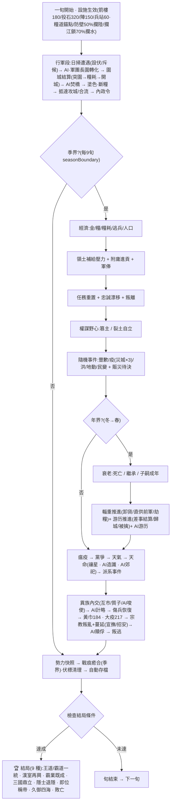
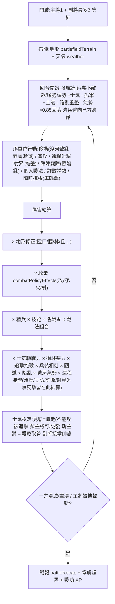
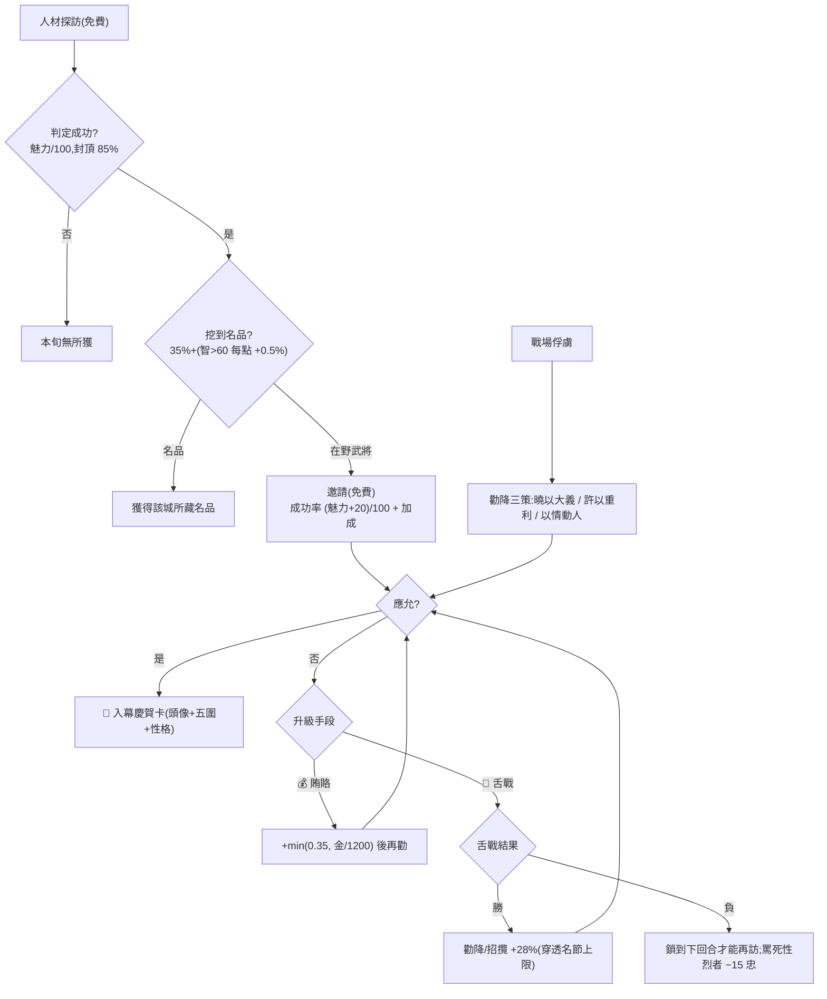
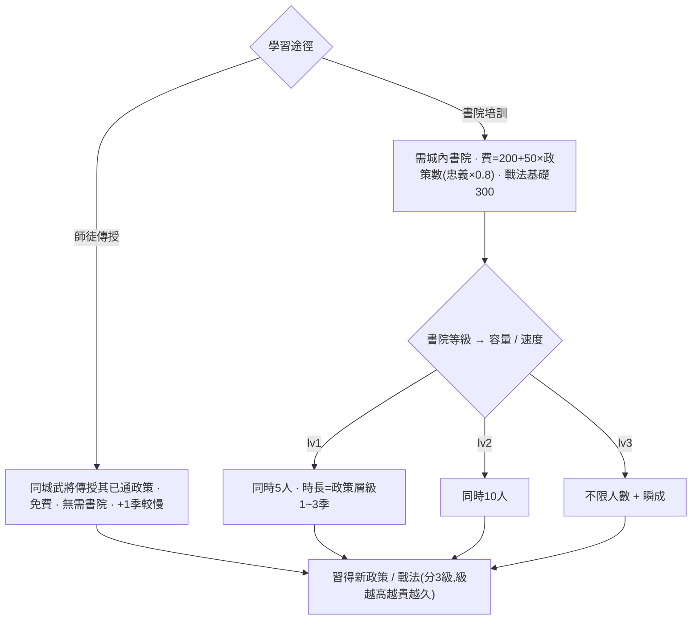
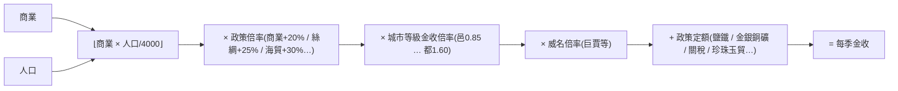
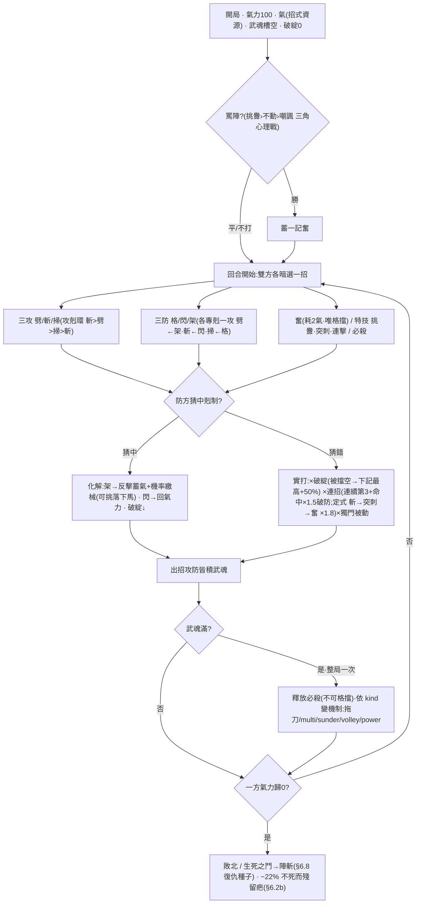
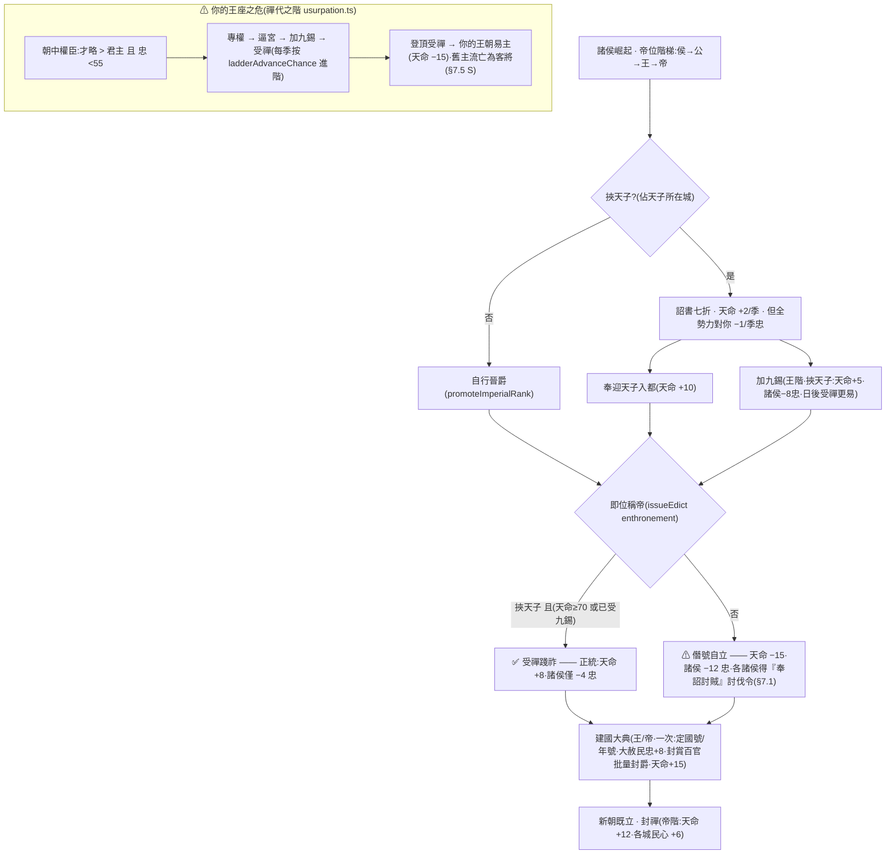

# 三國志大師 · 全功能攻略與設計文檔

> 一份「真相源」:既是玩家攻略(怎麼玩),也是設計/數值文檔(每個數字是多少)。
> 所有數值以 `src/game/` 代碼為準;改了機制請同步更新本文。
> 全十一章 + 流程圖 + 附錄已成 ✅。新增/改動機制時請同步更新對應章節。

---

## 目錄(所有遊戲內容地圖,79 個系統)

| # | 章節 | 涵蓋系統 | 狀態 |
|---|---|---|---|
| 速 | [速查總表 Quick Reference](#速查總表-quick-reference) | 一頁掃完所有關鍵常數 / 公式 / 成本 / 機率 | ✅ |
| 1 | [城市・內政・經濟](#第一章-城市內政經濟) | citySize, economy, commands, civicEvents, market(行情/榷場/馬市/鐵市), buildings(含戰損修繕), cityCivic(民情街景/城中人物/晝夜/街頭際遇/官邸家眷), autoBuild, policyEffects, **law(律令寬嚴/訟獄積案/決獄/冤獄/大赦)**, **household(隱戶/徭役/括戶)**, **culturalWorks(題詠/文集/立祠)**, **hoarding(囤積居奇/抑兼併)**, **grandProjects(大堰/運渠/長城/馳道)**, **grainTrade(米價/糴政/商旅轉輸)**, **coinage(錢法/物價/通脹)**, **workshops(工官/軍器/督造)**, **postalRelay(驛傳網絡/政令所及)**, forging, specialties, specialtyEvents, tradeRoutes, convoy | ✅ |
| 2 | [武將・成長・家族](#第二章-武將成長家族) | growth, officerGrade, gradeCombat, officerFate, traitEffects, personality, biography, posthumous, aging, officerGen, family, clans, retinues, wishes, rapport, friction, relationshipEffects, career, codex, peerage, honorifics, battlePower(武將卡/開卡) | ✅ |
| 3 | [人才・招攬・舌戰](#第三章-人才招攬舌戰) | commands(search), officerFate, recommendation, commonerTalent, appraisal(月旦評), **officialSelection(察舉/九品中正/開科取士/中正官)**, scenicSites(三顧), captiveFate(處決後果/AI處置), aiRansom, debate, wordWar, persuasion(說客) | ✅ |
| 4 | [軍事指揮・委任](#第四章-軍事指揮委任) | muster, legion(都督之斷·長圍), governor, governorEval, advisor, 在途指令(駐守/設伏/圍城/焚橋/燒鎖/補給/分兵/召回), rout(潰軍/掩殺收降/殿軍斷後) | ✅ |
| 5 | [戰術戰鬥](#第五章-戰術戰鬥) | tactical, tacticalAi, combat, formations, stratagems, weather(區域天候), battlefieldTerrain, worldScars(戰場烙印), fieldworks(築壘), columnReinforcements(會戰), wallTier城郭分層, 入城三選, battleSpoils(戰場繳獲), **navalWarfare(水軍熟練/暈船/艦隊編成/淺灘擱淺/搶灘登陸)**, personalTactics, weaponTypes, namedMaps, damagePredict, battleRecap, fogOfWar | ✅ |
| 6 | [單挑](#第六章-單挑) | duel(招式/必殺技/獨門被動/破綻/傷殘/挑落下馬/**環境借勢/部位打擊/膽氣怯戰/棄馬步戰**/兵裝/坐騎/地形/性格/AI), **martialArts(武學修為/流派/流派相剋/秘籍/頓悟)**, **teamDuel(團戰圍攻/合擊/3D 同場)**, **arenaLadder(打擂擂台)**, **涟漪大地圖(威名威懾/代戰認輸金/慘勝負傷/名場面入史/世間鬥將)**, **debateArts(文辯修為/學派/辯經/傳道)**, **scholarRank(月旦評/文名威懾)**, **debateDiplomacy(折衝樽俎/責讓索貢/舌戰說降)**, **teamDebate(朝堂合辯)**, **引時事入辯(annals 彈藥)**, **realmEthos(尚武崇文之風)**, **lineage(師承譜系/同門/衣缽傳人)**, gauntlet, duelSeries, duelScenarios(劇情+戰役), duelHall(名局廊), warRanking(武評榜), rivalries(宿敵/恩怨簿), duelChallenge(約戰), tactical(致師) | ✅ |
| 7 | [外交・謀略・天子](#第七章-外交謀略天子) | diplomacy, diplomacyPacts(稱臣/索貢/會盟/援盟/調停/質子/借道), coalition, schemes, aiSchemes, ambition, espionage, expedition, foreignRealm, intrigue, courtFactions, factionEvents, emperor, imperialEffects, mandate, appointmentEffects, clans, statecraft | ✅ |
| 8 | [事件・天命・異族・宗教](#第八章-事件天命異族宗教) | events(天災/地動/賑災), historicalEvents(抉擇鏈), behaviorEvents(勸進/眾叛), customEvents, factionEvents, religion(黃巾/招安/宣撫), tribes, tribesDiplomacy(和親/互市/質子/以夷制夷/入主建國/七擒), mandate(祥瑞/造讖/禳星), mandateRituals(郊祀/祈雨), annals(災異志) | ✅ |
| 9 | [元遊戲・收藏・分享](#第九章-元遊戲收藏分享) | achievements, deedTitles, dailyChallenge, **shareCode(開局挑戰碼)**, **legacy(遺澤·跨局傳承)**, leaderboard, mods, powerHistory, historyBook, romance, sound, voiceLines, dialogueRoll | ✅ |
| 10 | [AI](#第十章-ai) | ai, aiBuild, aiCourt, aiAppointments, aiSchemes, aiRansom, aiWishesFlavor | ✅ |
| 11 | [核心流程・勝敗・培訓・其他模式](#第十一章-核心流程勝敗培訓其他模式) | resolution, endings, training, succession, objectives, hotSeat, spectator, heroMode, customOfficer, eventEditor, randomScenario, dynasties, strategicMap3D(兵鋒層/晝夜/水影/飛鏡/回放/設伏/斥候偵騎/兵站/攔江鎖/長圍/焚橋/烽燧鏈/糧道總覽/焦土/城等視覺) | ✅ |
| 圖 | [流程圖 Flowcharts](#流程圖-flowcharts) | 核心循環視覺化:結算順序 / 戰鬥管線 / 招攬升級 / 培訓 / 金收公式 / 單挑回合 / 稱帝之路 | ✅ |

---

## 速查總表 Quick Reference

> 全部關鍵常數 / 公式 / 成本 / 機率一頁掃完;細節見對應章節。數值以 `src/game/` 代碼為準。

### 核心常數

| 常數 | 值 | 出處 |
|---|---|---|
| 屬性上限 STAT_CAP | 150 | growth |
| 升級經驗門檻(9 級) | 100 / 250 / 500 / 900 / 1500 / 2500 / 3800 / 5500 / 8000 | growth |
| 升級成長 | 每升一級長 1 圍,+1(資質決定 +2 機率 15~45%),封頂該圍潛能;圍別 = 硬池(練兵focus)×軟權重(資質×年齡×戰績) | growth |
| 潛能上限推算 | latent = min(150, 起始 + max(8, ⌊(150−起始)×25%⌋)) | growth |
| 成長資質 | latent ≥115/98/82 → 天/上/中/常(S/A/B/C);+2 機率 45/34/25/15%、擲骰權重 1.7/1.3/1.0/0.7 | growth |
| 年齡軸成長 | 青年偏武統 / 巔峰均衡 / 老練轉統智 / 遲暮沉智政(軟權重×1.5);打仗XP不帶硬偏向 | growth, aging |
| 智政晚成 | 50 歲起武力50%−1、統率(62+)40%−1;智力35%・政治(55+)30% 機率 +1 | aging |
| 瓶頸→頓悟 | 滿級後溢出 XP 注頓悟槽(門檻 600),滿則抬一圍潛能+1 或 30% 習技 | growth |
| 品階(6 檔) | 鐵→銅→銀→金→白金→鑽石;評分 = 最高圍×0.55 + 均值×0.45 + √威望;面板顯示距下階分數 | officerGrade |
| 品階招牌 | 金「萬軍辟易」挫敵士氣 −4/−6/−8 · 白金「不動如山」潰陣折損 0.25→0.10 · 鑽石「萬人敵」單挑先手 +8 | gradeCombat |
| 綜合戰力 BP(武將卡) | 五圍加權(武2.6/統2.2/智2.0/政1.2/魅1.4)+ 品階×120 + 等級×40 + 技×45 + 裝備效果×8 + √威望×10 + 星×80;純展示不入戰鬥 | battlePower |
| 星級 0–6★ | 升星金 400→3000、需成長級 2/3/4/6/8/9;每星品階威儀微升(戰力+0.5%/星、單挑+1、氣力+2…);6★ 覺醒最強圍+2;AI 每季 30% 為王牌升星 | stars, gradeCombat |
| 技能等級 1–3 | 特訓 35% 機率精研一門;每級技能數值效果 +15%(乘子型按距1縮放);卡面 Ⅱ/Ⅲ 徽記、BP +20/級 | skillMastery |
| 神兵共鳴(本命) | 本命神兵(~520 對 = 手選經典 ∪ 正典持有表派生)駕馭直達 115%,不問品階;卡面 ✦本命 金詞條 | signatureItems, gradeCombat |
| 戰意 streak | 親臨戰術戰 勝+1(≤5)敗−1(≥−3);±0.6%/場戰力(streakPowerMul);卡面 🔥/❄ | growth, store |
| 兵種熟練 | 每兵種 0–100,親臨戰術戰以此兵種出戰累積(勝+3/敗+2);率該兵種戰力最多 +4%(戰略+戰術雙路);生疏/嫻熟/精通/宗師 | armProficiency |
| 名師高徒 | 正史師徒(mentorsOf)同城同勢力在職→自動帶練 XP 10(定向師之所長)+小機率承衣缽;介於拜師14與名將帶新兵8之間 | growth |
| 老兵度(精兵) | 城守住圍城 +老兵度(戰術+8/突圍+6,封頂100),守備最多 +12%(resolveBattle);城陷歸零 | combat, store |
| 兵種專精 perk | 熟練達宗師(80)解鎖兵種質變:衝陣不亂(騎衝+12%)/矢無虛發(矢雨+12%)/拒馬如林(槍立防拒騎−15%)/陣列如鐵(步立防−10%)/操舟若神(水戰+10%) | armProficiency |
| 校舍常設集訓 | 有書院/太學/武學堂/演武場的城,駐守閒置武將每季自動得歷練(4×xpMul,山長定向),不占興学令;全勢力對稱 | resolution |
| 宿疾傷殘 | 瀕死傷癒 ~22%+齡落永久宿疾(箭瘡/折肱/頭風/毀容),折入五圍;折肱禁單挑重擊;**老病告退心願**;根除:洗髓/傷兵營慢療/**名醫義診** | afflictions, duel, wishes, store |
| 名醫養成 | 醫者/藥師累積醫術 0–100(每季+2、行醫治癒+6)分醫工/良醫/名醫/神醫;神醫坐鎮養傷更快(+1~2季)、癒宿疾率 +最多15% | medicalSkill |
| 軍醫隨軍 | 醫者隨敗方在陣:傷率 ×(1−緩解)、可穩重創降一階;緩解 0.1(生手)→0.4(神醫,醫術100) | combat, medicalSkill |
| 神醫回天 | 陣亡武將同陣有存活醫者則機率搶救(重傷不死):10%(生手)→50%(神醫);戰術會戰 | store, medicalSkill |
| 醫者防疫 | 城中名醫降瘟疫機率+折損(緩解 0.1→0.35);抗疫成功者醫術 +8(懸壺濟世) | events, medicalSkill |
| 六軍歸心(信物成套) | 一側集齊 ≥3 種不同統御信物:除逐件 +力外再 ×1.06(commandTokenMultiplier) | items, combat |
| 器魂共鳴 | 一側 ≥2 柄進化(·神)神兵同陣:+3%/柄(過首柄)戰力,封頂 +6% | items, combat |
| 名將成套羈絆 | 同陣容某套≥2人:+1%/人(過首人)、全套再+2%,封頂+8%;宿怨同軍 −1%/對(下限−3%) | setBonds, combat |
| 成套之禮 | 名將套首次全員仕於我(1次/套/局):都城+金800、眾將忠誠+5、慶典彈窗 | setBonds, store |
| 出陣羈絆(陣容原型) | 隊伍「形」的加成:智勇相濟/諸兵種協同/猛虎成群/謀士如雲/鄉黨相扶/老少相濟/同心同德;疊加封頂 +6%;出陣面板即時預覽,與成套並存 | partySynergy, combat |
| 名將殘卷 | 求賢祭現身即得(1 + 金牌+2 + 故人+2);**殘卷煉星**不耗金升星(仍守成長級門檻,價 3/5/7/10/14/20 卷) | festival, stars, store |
| 圖鑑功勳 | 跨局「遇」數里程碑 25/50/100/200/300,達標於當前戰局一次性領取名將殘卷+都城金(3/400→22/4000) | codex, store |
| 品相(卡片鑑定) | 依 BP+星級評收藏品級:神品≥2200/極美品≥1700/上品≥1300/佳品≥950/中品>0/待鑑;6★≥極美品、4★≥上品保底 | battlePower |
| 名場面異畫 | 名場面成就解鎖同一武將第二畫面(千里走單騎/長坂坡/隆中對/空城/五丈原/赤壁/虎牢…),卡上題額+題句+切換;純皮膚 | altArts |
| 開包閃度 | 開卡(得將/求賢祭/覺醒)擲一次閃度並永久烙印:虹光3%/金輝12%/銀輝30%/普通;覺醒保底金+;卡面流光+閃度標 | cardFoil |
| 卡背收藏 | 成就解鎖開卡翻面卡背(符文/織錦/雲龍/玄鐵/朱雀/傳國玉璽),圖鑑 🂠 下拉選用 | cardBacks |
| 鈐印題跋 | 卡面蓋勢力鑑藏印(己方將);玩家可 ✒ 為卡題一句題跋(officerColophons,≤48 字) | store |
| 動態卡面 | 卡背景隨現狀:負傷/瀕死裂紅、囹圄鐵欄、致仕暮金、在途揚塵、歲寒霜白(疊加);已故仍沉棕 | cardFaceMood |
| 群英譜(關係網) | 武將卡緣分區 🕸 開自我中心連線圖:義結/宿敵/私仇/師徒/主從/情/姻親/血親分色標;點節點換心走譜 | RelationWebModal |
| 名將傲氣 | 金牌+ 位卑(階+爵×1.5 < (品階−2)×3)忠誠 −1/季,位極人臣 +1;全勢力對等 | resolution |
| 揚威·失威 | 被罵死(威望−3·失威3季)/被俘(−2·失威2季);失威期招牌暫失,每季−1漸復 | store, gradeCombat |
| 品階硬門檻 | 金牌+ 方可治都/京、領軍團都督、居頂級官職(白金+ 為丞相等) | store, titles |
| 瑜亮情結 | 同勢力兩白金+ 並立,性烈者偶不平(12%/季·忠誠−2) | resolution |
| 轉生突破 | 滿 9 級可突破,費 800金+80×(1+次數)鐵,潛能 +6/次,最多 5 次;鑽石第 5 次觸發**神品覺醒**(五圍 +2+絕技) | growth |
| 突破之道 | 每次突破擇一道(武/將/謀/治/王道)偏導 +2 兩圍與招牌性格;AI 依最強圍自動擇 | growth |
| 名器養成 | 武器隨征戰累威名(每戰 +1,戰術+戰略皆計):光環封頂 +8%、抵一檔兵器駕馭差、稱號 飲血/百戰/名器(12/30/60) | items |
| 器魂進化 | 神兵(gold)★5 + 名器(威名60)可醒器魂:費 3000金+400鐵,全效果再 +18%、名冠 ·神;玩家專屬、每器一次 | items, store |
| 名器譜系 | 神兵/寶器帶入戰術戰即記譜系:歷任主人鏈(最近12)+歷戰數+殲敵;**譜系升階名器譜系/傳世名器/神兵譜系→一次性威名+6/階**;顯於名品卡 | itemProvenance |
| 藏珍功勳 | 跨局「藏」數里程碑 20/50/100/200/350,達標於當前戰局領都城鐵+金(200/400→2400/4000) | itemCodex, store |
| 名城錄 | 跨局城池成就冊(文化名城/百戰雄城/億兆生民/富甲天下/天府之土/金城湯池/政清人和);季末記你所養名城,百科「名城」分頁 | cityCodex |
| 名城功勳 | 跨局名城殊譽數里程碑 5/15/30/50,達標於當前戰局領都城金+全境民忠(600/2→4000/6);與圖鑑/藏珍功勳三冊齊 | cityCodex, store |
| 名匠監造 | 主匠分匠人/良匠/巧匠/神匠(智+巧思);神匠(巧思且智≥90)神品更易(+10%)且鑄件開爐即帶名器種子威名 8 | forging, store |
| 套裝技 | 招牌套裝的雙軸共鳴:命名技加成第二軸(力+文/力+守),武聖春秋/青釭照夜/倚天問鼎 | itemSets |
| 耗損保養 | 神兵每戰 +1 耗損(僅神兵);過 60 才咬、封頂 −6%;鐵坊城「保養」(費耗損×8金)復原 | items, store |
| 人馬合一 | 固定騎手與坐騎每戰累默契(officer.mountBond),騎乘戰力 +0.8%/戰封頂 +5%;換騎歸零 | mountBond |
| 鍛造詞綴 | 鑄成 22%(神匠 34%)附隨機詞綴(破甲/疾風/嗜血/堅甲/巧智/中和);神匠偏好精品詞綴 | items, store |
| 器魂戰技 | 進化(·神)神兵:單挑勇 +8、武魂槽 +30% 加速、必殺傷害 ×1.2、**必殺必震敵武魂(奪其必殺)**;隨兵器易手 | evolvedArts, duel |
| 統御信物 | 虎符→騎/帥印→步/節鉞→槍/令旗→弓/兵符→諸兵種;己方 +4%/人戰力 + 駐城 +10%/人募兵 + **戰術半徑4光環 +6%(對口兵科 +10%)** | items, combat, resolution, tactical |
| 名器傳承 | 持有者辭世,〈名器〉連同威名傳予在世弟子/子嗣 | aging |
| 寶石共鳴 | 同孔同寶石:2 同 +25% / 滿 3 孔 +50% 該寶石加成 | items |
| 洗點退養 | 拆精煉/突破/鑲嵌:寶石歸庫、半數金退還、名器威名保留 | store |
| 師徒衣缽 | 拜師(同城)帶練 +14 XP 偏師父所長,遞增機率傳技/戰法/陣形;師亡繼承遺志(主圍+2、忠+2) | growth |
| 特訓 | 內政令 400金,猛練一員(閉關/演武/遊學/狩獵/論道),習技/性格/潛能,武系試煉有養傷風險 | growth, commands |
| 兵書/秘笈 | 可消耗書冊,研讀一次性灌歷練+抬潛能(讀後即毀);散落世間可尋獲 | items, growth |
| 山長 | 主事學館者智力放大該城歷練(最高+40%),最強圍偏導講學 | buildings, growth |
| 成年出仕 | 14 歲(蔭補:依父輩品階/爵位起步都尉/校尉、繼承一技、入家門) | family |
| 子嗣潛能 | 起始 +25(神童 +15)(5% 出生神童;教養逐年揭示) | family |
| 生育機率 | 0.18/春(同勢力配偶;和睦 ×1.3、不睦 ×0.7) | family |
| 資質遺傳 | 五圍取雙親均值加噪聲 + 繼承雙親 0–2 性格 | family |
| 繼承順序 | 世子 → 嫡長子 → 政治;落選成年子 −12 忠誠(奪嫡) | succession |
| 質子聯姻 | 羈絆下限 88;背盟質子身死 + 外戚 −25 聲望 | family |
| 家門聲望階 | 寒門 / 士族(≥115) / 世家(≥250) | clans |
| 門第聯姻(§7.8E) | 厚結仕你世族:即時忠+15、守底線60、豁免簒奪;費金 1500+人×800 | clans |
| 察舉薦才(§7.8F) | 仕你世族每季 4%×檔(世家2/士族1.4)×政策(重門第1.6/唯才0.4)舉門生入仕 | clans |
| 部曲私兵(§7.8G) | 均忠≥50 之族向強者所在城輸部曲=Σ(120+統×14)×檔;跌破則撤兵 | clans |
| 舉族叛附(§7.8H) | 非聯姻族均忠<28 且≥2人 → (28−均忠)/90 叛投最強敵;策反敵族成功率含離心+聲望+金 | clans |
| 學派造詣(§7.9I) | 持守+3/季(學宮+6,>60減半);效果×(0.4+0.6×造詣/100);改弦則歸零+民忠−造詣/20 | statecraft |
| 學派向背(§7.9J) | 契合士+1忠/季、相違士−1(造詣≥60則−2);相違名士忠<18 每季12%拂袖而隱 | statecraft |
| 興學養士(§7.9K) | 太學/書院:加速造詣、講學長屬性、薰陶轉主義、育士出仕(太學機率倍書院) | statecraft |
| 國策大政(§7.9L) | 造詣≥50、冷卻12季:行學派簽名大政(變法/興學/休息/屯田),效果×造詣+天命2 | statecraft |
| 好感軸 | −100~100(雙極);義結門檻 +100、宿怨門檻 −100 | rapport / friction |
| 義結深淺 | 義交→金蘭(8季)→生死之交(24季);忠誠下限 88/92/96 | relationshipEffects |
| 結拜前提 | 好感 ≥60(結拜/三結義) | rapport |
| 心腹門檻 | 君臣好感 ≥80 → 永不叛/永不被策反/密報預警 | rapport |
| 化解宿怨 | 調解/演武升好感;回升 ≥−50 宿怨冰釋 | friction |
| 糧耗 | 0.25 /兵/季 | economy |
| 求賢令來投 | 35% /季;庶民五圍 30~70(12% 暗藏明珠 +15~35,封頂 98),忠誠 80 | commonerTalent |

### 城市・經濟

| 項 | 公式 / 值 |
|---|---|
| 金收 /季 | (⌊商業 × 人口/4000⌋ × 政策倍 × 等級倍 × 威名倍 × **品階理政倍** × **特產倍** + 政策定額) × **稅率** × **通膨** |
| 糧收 /秋 | ⌊農業 × 人口/1000⌋ × 等級糧倍 × 特產倍 × **天時倍(旱0.55/雨1.1)** + 義倉 |
| 度支淨金 /季 | 稅入 + 名產商路 + 通商條約 + 食邑 + 官署常俸 − **俸祿**;負則算府庫見底季數 |
| 鑄錢 | 即入 `1000 + 首都商業×30` 金,通脹 +18(漸消) |
| 勸募(募捐) | 即入 `Σ⌊(商業×12 + 人口/3000)×民忠/100⌋` 金,各城民忠 −8,**一年一次** |
| 富商借餉 | 即入本金 `clamp(Σ(商業×18+人口/2500), 2000, 25000)`;欠 `本×1.25`,分 8 季自首都償;債未清不可再借,付不出分期則首都民忠 −1 |
| 等級門檻(人口) | 邑 0 / 鎮 3萬 / 城 8萬 / 都 16萬 / 京 28萬;**天子駐蹕之城直接視為京**(京師,隨駕遷移) |
| 人口承載力(上限) | ⌊(30,000 + 農業 × 1,500) × 民政倍(安民坊/水利,最多 ×1.3)⌋;對齊等級表(都=28萬),農業 ~167 達都,大都會 ~45–70 萬封頂 |
| 流民池 attrition | 未安置流民每季 −15%(無餘容也有界) |
| 治所 /首都 | 每季 +3 民忠 + 禁軍宿衛(+⌊人口×0.4%⌋ 兵);開局可選治所;**首遷免費**、之後 −800 金;失守 → 自動遷都 + 全境 −8 忠;AI 會戰略遷都 |
| 州牧(玩家專屬) | 委一將牧整州:該州己方各城每季 民忠 +1(治才≥80 則 +2)、金 +⌊政治/12⌋。治才=政×0.6+魅×0.4。不占用武將 |
| 攻城人口戰損 | 城陷 −20% 人口(四成化流民逃原主鄰城) |
| 流民池 | 萎縮城外溢半數入池;每季池中半數按「餘容×民忠×輕稅」分配給民忠 ≥50 之城 |
| 農商上限 econCap | 90 / 140 / 190 / 250 / 320(隨等級) |
| 命令增益 | ⌊有效屬性/14⌋ + ⌊max(0,有效屬性−70)/10⌋ + 1 + 隨機(0~1)(豐政 ×1.5 / 災異 −1~3) |
| 市易現價(spot) | 每金換糧 = 10 × 季節(秋1.3/冬.7/春.95/夏1.05) × 缺糧.6/滿溢1.25 × (1+商業/400),夾 4~22 |
| 市易價差・滑點 | 價差 10%×(1−商業/500),地板 3%;大單滑點 ≤50%(深度 買 2500+商×40 / 賣 6000+商×80) |
| 平糴平糶 | 常平倉 +.12/級、平準署 +.08/級(封頂 .6):平抑季節/缺糧波動、收窄價差、減滑點 |
| 榷場(borderTrade) | 通好接壤鄰邦互市,按對方行情定價;關稅 12%→市舶司每級減,地板 4% |
| 馬市・戰馬 | 產馬地(`horse`特產)每季育馬 ⌊40×徵兵倍×(.6+忠/200)⌋,單城封頂 6000;產地價賤;駐馬抬募兵上限;可隨輜重運送 |
| 鐵市・鐵 | 冶鐵地(`iron`特產)每季煉鐵 ⌊45×min(1.5,商倍)×(.6+忠/200)⌋,封頂 8000;產地價賤;存鐵≥300 鍛造 −30%金(耗鐵300);可隨輜重運送。買進轉賣≈打平(無現金泵) |
| 採藥・藥材 | 藥地(`herb`特產)每季採藥 ⌊35×發展度權重×(.6+忠/200)⌋,封頂 4000;季交時加速傷兵康復(耗藥)、瀕死救治、抑疫(§1.9) |
| 名產發展度 | 「興名產作坊」每級 +15% 名產之利與物資產出(0–5);費 ⌊(600+600×級)×(1−min(.3,商/400))⌋,需民忠≥40(§1.9) |
| 專營/壟斷・禁運 | 控天下某物資 ≥60% ×1.3、≥85% ×1.6;鹽鐵專營等政策金收隨持有產地放大;專營可禁運敵國(腰斬其控制力)(§1.9) |
| 名物萃京 | 每季按所控名產**種類數**(d×40+d²×6)+ 發展度 + **品類廣度**(cd²×12,涵蓋四類愈全愈肥),把商利匯入首都(需求側,§1.10) |
| 名產商路・互通有無 | 同主、**陸鄰或漕運**(港對港,×1.15)、≥1 名產則通商,雙方各得基準×稀有×發展:**跨類**(兵甲/糧鹽/工巧/藥石四類)85 > **同類異產** 55 > **同產** 35 > **單方** 40(§1.10) |
| 商路風險・護商 | 任一端鄰交惡之敵(關係≤−25)×0.45、民心<40(盜匪)×0.7,疊乘;任一端有**驛傳**則緩解(×0.8/×0.85);前線商路戰時自萎(§1.10) |
| 輜重直供前線 | 車隊可直送在野/圍城我軍,糧/援兵卸入該軍解孤軍深入;AI 亦前運糧秣接濟圍城之師(帶 ≤1500 後方護衛)(§1.10) |
| 主動劫糧(烏巢) | 派輕騎截劫偵見之敵糧道(其最近城為我城即可見);騎兵≥護糧則焚糧掠金擒將(損隨抵抗縮放),不及則被拒(損35%);**AI 亦對稱劫你糧道**,反制=配押運/謹慎/漕運(§1.10) |
| 行軍節奏 | 急行軍 −1旬·累毙−3%/季·疲勞−12·暴露×1.25 / 常行 / 緩進 +1旬·孤軍折損減半·暴露×0.8(§4.1) |
| 行軍迷霧・斥候 | 開霧時敵縱隊僅斥候範圍內可見;範圍隨守望者智力放大(城基130/軍110 px + (智−60)×0.7)(§4.1) |
| 邀擊 | 對斥候可見之敵縱隊,從最近邊城遣將急行截擊(費100金),途中接戰(§4.1) |
| 真日級攔截 | 敵對縱隊按15日逐日掃描,首觸之日接戰、按日序結算;日播至接戰日自動暫停,先改道可避、接戰即鎖;暫停時可「⚔迎戰」當場開打(勝負即寫回,結算去重)(§4.1) |
| 兵臨之日 | 末旬縱隊約第6–7日抵達(t=0.95封頂反解);日播至該日自動暫停+標記,守城戰報冠「第X日」(§4.1) |
| 全軍集結令 | 合格城(駐軍≥3000/有閒將/付軍費)向任意城收束:攻/勤王/集結點;先預覽,可調比例/守軍底線/排前線(§4.2) |
| 持續集結 | 每季續發至目標陷落(上限16季);可設集結點先汇2季再自動強攻;每路出兵城民心 −1~6(厭戰);AI 占優偶總動員(§4.2) |
| 軍團都督 | 方略 攻略/蠶食/略地/固守(應敵預驰援);都督統率→動員(統≥85分進合擊)、智力→擇敵、武/威→都督之旗(開戰士氣+0~16)、政≥60→調度錢糧;每旬戰報;可改編(§4.3) |
| 委任太守 | 自動內政;太守政治→更猛更省·魅力→撫民·智力→肅貪;施政重點均衡/富國/強兵/守備/安民;每旬政報;貪婪低忠縱貪+貪墨、久任≥4年野心者異心(§4.4) |
| 文教·文化名城 | City.culture 0–100:有書院/太學等校舍且文治太守坐鎮每季+1~3(無校舍−1);**教化息貪**(貪腐累積 ×(1−最多35%))+**民安其教**(≥60 文化名城,民忠+1/季)+**文教招賢**(遊士降臨加權 1→5×)+**文舉育才**(文化≥30 城,最年輕才俊每季35%機率 智/政+1,封頂潛能);城池面板文教條 |
| 軍師錦囊 | 軍師讀盤獻策一鍵照辦;智≥80→4策·≥92→5策、預警隨智提前(foresight=(智−70)/100)、智≥72解鎖謀略獻策(二虎競食/遠交近攻)、封軍師者優先;忠誠<40設宴結心;名士奇策(諸葛亮等簽名);一鍵照辦全部/✕擱置(§4.5) |
| 考課・殿最 | 每年冬末考太守(因城而異:邊城重守軍24+城防10、腹地重府庫民心),≥66上考/≥38中考/下考;上考忠誠+4·歷練+16·威望+1;連上考≥3威望+2(陞遷儲備)、連3下考AI自動罷免換賢·玩家標記親裁;闔境上考勢力天命+2、全境天下治最表彰;考課面板逐項拆解+表彰/問責/革職(§4.6) |
| 州牧 | 銀牌+牧一州;分權之效:政→金·魅→民忠·智→勸農抑貪·統→城防(治才≥55解鎖);擁兵自重(0-100):兵力城數+低忠+野心+久任累積·忠≥80/好感≥60/忠義者制衡,≥50示警·100擁州自立(裂全州自成一勢);召還/安撫(600金−35)化解;AI亦封州牧且會割據(群雄裂變);失州自動卸任(§4.7) |
| 牧守一體 | 州統諸郡:辟召(一鍵委任州內未委之城)、督課(能員州牧為其州太守考課背書+≤5)、政績歸牧(州牧考績由其州太守等第匯總,良牧手下多良守得威望/忠誠、反之問責)、太守→州牧晉升(連上考太守標「堪為州牧」並為AI優先)、州兵動員(統≥70補州境薄弱守軍向6000)、面板並列部屬考課——縫合§4.4太守/§4.6考課/§4.7州牧(§4.7) |
| 行軍捷疾 | 健行+15%·嚴峻/騎將+10%·鐵律+5%·驛站+10%(取最佳,不疊),鈍重−10%;快省一旬慢加一旬(§4.1) |
| 召回行軍 | 在途縱隊折返本城,保留兵力(行越深散卒越多 −5~25%),抵城併入守軍(§4.1) |
| 名產↔戰鬥/武將 | 専才坐鎮(對口專才駐城 ×1.35)、戰陣藥營(藥材陣前降傷一級,耗120/人)、名駒入廄(名馬城牧得赤兔等坐騎)、匠籍神品(冶鐵城鍛造神品率+)(§1.9) |

| 律令(§1.11) | 寬刑 民心+1/季·稅×0.93·貪腐×1.25 / 平律 無偏 / 峻法 民心−1·稅×1.07·貪腐×0.70·獄訟×1.35 |
| 訟獄積案(§1.11) | 到案=(2+人口/9萬,頂6)×律令;聽斷=1.5+最高政治/22+牢城或安民坊2;無人駐守=不聽訟;≥25/55/80 民忠 −1/−2/−3 |
| 決獄・冤獄・大赦(§1.11) | 決獄 120金 清 12+政治×0.55+有堂8;冤獄率 (積案−30)/100×0.22×律令(1.7/1.0/0.5)×(1−政治/130)頂0.35 → 民忠−5;大赦 300+城數×40 金,積案歸零、民忠+4~12,8季冷卻 |

| 徭役(§1.12) | 息役 工程+0·民心+1/季·農×1.02·隱戶−0.4 / 薄役 +1工程 / 重役 +2工程·民心−2/季·農×0.90·隱戶+1.1 |
| 隱戶與稅基(§1.12) | 漂移=(0.7+人口/50萬,頂1.2)+徭役壓力+律令(峻0.5/寬−0.3)+民心(≥70 −0.3/<40 +0.4)−(政治/90)×min(2,隱戶/12),夾在 2%~45%(典型均衡 8~12%,無人駐守則直上 45%);金糧收入 ×(1−隱戶%×0.8/100);括戶 200金 清 min(隱戶−2, 2+政治/14) 點永久回籍,民忠−2、城中世家將 −4 忠誠 |

| 題詠(§1.13) | 150金;詩品=智×0.45+魅×0.3+威望/6(頂20)+名勝10+文教×0.08+靈感(−9~+17);城文教+詩品/20、民忠+0~2、作者威望+詩品/12;≥70 入事件簿,≥88 千古絕唱 |
| 立祠(§1.13) | 400+威望×12(威望封頂80);該城每季 民忠+1(威望≥60 為+2)、文教+0/+1;同族在朝者忠誠+3/+6;一城一祠、一人一祠 |

| 囤積居奇(§1.14) | 壓力=糧價(貴.55/平.20/賤.05)+律令(峻−.18/寬+.12)+貪腐/100×.25+民心(<40 +.10/≥75 −.08)−常平倉×0.9;≥0.5 每季+4~10、<0.25 每季−3;報價×(1−囤%×1.2/100)、入廩糧×(1−囤%×.5/100)、囤≥8/20 民忠−1/−2 |
| 抑兼併(§1.14) | 180金;清 (6+政治/8)×律令威權(1.25/1.0/0.75) 個百分點 → 糧入公廩、民忠+清幅/2(頂8)、商業−清幅/3、豪右銜恨 |
| 督造軍器(§1.18) | 260金;軍器 +min(空間, 6+政治/9+武庫×2.5, 城中鐵/14),耗鐵 14/點;無鐵直接失敗 |

| 大工(§1.15) | 大堰3200/12季 · 運渠3800/14季 · 長城4200/16季 · 馳道2800/10季;役夫進度=徭役(1.0/1.4/2.2)×(1−隱戶%×0.8/100,頂−35%);一國一工,工地易主即廢 |
| 米價(§1.16) | 金/百石 = 100 ÷ (市易 foodRate × 囤積 marketRateMul);中性 ≈10,≥14 米珠薪桂、≤7.5 穀賤傷農 |
| 商旅轉輸(§1.16) | 觸發:相鄰且買價/賣價 ≥1.22;餘糧=存糧−max(600,兵×4),缺口同式;買方一季至多花府庫 60%;載量=400+(商業和)×9,驛傳×1.5、民心<40 ×0.55、≥75 ×1.1;成交取中價,買方+6%/賣方−6%(商賈得 12%);通糴抽 5% 商稅入首都;一季至多 14 支 |
| 糴政(§1.16) | 通糴 出入國境·商稅5%·商業+0.4/季 / 平糴 僅境內 / 閉糴 全停·商業−0.6/季·囤積壓力+0.1;跨境須雙方非閉糴且關係 ≥−20 |
| 常平倉操作(§1.16) | 米價≤8.5 且糧<兵×6 → 糴入(至多府庫25%);≥12.5 → 糶至兵×4(民心+1~2);經手量=1500×(平準/0.3);先於商旅動作 |
| 錢法(§1.17) | 五銖 ×1.00 / 大錢 金×1.22·商業−0.5/季·通脹+3.5/季·消退×0.4·鑄錢×1.6 / 穀帛為市 金×0.85·消退×2.4·鑄錢×0.35;通脹漂移=(3+平準署緩解)×消退係數
| 物價(§1.17) | 乘數 = 1+通脹/160(100 → ×1.63),直接乘進米價;階級 18/40/70 → 錢輕物重/物價騰踊/穀石數萬 |
| 軍器(§1.18) | 產出/季 ≤1.4+武庫×1.6+徭役(0/.5/1.2),每點耗 14 鐵;上限=26+武庫×13+產鐵12+min(12,政治/8)+min(10,人口/4萬);耗損=0.6+兵/9000,徵兵每 400 人再 −1 |
| 軍器之效(§1.18) | 徵兵 ×0.78~1.12 · 守城防禦 ×0.88~1.08 · 練度 ≥75 +1/<30 −1;督造軍器 260 金 = min(空間, 6+政治/9+武庫×2.5, 鐵/14) |
| 驛傳(§1.19) | 文書自首都腳程 3 跳,入己城 −1,抵驛站/驛傳回滿;≤1 跳 貪腐×0.8·民心+0.5 / ≤4 跳 ×0.95 / >4 跳 ×1.1·隱戶+0.15 / 斷驛 ×1.35·民心−1·隱戶+0.5 |

### 內政命令成本(金)

| 命令 | 金 | 命令 | 金 |
|---|---|---|---|
| 人材探訪 | 0 | 鎮守 | 150 |
| 賑濟 | 糧(非金) | 民忠安撫・巡查肅貪 | 200 |
| 屯田 | 250 | 練兵 | 300 |
| 農業 / 商業開発・興学 | 300 | 徵兵 | 500 |
| 城壁修築・招撫流民・治水 | 400 | 出陣 | 100 |
| 大農政 / 大商政 | 1100 | 大築城 | 1400 |
| 城壁強化 | 1500 | | |

### 招攬・勸降・舌戰

| 項 | 值 |
|---|---|
| 在野招攬成功率 | (君主魅力 + 20) / 100 + 性格/出身/威名/羈絆加成(高潔 −10%) |
| 人材探訪 | 成功率 = 魅力/100(封頂 85%);先 35%+ 機率挖名品,否則出在野 |
| 賄賂 | +min(0.35, 金/1200) |
| 舉薦(賢以薦賢) | 識見武將(智或魅 ≥72)每季 6% 薦在野;**玩家+AI 皆會**;荐主智越高所薦越上才(智 100 取前 ~15%) |
| 月旦評・品評 | 名士(智 ≥78)下定評:揭資質(識人雾)、定品第、得名望 3~24;許劭/司馬徽傳奇定評 ×1.5 |
| 識人 / 走眼 | 識者造詣≈智力(許劭/司馬徽近無誤);走眼則含糊失準·不揭資質,須更高明者重斷 |
| 知遇之恩 | 準評在野上品 → 你招攬/勸降該人 +0.15;每季公開月旦評自動揚名+結知遇 |
| 三顧茅廬(名所隱士) | 訪之分三顧:一訪 −0.15、二訪 +0.12、三訪 +0.45(上限 0.97);`scenicVisits` 計次 |
| 說客(戰略舌戰) | 遣善言之士赴**接壤**敵城:說降忠誠<65 之敵將 / 游說鄰境諸侯結盟;費 200 金,勝則易幟·立盟 |
| 寧死不降 | 鐵血/鐵骨之士絕不歸降(招攬率 =0),唯釋或斬 |
| 處決後果 | 斬俘折君主威望 2~20(殺烈士/忠義更重)+ 結宿怨於其親族義兄 + 與故主邦交 −12 |
| AI 處置俘虜 | 俘獲方 AI 每季招降/義釋/處決自家俘虜(承擔同等後果),先於贖俘結算 |
| 舌戰(招攬/勸降加成) | 勝 +28%(一次,穿透名節上限);負則鎖到下回合 |
| 勸降「曉以大義」對高潔上限 | 0.15 → 0.35 |
| 舌戰・口才(交互) | 口才 = ⌊(智 + 魅/2)× 口才性格⌋;沉著 100 見底即潰,六回合論點計分 |
| 舌戰・九招 | 三式環 論>諷>駁>論;費氣勢 詰/引(2)・哂(1);流派絕學 喻/叱/詐(按風格解鎖) |
| 舌戰・加成 | 論題切中 ×1.18、連辯(論→引/駁→詰)×1.3、流派相剋 口才 +8、全場附和必中 |
| 罵死 | 罵倒(沉著歸零)性烈/年邁敵手:必羞憤,且有概率致死(王朗墜馬,上限 40%) |
| 游历腳程 | 來回 ≈ 單程 × 2 季;`speedMul` 0.7–1.4×(智 +勤奮快、懶惰/謹慎慢) |
| 游历歷練 | 歸城得 XP:城內 10+單程季×4;遠使 20+單程季×6,偏向差事屬性 |
| 游历探索 | 必開眼 18 旬;另擲 賢才 / **秘笈兵書** / 奇遇(金200–800・糧300–1100)/ 民心(+3~6) |
| 游历出使 | 外交關係 +12~25(無被擒之險) |
| 游历策反/刺探 | 成功 ≈ (智/魅) 適性 vs 守將忠;刺探開眼 30 旬+破壞;被擒險 8–55%(才高則低) |
| 訪賢(三顧) | 定向招在野賢才;高才難致,每訪 +0.18 誠意(`courtVisits`)終得 |
| 巡視/結交/募兵 | 自家城民心+4~8察叛 / 敵將忠−4~8鋪路 / 遠城募兵數百~千餘引歸 |
| 護衛同行 | 帶一護衛:被擒險 ×0.55、共享歷練;envoy被擒則同擒 |
| 奇遇際遇(§7.6Y) | 探索際遇表:隱士/劍客(武統+1~2)/方士(智+1)/巨賈(金+奇珍)/落難者(民望)/奇遇 |
| 尋寶探秘(§7.6Z) | 尋寶:神兵寶馬秘笈窖金;peril 0.1–0.5敗則傷,深險12%×peril葬身(殞命) |
| 游學進修(§7.6AA) | 游學:歸來智/政+1~2(統學昌盛城更多)+機率得秘笈;無被擒之險 |
| 微服私訪(§7.6AB) | 微服:自境民心+6~10揪貪劣貳心;敵境深探(開眼20旬)有被識之險 |
| 遠使異域 | 單程 5–12 季;西域/倭/扶南/大秦+10 異族;得金/奇珍/異族兵/天命,降異族 aggression |
| 遠使凶險 | 該邦凶險 − 使才/300;遇劫空手受傷;凶險 ≥0.45(天竺/安息/大秦)或殞於道 |
| 絲路商路 | 遠使通成開常駐商路,每季入金 = 單程季×40(高昌200…大秦400);AI 亦遠使 |
| 途中際遇 | 在途每季 ~14%:出途斷橋/風沙 +1旬;歸途商旅 +金 / 盜匪 失金 |
| 遠邦關係 | 0–100,成功遠使 +18;降凶險 關係/400、提回報檔 關係/250 |
| 反向來使 | 已通商邦每季 6%+關係/500 遣使來朝,奉貢金(商利×2)+天命 |
| 異域義從 | 邊城 foreignAux 守備加成 = 1+min(0.15, aux/20000);關係≥50+封號方借兵成軍 |
| 邦交競逐(§7.7①) | 有號之邦(倭親魏倭王/大秦…)封號獨歸最近成功遠使者;封號之主每季天命+(天命/6)且獨享借兵;AI 爭奪、易主旁落 |
| 厚禮遠使團(§7.7②) | 副使(使才/320 提檔、/360 降險)+ 厚禮(每8000金+0.3檔、降險×0.4、每800金+1關係,封頂+12) |
| 西域都護府(§7.7③) | 自家邊城開府(須通西域)→ 西域商利×1.5、絲路難斷;失城則廢 |
| 絲路風險(§7.7③) | 每季 0.035+凶險×0.06 斷路(都護府×0.3、常駐×0.45)→ 中斷2–3旬,其間無商利/朝貢 |
| 常駐使節(§7.7④) | 久駐一員:每季關係+2+使才/40、護路、12%+使才/500 密報敵城;亡則撤、召還歸邊城 |
| 異域援軍(§7.7A) | 封號主+關係≥50 召義従遠征軍(突騎/象兵/汗血騎,兵×(1+天命/10));費金+關係−20,每邦冷卻8旬 |
| 遠邦之怒(§7.7B) | 敵意0–100:勁敵執你封號+6/關係<15+4/斷路+2,常駐·封號·關係≥60 −8;≥55 觸邊釁襲城,襲後−25 |
| 絹馬互市(§7.7C) | 西域+大宛商路可切 通商↔買馬;買馬每季輸戰馬=單程季×14(都護府×1.5,封頂6000)抬騎兵上限 |
| 異域歸化(§7.7D) | 關係≥70 每季 5%+(關係−70)/400:遣歸化武將(異姓·按區補正)或文物之利(+金/+民心) |

| 選官之制(§3.6) | 察舉 基準 / 九品中正 舉薦×1.9·眼力+0.3·寒門×0.4·世家將+1忠·寒門−1(中正公正則封鎖減半)/ 開科取士 寒門×2.4且才質+0.25·舉薦×0.7·世家將−1·寒門+2;九品需5城+政治≥60之臣,開科需太學 |

### 外交・縱橫(§7.1)

| 項 | 值 |
|---|---|
| 關係/信譽/積怨 | 中立/NAP/同盟,好感 −100~100;信譽守約+5・背盟−25;積怨高則難議和 |
| 借糧 | 盟友 ≤6000、NAP/交好(score≥20)≤3000,出自對方存糧 |
| 通商條約 | 需同盟或 NAP;雙方各 +200 金/季(交戰休眠) |
| 稱臣納貢 | 成算 = 戰力比×0.35 + 好感/300 + 君主柔順 − 積怨/250;成則鎖同盟+地板 60 |
| 藩屬季貢 | 100 + 30×(城數−1),上限 400 /季,自藩屬庫入宗主都 |
| 徵召藩屬 | 藩屬即與指定敵開戰;不臣 vassalDiscontent +18 |
| 叛附 | 機率 = max(0,兵力比−0.85)×0.18 + 不臣/400,上限 0.5;成則 −40 好感+宗主積怨 20 |
| 弱者求附 | AI 被 ≥2.5× 強鄰壓且交好,12%/季主動稱臣(含向玩家) |
| 索貢/通牒 | 成算 0.25 + 戰力比×0.4 + 好感/400 + 柔順 − 積怨/250 − 重(金0/糧.08/稱臣.3) |
| 索貢得手 | 金:其都 35% 入我都・信譽−4・積怨+12;拒 = 開戰之釁 |
| 共討會盟 | 8 季;盟軍 AI 攻目標 ×1.8;滅敵→盟主信譽+10 天命+8,期滿存→信譽−5 |
| 援盟之請 | 盟友被 ≥1.15× 強敵壓境每季列出;參戰 +盟誼12 信譽+6,坐視 −盟誼20 信譽−8 |
| AI 索貢來牒 | 好戰且 ≥1.8× 接壤強鄰 10%/季下牒(≥3× 可逼降);屈服輸款/稱臣、抗牒開戰 |
| AI 合縱共討你 | 玩家 ≥1.4× 最強鄰時,最強自由鄰 10%/季任盟主糾眾組正式會盟;一時僅一個 |
| AI 盟友驰援 | 玩家被 ≥1.15× 強敵壓時,接壤該敵之 AI 盟友 30%/季自動宣戰來救 |
| 調停斡旋 | 600 金請第三強國止戈;成算 0.28+居間者兵威+與敵交情+你好感/400−敵積怨/200,成→8季NAP+積怨−20 |
| 質子 | 真武將質居敵都;索還(好感−8)、興兵討宿主則處死、5%/季越獄、滅國獲釋 |
| 假途借道 | 向盟友/NAP 借道 8 季(盟友幾必允、NAP 看交情);可遠擊與其接壤之敵城 |
| 假途滅虢 | 借道後反咬授道之主:信譽 −30、關係 −50 轉敵、積怨 +30、借道權即焚 |
| 歲幣納貢(§7.1AC) | 買安(每季輸金→其1年deterrence不犯你)/勒貢(兵≈2倍或持討伐令→每季勒金);不繼則約廢−8 |
| 秦晉之好(§7.1AD) | 姻親盟>3年關係地板55;姻親之國亡→承其統之名天命+8 |
| 攻守同盟(§7.1AE) | 須同盟/關係≥40:盟友共享你討伐令(標敵X,盟友亦得討X 1年)、關係固守45 |
| 朝聘常駐使(§7.1AF) | 遣一員常駐敵朝:每季維關係+至25、40%探其城眼、其圖你則預警 |
| 天子敕令 | 挾天子者外交帶 imperialSanction(挾 +0.15、天命>50 +至0.1);抗詔者天命 −5 |
| 太后臨朝(§7.4M) | 嗣君<18 自動輔政(取年長能臣);輔政能而不忠→權臣之患;及冠親政天命+3 |
| 外戚干政(§7.4N) | 立后納妃(費金1200)擢國舅:+12忠·同族+6·每季添利;外戚坐大成專權之患 |
| 學官專權(§7.4O) | 挾天子者內廷勢0–100(扶宦黨+5/季否則−3);≥30賣官(金=勢×30損民心)、≥60亂政;可盡誅學官歸零 |
| 正統之爭(§7.4P) | 改元(數年一次天命+4);二帝並立按正統(天命+挾天子25+積年+國力)最高者每季天命+2、僭偽−1 |
| 禪代之階(§7.5Q) | 你朝權臣(才凌君主·忠<55)沿階 專權→逼宮→加九錫→受禪;登頂則你王朝易主(權臣為君·天命−15) |
| 心腹黨羽(§7.5T) | 權臣漸結黨羽(同城低忠)加速登階;翦除肘腋費金散黨挫一階,忠<20者25%狗急跳牆 |
| 清君側(§7.5R) | 學官≥60/均民忠<35/篡逆之國招討逆之名;興清君側得討伐令+10%戰力+天命3 |
| 流亡客將(§7.5S) | 被簒/滅國之主流亡持名分;納其來投得其人+同族從者,然鳩占鵲巢有風險 |
| 客將寄寓(§7.10) | 納為客將(guestGenerals):失意(忠<22)15%辭去;才高有心失意者0.1+(30−忠)/100據你非首都城反客為主 |
| 借兵復國(§7.10AH) | 割一邊城(1500金)扶客將復立故國→奉你為藩屬+同盟(關係80);借荊州之局 |
| 群雄來投(§7.10AJ) | 天命≥60則流亡之主慕名有意來投(報中提示,可納) |
| 求和/受降 | 求和輸歲幣≤800 換 8季NAP(對方占優不允);AI 積怨≥25 且 <0.7× 遣使乞降(輸 40%庫金/稱臣) |
| 盟主分贓 | 會盟滅敵:盟主 +戰償金1500、盟軍各 +信譽3 |
| 信譽連鎖 | 信譽<30:舊盟每季 −2、藩屬不臣 +4、會盟乏人響應 |

### 計略(§7.2,schemes.ts)

| 計 | 費 | 效果(成算 ∝ 軍師智) |
|---|---|---|
| 驅虎吞狼 | 600 | 甲乙 −50 + 甲得討伐令;敵對越深越易 |
| 二虎競食 | 800 | 相鄰兩強 −30 + 互得討伐令 |
| 遠交近攻 | 300 | 無接壤國 +25(0.55+智/300) |
| 離間盟好 | 700 | 拆甲乙同盟/NAP → 中立 −30;盟誼越淺越易(0.3+智/280−好感/220) |
| 流言亂政 | 500 | 目標全境 −7 民心、最弱城再 −5(0.35+智/300) |
| 疑兵之計 | 400 | 接壤強鄰約 1 年不犯你(0.45+智/280) |
| 趁火打劫 | 400 | 敵陷困(城忠<45/兩線交戰)方可施,得討伐令(0.5+智/300) |
| 連環計 | 1200 | 破甲乙盟+驅甲攻乙;0.2+智/250−好感/250(上限.85) |
| 假詔討賊(§7.2) | 700 | 須挾天子:命甲討乙(甲乙−60+甲討伐令)+你天命+3 |
| 詐敗誘敵(§7.2) | 450 | 接壤敵:驕其兵覬覦(其−15)→予你討伐令(+10%戰力) |
| 無中生有(§7.2) | 500 | 敵疑我有備數季不敢犯 + 疑其最強盟友(該對−25) |
| 將計就計(§7.2) | — | 敵謀你敗露且識破 → 0.3+己智/300 反施:施計者−14+你得討伐令 |
| 抗謀 | — | 目標最強軍師智 >50 削成算(−(智−50)/400) |
| 反間敗露 | — | 計敗 .35/得售 .12,−軍師智/350;露則目標 關係−12 積怨+12 |
| 討伐令 | — | +10% 戰力 + 攻其積怨 +6→+2;**奪標記城 +2 天命(上限6)+招募×1.3/2季**;2 年到期 |

### 諜報(§7.3,espionage.ts)

| op / 機制 | 費 | 效果 |
|---|---|---|
| 諜報/煽動/破壞 | 80/250/200 | 開眼 / 民忠跌 / 焚糧 30–50% |
| 暗殺/寢返/離間/離間計 | 500/400/150/250 | 殺將(敗露積怨+14)/ 策反 / 忠 −15~25 / 兩將反目 |
| 盜竊金庫 steal-gold | 200 | 盜敵城金 25–40% 輸歸我都 |
| 美人計 seduce | 350 | 招誘反正,好色 +0.45、持身 −0.15 |
| 偽書反間 false-intel | 350 | 蔣幹盜書:忠 −25~35,40% 為其主自囚 |
| 潛伏細作 | 300 | 常駐開眼/蝕民心/累暴露,≥100 被擒 |
| AI 敵諜來犯 | — | 軍師智≥68 之 AI 每季施諜於你(煽/焚/離/反/殺/潛) |
| 肅諜清查 | 300 | 揪敵潛伏細作 + 四境戒嚴 4 季(降敵諜成功率) |
| 反間 turnSpy | — | 入伙(忠45)+開眼故主30旬;或**為間**(潛回故主為內線,暴露起25) |
| 眠龍出淵 activateSpy | — | 潛伏細作內應作亂:城民心−30/焚糧半/兵−20%(一次性) |
| 實用情報 | — | gather-intel 另報敵之盟約 + 兵鋒最可能攻向我哪城 |
| 校事 spymaster | — | 全境最精諜之臣加成一切諜報,上限 +15% |
| 暗殺護衛/弒君 | — | 刺君−0.18・刺名將−0.08;弒主全境民忠−10;謀刺君敗露積怨+26 |
| 細作網絡(§7.3U) | 對每敵國0–100:施諜+6/潛伏+2、閒置−1/季;ops+網絡/400、≥40每季開一敵城眼 |
| 流言惑眾(§7.3V) | spread-rumor(220金):民心−10~18,逐季蔓延(每季−3、35%延鄰城,2–3季) |
| 死士死間(§7.3W) | 遣死士(暗殺/破壞/煽動/流言):成算+25%、無敗露反噬,然武將殞身 |
| 繡衣校事(§7.3X) | 設校事府:每季免費刺探(開眼+網絡2)、反諜常戒嚴≥2 |

### 天子・朝廷(§7.4)

| 項 | 值 |
|---|---|
| 帝位 | 庶→侯→公→王→帝;逐階解鎖敕令 |
| 天命 | 0–100(初50);挾天子+2/季、祥瑞凶兆 8%/季;90+ 招募×1.3 |
| 扶植一派 | favored 黨 +2忠 + 派利(革新城+2/門閥金/軍方禁軍/宦黨全員+1忠) |
| 黨錮一派 | 500金:其黨−12忠、天命−5;能臣 30% 出走 |
| 受禪稱帝 | 挾天子+天命≥70(或九錫)→天命+8、諸侯−4忠、無人討 |
| 僭號篡位 | 否則→天命−15、諸侯−12忠、各存活諸侯得奉詔討賊討伐令 |
| 衣帶詔 | 挾天子(天命<85)12%/季:離心之臣−15忠 + 一敵國奉詔討賊 |
| 九錫/封禪/推恩令 | +天命5(諸侯−8忠,易受禪)/ +天命12各城+6 / 慫敵藩屬不臣+25 |

### 權謀・叛變(§7.5)

| 項 | 值 |
|---|---|
| 叛變門檻 | 忠<30 + 領地 + 野心/傲慢/積怨≥3;loyal/心腹免疫;獨立 seeded rng |
| 簒奪 | AI 限定,才略 >1.0–1.35×主(權臣門檻低)、忠<25(權臣<30) |
| 內應獻城 | 心懷異志+接壤強鄰 → 40–65% 開門獻城予強鄰(玩家亦受害) |
| 割據 | 據非首都城自立,拉走≤2(權臣≤3)同黨 |
| 君主彈壓 | 安撫400金+15忠 / 調離還都奪基 / 下獄 / 誅殺(全軍−5忠+結怨) |
| 兵變 | 民忠<18 且 糧<守軍×0.5 → 30% 嘩變:逃卒20–35%、忠−10 |

### 事件・天災・異族・宗教・天命(第八章)

| 項 | 值 |
|---|---|
| 地動(§8.2) | 0.8%/季(山城×2.5):城防−10~20、1–2 建築降一級、民忠−6;民忠損被靈台每級−25% |
| 災後之疫(§8.2) | 洪/饑/震所中之城(不分敵我)次季瘟疫機率 ×3 |
| 建安大疫(§8.2) | 217 冬一次:天下每城人口−5~8%、兵−4%、民忠−4(醫館−20%/級、靈台護心);建安七子俱歿 |
| 賑災(§8.2) | 受災玩家城入待決:**開倉**(糧=max(500,人口/40),忠+9天命+2)/**徙民**(8%口移最裕鄰城,災城+4受城−3)/**坐視**(忠−5);AI 有糧(>人口/20)60% 自賑(忠損減半) |
| 靈台(§8.2/8.5) | 700金/級,民政,至3級:本城天災民忠損−25%/級;凶兆襲主公時 20%/最高級 禳之移禍他國 |
| 和親(§8.3) | 2000金:侵略度−0.10,12 年不寇**我**境;侵略度>0.6 恐背盟毀約 |
| 互市(§8.3) | 500金開市(須領其邊城、侵略度≤0.5):每季邊城+60~120金、25% 得胡騎40–80;侵略度−0.01/季,>0.5 市斷 |
| 質子(§8.3) | 侵略度≤0.12 徵之:王子入仕為將(戰62–80),其部侵略度封頂0.12;侵略度>0.3 每季10% 亡歸 |
| 以夷制夷(§8.3) | 600金:嗾虜專寇一敵國 2 季(季襲率提至≥55%,不寇僱主);**AI 亦 6%/季賂虜寇你**(關係<−20) |
| 挑動互鬥(§8.3) | 800金(兩虜疆界須接):二虜相攻,各−0.12~0.22 侵略度 |
| 入主建國(§8.3) | 侵略度≥0.45 破城且守軍<襲軍×0.35 → 50% 據城立國(酋長/單于為君,成可外交之勢力;每族一次) |
| 七擒孟獲(§8.3) | 征討南蠻勝而孟獲在野 → 生擒(非泛用招降):**義釋**侵略度−0.06 / **斬之**+0.25 斷鏈;**七擒 → 舉族來歸**(孟獲95忠+祝融/兀突骨/木鹿,攜藤甲兵/象兵精銳)、永不復寇、附庸兵×2 |
| 招安邪教(§8.4) | 800金遣使(魅力使者,賊城須鄰我境):約 22%+魅/250(單城+18%、天命≥60+8%、賊眾>1.5萬−10%)→ 成:舉城來歸(兵×0.75)+教主入仕;敗:賊+400兵、25% 扣使 |
| 宣撫(§8.4) | 200金駐官 2 季:駐城抗蝕 +(40%+魅/300)、期內不舉城附逆 |
| 黃巾總爆發(§8.4) | 184 春/夏一次性:民忠<70、人口>6萬之城**至多 4 座同日反正**,同歸太平道(張角為君、張寶張梁分鎮) |
| 郊祀祭天(§8.5) | 800金+500糧,歲一次:天命+6~10(挾天子再+4);天命≥95 具文無效;**AI 天命<40 每季10% 自祭** |
| 祈雨(§8.5) | 300金,旱季每季一次:35%+禮官政治/400(上限70%)→ 旱解轉雨+全境民忠+4+天命+3;不應則金虛擲 |
| 造讖惑眾(§8.5) | 計略 600金:目標天命−8~16、己+4(目標天命愈高愈易著);敗露己天命−8+結怨;**AI 5%/季 謗最高天命者(常為你)** |
| 勸進/眾叛(§8.5) | 天命≥90+城≥8 → 群臣勸進(受:金−2000忠+5天命+6/三讓:天命+3民忠+3);天命<12 → 眾叛親離(罪己詔+10/諱之最搖之臣−15忠);各一次 |
| 事件簿(§8.1) | 災異志:史事/天象/災異/邊患/亂事/祭禮 編年可查(上限500條) |

### 戰鬥・單挑

| 項 | 值 |
|---|---|
| 單挑相剋 | 攻環 斬>劈>掃>斬;每招被一式防剋(劈←架、斬←閃、掃←格),另二式擋下 |
| 車輪戰疲勞 | 每場 −8 武力(封頂 −30),氣力續用累積 |
| 政策戰鬥加成 | 軍学 +10% 攻、弩兵 +30% 射、馬鎧 −20% 受傷…(全表見附錄) |
| 戰法熟練度 | 持有 ≥4/8/12 條 → 戰力 ×1.03 / 1.06 / 1.10 |
| 練度守城 | 守備加成 = 1+練度×0.0025(滿練 +25%)、守方減損 = 1−練度×0.0015(滿練 −15%);由 練兵/演習 累積,每季 −2(見 §1.3) |
| 時辰推移(§5.1) | 7回合一階 拂曉→白晝→黃昏→入夜(單向趨暗);入夜 弓程4→2、伏擊1.3→1.5×、夜傷×0.94 |
| 久戰疲乏(§5.1) | fatigue 0–100(近戰+12·矢雨+7,休整−7·據守−14);傷害 freshMul=1.05−min(0.30,疲/333)、疲≥70 少1AP |
| 弓矢有限(§5.1) | 矢:弓3·攻城/水3;矢雨耗1,矢盡不能射;糧車/補給格相鄰每回合補1 |
| 真·朝向側背(§5.1) | facing 0–5 隨移動/攻擊轉向;正面×1.0·側翼×1.12·背刺×1.25且難反擊(無facing回退陣營推斷) |
| 士氣轉戰力(§5.1) | 攻方士氣≥80 ×1.06·<40 動搖×0.88·≤15 ×0.78;打動搖目標×1.12 |
| 潰走與追擊(§5.1) | 士氣歸零=潰走(不能攻、自動逃向己方邊緣);追擊潰兵 步×1.5/騎×1.8 且潰兵不反擊;鄰主將可收攏回25;三軍盡潰即敗 |
| 衝鋒蓄力(§5.1) | 本回合淨衝距≥2 且敵原距≥2:每格 騎+9%(封頂+32)/步+4.5%(封頂+15);正面朝向衝者的槍兵自動立防(不必據守)→衝勢×0.7且反擊×1.6 |
| 將旗統率(§5.1) | 主將旗下半徑 R=2+統率/40 每回合 +3 士氣;半徑外又無鄰友軍=孤軍 −6 士氣 |
| 陣前單挑(§5.1) | 相鄰敵將可挑將(沿用演武場勝負);車輪戰 每戰每場 −5 武力(封頂−20);敗將部曲奪氣/被挑落即潰走;委託指揮時自動裁決 |
| 水軍熟練度(§5.14) | 熟練 = 6 + 水鄉城佔比×52 + 最佳船塢×7 + 港數×3(頂9) + 水軍都督府12 + 舟戰主將14(0–100);五階 不習水戰<25/略習<45/訓練<65/慣戰<85/樓船水師≥85 |
| 暈船(§5.14) | 水戰戰力 ×(0.72+熟練/100×0.5);熟練<40 開局士氣 −(40−熟練)×0.45(最多−18);<18 每船 −1 AP;**連環船視同熟練 50**(舟穩暈消,但成火船標靶) |
| 艦隊・淺灘・搶灘(§5.14) | 港中實有船按「主將優先→兵多者」由重到輕發下,發完回落兵數推定;淺灘:樓船/大翼/海鶻 擱淺 ×0.55 且移動+2(走舸鬥艦無礙);蘆葦易燃 0.72(高於森林 0.5,燒盡化淺灘);船上部隊登陸 = 陷亂 2 回合(熟練≥65 為 1)+士氣 −10/−4 |
| 必殺技・個性化(§6.2) | 武魂滿放必殺(整局一次,不可擋);名將具名式:拖刀計(對手防禦+50%)·七進七出/錦帆銀槍/江東霸王(×1.2+回12氣)·無雙/據水斷橋(清空敵武魂)·百步穿楊系/弓手(×1.25) |
| 坐騎入單挑(§6.3) | 駿·先發(赤兔/絕影/烏騅/玉獅子…開局多1氣/自動戰+初速)·救·的盧救主(的盧/絕影/千里雪…整局一次化致命為負傷脫險,氣力保1) |
| 進階深度(§6.2b) | 獨門被動(無雙×1.2·七進七出免死·霸王色懾敵·天下無敵+7·撼山難×0.85·死戰×1.25·神射+chip);破綻軸(攻空→破綻↑,被擊最高+50%);傷殘永久(斷臂/目眇/跛足,~22%,縮招式池);AI留必殺收尾+趁勝追擊 |
| 馬戰(§6.2b) | 騎名駒→開局衝鋒對撞(勇+先手+長兵+馬勢,重撞挑落下馬);馬上長兵+4·馬上難閃+chip;挑落下馬(架繳械)轉步戰失坐騎之利;自動戰先結衝鋒;3D 坐騎奔逸 |
| 臨場三術(§6.2c) | 每局一次:**環境借勢**(依地形一式:揚沙/據橋斷喝落馬/撩泥/撩火自灼/借雨突襲,不致命+抬破綻)·**部位打擊**(擊械缴械/斬馬挑落,命中率隨勇差~0.82,落空自身破綻+18)·皆列「臨場借勢」排 |
| 膽氣怯戰(§6.2c) | duelValor 由性格(忠勇↑怯懦/狡詐/野心↓)+武力+威名品階讀出;敗將**戰死/請降/落荒**三途 sigmoid(中心 v≈40:v80→~95%死·v15→~66%潰,忠義死節永不逃);互動單挑敵氣力≤24且膽氣不足或於補刀前潰(請降可斬/生擒招降、逃遁逸去);自動戰擊倒按膽氣改判 fate(普通武將仍多戰死~70%,整體殺傷率大致不變) |
| 武學修煉(§6.10) | 與 level 分離的單挑成長線:8 流派 · 修為 0–100 六境(未入門→入門→精熟→大成→宗師→武神);每境生效 招式提前解鎖(+0/1/2/4/6/8 等效歷練)·修為入勇(+0/2/4/7/10/14)·蓄勢(大成+開局蓄氣);**流派相剋環**(槍→刀→雙劍→弓→重兵→戟→劍→斧→槍,入門起 +1+境界折入雙引擎);花心得修煉(每次+5,耗4~24 遞增);苦戰頓悟入心得;**流派絕學**(大成+得本派 WeaponArt 一式,神兵優先);**學宮養士**(校場+1/講武堂+2 心得隨季,城頂+3);**遺譜傳世**(宗師/武神身故遺書於終老之城);**臨陣觀敵**(readFoe:智+自身修為決定看破流派/境界/相剋/絕學之深淺);**心得出路**(悟招 解鎖等級×3 提前參透;改換門庭 20~70 心得,修為存六成、已悟招盡失);秘籍(五兵秘訣/越女劍經/養由基射訣)研讀化修為/心得 |
| 文辯修煉(§6.14) | 舌戰成長線:3 學派(智者經學/猛士骨鯁/奸雄縱橫)· 修為 0–100 六境(未通文墨→開蒙→通經→雄辯→名士→辯聖);每境生效 修為入辯(+0/2/4/7/10/14)·腹稿(通經+開局 1~2 氣勢)·養氣(沉著 +4~12);講席(+5 修為,耗 4~24 心得)·論戰頓悟·名士傳道(≥82,耗 6 心得授 +8~14)·辯經(鬼谷子/公羊傳/鹽鐵論)·學宮養士(學舍/藏書樓+1/太學+2 心得隨季)·遺集傳世(名士/辯聖身故遺文集)·切磋雙人熱座;互動+戰前自動舌戰皆計 |
| 月旦評(§6.15) | 清議魁首(moonLaurel):清議分=口才+修為/2+威名/10 排月旦榜;論辯場「月旦」頁互動奪魁(心得 6~14+金 200~480)/守評(俸賞隨連守);非玩家魁首每季 ~45% 遭清議挑戰,易主入史;文名威懾 debateDread 0~0.4(對手開局沉著 −dread×40,地板 60);罵倒/≥5 回合名局自動入史;**月旦品題**(首登魁首得終身評語入卡入史)·**月旦來辯**(玩家執魁首每季~30% 敵士下帖,避辯文名−3)·**出將入相**(雙榜前八得徽章+鎮城民心+2/季)·**歲末雙榜**(每年冬末兩榜前三入史,威名+3/+2/+1)·**文敵簿**(舌戰另冊記怨,三場結文敵,月旦來辯文敵先至,罵倒即了)·**世間論辯**(每季~30% 兩 AI 名士清談,修為共長,雙名家入史)·**清談大會**(年度文魁:文名+8/心得+10,鏡像武道會);成就 辯聖/清議領袖 |
| 折衝樽俎(§6.16) | 外交三桌(皆互動宗師局):折衝定和 250金(無論勝負皆 NAP,敗者納辯金×2)· 責讓索貢 150金(勝得 180+清議分×2,罵倒 ×1.5;必傷和氣+積怨)· 舌戰說降 200金(敵弱城 守軍≤2500 非國都:罵倒守門之聲→開城來降+守將來投;辯勝→守軍 −25% 宵遁);赴會判定吃文名威懾;引時事:事件簿近 16 條涉敵記載→引(cite)×1.3;**AI 對稱**:說降來使叩你弱城(應辯/拒之門外−6民心/置之不理自動代辯,被罵倒即失城)+ 索貢來牒可**舌戰抗辯**(辯勝折牒撤令);**舌戰戰役**三鏈(過江舌戰/舌劍唇槍/三寸之舌)逐關解鎖;**辯服來投**(群儒中辯勝未罵倒者可能來投,忠義/守節永不背主,上限 0.45);成就 三寸之舌(奪城,金)/據理折牒(銀)|
| 朝堂合辯(§6.17) | 2v2 多士同辯(teamDebate):圍攻只擋最利一問(−40%)·同派/結拜合辯 +6·persona 相剋環 +4·集火最低沉著;語塞者退場,10 回合判;論辯場「合辯」頁,語塞之性烈者染羞憤;**合辯同場**(HallExtra 側席全員上殿上演,主辯倒則副辯補位) |
| 尚武崇文之風(§6.18) | 國風**推導**自名冊(武學修為×2+單挑勝≤40 對 文辯修為×2+舌戰勝≤40,除以人數):尚武/崇文(差≥12)· 文武兼修(強度取較弱邊)· 無所偏尚(<18);各買各的:學宮助學+1~2心得 · 崇文安民全境民心+1~2/季 · 武風懾人致師+0.04~0.08(個人凶名仍頂0.42,總頂0.5)· 招賢同類±5~10%(接 attemptRecruit stanceModifier);不落存檔,隨名冊漂移;**讀出**:群雄面板每國一枚國風徽章(敵國亦可見)|
| 師承譜系(§6.18) | 傳藝/傳道留下師→徒譜系(分武/文、記年);**同門/師徒在團戰+8、合辯+6**(視同結拜);名門以在世弟子數排,師歿仍計;**衣缽傳人**生前指定,身故傳人修為躍升至師之七成(遺譜=留給路人的書,衣缽=留給弟子的藝);**AI 傳習**每季40%,譜系全圖生長;**讀出**:武將詳情「師事/門下」+ 武鬥館「名門」頁(師/在世弟子/衣缽,師歿標註)|
| 團戰單挑(§6.11) | 真·多將混戰(teamDuel):圍攻(一回合只架最凶一擊−40%,餘擊實中)·合擊(義兄弟夾攻+8)·集火最弱·膽氣判斬/降/逃;12 合按存活/總氣力定勝;武鬥館「團戰」演武(主將+2 對敵三傑,不取生死);**實戰入口**:戰場單挑遇敵側亦有群英→彈「一騎打/團戰並擊」,**團戰並擊=親督實打**(stepTeamDuel 逐合下 集火/死守 令,3D 全員同場),後果實算(斬亡/降擒/逃逸/傷養/士氣±);武鬥館團戰預設親督可切自動;**團戰名局廊**(kind melee,存 id/站位/倒地合/命運,由當下名冊還原重演)|
| 打擂擂台(§6.12) | 常駐擂主(arenaChampion 狀態,空缺以天下最強充任);challengeArena 挑戰(點到為止,勝取而代之→心得6~14+金250~600+威名)·holdArena 坐鎮守擂一季(俸賞隨連守遞增封頂,敗則失位);**隨季**:非玩家持位每季~45% 遭挑戰,易位入史;武鬥館「擂台」頁;心得接 §6.10 |
| 棄馬步戰(§6.2b) | canDismount/dismountBout:騎者可下馬 — 免挑落+閃避復原(去馬上難閃),捨馬上長兵+的盧救主;交互一手 |
| 涟漪大地圖(§6.13) | 威名威懾(duelDread 0~0.42:威名+無雙/虎吼/嗜血 令敵避戰,鬥將不避;接致師 敵未戰先怯 −dread×16)·代戰認輸金(約戰折服→敵國納金 150+敗將勇×2 入我都,來犯應戰勝亦計)·慘勝負傷(勝方殘氣<45 或≥6合→勝方亦輕傷,全路徑)·名場面自動入史(陣斬/了斷宿敵/≥12合/平手→annals)·世間鬥將(每季~35% 兩 AI 名將較藝入榜入史,修為隨戰共長) |
| 決鬥定和(§6.13) | 外交面板 300金:兩國各出最強一將點到為止;應戰依 彼優↑/積怨↑/我凶名↓(0.15~0.9),不敢應者+4 關係;**無論勝負皆締 NAP**(勝8季+敵納認輸金×2/敗仍8季我納金/平4季);入史「一騎定和」 |
| 鬥將生涯(§6.5) | duelCareerBonus:段位(神將+10/虎將+7/驍將+5/健將+3)+百戰(≥30+6/≥15+4/≥6+2)折進單挑固定勇;武評榜名宿實打強於武力,自成成長階梯(競技場🏅段位+X) |
| 天下武道會(§6.5) | 比武大會單淘汰;奪魁→武評榜+80・威名+8(常升段→鬥將生涯)、亞軍+30/+3;陡升年度一次(lastTournamentYear),同年再辦僅練習+12 |
| 致師(§6.7) | 戰前 turn1 遣強將陣前單挑:勝全軍士氣 +18·敗 −22·平 −5(較陣中 +10/−15 更烈),佔該方一次戰前部署;敵將亦自動致師 |
| 約戰(§6.7) | 演武場約戰他勢力名將,真·生死之鬥(可斬殺,接§6.8復仇):遣使200金+耗一檔演武;依性格應/避;勝 威名+6/辱敵−5・忠誠−4;陣斬則真亡+親族銜恨;避戰者−3・忠誠−2;敵將(尤宿敵)亦會下戰書約戰你;**折服而不殺或可招攬來投**(duelRecruitChance);**勝負撼兩勢力好感**(折服−8/陣斬−14/平手+4) |
| 宿敵・恩怨簿(§6.6) | 每場單挑累計逐對戰績;交手≥3 即結宿敵→主動搦戰+知己知彼(敵讀招高1檔);一方斬殺即血仇封存 |
| 兵裝相剋(§5.1/§5.9) | 10 兵裝接戰:戟制騎×1.15·弩破甲/兵器破甲×1.13·騎踏陣×1.12·弓襲輕×1.08·劍迅捷×1.10·劍難破重×0.92·刀破輕×1.07·襲書生×1.12/欺徒手×1.08;每條≤×1.15、夾[0.85,1.4] |
| 圍殲與退路(§5.1) | 六格皆敵/牆=被圍;未潰者困獸猶鬥(受創×0.9·掉士氣半·反擊×1.35,圍師必闕);潰兵被圍 追擊×1.25 甕中捉鱉 |
| 隊列陷亂(§5.1) | 陷亂(被衝鋒/徒涉渡河):攻×0.82·被擊×1.15;據守即時整隊,否則一回合自復 |
| 陣中築壘(§5.11) | 2AP 就地築壘(平原/道路/丘/沙;潰兵/糧車/水軍不可):受擊×0.85·敵入格耗 2 步·破騎兵衝鋒;木柵易燃(火至焚毀);AI 守方遠敵時亦自築 |
| 會戰(§5.11) | 開戰時 90px 內雙方在途縱隊(非紮營/回師/水運)按**真實方位**入場:每側 ≤2 支、依距 3/5/7 回合到;倖存者寫回地圖軍團(與主軍/城庫永不雙算) |
| 戰場烙印(§5.11) | 燒林→白地・焚橋→斷渡 **回寫世界格**:大地圖焦土著色、同地再戰承襲(林已燼/渡已斷);焦土 8 季・斷橋 4 季自癒 |
| 設伏(§4.1) | 紮營+掩蔽地(行軍成本≥0.3)可設伏:敵圖上**不可見**(遭遇預告亦不洩);伏擊底 0.45(明營 0.3)+識破減半;親征遇伏=伏方免費帶「伏兵」戰前準備;AI 分遣隊亦會設伏 |
| 攻城戰損(§1.6) | 攻城結算逐建築擲損:陷城 20% / 守住 8%(火攻 +12%);損毀建築**零加成**,修繕費 = 40%×造價×等級 |
| 城郭分層(§5.12) | wallTier 2 攻城戰場多一道**內城牆**(門 HP600/牆 800);tier 3 西面再加**護城河**(唯門前橋可渡);所建即所戰 |
| 區域天候(§5.12) | 戰場天候按**開戰地點**修正:北國冬戰 45% 落雪、江南夏戰 35% 逢雨、西陲雨化風沙、秋日河域偶起霧;確定性雜湊,同地同旬同天 |
| 入城三選(§5.12) | 親征破城後一令:安民(民忠+12)/犒軍(傷兵歸隊=攻方損失15%,民忠−3)/搜捕(舊臣各40%就擒,民忠−8) |
| 斥候偵騎(§4.1) | 行軍縱隊逐日偵查:主將智驅動偵查半徑與識破率(急行軍×0.5/緩進×1.5);揭破的敵伏標 ⚠伏、入預告、接戰識破≥50% |
| 兵站(§11.5.1) | 施設新種:320金,補給色帶**通至兵站即算連通**+友軍過境每半月+60兵;木朽16季;可被攻拔;AI 擴張型勢力亦建 |
| 街頭際遇(§1.4) | 每城每季至多一遇(35%,城/季確定性):行商獻寶(300金→馬40鐵40藥20)/遊俠比武(武將XP+練度3)/相士(100金→民忠+4)/說書人(民忠+3) |
| 盟軍會戰(§5.11) | 會戰擴及**同盟**:交戰方之盟友縱隊在 90px 內亦按真實方位入場助陣(同側上限共 2 支);同時盟於雙方者按兵不動 |
| 長圍(§4.1) | 紮營於敵城 45px 內可下「圍城」(兵≥3000):每旬城中糧 −(守軍×0.8+人口×0.004)、民忠 −2;**糧盡且圍軍≥守軍八成→開城出降**(舊臣半數就擒);守軍多於圍軍 1.3× 時 50%/旬 突圍(勝則圍城即解);**AI 對稱**:AI 兵臨堅城(wallTier≥2 或城防≥80 且守軍夠硬)六成改圍不攻 |
| 焚橋斷渡(§4.1) | 臨河縱隊可「焚橋」:近旁河格蓋 bridge-broken 戰痕(4 季)—— 此地開戰橋樑已斷;斷渡處水色轉暗、懸停標「斷渡」 |
| 潰軍(§4.1) | 敗軍殘部 ≥400 且有城可歸 → 圖上「潰」軍奔最近友城(<120px 兩季/否則三季):不受號令、不奪土、每季散卒 8%(<300 潰滅);歸城併入守軍(民忠 −2);主將死/俘/傷則照舊星散 |
| 掩殺收降(§4.1) | 縱隊/守軍(≥4000 出城)撞上潰軍=單方屠戮:斬獲 55%(獵方有「追撃」技 +15%),斬獲三成收降入己;餘 <300 覆滅→敵將各 35% 就擒;獵方僅折 2%(出城 1%);玩家獵滅=成就「追亡逐北」 |
| 殿軍斷後(§4.1) | 敗軍有「殿軍」將(技/性格):成潰折損 ×0.8、被掩殺斬獲 ×0.6、同袍被擒率減半;殿軍本人必殺出重圍 |
| 避戰迂迴(§4.1) | 行軍縱隊可「避戰」:遇敵擲脫離 = 0.4+(我智−敵智)×0.004(緩進+0.15/急行−0.1,夾0.2–0.85,對匿伏減半);被抓=倉皇接戰×0.85;避戰不奪土 |
| 師老兵疲(§4.1) | 疲勞0–100:行軍+8/季(急行+14/緩進+4)、紮營−8、圍城營+4;戰力×(1−min(0.25,疲/400))、開戰士氣−min(15,疲/8);面板疲≥24亮徽記 |
| 冬季行軍(§4.1) | 冬在途折兵3%/季(緩進減半);深山(行軍成本≥0.55)50%/季雪困原地;圍城營冬凍損4%/季;冬季河冰可渡為其取捨 |
| 野戰繳獲(§4.1) | 野戰/攔截/拔寨勝方得 糧=敵折損×1.5、金=×0.04、馬=×0.015、鐵=×0.025(拔寨再×1.5);糧補隨軍糧(未帶糧歸源城)、金馬鐵歸源城(受城庫上限);出擊勝同繳入城 |
| 戰場繳獲(§5.13) | 會戰勝方持城時,敵陣亡將的神兵/寶器/統御信物(金銀稀有或令符)各 40% 落地入城武庫(記為城的 lostItems);被俘之將裝備隨身不奪,唯陣亡者遺械可拾 |
| 圍點打援(§4.1) | 圍城軍對撲向被圍城的敵援軍自動以逸待勞:伏擊底 0.45(同設伏,免掩蔽免手動);圍城即是餌 |
| 陣擒(§4.1) | 野戰敗軍軍官每員 8% 被生擒(伏擊 15%;殿軍令同袍減半、本人必脫);主將被擒→殘軍星散不成潰;押往勝方源城入俘虜系統 |
| 兵隨軍行(§4.1) | 出征即從源城帳冊帶兵(carried 標記),空城真空、調虎離山成立;散滅之卒涓滴歸鄉、罷兵退帳;舊檔在途行軍沿舊約定走完,混編合流宿主轉攜行 |
| 追擊令(§4.1) | 選己軍點敵潰軍即咬住:每旬自動追瞄獵物下一步,追上即掩殺;獵物亡/入城→就地紮營候令;新令自動解除 |
| 候期(§4.1) | 在途縱隊原地待命 1–3 旬再進(⏳鈕):兩路合擊對錶,同旬抵達自然併入同場會戰 |
| 兵無常勢(§4.1) | 野地遭遇戰(雙方皆行軍、非水戰)戰力比落在 ±25% 帶內時擲骰定勝負(power² 機率,均勢五五開);紮營/伏擊/水戰仍確定性(堅陣無僥倖) |
| 傷亡隨優勢縮放(§4.1) | 野戰/出擊傷亡按戰力比縮放:勝方基礎×clamp(1/比, 0.4–1.35)、敗方×clamp(0.75+0.25×比, 0.9–1.25) — 碾壓贏得便宜殺得深,險勝兩敗俱傷,以少勝多代價沉重 |
| 軍團迎伏(§4.3) | 智 ≥75 之都督遇敵犯軍團城:受威脅城派四成兵至敵來路掩蔽點(直線採樣成本≥0.3),抵達即入伏;每軍團每季一伏 |
| 攔江鎖(§11.5.1) | 施設新種(500金/HP400/20季):敵**水軍**過境每半月 70% 攔停(陸軍不受阻);可被攻拔;反制=**火炬燒鎖**(舟師臨鎖 −300金即熔,王濬故智;AI 艦隊亦 30%/季燒你的鎖) |
| 督戰/詐敗/寡不敵眾(§5.1) | 督戰:鄰主將(士氣>30)受擊士氣保底10;詐敗:偽計給己掛詐敗→首個追兵吃滿血回馬且陷亂;寡不敵眾:兩格內我<敵半−4/我>敵2.5倍+3 |
| 射擊縱深(§5.1) | 基礎遠程攻擊 射程 弓3/弩4/攻城4/水軍3;射界被牆/門/高山擋(矢雨拋射越過);掩體 林×0.8·人擋×0.85;射程外無反擊;基礎射為騷擾(傷×0.5,非決勝)·每射耗1矢;矢雨齊發=主滿傷+鄰半傷濺射 |
| 戰局氣勢(§5.1) | momentum −100..+100(正偏攻方);殺敵+6·斬將+14,每回合×0.85回落;順勢 傷害至多+5%·回士氣,頹勢 傷害−·掉士氣(平衡跑分後調緩) |
| 指揮繼承(§5.1) | 主將陣亡→統率最高存活者接掌(isCommander 易主);全軍動搖 −30→−15(有繼承);真無人方全潰 |
| 天候泥濘(§5.1) | 雨/雪 平地/道/丘/磧/澤 行軍每格+1(牆/門/橋/隘/林免);地形烙印:燒林→白地·焚橋→斷河 |
| 臨陣變陣(§5.1) | 中途改陣 changeFormation:全軍當回合暫陷亂(攻×0.82·被擊×1.15)+冷卻3回合 |
| 傷害預估校準(§5.8) | forecastAttack 折進全套乘子+射程外無反擊;AI 選敵改用同套精算(避拒馬·挑兵裝優·追潰兵) |
| 殺傷烈度・甲冑(§5.1) | COMBAT_LETHALITY 0.45(基礎傷×0.45,轉消耗戰);ARM_ARMOR 步/槍受擊×0.85·輕騎×1.3;平衡跑分後校準(攻方側偏88%→~70%) |
| AI 用陣・陣克陣(§5.2) | pickAiFormation:NPC 按兵種/智略/態勢布陣 + 攻方剋守方陣;接入野戰開戰,陣克陣終於常態觸發 |
| 陣勢:陣亂/精通(§5.2) | formationStrength=整度×精通:潰/亂/亡多→衰減,失逾2/3或無主將→大陣已亂(歸零);主將智超門檻→陣愈強(封頂+35%) |
| 陣形方位(§5.2) | 接真朝向側背:方圓/四象/偃月封側背·長蛇/鋒矢/錐行側翼薄·鶴翼/雁行攻方包抄(皆按陣勢縮放) |
| 守方用計・鬥智(§5.3) | 守方抽守城計(鐵壁/以逸待勞/反間…)同場結算(mirrorDefenderEffect);看破率=(守智−攻智+5)/70+神算,成→計不售且反噬(守+8%·攻損×1.12) |
| 連環計・計多必失(§5.3) | 智≥90 疊第二計(效果相乘),但疊計看破率+22%易雙重反噬;美人計對好色/反間對低忠更烈 |
| 軍師獻策(§5.3) | 出陣彈窗對敵城速決戰列主將能施之計(applicableStratagems+成功率),玩家選計→issueMarch→forcedStratagem→結算 |
| 計接戰場(§5.3) | 速決之計轉戰術圖化開局劣勢:火攻→敵地火·埋伏→伏兵·夜襲→入夜·斷糧→敵乏食 |
| 天時為將用(§5.4) | AI 知天候:出征門檻×weatherAttackMul(乾風+智謀×1.18·雪×0.82);pickAiFormation 火天打疏陣;火攻 AI 看風使火選下風易燃之敵 |
| 火攻深化(§5.4) | 陸戰大風7%轉向(火可反噬);煙障穿火格×0.72/格(下限0.45);糧車陷火燒×3引斷糧;火頭壽命≤母火(離源遞弱) |
| 借東風做活(§5.4) | 祭風成功率=clamp(0.2,0.97,0.82+(智−85)/110),左慈/于吉亦可祭;敵高智逆風 resist=min(0.6,(敵−我)/55);火攻成計再×風助(滿風+~14%,復活 fireAttackMultiplier) |
| 天候成災・前瞻(§5.4) | 大旱→蝗災(倉−22%)/流民(人口−5%)·久雨→水患(城防−3,堤防可禦);季報附🔭預報;行軍速度×marchSpeedMultiplier(雪0.7/雨0.85) |
| 城戍助守(§5.5) | siegeFacilityAid:守城設施接入**抽象攻城**(不只戰術圖)—箭樓/投石臺先轟圍城縱隊+守軍威·陣增守卒·防壁加防;隨級↑隨耐久↓,被拆則無 |
| AI 識城防(§5.5) | decideCommand 用同式估敵設施網→避設施城/需更大優勢;planAIFortAssaults 按「距離−遠程150−阻路45」評分,先拔會轟之箭樓與擋路之堡 |
| 守城演習(§5.5) | 收功按戰果:守住+6×(0.8+統/250)·失守+3·中退+1;參演武將得歷練 XP(守住18/失守11,偏武力統率)。取代舊「發動即+3」 |
| 城防情報・設施分型(§5.5) | 行軍路線穿敵箭樓/投石臺火力範圍→出陣彈窗⚠預估折兵;戰術圖投石臺**濺射**相鄰半傷(亂石穿空)、箭樓單點精準 |
| 因兵制地(§5.6) | terrainSiegeMultiplier(攻城+AI共用):騎攻山/關×1.15·林/澤×1.08(騎難施)·器械攻山/關×0.88(破關)·步卒基準;封頂×2.0 |
| 天時地利(§5.6) | 雪×山/關×1.12·久雨×林/澤×1.08·旱×水/澤×0.92(接§5.4天氣) |
| 險隘寡守・沙漠(§5.6) | 山/關攻方愈眾守利愈增×(1+min(0.2,(兵比−1)×0.08))一夫當關;沙漠不再×1.0—基準1.04+大軍至+0.10耗師 |
| AI/玩家識地利(§5.6) | AI decideCommand 用同式估地利→避騎攻雄關·險地遣攻城將領軍;MarchPicker🏔顯地形+宜步/器(騎將紅字警示) |
| 戰前準備·六選一(§5.7) | turn1 各一張:伏兵(隱+伏擊+亂陣)·夜襲(−18士+弓程半+夜霧)·地道(攻·入牆)·拒馬陷坑(守·騎2.5×)·火計(攻·開局起火)·疑兵(−10敵士) |
| AI 善用戰前準備(§5.7) | pickAiBattlePrep+applyAiBattlePreps:開戰為非玩家側依主將智謀/性格/地形廟算選備(攻挖地道/備火計、守布拒馬、據林設伏);AI 不再裸戰 |
| 地道破解・伏兵深化(§5.7) | 守將高智機率聽地識謀→潛入軍−30士+亂陣;伏兵中伏亂敵陣腳2回;斥候智謀識破近處伏兵(夜霧減半) |
| 迷霧對等(§5.8) | planAITurn 為每方算自身視野(computeFog by force);AI 野戰攔截只對看得見之敵縱隊出兵;關閉迷霧=雙方全知如舊 |
| 預估補全・不洩密(§5.8) | forecastAttack 再折陣法/天氣/精銳/伏擊(±15–30%);對 target.hidden 回 {hidden} 零傷(伏兵未察,不給 X 光) |
| 復盤 MVP・委託做活(§5.8) | attackUnits 記 damageDealt/kills→復盤評首功(殲敵最多);委託指揮代打側 turn1 選戰前準備+被陣克時改陣克敵 |
| 名物識兵(§5.9) | classifyWeaponByName:312/363 落空之武器按名稱關鍵字歸類(弩/斧錘/戟/扇…),約九成正確;deriveWeaponType 三段:手工映射→名稱→屬性 |
| 兵裝精通・得地(§5.9) | 本兵裝名家(god-of-war/archer/cavalry/siege-master)相剋×1.5放大不挽劣;長兵扼隘+弓弩居高×1.08;弩射遠3→4;兵器破工事+80 |
| 預設戰場・18全達(§5.10) | 死圖歸位(五丈原→mei·漢中改陽平關→yangping);補目標(樊城/五丈原/陽平關);名向之風(赤壁/夷陵鎖東風·新野南風) |
| 援軍突至・AI識名戰(§5.10) | 5場簽名援軍(張遼@合肥·張飛@長坂·黃蓋@赤壁·王平@街亭·黃忠@定軍);風場 AI 智≥65 首選火計備料 |
| 抽象戰接戰術(第五章補完) | 自動結算(七成路徑)接主將兵裝相剋(戟制騎…)+ **戰後給 XP**(沙場歷練,勝16/負9+主將6);補 forecast 末4乘子(歷練/神兵套/性格/精銳) |
| 玄門陣法做活・AI變陣 | 八陣困敵−1AP·十面20%慌亂·七星看破×0.6·背水置死地(潰兵就地振作);AI智≥75 turn1被陣克則變陣;除 pathfinding flake |
| 看破擴充・天候撼軍・霧隱 | 看破覆 8 計(增連環/劫糧/兵糧攻);雪每回合−2士氣;霧如夜使斥候識破伏兵減半(草船借箭) |
| 名計補全(§5.3) | +空城計(守·寡兵虛張逼退·敗則反噬)·苦肉計(自損取信再致命)·聲東擊西(智優誤導擊虛);共 26 計 |
| 單挑接兵裝・抽象戰再深 | resolveDuel 讀兵裝相剋(戟制騎±~6勢·名家×2);抽象戰接陣克陣(主將兵種proxy)+兵敗如山倒(決勝側追擊掩殺·敗者損+至30%) |
| 名戰場 AI 決堰(§5.10) | AI 主將於水上之敵多於己時,趨漢水堰決之(水淹七軍);烏巢焚糧本已有 |
| 城防自固(§5.5) | planAIPerimeterDefense:AI 於前線城自費增築八方位城防(富箭樓/否拒馬,每城疊至4件),AI 城不再裸守 |

### 培訓

| 項 | 值 |
|---|---|
| 書院政策費 | 200 + 50 × 已有政策數(忠義者 ×0.8) |
| 書院戰法費 | 基礎 300 |
| 書院容量 | lv1 5 人 / lv2 10 人 / lv3 ∞ + 瞬成 |
| 師徒傳授 | 免費、無需書院,+1 季較慢 |

### 衰老・結局

| 項 | 值 |
|---|---|
| 史實武將死亡率 | 卒年後 min(1, 0.3 + (當年 − 卒年) × 0.15) |
| 虛構/子嗣死亡率 | 60 歲後 (歲 − 60) × 0.05 |
| 生死設定(設定→遊戲) | 武將壽命 史實/虛構不老/全員不老 · 壽命長短 短/史/長 · 變老不影響屬性(五圍凍結) · 不會戰死(改負傷或被俘) · 起死回生(每年冬末 5%，至多 2 人，現身故鄉回復壯年) |
| 結局(9 種) | 王道一統 / 霸道一統 / 漢室再興 / 霸業既成 / 三國鼎立 / 隱士退隱 / 即位稱帝 / 久御四海 / 敗亡 |
| 開局設定(新局精靈/設定面板) | AI 強度 1–5(攻擊門檻 ×0.6–1.45 + 戰術 ±0.16) · AI 起始兵力 ×0.8/1/1.2 · 戰鬥難度(獨立) · 起始國力 ×0.7/1/1.4 · 經濟 起始稅率+通脹 · 壽命長短 ×1.6/1/0.5 · 在野登場 ×0.6/1/1.4 · 單挑頻率 ×0.5/1/2 · 天災頻率 ×0.5/1/1.7 · 新武將登場 0/.05/.12/.25/季 · 虛構人才庫 0/20/50 · 初始外交 逐鹿/亂世/結盟 · 鐵人模式 · 勝利條件 自由/統一/稱霸/三分 · 武將位置 歷史/隨機 · 戰霧 |

---

## 第一章 城市・內政・經濟

### 1.1 城市等級(citySize.ts)

城市等級**純看人口、實時自動升降**,不需手動、不花錢。

| 等級 | 人口門檻 | 農商上限 econCap | 防御上限 statCap | 兵力上限 | 金收倍率 | 糧收倍率 | 建築格 |
|---|---|---|---|---|---|---|---|
| 邑 Hamlet | 0 | 90 | 60 | 15,000 | ×0.85 | ×0.85 | 12 |
| 鎮 Town | 30,000 | 140 | 80 | 40,000 | ×1.00 | ×1.00 | 19 |
| 城 City | 80,000 | 190 | 100 | 85,000 | ×1.15 | ×1.15 | 28 |
| 都 Metropolis | 160,000 | 250 | 130 | 140,000 | ×1.35 | ×1.30 | 35 |
| 京 Capital | 280,000 | 320 | 160 | 250,000 | ×1.60 | ×1.50 | 44 |

- **承載力(人口上限)= ⌊(30,000 + 農業 × 1,500) × 民政倍⌋**:農業決定一城能養多少人,人口向此上限**邏輯成長**(越接近上限漲得越慢),超過則流民外遷拉回。所以升「都/京」是**對農業的投資**,而非乾等。**刻意對齊等級表(京 = 28 萬),避免巨城失控(RoTK 體感):農業 ~167 才達「京」,即使滿級農政大都會也壓在 ~60–70 萬以內。**(實機 30 年模擬:最大城穩定在 ~45 萬、全圖人口溫和成長 +32%/30 年。)安民坊/水利提高承載力上限(最多 +30%,`growthAdd × 6`)。饑荒/民變仍無視上限照樣萎縮。**城內面板人口列顯示「承載力 N (X%)」進度條 + 飽和提示**。
- **京師特例(imperialSeat)**:**天子駐蹕之城不看人口、直接視為「京」**(許都以朝廷貴、非以戶口貴),吃「京」整列數值(econCap 320/兵上限 25 萬/金 ×1.60/44 格)。開局天子所在按史實推導(洛陽 → 192 起長安 → 196 起許都;戰國/楚漢/隋唐盤無漢天子;劇本可用 `emperorCityId` 覆蓋),**奉迎天子後「京」銜隨駕遷走**、舊京師落回人口等級。
- **升格/降格事件**:人口跨過門檻時跳出戰報 —— 升格 +2 民忠(民心歸附),降格示警。
- **AI 經營對等**:AI 在城市未滿承載力且有餘錢時會主動跑「招撫流民」催人口,並在升「城」後改用二級內政(大農政/大商政/大築城)—— AI 也會把城養大、吃 tier 解鎖,單機難度不因這套系統而塌。AI 亦會在**糧道吃緊時屯田**(`兵≥2000 且 糧<兵×4`)、**前線要塞練兵**(`兵≥3000 且 練度<60`)。
- **委任太守對等(governor.ts)**:玩家委任的太守不再只會五道基礎令 —— 現按「**平亂(撫民/賑濟)→ 肅貪(貪腐≥40)→ 補軍 → 屯田(糧緊)→ 開發落後支柱(滿城餘錢用大政)→ 城壁/練兵/招撫流民/治水**」的優先序施政,委任城發展得與 AB 自營城一樣深。
- **大軍規模 + AI 建軍**:兵力上限整體上調(邑15k/鎮40k/城85k/都140k/**京250k**;與人口/承載力解耦,不動人口),AI 主動把守軍補到**上限的 ×0.75(前線)/×0.5(後方)**(非只在快空時補),後方餘兵由增援運往前線。募兵吞吐上調(每次 `魅力×50+800`、`sizeMax=上限/8`、`pop/60`),每兵抽 1.4 民(大軍不抽乾城、人口不必上調)。糧耗(0.25/兵)是天然上限 —— 大軍須有大農業餵養。(實機 30 年:全圖兵力 ~55–70 萬,最強城可養 **~8–15 萬**(實機見 北平 15.3 萬)大軍。)
- 升「城」(8 萬)解鎖二級內政:大農政、大商政、大築城、城壁強化。
- **城格解鎖建築(BUILDING_MIN_SIZE)**:大型工程需城市夠大才能興建,玩家與 AI 皆受限(自動建造佇列會等城市夠大再起工),把「升城」變成**質變獎勵**:
  - 城 City:市舶司、鴻臚館、軍器監、甕城、藏書閣、樓船署
  - 都 Metropolis:太學、平準署、烽燧
  - 京 Capital:武學堂
- **治所/首都(force.capitalCityId)**:
  - **開局選治所**:多城勢力可在新局精靈「開局設定」步驟,以下拉選單指定起始治所(免費;單城勢力不顯示)。
  - **遊戲中遷都**:城內面板「遷都至此」按鈕,可遷至任一本軍城池(`relocateCapital`)。**首次遷都免費**(`capitalMoveUsed`,每局一次),之後每次 800 金;新都 +5 忠、舊都 −3 忠。城內面板頂端對治所顯示「★治所」徽記。
  - **治所效益**:政令外交所出之地,每季 **+3 民忠**(向心)+ **禁軍宿衛**(民忠 ≥40 時每季 +⌊人口 ×0.4%⌋ 兵,封頂於兵力上限)—— 治所自帶守軍,愈難攻克,選都/守都有戰略分量。
  - **AI 戰略遷都**:AI 會主動把治所遷往**更大、更安全(非前線)**的內陸城(治所價值 ≥1.4× 才遷,避免反覆橫跳)。
  - **失都**:治所被攻陷時自動遷往本軍最大城,且**全境民忠 −8**(失都動搖)。
- **攻城人口戰損(兵燹)**:城池被攻陷時人口 **−20%**(戰死+流亡),其中四成化為**流民**逃往原主鄰城(若有)。故攻下的大城會殘破、可能暫時跌格,須休養或重建 —— 與焦土/重建(§see 焦土)連成一線。
- **流民池(refugees.ts)**:全局**流民**池在各勢力間共享。每季饑荒/民變使萎縮城**外溢人口的一半**注入池中;池中**半數**按「餘容 × 民忠 × 輕稅吸引」分配給歡迎流民的城(民忠 ≥50 才吸納);**未安置者每季 −15% 流散**(即使天下城池皆滿,池也有界,不會無限膨脹)。富庶輕稅之國因此能**被動吸走**他國暴政逼走的人口。度支簿(財政面板)顯示「天下流民」存量。
- **建築格 = 該城可同時擁有的自建建築總數的硬上限**(邑12 → 京44),玩家與 AI 皆受限;格滿時只能升級既有建築,無法再蓋新設施 —— 養大城市才能容納更多建築。升級既有建築不佔新格。目前可建類型共 41 種(京城上限 44 留有餘裕);3D 城景(30×19 網格)的地基數依建築類型數自動裁切,每種建築各一棟,不留空地基。
- **建築加成皆已接入模擬**:商業/農業類乘季度金糧收、城防類加攻城守備(樓船署限水戰)、徵兵/兵力上限類提高每季徵兵、書院/太學/武學堂/藏書閣類加速武將歷練、水利抗旱、安民坊增人口、市舶司增通商歲入、驛傳增運量、招賢館增招攬、諜報司/烽燧/斥候營調諜報成功率、傷兵營加速療傷、道觀抗邪教、將作監降建築造價/工期、酒肆增武將情誼、牢城抗離反割據、軍器監精煉折價+機率精煉+2階、平準署消通膨、鴻臚館強外交。
- `loyaltyCap` 恒為 100。

### 1.2 季度收支(economy.ts,每季結算一次)

- **金收** = (⌊商業 × (人口 / 4000)⌋ × 政策倍率 × 等級金收倍率 × 威名倍率 × **品階理政倍** × **特產倍** + 政策定額) × **稅率倍** × **通膨倍**
  - 例:商業 25、人口 10 萬 → 25 × 25 = 625 金/季(邑級再 ×0.85),再依下列各乘數調整。
  - **+1 商業 ≈ +(人口/4000) 金/季**(10 萬人口 ≈ +25 金/季)。
  - **品階理政倍**:駐城最高品階文官每高一檔 +3%(金牌 ≈ +6%、鑽石 ≈ +12%)。
  - **特產倍**:該城若有名產(蜀錦/鹽/名馬…)永久加成,見 §1.9。
  - **稅率倍**:輕稅 ×0.7(+2 民忠)/ 常稅 ×1.0 / 重稅 ×1.4(−3 民忠)。
  - **通膨倍**:鑄小錢等推高通膨,稅入最多縮 −40%(僅玩家勢力結算)。
- **糧收**(僅秋季) = ⌊農業 × (人口 / 1000)⌋ × 等級糧收倍率 × 特產倍 × **天時倍** + 義倉額外糧。
  - **天時倍**(weather.ts):旱災 ×0.55、久雨 ×1.1、其餘 ×1.0。旱災另使該城**民忠 −2**(饑荒之憂)。
- **糧耗** = ⌈兵力 × 0.25⌉ /季。糧不足 → 逃兵(缺多少糧按 0.25/兵折算開小差)。
- **人口增減**(僅秋季):民忠高 + 糧有盈餘 → 增長;反之萎縮。增長受**承載力**封頂(見 §1.1),越接近上限漲越慢,超過則外遷。升級全靠人口,故「**衝農業拉高承載力** + 囤糧 + 保民忠 + 招撫流民」是升城四件套。
- **通商條約收入**:每份同盟/互不侵犯的通商條約,雙方各得 **200 金/季**(交戰期間休眠)。

#### 度支簿 — 全境收支總帳(BudgetModal,`realmBudget()`)

度支簿不再只列各城「毛稅入」,而是把每城稅入/秋收與**勢力層級的金流**一起結算成一張損益表,底線即為真實**淨收支**(與季結算引擎用同一批函式,不是估算):

- **金 · 收支**:稅入(各城)+ 名產商路 + 通商條約 + 食邑 + 官署常俸 − **俸祿(軍餉)**。
  - **俸祿**:每名在籍武將依其將軍號領常俸(見 §6 將軍號譜系的 stipend),每季自首都府庫支出;府庫不足則欠餉,全軍忠誠 −2。**這是過去面板看不到的最大支出項**。
  - 食邑(§6 爵位)與官署常俸(§6 九卿/尚書台)逐季入首都,亦計入收入。
- **糧 · 收支**:秋收(各城,僅秋季)+ 食邑糧 + 官署糧 − 兵糧(`兵×0.25/季`)。
- **府庫見底倒計時**:若淨金/淨糧為負,面板算出「府庫/存糧 X 季見底」紅字預警。
- **府庫沿革**:記錄最近 8 季季末府庫金,繪迷你折線,看出國本是增是耗(含戰費等所有開銷,比單看預算更實)。
- **天時入帳**:預測直接讀當季天氣 —— 旱災時秋收欄按 ×0.55 顯示,不再固定晴天高估。
- **應急籌款**兩杠杆:
  - **鑄錢**:即入一筆金(`1000 + 首都商業×30`),代價是通脹 +18(蝕日後稅入,漸消)。
  - **勸募(募捐)**:向民間募款,即入 `Σ⌊(商業×12 + 人口/3000) × 民忠/100⌋` 金,代價是**各城民忠 −8**;**一年一次**(隔 4 季)。富而民安之國募得多,怨聲載道之國募得少。

### 1.3 內政命令(commands.ts)

每名武將每季可下一道令。增益 = `⌊有效屬性/14⌋ + ⌊max(0,有效屬性−70)/10⌋ + 1 + 隨機(0~1)`,有效屬性 = 武將屬性 × 性格契合 × 官職加成。

- **70 以上有精英尾巴**:每超 10 點再 +1,讓政治/魅力 90+ 的名臣明顯勝過 60 的庸吏(舊版 20 一檔,80 與 60 同基礎,「頂級文官優勢有限」已修正)。
- **良吏豐政**:小機率暴政(機率隨屬性升,基礎 6%~ 上限約 12%),該季增益 ×1.5,報告裡自然顯示為更大的 +N。
- **災異(與豐政對稱)**:勸農/興商/築城三項基礎令有小機率不進反退(蝗旱/市亂火患/失火坍塌,設施 −1~3)。風險基礎 ~4%,**民忠跌破 60 後攀升至 ~14%**,能吏(政治/魅力>70)可壓低。**大政令(大農/大商/大築)不再完全免疫**:以 ~0.35× 的折減風險運作,但一旦出事設施倒退加倍(大工程一旦失敗,虧得更慘)。
- **天時聯動**:當季天氣會撥動結果 —— **旱**令災異 +6%(久旱蝗起、木乾易燃)、**雨**令災異 −1%;**旱年賑濟 ×1.5**(饑時放糧最得人心)。
- **滿倉轉用(到頂不空轉)**:基礎開發令撞到該等級上限時不再空耗一季 —— **勸農**到頂改囤餘糧(+糧)、**興商**到頂經市得利(+金)、**築城**到頂改在城上閱武練兵(+練度)。升城前頂級文官仍有去處。
- 勸農/興商/築城/撫民/賑濟 共用此增益曲線。

| 命令 | 費用 | 屬性 | 上限 | 等級要求 | 說明 |
|---|---|---|---|---|---|
| 農業開発 | 300 | 政治 | econCap | — | 勸農,提升秋收糧 |
| 商業開発 | 300 | 政治 | econCap | — | 興商,提升金收 |
| 城壁修築 | 400 | 政治 | statCap | — | 提升城防,守城減損 |
| 徴兵 | 500 | 魅力 | 兵力上限 | — | 徵募,耗人口(每兵 −2 人口) |
| 民忠安撫 | 200 | 魅力 | 100 | — | 提升民忠;**近上限遞減**(民忠≤60 全效,之後按 (100−民忠)/40 衰減,單靠撫民難拉滿) |
| 賑濟 | **糧** | 魅力 | 100 | — | 開倉放糧:耗**糧**(≈人口×2%,最低 500)換大幅民忠,**不受撫民遞減**可拉滿;空倉則無法施行;**旱年民感尤深 ×1.5** |
| 巡查肅貪 | 200 | 政治 | 貪腐→0 | — | 追贓:**回收金隨累積貪腐放大**(`商業×1.5 + 政治×2 + 貪腐×8 + 貪腐×商業×0.15`)+ 民忠(不受撫民遞減);並把**貪腐壓回**(每次清 `max(8,政治/6)`,積重者一次掃不盡) |
| 屯田 | 250 | 統率 | — | — | 軍士耕屯:出**糧**(`√兵力×(8+統×0.15)`)**不耗民口**,墾田另小增農業;空城無兵可耕。**民忠<35 時 ~20% 兵怨逃屯**(逃散、收成減半)。養大軍、護前線糧道的支柱;`治軍嚴整`(鐵律/武勇/宿將)+20% |
| 練兵 | 300 | 統率 | 練度 0→100 | — | 操演守軍,**練度 +N**(近上限遞減);練度給**守城防禦力加成**(滿練 +25%)+**守方減損**(滿練 −15%),皆守城時生效,每季自然 −2 緩降。與 **演習**(亦 +3 練度)互補;`治軍嚴整` +20% |
| 興学 | 300 | 知力 | — | — | 講學:**在城所有武將獲 XP 爆發**(`10+智×0.4`,書院/太學再 ×xpMul);文教之城育才更快 |
| 治水 | 400 | 政治 | floodWorks 0→3 | — | 修堤:堤工 +1(與**堤防**建築疊加至洪災免疫上限 3,見 §1.6 堤防)+ 水利惠農小增;堤工+堤防已達 3 則無效 |
| 人材探訪 | **0** | 魅力 | — | — | 免費!成功率 = 魅力/100(封頂85%) |
| 招撫流民 | 400 | 魅力 | — | — | 加人口 → 推動升城;**城越大吸引越低**(邑×1.0→都×0.4),魅力<80 民忠 −1 |
| 鎮守 | 150 | 統率 | — | — | 驅逐外圍敵軍 + 城防小增 |
| 大農政 | 1100 | 政治 | econCap | 城+ | 3× 勸農,**一季完成(省行動,金有溢價)** |
| 大商政 | 1100 | 政治 | econCap | 城+ | 3× 興商,一季完成 |
| 大築城 | 1400 | 政治 | statCap | 城+ | 3× 築城,一季完成 |
| 城壁強化 | 1500 | 政治 | wallTier 1→3 | 城+ | 城牆層級,T2 +18% / T3 +40% 守備 |
| 出陣 | 100 | 統率 | — | — | 行軍至鄰城 |

- **性格契合**:⭐ 相宜(≥1.15× 加成)/ ⚠ 相剋(≤0.85× 折扣)。派對性格的人。
- **屬性回報**:14 一檔起步、70 以上每 10 點再 +1,名臣回報明顯;噪音收緊為 0~1,高手既高又穩。
- **大政令取捨**:效果 3× 但金有溢價(大農/商 1100>3×300、大築 1400>3×400),賺的是「一個行動名額辦三季的事」,缺金時基礎令仍有價值。
- **貪腐(corruption,0~100)**:富庶大城若久不稽查,**貪腐逐季滋生**(≈ `(0.6 + 商業/120 − min(0.6, 在城最高政治/130)) × 性格倍`,越富越長;能吏**壓得慢但壓不死**(政治抵減封頂 0.6);`贪婪/饕餮` ×1.5、`清廉/節儉/鐵律` ×0.5)。**蝕金收**最多 −40%(滿腐時 `金收×0.6`);**貪腐 ≥60 另咬民忠 −1/季**(貪墨生怨)。**過 50/75 時季報跳警告**,提醒去巡查。**巡查肅貪**一掃即把它壓回並追回贓款 —— 越拖越肥,掃一次的回收也越大。
- **練度(drill,0~100)**:由 **練兵** 令與 **演習** 累積,**守城時加防禦力**(每點 +0.25%,滿練 +25%)+**守方減損**(每點 −0.15%,滿練 −15%),每季自然 −2,鬆懈即退。前線要塞值得常練。
- **文教(culture,0~100,culture.ts)**:城市的**軟實力** —— 有**校舍**(書院/太學/武學堂/藏書閣等)且城中有**文治之才**坐鎮者,每季累積文教 **+1~3**(隨在城最高智力,`cultureGain`);無校舍則緩退 −1。文教之效有二:①**教化息貪** —— 貪腐累積 **×(1−最多35%)**(`cultureGraftCurb`),文風昌盛之城,吏治自清;②**民安其教** —— 文教 **≥60 為文化名城**,民忠 **+1/季**(`cultureLoyaltyLift`)。城池面板顯**文教條**(初興文教/文教興隆/文化名城)。書院之利遂不止於練將 —— 更養一城之風氣,清吏治、安民心。是把智力型太守與文教建築的長期投入,兌現為一座**越治越安、越治越清**的名城。③**文教招賢(events.ts,cultureTalentWeight)**:**遊士降臨**(WANDERING_TALENT)不再均勻隨機選城 —— 改按各城**文教加權**(1 → 文化名城 3.4× → 滿文教 5×)擇地現身 —— **士歸有德**,文風昌盛之城更引天下賢士自來。④**文舉育才(resolution.ts Phase 3f-sexies)**:**文教興隆**(文化 ≥30)之城**教化本地才俊** —— 每季 35% 機率,在城**最年輕**(<30 歲)之員的**智/政較弱一項 +1**(封頂其潛能 latent)—— 文風薰陶,自城中育出俊才。文教遂由「息貪安民」再進為一塊**招才磁石 + 育才學府**:既引外賢自來,又養本地棟樑。
- **選將可多選**:一次勾多員一起委派,人材探訪免費可全城齊出。
- **協同施政(assistantOfficerIds)**:勾 2–3 員時,除了「分別委派」(各下一道令、各付一份金、產出線性疊加),還可選「**協同施政**」——**最契合者主政、其餘襄助**,只付**一份**金,襄助者按 **0.5× / 0.3×** 遞減把自己的(性格調整後)屬性加進主政者的有效屬性。產出比「分別委派」少(遞減 < 線性)但**省金**,且**襄助者亦得內政歷練**(名臣帶新人邊做邊學)。權衡:急著一季把關鍵城某項衝上限、或想省金練新人 → 協同;純要產出最大且不缺金 → 分別委派。襄助者同標記為忙(`task`),取消主政令即釋放全部。AI 暫不使用協同(玩家專屬)。

#### 內政事件(civicEvents.ts) — 把數字變成故事

每季結算後,各城至多觸發**一樁內政事件**(視狀態與機率),讓貪腐/練度/屯田不只是後台數字,而是季報裡會記得的瞬間:

- **貪腐醜聞**(貪腐 ≥55,機率隨貪腐升):貪官攜公帑潛逃 —— 失金(`200+貪腐×12`)、民忠 −4、貪腐被揭 −10(但未根治)。這是**放任貪腐的懲罰**,提醒你去巡查肅貪。
- **校場揚威**(練度 ≥80,~15%):大閱校場,軍威赫赫,民忠 +2。練到頂的正向回饋。
- **屯田豐收**(秋季 + 守軍 ≥8000 + 農業 ≥60,~20%):屯田大熟,軍糧充盈(`+守軍×6%` 糧)。軍屯重鎮的豐收獎勵。

事件自動結算、寫入季報(AI 城同享)。30 年模擬中「屯田豐收」自然觸發數十次;醜聞/揚威多由玩家極端局面(疏於肅貪、刻意練滿)引出。

### 1.4 城內理政入口(城內 3D 地圖)

進城點對應建築即可下令、當場看數值:

- **屯田 田畝** → 勸農 / 大農政 / **治水**(顯示 農業 X/econCap)
- **市集 商坊** → 興商 / 大商政(顯示 商業 X/econCap)
- **府衙 治所** → 民忠安撫 / 賑濟 / 巡查肅貪 / 招撫流民 / **興学**
- **兵營 校場** → 徵兵 / 屯田 / 練兵 / **鎮守**
- **酒樓** → 人材探訪
- **城牆 城門** → 城壁修築 / **大築城** / 城壁強化

低於建築所需城格的二級令(大築城等)按鈕自動隱藏。**所有非 march 的內政令現皆有城內 3D 入口**,與大地圖指令面板對齊(兩個入口並存)。

- **施政預覽(下令前看回報)**:可量化的令(勸農/興商/築城/大農政等/撫民/徵兵/練兵),指令按鈕直接標出**城中最佳在野文武**約可得的增益(如「勸農 +5」);府衙理政的武將清單亦逐員列出該員的預估值(`≈ 農業 +N`),擇人不再憑感覺。預估為**期望值**(去隨機、去暴政災異、計入個性契合與官爵理政倍),實際結算仍有 ±1 浮動與良吏豐政暴擊。
- **自建建築可點閱**:城內玩家自蓋的建築(書院/市舶司/軍器監…)點之即顯示其類別、等級與**已接入模擬的加成說明**;**文教類**(書院/太學/藏書閣/武學堂)可就地下**興学**,並顯示在城武將員數(興学講學的受益面)。
- **地標報時/瞭望**:鐘樓・鼓樓點之**報時**(當前年・季 + 在城武將數);寶塔**登高瞭望**最近一座異旗之城(方位 + 城名 + 所屬,四鄰皆我則報「邊塵不驚」);園林記在城雅集之眾 —— 城景地標皆可點、皆有活文本。
- **府衙就地度支**:點府衙除理政外,直接顯示**本城季度損益**(季金稅入 / 季糧淨收 / 人口季變,與季結算同一引擎 `tickCityEconomy`,非估算),不必回平面度支簿。
- **城中人物(2026-07)**:在城武將**以人偶立於其所**——文官佇於府衙前(進賢冠/藍袍)、武官(武力 ≥72)在校場操演(兜鍪/甲肩)、**已知在野之士在酒樓外**(斗笠/綠袍),頭上名牌、點之出五圍卡並直達 特訓/練兵/探訪 等令;**未發現的在野**以兜帽剪影+「?」出現在酒樓角(搜索有戲的視覺提示)。
- **城內晝夜(2026-07)**:城內視圖與大地圖同鐘 —— 上旬白晝、中旬黃昏(斜陽入城)、下旬**月夜**:深藍天穹、街上行人減半、燈籠火光全開,**打更人**提燈沿大街巡走。
- **街頭際遇(2026-07)**:每城每季至多一遇(35%,城+季確定性雜湊,重進不重擲):牌坊邊立一名 ✨人物 —— 行商獻寶(300金→戰馬40+鐵40+藥材20)/遊俠比武(最強武將得武藝歷練+練度3)/相士設壇(100金→民忠+4)/說書開講(民忠+3);點擊出卡二選(應/婉拒),擇罷本季即逝。
- **夜窗透光(2026-07)**:下旬月夜幾乎家家窗紙透暖光(較秋冬燈更旺),配燈籠與打更人;月夜入城是全遊戲最亮眼的一幕。
- **官邸家眷(2026-07)**:**都城**城內視圖生成官邸,君主之妻室子嗣(§2.5 家族)以人偶現於庭中;點擊出家眷卡(妻室名錄、子女年歲、世子標記、將滿 14 出仕提示)。
- **民情街景(2026-07)**:城的境況寫在街上 —— 民忠 <35% 道旁現**流民**(點之直達 賑濟/撫民/招撫流民);上季**疫城**(plagueRiskCityIds)民宅掛**白幡**、街上行人減半;**秋季+民忠 >66%** 大街張起**綵旗**辦秋社廟會。旱災枯田/焦土廢墟/張燈結綵本已接。
- **府衙治所/遷都**:府衙卡對治所顯示「★ 本城為治所」徽記;非治所則就地給「遷都至此」鈕(`relocateCapital`,首遷免費、之後 800 金)。
- **市集就地市易**:點市集可金⇄糧**互市**(`tradeFood`),浮卡顯示本城當季糧價(`foodRate`,隨季節/存糧/商業浮動)與各檔買賣即時報價。
- **一鍵委派**:城景頂欄按鈕(有閒置武將時顯示),把城中閒置武將按需求×適性自動派活(`autoAssignIdle`);委任太守自理之城不計入。全境版另置於大地圖頂欄「⚡委派」,委派後彈「委派錄」列出誰去何城做何令。
- **📜 施政(大地圖快捷輪盤)**:選中自家城時,城池圖示周圍扇出的快捷輪盤(進城/出陣/徵兵/集結)另有一顆「施政」,一鍵只治**該城**——其閒置武將各就最佳內政令(`autoAssignIdle(cityId)`,同一啟發式限定單城),免進城市面板。最高頻的文政令因此壓到一鍵。

#### 城景視覺(數值/狀態看得見)

城內 3D 不只隨季節換裝,城市的**天時與狀態**亦直接反映在畫面上 —— 一眼讀出這城出了什麼事:

- **天時進城**(`weatherKind`):**旱災** → 天光發黃、揚塵粒子、農田枯黃(青翠度 ×0.32);**久雨** → 斜落雨絲 + 天色壓暗轉灰;**大風** → 風捲塵屑。(原本只有「季節」換光與落雪/落葉/花瓣,真正的天氣只影響數值、不進畫面。)
- **焦土殘破**(`city.ruined`):被攻陷化焦土之城顯現斷壁殘垣、黑煙柱、行人/燈火盡滅、天光黯淡褪色 —— 攻城兵燹一望可知,與「攻城人口戰損」「重建」連成一線。
- **★治所**:本軍治所府衙上方升一面**鎏金華蓋 + 高桅大旗**,遠看即知都城;府衙浮標亦轉為「★ 治所」。
- **城壁等級**(`wallTier` 1/2/3):城牆隨等級**變高變厚**,三級堅城(合肥/長安/洛陽式)另加石腰線,巍然如壁。
- **名產風物**(§1.9 特產):有名產之城,市集旁陳一垛貨物並掛名產字標(蜀錦/鹽/名馬…),呼應其商利/糧產加成。
- **駐軍旌旗**:校場按守軍規模列旗(每 ~1.2 萬兵一面、封頂八面),大軍駐城旌旗如林。
- **施政中**(讀 `pendingCommands`):本城**已下而未結算**的令,對應地標即活起來 —— 屯田有田間出工、校場操演列槍、城牆搭起腳手架、府衙官民聚理、市集興販、酒樓訪賢;各帶脈動光環與「…中」字標,一眼看出這季城裡在忙什麼、忙在何處。
- **城景音效**(`playSfx`,合成音、可於設定關閉):進城開城聲、退出 whoosh、點地標 click、開理政面板、委派(徵兵鳴鐘/付費施政錢響/免費差事輕擊)、市易錢響、一鍵委派鳴鐘、遷都鳴鑼、建城/升級夯擊 —— 城內操作皆有聲回饋,疊在原有城市環境音之上。

#### 慶典彈窗(里程碑圖/影)

達成里程碑時全屏彈出一張慶典圖(或短片),配victory 音與淡入動畫,點/「繼續」/逾時(5秒)收起。事件入 `popupQueue`(`pushPopup`/`dismissPopup`),於 `MapScreen` 全局掛載 `CelebrationPopup`,故大地圖/城內皆會顯示。目前觸發:**遷都成功**(`capital-set`)、**升城**(`city-upgrade-<等級>`,季結算偵測玩家城跨級晉升)、**城內建築竣工**(`building-complete`,季結算偵測 level 0→≥1)、**訪賢得士**(`officer-recruited`,招攬/勸降來投)、**堅城落成**(`wall-citadel`,城壁強化至 3 級)。

- **素材約定**:每個 key 對應 `public/popups/<key>.png`(圖)或 `<key>.mp4`(影)。**檔案缺失時自動降級為樣式卡**,不報錯 —— 系統先行,素材後補即自動點亮。已知 key 與建議畫面見 `public/popups/README.md` 與 `src/ui/popups/assets.ts`。
- **擴充**:任何動作呼叫 `pushPopup({ key, media, titleZh, titleEn, captionZh?, captionEn? })` 即可加新慶典(竣工、名將登場、統一…)。

### 1.5 市易(market.ts)

城內「市易」金糧互市,**現價(spot)** = 每金可換糧數,範圍 4~22:

- 季節:秋 ×1.3(穀賤)、冬 ×0.7(穀貴)、春 ×0.95、夏 ×1.05。
- 缺糧之城(存糧 < 兵×2)價漲(×0.6);糧倉滿溢(> 兵×8)價跌(×1.25)。
- 商業越高現價越好(+商業/400)。

**價差(spread)**:基礎雙向抽一成,但**商業越旺價差越窄**(商業/500,最多 −60%,地板 3%)——商賈雲集、買賣都更划算。來回倒手仍必虧,要靠真實價差套利。

**大單走價(price depth)**:市場非無限流動。一筆訂單相對該城「市場深度」越大,越會把價格推向不利的一側——**大買壓低拿到的糧/金、大賣壓低賣出的金/糧**(單筆最多滑點 50%)。深度隨商業增厚(買:2500+商業×40 金;賣:6000+商業×80 糧)。這堵死了「在便宜城無限刷糧再運走倒賣」的舊套路——要分批、分城、分季節。

**平糴平糶(常平倉 / 平準署)**:這兩棟建築的 `priceStability`(常平倉 +0.12/級、平準署 +0.08/級,合計上限 0.6)實際接入市易——**把季節/缺糧的價格擺動拉回中性、收窄價差、並減弱大單滑點**。囤了常平倉的城是穩定的糴糶樞紐,適合做大宗中轉而不被滑點吃掉。

**行情(marketOutlook)**:市易浮卡顯示**現價檔位**(穀賤/平/穀貴,以商業中性價為基準)、**來季走向**(↓賤/→平/↑貴,由季節係數推算)、與**衝擊預警**——兵臨城下(圍城需求暴增)、新遭災歉(`lastReport` famine/flood)、旱情(`weather`)各出一條 ⚠。讓你預判而非事後才發現糧價已飆。

**榷場(borderTrade)**:與**接壤且通好**(同盟/互不侵犯)的鄰邦城市互市——**糴**(向對方買糧)或**糶**(賣糧給對方),按**對方城**的行情定價(可套對方的穀賤穀貴),另收**榷場關稅**(基礎 12%,本城 `市舶司` tradeMul 每級遞減,地板 4%);糧與金在兩城府庫間即時轉移。對方不會把自家駐軍糧/府庫掏空(留兵×2 糧緩衝、金不足則拒交)。外交與經濟首次打通——盟友的糧荒是你的生意。**AI 雙向使用**:糧倉滿溢的 AI 城會把餘糧透過榷場**賣給**接壤通好缺糧鄰邦;反之,**缺糧**的 AI 城也會主動向有餘糧的通好鄰邦**籴糧**(僅 AI↔AI,不會擅動玩家府庫)。友邦經濟互通,不再一邊爛穀一邊餓殍。

**馬市(horseRate / buyHorses / sellHorses)**:**戰馬**是第二種商品。涼州/幽州/并州等**產馬之地**(`horse` 特產)每季育馬(`馬廄/牧苑` 增產,民忠加成,單城上限 6000),價賤(每金換馬多);非產地價貴。同樣套用滑點/價差/平抑模型。**用途**:駐城戰馬抬高該城**募兵上限**(騎兵戰備,接 `recruit-troops` 的 sizeMax);餘馬可在馬市賣現。AI 會在馬多錢少時拋售餘馬(保持流動性)。**戰馬可隨輜重(convoy)運往他城**(算入載量、按途耗折損、到城併入存欄並受 6000 上限封頂)。**經濟模型**:買進再轉賣≈打平(兩道價差+滑點+途耗吃掉差價,**無現金泵**);真正的價值是把**免費育出的馬**運到江南前線「抬募兵」或脫手——產馬地的隱藏現金作物與騎兵兵源。**常運糧道(standing route)現也自動運餘馬餘鐵**:設了常運的城,每季把餘糧、產馬地的餘馬、冶鐵地的餘鐵一併裝車自動發運,免去手動派車。AI 則以**馬政調度**(抽象即時)把產馬城的餘馬分到自家最缺馬的城,使 AI 前線也養得起騎兵。

**鐵市(ironRate / buyIron / sellIron)**:**鐵**是第三種商品,與戰馬同構。宛城/巴西/涪城/彭城等**冶鐵之饒**(`iron` 特產)每季煉鐵 ⌊45×min(1.5,商業倍)×(.6+忠/200)⌋,單城封頂 8000,產地價賤、他處價貴。**用途**:城中存鐵 ≥300 時**鍛造打折**(鐵料自給,費金 −30%、耗鐵 300);更有**鐵料配方**直接以鐵為材料鍛兵(§1.8,無上限)。AI 同樣拋售餘鐵;鐵亦可隨輜重運送。把鐵從產地運到設有鐵工坊的鍛造重鎮,即可長期廉價鍛兵。

- **實戰**:秋天賣餘糧換金仍是前期最大的隱藏現金來源,但別一次傾倉——分批賣、或在商業/常平倉高的城賣,滑點與價差都更小。產馬邊城靠馬市與募兵雙收;與盟友開榷場可把對方的災荒變現。

### 1.6 城市建築(buildings.ts,城內 3D 自建)

在空地基上建造,每級乘法加成(與默認地標建築分開)。每種建築每城各蓋一棟;**同時可擁有的建築數受城市「建築格」上限約束**(邑12 → 都44,見上表;現有 41 種)。**所有加成皆實際接入季度模擬與戰鬥**(非僅顯示)。

| 建築 | 效果 |
|---|---|
| 兵營 | 徵兵速度 +10%/級、兵力上限 +5%/級 |
| 市場 | 商業金收 +12%/級(最高 +60%) |
| 錢莊 | 商業金收 +15%/級(最高 +75%,比市場更猛) |
| 鐵工坊 | 徵兵 +8%、商業 +3% /級;鍛造前置 |
| 馬廄 | 徵兵 +8%/級、兵力上限 +8%/級 |
| 武庫 | 城防 +8/級、兵力上限 +4%/級 |
| 工房 | 城防 +6/級、徵兵 +4%/級 |
| 驛站 | 商業 +8%/級、兵力上限 +4%/級(傳驛轉運) |
| 太學 | 武將經驗 +12%/級、民忠 +1/季/級(高階書院) |
| 甕城 | 城防 +12/級、抗離間 +20%/級(重門禦敵) |
| 常平倉 | 農業 +10%/級、商業 +5%/級;**市易平抑** +0.12/級(平糴平糶:收窄價差、減弱季節/缺糧波動與大單滑點,見 §1.5) |
| 演武場 | 徵兵 +6%/級、武將經驗 +8%/級 |
| 水利 | 農業 +8%/級;抗旱(三級約抵旱災減產 3/4) |
| 招賢館 | 招攬在野武將成功率 +8%/級、武將經驗 +6%/級 |
| 諜報司 | 敵方對本城謀略成功率 −15%/級、抗離間提升 |
| 驛傳 | 出征補給運量 +15%/級、兵力上限 +3%/級 |
| 安民坊 | 人口成長加快、民忠 +1/季/級 |
| 市舶司 | 對外/盟約通商歲入 +10%/級、商業 +4%/級 |
| 武學堂 | 武將經驗 +15%/級 |
| 糧倉署 | 兵力上限 +6%/級、徵兵 +3%/級 |
| 譙樓 | 城防 +10/級、抗滲透(離間抵抗)提升 |
| 傷兵營 | 駐城武將養傷恢復加快、民忠 +1/季/級 |
| 道觀 | 邪教蔓延對本城民心侵蝕 −30%/級、民忠 +1/季/級 |
| 將作監 | 本城其他建築造價 −10%/級、工期加快 |
| 酒肆 | 同城武將情誼成長 +50%/級、民忠 +1/季、商業 +3% /級 |
| 牢城 | 駐城武將離反/割據傾向降低、抗煽動 /級 |
| 牧苑 | 兵力上限 +5%/級、徵兵 +5%/級(騎兵) |
| 藏書閣 | 武將經驗 +10%/級、抗離間 /級 |
| 烽燧 | 城防 +8/級、敵方謀略成功率降低 /級 |
| 軍器監 | 精煉折價 −10%/級、機率一次精煉 +2 階 |
| 平準署 | 都城通脹回落加快 +2/季/級、商業 +3%/級;**市易平抑** +0.08/級(平準:同常平倉效果,見 §1.5) |
| 鴻臚館 | 外交關係變動加成 +15%/級、商業 +3%/級 |
| 樓船署 | 水戰城防 +10/級、徵兵 +3%/級(限臨水城) |
| 斥候營 | 本城發動諜報成功率 +10%/級、抗煽動 /級 |
| 書院 | 武將培訓、招攬機率 |
| 寺院 | 民忠 + 抗離間 |
| 屯田(農場) | 秋收糧 |
| 城壁 | 城防 |
| 船渠 | 造船前置(限臨水城) |
| 義倉 | 饑荒 −20%/級、糧損 −25%/級 |
| 醫館 | 瘟疫 −25%/級(發生與死傷) |
| 堤防 | 洪災 −1/3/級,三級免疫(可由 **治水** 內政令以人力堤工疊加至此上限,見 §1.3) |
| 靈台 | 本城天災**民忠損** −25%/級(物損不減);凶兆襲主公 20%/最高級 禳之移禍他國(§8.2/§8.5) |

> 乘法建築(市場/義倉等)長期碾壓「硬戳」內政;發展到中期應優先補關鍵建築。建築格有限,小城需取捨;養成「都」(44 格)才能蓋齊各路設施(現有 42 種,地基依類型數自動裁切)。

#### 1.6.1 建築群方略(同類協同/district set bonus)

每種建築歸屬一個**類別**(7 類);同城**同類別建築越多,該類別全部建築的效果一齊遞增**——獎勵「專業化城市」(經濟都、軍事重鎮)。玩家與 AI 同享(只看類別與數量,不依位置)。

- **協同倍率**:每多一棟同類(超過第一棟)+6%,封頂 **+36%**(同類 7 棟以上)。對該類建築所有等級制效果生效。
- **七類與成員**(共 41 種):
  - **經濟**(7):市場·錢莊·驛站·市舶司·平準署·鴻臚館·將作監
  - **農政**(4):屯田·義倉·常平倉·水利
  - **軍務**(9):兵營·鐵工坊·馬廄·工房·演武場·糧倉署·牧苑·軍器監·驛傳
  - **城防**(7):城壁·船渠·武庫·甕城·譙樓·烽燧·樓船署
  - **文教**(5):書院·太學·招賢館·武學堂·藏書閣
  - **民政**(8):寺院·醫館·堤防·安民坊·傷兵營·道觀·酒肆·牢城
  - **諜報**(2):諜報司·斥候營
- **策略**:把一座大城堆滿同類(如「軍務」9 棟 → 全軍務 +36%)遠強於平均亂蓋;但需大城建築格 + 取捨其他類別。建造選單會即時顯示「○○群 ×N → 同類 +X%」。
- 注:協同只放大走 `buildingBonuses` 管線的效果;義倉/醫館/堤防的災害減免仍按等級計(但它們照樣計入農政/民政群,助益同類鄰居)。

#### 1.6.2 地利親和(specialty affinity)

城市**特產**對應一個建築類別;該類建築在此城**效果 +10%、造價 −15%**(`SPECIALTY_AFFINITY`):名馬/鐵 → 軍務;鹽鐵絲錦珠銅漆象 → 經濟;稻麥橘魚 → 農政;木材 → 城防;藥材 → 民政。把對的產業蓋在對的地利上,和群方略疊加(地利 ×10% × 同類群 ×N%)。建造選單標「◆地利」。

#### 1.6.3 治國理念 × 建築群(statecraft)

勢力**理念**偏好兩個類別,該類建築 **+10%**(`STATECRAFT_FAVORED_CATEGORIES`):法家→經濟·城防;儒家→文教·民政;道家→農政·民政;兵家→軍務·農政。把「治國路線」和「城市專業化」連動(目前接入季度經濟與徵兵;戰鬥城防暫不計理念)。

#### 1.6.4 建築前置(prerequisites)

高階建築需先建基礎(同城、level≥1,`BUILDING_PREREQ`):太學/武學堂/藏書閣←書院;常平倉←義倉;軍器監/將作監←鐵工坊;樓船署←船渠;市舶司/鴻臚館←市場;平準署←錢莊;甕城/譙樓←城壁;烽燧←譙樓;糧倉署/演武場←兵營;道觀←寺院;傷兵營←醫館;斥候營←諜報司。玩家與 AI 皆受限;建造選單對未解鎖者標「需先建○○」。

#### 1.6.5 城建興廢(building events,buildingEvents.ts)

每季每城小機率發生**火災/坍塌/兵災**(隨機一棟建築掉一級;level1 毀為空地基),或**名匠投效/豐功**(隨機一棟免費 +1 級)。城中有**譙樓/烽燧/將作監**(瞭望與修繕)時災害機率大減。讓蓋好的城仍有起伏,而非一勞永逸。

#### 1.6.6 攻城戰損與修繕(2026-07)

互動攻城戰結束時**逐建築擲損毀**:城陷 20%、守住 8%,戰中用過火攻/燒出戰痕再 +12%。損毀建築(`damaged`)**完全不供加成、不計建築群**,城內 3D 顯示焦黑歪頂+餘煙、點之說明;城建面板該建築轉紅按「修繕 Xg」(費 = 40%×造價×等級)即復原。攻下敵城常接手一片瘡痍 —— 修繕預算是戰後重建的一部分。

> **建築成就**(跨遊戲):奠基立業(首座建築)、富甲天下(一城經濟群 7 種齊)、兵甲重鎮(軍務群 9 種齊)、百業俱興(一城七類俱備)、天下第一城(一城 30+ 建築)。

### 1.7 缺錢自救清單(實戰速查)

**穩定開源**
1. **市易賣糧**:秋天穀賤勿賣、看浮卡「來季↑貴」再出手;**分批賣、挑商業/常平倉高的城**賣,少吃滑點與價差。
2. 富城 **蓋市場/錢莊**(+12%/+15% /級複利);**巨賈/能臣** 威名武將駐錢城(+6~15% 收入)。
3. **委任太守** 自動施政,省手動花費;**人材探訪免費** + 多選,別省這一步。

**新財源(市易深化後)**
4. **榷場賣糧**:把餘糧賣給**接壤通好**鄰邦,按對方行情(挑對方穀貴的城),`市舶司` 還能壓低關稅 —— 常比本城市易更划算。
5. **馬市/鐵市現金作物**:產馬地/冶鐵地把**免費產出**的馬/鐵(可隨輜重)運去「他處價貴」的城脫手,穩定外快;產出也抬募兵/降鍛造成本。
6. **巡查肅貪追贓**:富庶大城貪腐越肥,掃一次**追回的贓款**越多 —— 一筆常被忽略的即時現金。
7. **熔毀雜物**:鐵工坊城把藏寶池平庸名品**熔回金+鐵**(見 §1.8),神兵級一件回 500 金/320 鐵,鐵還能再省鍛造金。

**奪取 / 應急**
8. **攻城掠金**:打下敵城得其國庫(最暴力的開源)。
9. **度支簿應急三招**(先看府庫見底倒計時再決定):
   - **鑄錢** —— 即入金,代價通脹(漸消)。
   - **勸募** —— 即入金(隨國力/民忠),代價民忠 −8/城,一年一次。
   - **富商借餉**(`borrowWarFunds`)—— 借一大筆現金(本金隨全境商業,2000~25000),**分 8 季自首都自動償還本+息 ≈25%**;債未清不可再借,首都付不出當季分期則 民忠 −1(信用受損)。要急用、且預期戰後能回血時最划算。

### 1.8 鍛造合成(forging.ts,153 配方)

在建有 **鐵工坊**(foundry)的城,花金 + **獻祭已有名品 或 耗鐵**,按配方鍛出指定名品(store `forgeItem`)。

- **材料(兩種計價)**:
  - *獻祭式*:配方所需名品須在該城「藏寶池」裡,鍛成後消耗;**每件名品全局唯一,故此式有材料上限**。
  - *鐵料配方*(`ironCost`):**只花金 + 鐵、零獻祭**。鐵可再生(每季煉、可買賣、可運),故此式**不受唯一名兵數量限制**——要加多少配方都行。第 8 批(20 兵器)、第 9 批(16 甲冑)、第 10 批名馬皆用此式;第 10 批兵書/寶物則為**委金**(純金、空獻祭)。
  - *其他裝備槽*:第 10 批 12 件填上**名馬/兵書/寶物**(照夜玉獅子、烏騅馬、遁甲天書、將苑、九錫、鎮國神璽…),皆 `forgeOnly`,各帶騎戰戰法/政策。
- **工坊門檻**:配方分 lv1~3,鐵工坊(每級 500 金 / 3 季 / 上限 4 級)須達標等級才能開鍛。
- **鐵料自給(獻祭式專屬折扣)**:獻祭式配方若城中存鐵 ≥300,費金 −30%、耗鐵 300(見 §1.6 鐵市)。鐵料配方不疊此折扣(鐵本身已是材料)。

**配方分兩類:**

**① 工具升階(5 條)** —— 把既有的寶物/兵書/坐騎精製成更好的同類:玄甲(鎖子連環甲)、孟德新書(孫子兵法)、翡翠玉珮(玉珮)、七星燈(太極圖+玉璧)、斑馬符(虎符)。

**② 鍛造專屬兵器(120 把,`forgeOnly`)** —— **原創兵器,只能鍛、地圖撿不到、武將不自帶,與野區/武將持有的歷史名兵零重複**(`computeLostItems` 跳過 `forgeOnly`)。每把各有定位,多帶一條**戰法 / 性格 / 陣型**。前 30 把為原創命名;第 4 批(下表末 10 把)取材**武俠 / 歷代名兵**;第 5~7 批(各 20 把,見表後)取材**水滸 / 封神 / 西遊 / 神話 / 古龍 / 說岳 / 楊家將 / 隋唐 / 山海經 / 歐洲 / 日本 / 異域**;**第 8 批 20 把為鐵料配方**(希臘 / 北歐神話 + 異域 + 山海經 + 水滸,金+鐵無獻祭)。各大批分別抽成 `FORGE_BATCH_5…_8` 陣列展開,避開 TS2590:

| 成品 | 武/統/智 | 金 | 工坊 | 附帶 | 材料 |
|---|---|---|---|---|---|
| 百鍊烏金刀 | 武7 統3 | 900 | 1 | —(入門刀) | 寒月刀 + 鳳嘴刀 |
| 鎮魂蟠龍槍 | 武8 統5 | 1500 | 2 | 長蛇陣(陣) | 蟠龍棍 + 鐵脊蛇矛 |
| 流星追風槊 | 武8 統4 | 1400 | 2 | 千里奔襲(戰法·騎) | 三尖兩刃刀 + 鳳嘴刀 |
| 玄武重盾斧 | 武7 統6 | 1400 | 2 | 鐵壁(戰法·守) | 開山斧 + 龍鱗鎧 |
| 燭龍焚天槍 | 武9 智3 | 1600 | 2 | 火攻(戰法) | 蟠龍棍 + 三尖兩刃刀 |
| 追魂奪命爪 | 武9 智2 | 1500 | 2 | 鷹擊(戰法) | 峨眉刺 + 飛鏢 |
| 碧波蛟龍叉 | 武8 智4 | 1500 | 2 | 水戰(戰法·水) | 禪杖 + 鉤鐮槍 |
| 九霄落雷弓 | 武6 智5 | 1600 | 2 | 火矢(戰法·弓) | 蒙古複合弓 + 燕青弩 |
| 驚鴻照影劍 | 武7 魅5 | 1600 | 2 | 獨行(戰法·單挑) | 龍淵劍 + 工布劍 |
| 裂山玄鐵錘 | 武12 統2 智−2 | 2000 | 3 | 陷陣突擊(戰法) | 開山斧 + 流金鎚 |
| 驚雷貫日弩 | 武6 智5 | 1700 | 3 | 萬箭齊發(戰法·弓) | 連弩 + 烏金弓 |
| 七星龍淵劍 | 武6 智6 | 1900 | 3 | 老謀(性格·智將) | 雌雄一對劍 + 太極圖 |
| 奪命柳葉飛刀 | 武9 智2 | 1600 | 3 | 飛刀暗器(戰法) | 雙鐵戟 + 雌雄一對劍 |
| 裂石狼牙錘 | 武11 統2 | 2000 | 3 | 突進(戰法) | 丈八鐵矛 + 鐵鐧 |
| 玄冰寒鐵戟 | 武9 統4 | 1800 | 3 | 偃月陣(陣) | 畫戟 + 玄鐵重劍 |
| 百獸狻猊盾 | 武6 統7 | 1700 | 3 | 方圓陣(陣·守) | 乾坤圈 + 障刀 |
| 太白宣花斧 | 武10 統2 | 1800 | 3 | 狼牙(戰法) | 月牙鏟 + 春秋大刀 |
| 鎮岳乾坤鞭 | 武8 統5 | 1700 | 3 | 流星錘(戰法) | 七節鞭 + 流星鞭 |
| 天樞北斗槍 | 武9 智3 | 1900 | 3 | 七星陣(陣) | 八卦盤龍棍 + 柳葉矛 |
| 撼天震地槊 | 武10 統3 | 2000 | 3 | 錐行陣(陣) | 齊眉棍 + 苗刀 |
| 裂風偃月刀 | 武10 統2 | 1900 | 3 | 騎戰(戰法·騎) | 雁翎刀 + 大食彎刀 |
| 赤血修羅戰斧 | 武11 統2 | 2000 | 3 | 背水死戰(戰法) | 鬼頭刀 + 牛尾刀 |
| 幽冥奪魄槍 | 武9 智3 | 1700 | 3 | 設伏(戰法) | 三稜箭 + 辟閭劍 |
| 轟雷神火銃 | 武7 智4 | 1800 | 3 | 火器齊射(戰法·銃) | 三眼銃 + 鳥銃 |
| 驚濤裂岸戟 | 武9 統4 | 1800 | 3 | 雁行陣(陣) | 鳳翅鎏金钂 + 儀刀 |
| 七殺破軍刀 | 武11 統2 | 2000 | 3 | 殲滅追擊(戰法) | 滿洲腰刀 + 楊志寶刀 |
| 誅仙伏魔劍 | 武8 智5 | 1900 | 3 | 不戰而屈(戰法) | 豪曹劍 + 純鉤劍 |
| 降龍伏虎杖 | 武9 統4 | 1700 | 3 | 山地戰(戰法) | 三節棍 + 打狗棒 |
| 泰阿鎮國劍 | 武8 智4 魅4 | 2200 | 3 | 忠義(性格) | 泰山劍 + 橫刀 |
| 太一鎮嶽戟 | 武11 統4 | 2400 | 3 | 八陣(陣·封頂) | 骨穿雙戟 + 雙鐵戟 |
| 孔雀翎〔古龍〕 | 武8 智4 | 2200 | 3 | 暗器(戰法) | 柳葉刀 + 鈴鐺刀 |
| 離別鉤〔古龍〕 | 武9 智2 | 1800 | 3 | 虛招(戰法) | 環首刀 + 斬馬劍 |
| 圓月彎刀〔古龍〕 | 武9 統2 | 1800 | 3 | 速決(戰法) | 倭刀 + 唐刀 |
| 金蛇劍〔金庸〕 | 武8 智4 | 1900 | 3 | 詭道(戰法) | 鹿盧劍 + 馬騰寶劍 |
| 長生劍〔古龍〕 | 武6 智5 魅4 | 1900 | 3 | 攻心(戰法) | 李白佩劍 + 諸葛瞻佩劍 |
| 越王勾踐劍〔史〕 | 武8 統5 | 2200 | 3 | 以逸待勞(戰法) | 巨闕劍 + 勝邪劍 |
| 梨花槍〔楊家〕 | 武10 統3 | 1900 | 3 | 鶴翼陣(陣) | 麥鐵杖 + 三板斧 |
| 擂鼓甕金錘〔說唐〕 | 武13 統1 智−2 | 2400 | 3 | 破圍(戰法) | 八瓣金錘 + 宣花斧 |
| 五鉤神飛亮銀槍〔隋唐〕 | 武10 智4 | 2000 | 3 | 回馬槍(戰法) | 尉遲恭鐵鞭 + 韓當寶刀 |
| 虎蹲炮〔戚繼光〕 | 武6 智5 | 1800 | 3 | 火炮殺人(戰法) | 火銃 + 抬槍 |

> 設計:歷史名兵(青龍/方天等)維持「武將自帶 / 野區搜得到」不變;**鍛造另起這 120 把原創兵器**,定位全面(猛將錘斧 / 智將劍 / 弓弩 / 火器 / 騎槍 / 水戰叉 / 守城盾 / 單挑劍 / 各式陣法 / 賦性格政策),與既有名品零重複。第 4 批取材**武俠 / 歷代名兵**,第 5~7 批取材**水滸 / 封神 / 西遊 / 神話 / 古龍 / 說岳 / 楊家將 / 隋唐 / 山海經 / 歐洲 / 日本 / 異域**,第 8 批為**鐵料配方**(希臘 / 北歐神話 + 異域 + 山海經 + 水滸;詳見表後)—— 全挑池中尚未占用的名字。獻祭式把開局散落的雜兵器熔進去、鐵料式靠存鐵直造,皆可炼出獨一無二的鍛造神兵。
>
> *物品池去重*:先前併同清掉物品池裡 **30 組同名重複**(刪 29 件、重指其引用、另把鐵脊蛇矛/大將軍印兩組改名區分),全池已無重名。

**第 5 批 · 名著 / 異域(20 把,皆 lv3,工坊代碼為簡省抽成 `FORGE_BATCH_5` 陣列展開以避開 TS2590)**:

- **水滸(6)**:呼延灼雙鞭(連環)、索超金蘸斧(死戰)、董平雙槍(雙槍)、公孫勝松紋古定劍(五雷)、盧俊義渾鐵點鋼槍(全勝)、史進四竅八環刀(車懸陣)。
- **封神(5)**:番天印(隕擊)、陰陽鏡(咒殺)、金蛟剪(合圍)、戮仙劍(誅仙·斬將)、五火神焰扇(借風縱火)。
- **西遊 / 神話(4)**:降妖寶杖(三才陣)、東皇鐘(攝魂)、昊天塔(龜甲守)、神農鼎(賦醫藥政策)。
- **古龍 / 歷代 / 異域(5)**:碧玉刀〔古龍〕(賦仁慈)、多情環〔古龍〕(連環)、瀝泉神矛〔岳飛〕(追擊)、天龍破城戟(持久攻城)、馬其頓長矛(疊陣)。

> 取名全部挑**池中尚未占用**者(魚腸/湛盧/軒轅/莫邪/吳鉤/陌刀/打狗棒/屠龍 等已存在的一律排除);材料用池裡 40 件未被任何配方占用的雜兵器,一一對應、互不搶料。

**第 6 批 · 說岳 / 楊家 / 隋唐 / 山海經 / 異域(20 把,皆 lv3,抽成 `FORGE_BATCH_6` 陣列)**:

- **說岳 / 楊家(8)**:高寵鏨金槍(重騎)、岳雲銀錘(虎踞)、牛皋雙鐧(鼓舞)、楊再興神槍(死戰)、陸文龍雙槍(輕騎)、嚴成方金錘(鋒矢陣)、楊家金刀(魚鱗陣)、楊七郎鐵蒺藜(陷阱)。
- **隋唐好漢(4)**:八卦梅花亮銀錘〔裴元慶〕(居高)、禹王槊〔伍雲召〕(背水陣)、棗陽槊〔單雄信〕(夜戰)、瓦面金裝鐧〔秦瓊〕(義氣)。
- **山海經異獸(5)**:饕餮吞天斧(焦土)、窮奇噬魂槍(蠱毒)、梼杌裂地錘(五行陣)、相柳九首戟(十面埋伏)、應龍喚雨矛(水攻)。
- **異域(3)**:烏茲鋼刀〔天竺〕(詭詐)、維京戰斧(劫掠)、奧斯曼彎刀(却月陣)。

> 同樣全挑未占用名;材料取池中剩下的 40 件雜兵器(避開歐冶子湛盧/魚腸/干將/莫邪/太阿等名劍,免得熔名器),程序化一一配對。

**第 7 批 · 封神 / 歐洲 / 日本 / 山海經 / 水滸(20 把,皆 lv3,抽成 `FORGE_BATCH_7`)**:

- **封神剩餘(4)**:陷仙劍(八門)、絕仙劍(奇門遁甲)、混元金斗(七擒)、落魂鐘(五雷)。
- **歐洲騎士(5)**:十字軍聖劍(賦虔信)、圓桌斷鋼劍〔Excalibur〕(王道)、雙手巨劍(豹狼)、晨星流星錘(散開陣)、瑞士長戟(四象陣)。
- **日本名刀(4)**:童子切安綱〔天下五劍〕(以靜制動)、鬼丸國綱〔五劍〕(反制)、蜻蛉切〔三名槍〕(半渡擊)、日本號〔三名槍〕(溫酒奪槍)。
- **山海經(4)**:夔牛震天槌(衡軛陣)、鯤鵬擊浪槊(水形)、鳳凰涅槃弓(火鴉)、刑天干戚(賦魯莽·至死不屈)。
- **水滸 / 五代(3)**:關勝大刀(鴛鴦陣)、花榮穿楊弓(齊射)、王彥章鐵槍(斷糧)。

> 此批起池中**未占用的雜兵器材料告罄**(僅餘 23 件),故放寬為**每件材料最多供 2 配方**(`useCount<2`,新料優先);仍全挑未占用名、避開名劍當料。

**第 8 批 · 鐵料配方(20 把,皆 lv3,`FORGE_BATCH_8`)** —— **金 + 鐵、零獻祭**,徹底擺脫唯一名兵的材料上限:

- **希臘神話(4)**:波塞頓三叉戟(堰水)、阿瑞斯戰矛(激勵)、宙斯雷霆(祈雷)、阿喀琉斯之矛(金鐘罩)。
- **北歐神話(3)**:雷神之錘〔Mjolnir〕、永恆之槍〔Gungnir〕、提爾斷劍。
- **異域(5)**:大馬士革彎刀、波斯彎刀、羅馬短劍(龜甲陣)、村正妖刀(嗜血傷主)、突厥狼牙箭。
- **山海經(4)**:燭九陰幽冥劍(韜光)、帝江渾沌錘(離間)、九尾噬魂刀(美人計)、旱魃焚天鞭(火牛)。
- **水滸(4)**:雷橫朴刀、朱仝美髯刀(義釋)、龐萬春神臂弩(連弩)、鄧元覺寶杖(鐵布衫)。

> `ironCost = 400 + 戰力×20`(神兵級約耗鐵 700),`goldCost` 1500 起。鐵料配方面板顯示「鐵 N」並按城中存鐵亮/灰。

**第 9 批 · 鍛造甲冑(16 件,鐵料鑄甲,`FORGE_BATCH_9`)** —— 填上新的 **armor 裝備槽**(見 §2.2 裝備養成),統率為主、戰鬥**真減傷**,皆金+鐵直鑄:

- **玄鐵重鎧(鐵壁)/百鍊鐵甲(方圓)/烏金連環鎧(龜甲)** 等重甲;**四象神甲**套(青龍鱗甲/白虎銀鎧/朱雀火甲/玄武重甲);**賽唐猊獸面鎧〔徐寧〕/羅馬板甲/維京鎖甲/不動明王甲(金鐘罩)/麒麟寶甲** 等。
- 多帶**防禦向戰法/陣型**(鐵壁/方圓/龜甲/藤甲/金鐘罩/鶴翼…);可精煉/突破/鑲嵌,亦可湊**四象神甲、重鎧鐵衛**套。

**工匠手藝(主匠品質)**:鍛造由**駐城智力最高的武將**主持。成品**自帶 +N 精煉**(神品):智 ≥75 給 +1、≥92 再 +1;**巧思**(inventive)之士保底 +1;**軍器監**(refineUpgradeChance)抬高神品掷骰機率;常規封頂 +3,另有 **神品暴擊**(巧思 7% / 否則 4%)可破頂多鑄 1 階(`forgeQualityPlus`)。好鐵還要好匠 —— 神將坐鎮鑄出的兵器比白板強一截,且開爐有暴擊期待。

**鑄法圖譜(研發解鎖)**:配方不再開局全開。開局即會 = **lv≤1 基礎鑄法**(玄甲/孟德新書/翡翠玉珮 + 入門兵器**百鍊烏金刀**)+ **兩條樸素 lv2**(七星燈、斑馬符)——讓剛蓋好的 lv2 工坊有東西可造;**其餘鍛造專屬神兵(鎮魂蟠龍槍/裂山玄鐵錘/太一鎮嶽戟等)須研發習得**(`knownRecipes`,未習得者面板顯示 🔒、不可鍛)。研發來源:**鐵工坊 lv≥2 且有巧思之士駐守**時,每季有機會(22%+4%/級)鑽研出一張該工坊能造的新圖譜(季結算 `discoverableRecipe`,於季報通報)。神兵從「有錢就造」變成「先求得鑄法」,與 §2.3 巧思性格、§3 訪賢串成一線。

**熔毀(拆解回收)**:鐵工坊城可把藏寶池的散物**熔回鐵 + 金**(`dismantleItem` / `dismantleYield`):依品階(神兵 320 鐵 / 500 金、寶器 200/280、良具 120/140)再乘精煉加成(1 + 0.25×N)。回收的鐵直接餵「存鐵 ≥300 打折」循環,也是 §1.7 缺錢自救的一條現金來源 —— 開局幾十件平庸名品終於有去處。

### 1.9 特產名物(specialties.ts,15 物 · 57 城)

部分城池有**招牌特產**,給該城永久的金或糧加成(自動生效):成都**蜀錦** +20% 商利;鹽 +18% 金;名馬 +12% 金;稻米 +15% 糧;宿麥 +12% 糧;另有絲帛、珍珠、犀象、漆器、魚鹽、藥材、銅、木材等。特產直接乘進 §1.2 的金收/糧收公式,是「該占哪座城」的隱性權重。

> **地圖名產層**:大地圖疊圖列(overlay)新增「**名產**」一檔——只標出有名產的城,以名產字(馬/鹽/錦/稻…)標示,並按四類著色(兵甲紅/糧鹽綠/工巧金/藥石青),讓「該占哪座城」的隱性權重一眼可見。

除金/糧倍率外,**15 種名產各有戰略角色**(staple 稻/麥/橘/魚僅為金糧倍率,無下游):

| 角色 | 名產 | 下游(自動生效) |
|---|---|---|
| 戰馬 | 馬 | 育戰馬(§1.2 馬市),抬騎兵募兵上限 |
| 鐵 | 鐵 | 煉鐵餵鍛造(§1.8) |
| **藥材** | 藥(漢中/陰平/武都) | 每季採藥囤 `medicine`(封頂 4000);加速**傷兵康復**、瀕死救治、**抑制瘟疫**損失(§5/§6 傷病) |
| **軍糧** | 鹽 | **醃漬軍糧**:降全軍**兵糧耗**(foodUpkeepMul),圍城更耐久 |
| **木料** | 木材 | **造船**折扣(金 + 工期,§1.10/水軍) |
| **錢** | 銅(丹陽) | **鑄錢**入金更厚(mintMul)、**抑通脹**(每季額外消脹) |
| **名品** | 絲/錦/珠/象/漆 | **外交進貢**更重(招撫異族 §3)、**天命**每季微增(都城聲望) |

**名產發展度(specialtyDev 0–5)**:於該城「**興名產作坊**」投金(BuildingsPanel 按鈕,需民忠 ≥ 40,費 ⌊(600+600×級)×(1−min(.3,商業/400))⌋),每級令名產之利 + 戰略物資產出 **+15%**(蜀錦 +20% → 上看 +35%)。

**名產 ↔ 戰鬥/武將連結:**
- **専才坐鎮**:在名產城駐一名**對口專才**(`馬政`駐產馬地、`医術`駐藥地、`巨賈/行會/絲綢`駐鹽銅絲城…),該名產之利與物資產出再 **×1.35**(economy.ts `ROLE_SPECIALIST_POLICIES`,城內政策面板顯示「専才坐鎮」)。讓「**派誰**」也有講究。
- **戰陣藥營**:野戰時,擁藥材的一方在陣前救治重傷將領——**危→重、重→輕**降一級並縮短復原(每名耗 120 藥),於是更少將領因傷而亡(接 §4 瀕死)。讓整條藥材鏈在決戰一刻兌現。
- **名駒入廄**:發展度 ≥2 的`名馬`城每季有機會(dev2≈10%…dev5≈19%)**牧得名駒**(赤兔/的盧/汗血…,優先該城原產),入藏寶池可賜予武將,一統最多一匹/季。
- **匠籍神品**:在`冶鐵`名產城鍛造,神品(精煉暴擊)機率 +(0.1 + 發展度×0.05)——宛城/巴西之匠籍出精品。

**名產版圖・專營・禁運**(度支簿「名產版圖」面板):
- **版圖**:統計本勢力對每種戰略物資的**產地數/天下總數**與**控制力**(產地數 × 發展度權重)。
- **專營(share ≥ 60%)×1.3 / 壟斷(≥ 85%)×1.6**:握有天下多數產地者,該物資的全國加成再乘一個壟斷倍率(管仲、桑弘羊鹽鐵之利)。**鹽鐵專營等政策**(§1.3)的金收也隨實際持有該產地而**放大**(`名產所恃`,約 4 個加權產地 ≈ 翻倍)。
- **禁運**:握有專營(≥60%)者可對敵國行禁運,**腰斬**對方該物資的控制力(其依賴你的精製品/匠籍)。AI 亦會挾專營禁榷敵國;失去專營則禁運自動失效。

**名物盛衰(specialtyEvents.ts)**:每季約 20%(隨天災頻率)觸發一樁區域事件,擊中某名產城——**馬瘟**(斃馬)、**礦脈崩**、**蝗災**(歉收 + 流亡)、**珠枯/鹽涸/錢壞/蠶災**(該季商利驟減);或**豐年/盛市**(育馬、煉鐵、採藥、糧/金大進)。鼓勵分散押注、別把雞蛋全押一種名產。

### 1.10 商路與輜重(tradeRoutes.ts / convoy.ts)

- **名產商路**:同主、且至少一方有名產的兩城自動通商——**陸鄰**(相鄰)或**水路**(漕運一跳可達的兩港,即使無陸界,溢價 ×1.15「遠物為貴」)。每季雙方各得基準金,再乘**稀有度**與**發展度**:
  - **互通有無分類**:名產分四類——**兵甲**(馬/鐵/木/銅)、**糧鹽**(稻/麥/橘/魚/鹽)、**工巧名品**(絲/錦/漆/珠/象)、**藥石**(藥材)。基準金按互補程度分級:**跨類** 85(真互通有無,如馬⇄稻、藥⇄錦)> **同類異產** 55(如稻⇄麥,相競多於相補)> **同產** 35 > **單方有產** 40。獎勵在相鄰/同海湊出**多元跨類**的名產群。
  - **商路風險(可被切斷)**:商路不再是白拿。任一端**鄰有交惡之敵**(關係 ≤ −25,兵燹害商)收益 ×0.45;任一端**民心 < 40**(盜匪橫行)×0.7;兩者疊乘。是值得**防守**的東西——前線商路在戰時自然萎縮,內地安路才肥。
  - **護商(保路)**:任一端建有**驛傳**(`supplydepot`,巡護商道)則大幅緩解上述減收——兵燹 ×0.45→×0.8、盜匪 ×0.7→×0.85。驛傳遂身兼二職:加大輜重載量(`convoyMul`)+ 保住前線商路。盜匪減收另可用 治安/巡查 抬民心直接解。季報會提示「N 條因兵燹盜匪減收」。
  - 與外交「通商條約」(§1.2,200 金/約)並存。
- **名物萃京(需求側)**:名物遠運京師大市為貴。每季按本勢力**所控名產種類數**(超線性 d×40+d²×6)+ 產地發展度 + **品類廣度**(百貨萃集:涵蓋兵甲/糧鹽/工巧/藥石愈全愈肥,cd²×12,cd≤4),把一筆商利匯入**首都**——獎勵版圖廣、物產雜的大國(互通有無)。
- **輜重運糧**:派武將押運縱隊在自家兩城間運糧/金/兵(及馬/鐵/藥)。運量 = 3000 + 政治×220(驛傳加成);速度隨政治與性格;路損 6%/額外季(冬 +4%,木牛流馬/水路減半);**會被敵軍劫糧**(護衛兵 ≥ 劫者則擊退、損 20%,否則全沒)。長補給線是真實風險,見 §4.1 孤軍深入。
  - **木牛流馬全軍受惠**:過去只有手動派遣的縱隊吃到 木牛流馬(`wooden-ox` 技能)減損;現在凡**該勢力**有officer會此技,其**所有**車隊都受惠——玩家的**常運糧道**、以及 **AI 的城際運輸 / 前運糧秣**一律提速 ×0.6、路損減半。諸葛亮在陣,蜀軍補給線自然更韌,敵我對稱。
- **輜重直供前線**:輜重不止能運到城,還能**直送在野/圍城的我軍**(押運面板選「直供前線」)。糧/援兵卸入該軍(`army.food`/`troops`),正面解**孤軍深入**之困——一支深圍敵城的孤軍,靠後方車隊接濟方能久持。沿途仍須穿敵境,**愈深愈險**(這正是劫糧的好目標)。AI 亦會自鄰近富城**前運糧秣**接濟其圍城之師,且因開往爭戰前線而**帶後方護衛**(自後方守軍抽出 ≤1500,押運之兵到城後併入該軍)——劫此糧道須足兵踏破。
- **主動劫糧(烏巢)**:除被動守軍出擊外,玩家可**主動派輕騎截劫**偵見的敵糧道(輜重面板「敵糧道·可截劫」一欄;凡敵車隊**最近之城為我城**即可見、自該城出擊)。一季後截擊:**騎兵 ≥ 護糧**則踏破之——焚糧、掠金歸城、生擒押運(損耗隨抵抗縮放,劫無護輜重零損);不及則為護糧軍所拒(損 35%)、糧道續行;敵糧若已先入城則撲空。
- **AI 亦會主動劫糧(對稱)**:敵方若**偵見你的糧道**(其最近城為敵城)且抽得出兵,亦會派輕騎來截——你的**深入直供前線**遂成真正的賭注,非白送解圍。**反制**:給車隊配押運兵(即護糧)、走謹慎小路(較難被尋獲)、或改**漕運**(陸上輕騎追不上水路車隊)。配合 AI 前運糧秣,雙方補給線都成了可打可守的真目標。

---

### 1.10b 內政事件補篇(civicEvents.ts,2026-07)

既有三事件(貪腐醜聞/校場揚威/屯田大熟)之外,為新四軸各加一齣戲 —— **一城每季至多一事**,按優先序:貪腐醜聞 → 冤獄平反 → 豪強蔭附 → 米價騰貴/義倉施粥 → 童謠載道 → 校場揚威 → 屯田大熟。

- **冤獄平反**(積案 ≥70,18%):有司重審舊獄、平反冤囚 —— 積案 −12、民忠 +3。峻法之世也有循吏。
- **豪強蔭附**(隱戶 ≥25,16%):豪右公然納一村為佃客 —— 隱戶 +2、民忠 −2,並在季報直說「宜遣吏括戶,或輕其徭役」。
- **米價騰貴**(囤積 ≥25,20%):饑民鼓譟於倉門之外 —— 民忠 −4。
- **義倉施粥**(囤積 ≥15 且民忠 ≥70,14%):邑中大姓自發開倉施粥,不待官命 —— 囤積 −8、民忠 +2。**善意也會發生** —— 民心夠高的城,連豪右都要顧惜鄉評。
- **童謠載道**(文教 ≥45,12%):童謠傳頌昇平,行之遠於榜文 —— 民忠 +2、文教 +1。

### 1.10c 國政面板(StatecraftModal,2026-07)

§1.11–§1.15 與 §3.6 的六項制度原本各自散在**度支簿**(律令/徭役/大工)與**朝廷**(選官)裡 —— 因為每一項都是貼著它最先碰到的東西加上去的。它們其實是同一個決定的四個側面:**你要把百姓壓多緊**。故合為一面板,入口「**內政 ▸ 國政**」(命令面板亦可搜):

- 上半:**律令**(三途 + 大赦)· **徭役**(三等)· **選官之制**(三制 + 中正官姓名與公正與否)· **大工**(興工/罷役/役夫進度與 ETA/已成之工)。每項下方一行白話後果。
- 下半:**全境民政帳** —— 全境均值(積案/隱戶與實收租賦%/囤積/文教/祠數/詩數),以及**最需要管的 12 城**逐行列出四個計量(逾閾轉赭色,懸停顯示階級名),**點城名直接跳到該城**。
- 原處各留一行**唯讀摘要**與去路指引(度支簿顯示「峻法·重役」與全境隱戶;朝廷顯示現行選官與中正),制度不會因為搬家而在原地消失。

e2e `statecraft.spec.ts` 走一遍真瀏覽器:開面板 → 四塊皆在 → 切峻法 → 徽章更新。

### 1.10d 民政抉擇事件(behaviorEvents,2026-07)

自動結算的內政事件(§1.10b)之外,四件**由新制度觸發、要你親自選**的動態事件 —— 走既有 behaviorEvents 管線(以君主為 chooser、一局至多一次、不新增持久狀態):

- **刑名之議**(全境均積案 ≥45、≥4 城):堂上爭「亂世用重典」與「秦以嚴亡漢以寬興」。三選:明正典刑(民心 −3,但主政大臣忠誠 +8)/ 約法省刑(民心 +5)/ 不改其法但增廷尉(800 金、民心 +2)。
- **豪右抗命**(全境均隱戶 ≥22%):大姓閉門拒括,「此皆吾家舊佃,非國之編戶」。三選:嚴詔括戶(民心 −2、**世族重臣忠誠 −12**)/ 輸粟免罪(得 1200 金)/ 姑置不問(該重臣忠誠 +8)。
- **米貴如珠**(**任一城**囤積 ≥28%,不取均值 —— 一城餓殍就夠上達天聽):發兵啟倉平糶(民心 +5、費 600)/ 官價購入轉輸軍中(費 2500、兵 ×1.05、民心 −2)/ 許其自便但徵其利(得 1800、**民心 −5**)。
- **民力已竭**(**重役** 且全境均民心 ≤55 — 兩條件缺一不可):罷役還農(民心 +8)/ 功成在即不可半途(民心 −4)/ 出府庫錢雇役代徵(2200 金、民心 +4)。

### 1.11 律法・刑獄(law.ts,2026-07)

內政的第三條腿(與 §貪腐、§文教 並列)。**律令是一個有代價的選擇**,不是一個增益:

| 律令 | 民心/季 | 稅入 | 貪腐累積 | 獄訟增速 | 盜賊 |
|---|---|---|---|---|---|
| **寬刑**(約法三章) | **+1** | ×0.93 | ×1.25 | ×0.8 | 漸起 |
| **平律**(蕭規曹隨) | 0 | ×1.0 | ×1.0 | ×1.0 | — |
| **峻法**(刑法峻急,諸葛亮治蜀) | **−1** | ×1.07 | ×0.70 | ×1.35 | 斂跡 |

- **訟獄積案(City.caseload 0–100)**:每季**到案** = (2 + 人口/9萬,封頂 6)× 律令增速;**聽斷** = 1.5 + 城中最高政治/22 + 有**牢城/安民坊** 再 +2;**無人駐守之城完全不聽訟**(積案直線上升)。積案 ≥25 民忠 −1、≥55 −2(民有冤滯)、≥80 −3(獄訟山積),並抬高民變/盜賊權重。
- **決獄(新內政指令,120 金,政治)**:一季專坐堂上聽訟,清 **12 + 政治×0.55 + 有堂 8** 件,並依清案量回饋民忠。城市面板積案 ≥10 即顯示「獄訟」條與階級。
- **冤獄**:積案 ≥30 起,每季擲 —— 機率 = (積案−30)/100×0.22 ×(峻法 1.7 / 平律 1.0 / 寬刑 0.5)×(1 − 政治/130,地板 0.35),封頂 0.35。中則**民忠 −5** 並在季報明言「獄有冤死,市人切齒」。**峻法 + 積案 + 庸吏**是三重疊乘的災難組合。
- **大赦天下(度支簿按鈕)**:費 300 + 城數×40 金,全境積案**歸零**、每城民忠 **+4~12**(視赦前平均積案),記入事件簿;**8 季內不得再赦**(屢赦則法不立),且縱囚歸鄉盜賊復起。
- **各國自有其法**:AI 君主按性格取法 —— 暴君/好戰用**峻法**,儒者/優柔用**寬刑**,其餘平律。所以曹操的府庫收得齊而劉表的漏,十年下來看得出來。

存檔:`lawCode` / `lastAmnestyYear` 入持久化;`City.caseload` 缺欄視同 0;舊檔一律以平律開局。

---

### 1.12 戶籍・徭役(household.ts,2026-07)

漢代的「戶口」不是人口統計,是**稅基**;戶口與實際人口之間的差,就是那個時代的整個政治經濟學。承受不起賦役的百姓「投獻」豪門而**脫離版籍**(蔭戶)——田照樣種、飯照樣吃,但國家看不見,也收不到。曹魏屯田與歷代括戶,都是在把人搶回帳上,代價永遠是與庇蔭他們的世家翻臉。

- **隱戶(City.hiddenHouseholds,2%–45%)**:每季漂移 = **大邑難稽 0.7 + 人口/50萬(封頂 1.2)** + 徭役壓力 + 律令(峻法 +0.5 / 寬刑 −0.3)+ 民心(≥70 −0.3 / <40 +0.4) − **稽查 (最高政治/90) × min(2, 現隱戶/12)**。
  **稽查力隨積累變強**(冊子越亂,循吏一查一個村;冊子乾淨則查無可查)—— 這才給了本表一個**均衡點**而非貼邊:200 萬人以下之城,息役平律下大約落在 **8~12%**;重役可推到 40%+;**無人駐守之城單向上漲直到 45%**。(首版是線性漂移,soak 實測全境永遠貼 2% 地板、系統形同虛設,故改此式。)**隱戶直接壓稅基**:該城金與糧收入 ×(1 − 隱戶%×0.8/100)—— 隱戶 45% 時只收得到 64%。
- **徭役三等(度支簿設定)**:

  | 徭役 | 工程進度/季 | 民心/季 | 農收 | 隱戶壓力 |
  |---|---|---|---|---|
  | **息役** | +0 | **+1** | ×1.02 | **−0.4**(隱戶漸歸) |
  | **薄役** | **+1** | 0 | ×1.0 | +0.2 |
  | **重役** | **+2** | **−2** | ×0.90 | **+1.1**(逃戶大增) |

  徭役直接疊在既有的**將作監**建築加速之上 —— 想在三年內起一座太學,就得讓百姓服重役,然後看著他們一戶戶消失在版籍之外。
- **括戶(新內政指令,200 金,政治)**:清出 **min(隱戶−2, 2 + 政治/14)** 個百分點**永久**回籍(季報報實際口數),民忠 −2,且**城中出身世家的武將忠誠 −4**(寒門出身者不受影響 —— 他們本來就沒有被括的佃客)。
- **與 §1.11、§7.8 的三角**:峻法收得齊但逼人隱匿 → 稅基縮 → 想括戶又得罪門閥 → 門閥忠誠跌 → §7.5 謀反前兆。寬刑息役則反過來:稅漏、貪腐長,但編戶完整、民心安穩。**沒有免費的治法**。

存檔:`corvee` 入持久化;`City.hiddenHouseholds` 缺欄視同 0(首季按 2% 地板起算),舊檔以息役開局 = 完全舊行為。

---

### 1.13 文華:題詠與立祠(culturalWorks.ts,2026-07)

這個時代的另一場競賽。曹操在剛打下的海邊寫《觀滄海》,曹丕說文章是「經國之大業,不朽之盛事」;而那些贏了仗的人被記住,一半是因為有人替他們立了祠,另一半是因為有人把他們寫進了詩。一個只會算糧草與刀槍的政權,少掉了漢家朝廷認為自己存在的一半理由。

兩件事都便宜、都慢,入口在**祭祀面板**(禮制桌):

- **題詠(150 金)**:遣**智≥65 或魅≥65** 的閒置文士登臨賦詩。**詩品** = 智×0.45 + 魅×0.3 + 威望/6(封頂 20) + 名勝加成(近名勝 +10)+ 城文教×0.08 + **靈感 −9~+17**(同一人不會兩次寫得一樣好)。效果:城**文教 +詩品/20**、**民忠 +0~2**、作者**威望 +詩品/12**;詩品 **≥70(傳世之作)入事件簿**,≥88 為「千古絕唱」。
  詩是**真的文字**:按場合(登臨/凱歌/悼亡/讌集/述懷)組出題名與四句,同一擲骰永遠寫出同一首(存讀檔刷不出名篇)。歷代文集存於 `poems`(上限 200 首),面板顯示最近兩首。
- **立祠(400 + 威望×12 金,封頂 威望 80)**:為**身故舊臣**立祠於我城。此後該城**每季民忠 +1(威望≥60 為 +2)、文教 +0/+1**;其**同族在朝者當場忠誠 +3/+6**。**一城一祠、一人一祠**,入事件簿(rite)。

設計意圖:立祠是**屠城與濫殺的對重** —— 一條便宜、永久、只需要你記得誰為你死過的民心來源。

存檔:`poems` / `shrines` 入持久化;祠廟效果由 resolution 民政 tick 每季讀取(缺欄 = 無祠 = 舊行為)。

---

### 1.14 囤積居奇與抑兼併(hoarding.ts,2026-07)

史書上每一場饑荒都有同樣的第二幕:糧價漲 → 豪商與地方強宗把糧倉買空、坐等更貴 → 糧價再漲。國家的兩個答案,一個是**常平倉**(賤買貴賣、平抑糧價曲線),另一個是**帶兵的縣令**(抑兼併)。兩者都在這條算式裡。

- **囤積(City.hoardedGrain,0–40%)**:每季壓力 = 糧價(貴 0.55 / 平 0.20 / 賤 0.05)+ 律令(峻法 −0.18、寬刑 +0.12)+ 貪腐/100×0.25 + 民心(<40 +0.10、≥75 −0.08)− **常平倉平抑度×0.9**。壓力 ≥0.5 每季 +4~10;0.25~0.5 微增;以下每季 −3(賭局散了,倉門自開)。
- **囤積之害**:市易報價 ×(1 − 囤積%×1.2/100)(囤 40% 時只剩約 0.52×)· 入公廩之糧 ×(1 − 囤積%×0.5/100)· 囤積 ≥8 民忠 −1、≥20 −2。
- **抑兼併(新內政指令,180 金,政治)**:破豪商之囤 —— 清 **(6 + 政治/8) × 律令威權(峻法 1.25 / 平律 1.0 / 寬刑 0.75)** 個百分點,清出之糧按比例入公廩,民忠 +(清幅/2,封頂 8);代價是**商業 −清幅/3**、豪右銜恨。
- **閉環**:糧貴 + 寬刑 + 貪腐 → 囤積 → 更貴、更怨 → 你只有三條路:蓋常平倉(結構解)、改峻法(制度解)、遣吏抑兼併(暴力解,傷商業與門閥)。

**AI 制度對稱(本批補完)**:AI 勢力不再永遠是「無徭役 + 察舉」的木頭人 ——
- **徭役**按性格:暴君/擴張者**重役**(城建飛快、版籍腐爛)、好戰/機會主義**薄役**、其餘息役。
- **選官**按朝中成分:**世家佔比 ≥50% 且 ≥5 城 → 自動九品中正**(門閥自我制度化);儒者性格且世家佔比 <30% → **開科取士**;其餘察舉。此值**由名冊推導、不入存檔**,所以一國十年間朝中換了人,制度也會跟著漂移。

存檔:`City.hoardedGrain` 缺欄視同 0(舊檔第一季才開始累積)。

---

### 1.15 大工:多年工程(grandProjects.ts,2026-07)

都江堰修了許多年,然後養了蜀地八百年;鄭國渠本是拖垮秦國民力的陰謀,最後餵飽了滅六國的那支軍隊。**大工是一場賭注:你賭自己在它完工的那天還站著。**

這也正是 §1.12 **重役存在的理由** —— 重役毀你的民心、你的收成、你的版籍,而它是戰火燒到之前把大工建起來的唯一辦法。

| 大工 | 金 | 息役工期 | 民心/季 | 工成之利 |
|---|---|---|---|---|
| **大堰**(都江堰) | 3200 | 12 季 | −1 | 本城與所有鄰城 **農業 +30、治水 +3**(近乎免疫水患) |
| **運渠**(漕運) | 3800 | 14 季 | −1 | 本城與鄰城 **商業 +25**;全境**輜重折損 ×0.7** |
| **長城** | 4200 | 16 季 | −2 | 本城與鄰城 **守備 +25**;異族寇邊 ×0.55 |
| **馳道** | 2800 | 10 季 | −1 | 全境**行軍疲勞 ×0.75、輜重折損 ×0.8**(無城市加成,全在國力) |

- **役夫進度** = 徭役(息役 1.0 / 薄役 1.4 / **重役 2.2**)×(1 − 隱戶%×0.8/100,最多 −35%)。**看不見的人徵不到役** —— §1.12 的環從另一頭合上:版籍爛掉的國家連工都修得慢。
- **一國一大工**:同時只能興一項,已成之工不再重築。**工地城池易主則大工作廢**(已費之金不返)。
- 每季扣工地城民心;運渠與馳道疊乘於輜重折損(兩者皆成 = ×0.56)。
- 入口在**度支簿**(與律令/徭役同一欄);興工與工成皆入事件簿。
- **諸侯亦興大工**:AI 勢力(≥6 城、府庫 ≥工價×1.6)每季約 5% 依性格擇工 —— 征伐者先修**馳道**、守成者先築**長城**、其餘先治**大堰**;一國一工同樣適用。長局之下各國國力會因此**看得見地分岔**。

存檔:`grandProjects` 入持久化;推進區塊在 store.endSeason 內、**已加 `seasonBoundary` 閘**(endSeason 每旬呼叫,無閘會三倍速並三倍扣民心)。

### 1.16 米市流通:糴政與商旅(grainTrade.ts,2026-07)

在這之前,每座城的糧倉都是孤島 —— §1.5 市易讓**你**在本地櫃檯買賣,§1.10 輜重讓**你**親自派車押運,於是一座屯了兩萬兵的邊城,可以緊挨著一個豐收之郡活活餓死,只因為沒人下那道命令。

歷史上不是這樣的。**哪裡糧價漲得離譜,商賈就往哪裡去** —— 帶著騾馬、帶著漕船、帶著他們的抽成。朝廷要決定的只有一件事:這條路開多大。

| 糴政 | 商旅範圍 | 商稅 | 商業/季 | 代價 |
|---|---|---|---|---|
| **通糴**(通商惠工) | 境內 **+ 出入國境** | **5%** | **+0.4** | 糧亦流向出價高的**外邦**(哪怕明年你要打他) |
| **平糴**(平糴齊民,預設) | 僅境內 | — | — | 中庸,無得無失 |
| **閉糴**(閉糴之令) | **寸粟不出城** | — | **−0.6** | 邊城自生自滅;商賈他往;運不走的就**囤起來**(§1.14 囤積 +0.1 壓力) |

- **米價不是第二套模型**:糧價 = §1.5 `foodRate` 取倒數(金/百石),再乘囤積的 `marketRateMul`。你在市易櫃檯看到的價,就是商旅追逐的價,永遠同源。中性價約 **10 金/百石**;≥14 為「米珠薪桂」,≤7.5 為「穀賤傷農」。
- **商旅開路的條件**(每季結算,純函數 `planGrainFlows`,無隨機):
  - 兩城**相鄰**、買方價 / 賣方價 ≥ **1.22**;
  - 賣方**存糧超過駐軍儲備**(max(600, 兵×4))才算餘糧,買方**低於儲備**才算缺口 —— 所以商旅只填真缺口,不會把糧食搬去堆倉;
  - **錢到貨到**:買方一季至多以**府庫六成**買糧。**沒錢的孤城,守著碼頭也餓死** —— 這是「圍城前先斷其財」第一次有了意義;
  - 一季至多 **14 支**車隊,價差最大的路先走,同一座糧倉**不會被賣兩次**。
- **抽成與商稅**:成交價取兩城中價,買方多付 6%、賣方少收 6%(合計 12% 為商賈所得)。行**通糴**的國家在自己這一側抽 **5% 商稅**,入**首都**府庫。
- **路上的變數**:載量 = 400 + (兩城商業和)×9;任一端有**驛傳** ×1.5(護商);任一端**民心 <40** ×0.55(盜匪橫行),≥75 ×1.1。
- **國境**:跨境須雙方皆非閉糴、且**關係 ≥ −20**(兵戈之間無商旅)。於是「開通糴賺商稅」與「戰前閉糴斷敵糧」成了一組真實的取捨。
- **常平倉真的開始做事了**(耿壽昌 建常平倉於邊郡):過去這棟建築只是被動壓平價格曲線,現在它**自己買賣**——
  - 米價 **≤8.5** 且存糧不足戰備線(兵×6)→ **乘賤糴入**,一季至多花本城府庫 **25%**;
  - 米價 **≥12.5** → **平糶**,賣到只剩駐軍儲備(兵×4)為止,**民心 +1~2**(平其價,民賴以安);
  - 一季經手量隨倉的規模(平準加成 0.3 ≈ 1500 石,滿級加倍);價平則按兵不動。
  - 它**先於商旅動作** —— 商賈找到的價,已經是朝廷出過手之後的價。長局之下,有常平倉的城**糧與錢同時緩慢積累**,而它的百姓從沒見過米價暴漲。代價是府庫常年有一部分壓在糧上。
- **與既有機制的分工**:**常運糧道**(§1.10)是你自己的車、你指定的路線,免費但要手動、且只有玩家有;**商旅**是自動的、逐價而動的、天下每一國都在用的,而且**永遠抽成**。
- **AI 亦有糴政**(按性格):商賈/縱橫/均衡之主行**通糴**,暴虐/守成之主行**閉糴**,其餘**平糴**。
- 入口:**國政面板 ▸ 糴政・米市**(附全境最貴/最賤兩城與是否已達商旅門檻)。存檔欄 `grainPolicy`,舊檔缺欄 = 平糴。

### 1.17 錢法・物價(coinage.ts,2026-07)

**鑄錢**過去只是一顆按鈕:按下去進一筆金,吃一點通脹。那是**行為**;這一節是它背後的**制度** —— 而這制度正是這個時代最鋒利的選擇之一。

| 錢法 | 金收 | 商業/季 | 通脹 | 鑄錢 | 史事 |
|---|---|---|---|---|---|
| **五銖錢**(漢家舊制,預設) | ×1.00 | — | 自然消退 −3/季 | ×1.0 | 漢兩百年賴以運轉的東西 |
| **大錢**(大泉當千) | **×1.22** | **−0.5** | **+3.5/季**,且消退僅 **×0.4** | **所得 ×1.6、代價 ×0.7** | 董卓壞五銖錢更鑄小錢;孫權鑄大泉當千。**穀石數萬錢** |
| **穀帛為市**(罷錢不用) | **×0.85** | −0.2 | 消退 **×2.4**(幾乎立刻壓平) | 所得 ×0.35 | 魏文帝罷五銖錢,使百姓以穀帛為市 |

- **物價乘數** = 1 + 通脹/160(通脹 100 → 物價 ×1.63)。它**直接乘進 §1.16 的米價** —— 於是一個濫鑄的國家,自己的商旅、常平倉、囤積商全部同時反應:糧價全境上漲 → 囤積壓力上升 → 鄰國商旅湧入賺你的錢。錢法不再只是一行稅收修正。
- **通脹不再是玩家的私事**:每個勢力各有自己的通脹(`inflationByForce`),AI 也吃同一套 —— 府庫見底時,**暴虐/征伐**之主鑄大錢,**其餘**退回穀帛為市,**商賈/縱橫**之主永不離五銖。打完一場靠濫鑄撐起來的仗,五年後他自己還在還債。
- **平準署/銅產名物**的 `inflationRelief` 現在是**乘上錢法係數之後**才生效 —— 行大錢時,再多的平準署也追不上(×0.4);行穀帛為市時,一點小小的緩解就被放大(×2.4)。
- 入口:**國政面板 ▸ 錢法・物價**(附當前通脹與階級:物價平準 / 錢輕物重 / 物價騰踊 / **穀石數萬**)。鑄錢按鈕仍在度支簿,但所得與代價現在都受錢法左右。
- 存檔:`coinStandard`、`inflationByForce` 入 partialize;舊檔缺欄 = 五銖錢 + 舊的單一 `inflation` 純量(仍同步鏡射玩家那一格,舊讀取點不必改)。

### 1.18 工官・軍器(workshops.ts,2026-07)

遊戲一直在算**人**和**餵他們的糧**,從來沒算過**他們手上拿著什麼**。鐵只是商品與鍛造材料;一座沒有鐵、沒有作坊的城,照樣能徵出兩萬名裝備齊整的兵。

**軍器**(`City.armaments`,0–100)就是那筆帳:這座城的武庫能把在此集結的人**武裝到什麼程度**。

- **產出**:匠戶在**武庫/工官**把庫中的**鐵**打成甲胄戈矛。每季至多 `1.4 + 武庫等級×1.6 + 徭役(薄役 +0.5 / 重役 +1.2)` 點,每點耗 **14 鐵**;上限(可持續的天花板)= `26 + 武庫×13 + 產鐵之地 12 + min(12, 政治/8) + min(10, 人口/4萬)`。
- **耗損**:`0.6 + 駐軍/9000` 每季(要維護、要配發);**徵兵每 400 人再扣 1 點**(甲胄隨人而出)。
- **效果**(50 為中性點,向上加成小、向下懲罰大 —— 缺甲比有甲更要命):
  - **徵兵產出 ×(0.78 ~ 1.12)** —— 空武庫徵兵少兩成二。**無甲不成軍**。
  - **守城有效防禦 ×(0.88 ~ 1.08)**(接 combat.ts 的 `effectiveDefense`)。
  - **練度漂移**:≥75 每季 +1(甲堅則習),<30 每季 −1(器械不齊,操演亦弛)。
- **督造軍器**(新內政令,260 金,政治):把作坊拉到戰時狀態,一季得 `min(空間, 6+政治/9+武庫×2.5, 鐵/14)` 點。**金買人手,鐵才是硬約束** —— 庫中無鐵則直接失敗(不浪費一季)。
- **AI 亦督造**:駐軍 ≥2500、庫中鐵 ≥400、軍器 <45 的邊城會自己開工(門檻卡在「真有鐵可用」,免得 AI 白費一季)。
- **這給了鐵一個常設的軍事用途** —— 產鐵之地從此值得為**它能武裝什麼**而佔,不只是為了賣。
- 入口:城市面板「軍器」條(駐軍 ≥1000 才顯示,<30 轉警示色);指令選單 ▸ 督造軍器。存檔欄 `City.armaments`,舊檔缺欄 = 0,第一季讀作「無甲不成軍」再自己爬上來。

### 1.19 驛傳・政令所及(postalRelay.ts,2026-07)

**驛站**與**驛傳**本來各是一棟加商業、加兵上限、加輜重載量的建築 —— 每一個都是局部加成,每一個都對驛置真正的用途視而不見。驛路不是建築,是**網絡**;它運的是「你治理的省」與「你只是擁有的省」之間的差別。

模型:**文書自首都馳出,帶著固定的腳程(3 跳)。每進入一座己城耗 1;抵達設有驛站/驛傳的城則換馬,腳程回滿。** 於是遠方之省能不能治,取決於沿途有沒有一串驛置 —— 這正是南中之於蜀漢的問題,也是秦人先修馳道的理由。

| 狀態 | 判定 | 每季後果 |
|---|---|---|
| **輦轂之下** | 距首都 ≤1 跳 | 貪腐 **×0.8** · 民心 **+0.5** · 隱戶 −0.2 |
| **政令通達** | ≤4 跳且在網 | 貪腐 ×0.95 |
| **驛路迢遙** | >4 跳但在網 | 貪腐 **×1.1** · 隱戶 +0.15 |
| **斷驛** | 文書到不了 | 貪腐 **×1.35** · 民心 **−1** · 隱戶 **+0.5**(天高皇帝遠) |

- **與 §1.12 的閉環**:斷驛 → 沒人下鄉查版籍 → 隱戶漲 → 稅基縮;而括戶要派吏,派吏又要驛路。大帝國的行政問題第一次真的存在。
- **失一城即斷一線**:中途的城被奪走,它後面所有城當季就斷驛 —— 深入敵境的走廊不只是戰略問題,也是行政問題。
- 首都本身永遠是一座驛置(朝廷即發驛之所);**沒有首都(或首都已失)則全境斷驛**。
- 入口:**國政面板 ▸ 驛傳・政令所及**(驛置數、通達城數、斷驛城逐個可點跳轉、驛路迢遙城清單)。無新存檔欄 —— 網絡每季由建築與版圖現算。

---

## 第二章 武將・成長・家族

### 2.1 五圍與成長(growth.ts)

- 五圍:**統率**(行軍/守城)、**武力**(單挑/戰場殺傷)、**智力**(計謀/用間/識破)、**政治**(內政增益)、**魅力**(招攬/徵兵/民忠)。
- **潛能 latentStats**:每人有隱藏資質,成長以此為天花板;`STAT_CAP = 150`(遠高於起始數值,留足上升空間)。潛能由起始值推算:`latent = min(150, 起始 + max(8, ⌊(150−起始)×25%⌋))`。
- **經驗 XP → 等級**:升級門檻 `[100, 250, 500, 900, 1500, 2500, 3800, 5500, 8000]`(共 **9 級**,`MAX_GROWTH_LEVEL = 9`)。**每升一級**長**一個**屬性,增量 **+1(機率 +2)**,封頂該圍潛能 —— 不是一次撒滿五圍。每級另給「歷練之威」+0.6% 戰力被動(`growthPowerMul`)。哪一圍成長,由「**硬池**(`trainingFocus`/呼叫端指定的偏向圍,有缺口時獨占)」+「**軟權重**(資質×年齡×戰績)」共同決定。
- **XP 來源**:打仗(`awardBattleXp`)、培訓/講學、內政成功、**特訓**、**師徒帶練**、研讀兵書等;高 XP 武將會自然習得性格與技能。
- **練兵/拜師方向**(`trainingFocus`):可指定武將的偏向圍(硬池),之後所有 XP 升級成長都向該圍傾斜;各內政命令本身也自帶偏向圍(勸農偏政治等)。
- **成長資質**(`growthAptitude`,天/上/中/常,即 S/A/B/C):由潛能上限讀出每圍天賦(latent ≥115/98/82 → S/A/B/C)。資質高者**升級時更易 +2**(S 45% / A 34% / B 25% / C 15%)且**更常贏得升級擲骰**(權重 1.7/1.3/1.0/0.7)—— 兩名同數值的武將,因資質不同而走出不同成長弧。資質穩定(只隨突破/頓悟微動),是武將「天性」的固定讀數,顯示於武將面板。
- **年齡軸成長**(`ageGrowthBias`,軟權重 ×1.5):少年/青年偏**武力/統率**、巔峰(30–44)均衡、老練(45–54)轉**統率/智力**、遲暮+(55+)沉**智力/政治**。猛將老去自然化為統帥、老謀的謀臣(與 §2.4 的武力衰退 +「智政晚成」+ 性格沉澱相互呼應)。打仗 XP **不帶硬偏向圍**,正是讓老將也能從沙場長智政。
- **戰績驅動**(`deedFavoredStats`,軟權重 ×1.4):成長偏向武將**實際在做的事** —— 常斬殺/單挑勝→武力,用間/舌戰勝→智力,拔城/戰勝→統率,內政→政治。讀其 `deeds` 履歷。
- **瓶頸 → 頓悟**(`epiphany`,門檻 600):滿 9 級後超出上限的 XP 不再浪費,改注入「頓悟槽」;每滿一次便破一瓶頸 —— **抬升一圍潛能(並長該圍 +1)**,偶爾(30%)靈光乍現習一技。是突破之外、未到滿級即可細水長流的小突破,讓滿級老將仍值得續戰。
- **師徒衣缽**(`mentorId` / `tickMentorBonds`):為武將**指定師父**(同城、同勢力)。每季弟子得較豐的帶練 XP(14)並偏向**師父最強圍**,且有遞增機率**繼承師父一項技能/戰法/陣形**(衣缽相傳)。師父辭世時觸發**繼承遺志**:弟子於師父最強圍 +2、忠誠 +2、緣盡而散。匿名的「名將帶新兵」被動(金牌+ 同城帶低階,+8 XP)仍在,但已拜師者不重複吃。
- **特訓 / 試煉**(內政令 `special-training`,費金 400):花整季猛練一員,依其 `trainingFocus` 走五種試煉之一(**閉關**智 / **演武**武統 / **遊學**魅智 / **狩獵**武統 / **論道**智政),歷練遠勝日常,並有機率習技/養性/開潛能 —— 但武系試煉(演武/狩獵)有**養傷**風險。另有 35% 機率**精研一門已習技能**(技能等級 1→3,skillMastery.ts,見 §2.13)。AI 亦會在富庶後方為高潛力武將特訓。
- **告老傳承(retireOfficer)**:60 歲以上老將可主動**告老**(君主除外):衣缽**盡傳同城最有潛質之後進**(45 歲以下、潛能總和最高)—— 歷練 +500~1500、承一技、**名器盡付**(生前傳承,不必等身故),弟子記 mentorId、忠誠 +5;本人榮休(retired)。武將詳情星級行「告老傳承」二段確認。
- **切磋雙修(季末自動)**:同城同勢力**兩名閒置武將**每季 20% 機率切磋演武 —— 雙方各得歷練 12;武力差 ≥15 時弱方 20% 機率**偷師得技**。全勢力對稱,我方切磋有戰報。
- **洗髓伐毛(marrowCleanse)**:城中有**名醫**(醫者/藥師性格)坐鎮時,費金 1500 為一將洗髓 —— **最弱一圍潛能 +8、現值 +2**,此生一次(marrowCleansed)。資質庸者的翻身機會。
- **兵書 / 秘笈**(`consumable` 道具 / `studyManual`):可消耗的書冊(孫子兵法/太公六韜/道德經/論語/戰國策…),武將攜帶後**研讀**即一次性灌歷練 + 抬該圍潛能(讀後即毀)。散落世間可尋獲。
- **山長**(`headmasterId` / `schoolHeadmasterFocus`):指派武將主事學館(書院/太學/武學堂/招賢館等),其**智力放大該城歷練倍率**(最高 +40%),其**最強圍偏導講學**所授之圍(武學堂配猛將練武、書院配賢士練智)。

### 2.2 品階・轉生・兵器駕馭・裝備養成(officerGrade.ts / gradeCombat.ts / growth.ts / items.ts)

- **品階 grade**:武將依**有效五圍**(基礎 + 性格 + 裝備)評定六檔 —— **鐵牌(末流)→ 銅牌(三流)→ 銀牌(二流)→ 金牌(一流)→ 白金(超一流)→ 鑽石(神品)**。評分 = 最高一圍 × 0.55 + 五圍均值 × 0.45 + 戰功威望加成(`√威望`,封頂 +8);門檻約 70 / 82 / 92 / 100 / 110。品階非獨立貨幣,隨成長自然攀升;跨入金牌以上觸發**晉牌封賞**典禮(忠誠 +2)。**晉品評定**(`nextGradeGap`):武將面板顯示「距下一品階 +N 分」,評分公式不再黑箱。**品階硬門檻**:金牌+ 方可治**都/京**(`delegateCity`)、領**軍團**都督(`createLegion`)、居**頂級官職**(`appointTitle`,白金+ 為丞相等)。
- **名將傲氣**:金牌+ 武將期望與品階相稱的軍階/爵位 —— 投閒置散或位卑(`軍階tier + 爵位tier×1.5 < (品階−2)×3`)則忠誠每季 **−1**,位極人臣則 **+1**。全勢力對等:受冷落的敵國名將忠誠陰跌、更易策反。(resolution 季度忠誠漂移)
- **揚威・失威**:`renown`(威望)不再只升 —— **失威**:被**罵死**(威望 −3、失威 3 季)、**被俘**(威望 −2、失威 2 季)。失威期間**品階招牌暫失**(萬軍辟易/不動如山/萬人敵),每季 −1 漸復(`disgrace`)。品階遂成會起落的活名望。
- **瑜亮情結**:同勢力兩名**白金+** 並立,性烈者偶生不平(每季 12% · 忠誠 −2),瑜亮難共一台。
- **品階威儀**(戰鬥被動):各檔給戰力倍率(銅 1.01 → 鑽石 1.16)、統帥士氣、單挑加值/氣力、舌戰氣勢、減傷。全軍取**最強一將**為主光環(`gradeAuraPowerMul`)。**品階招牌**(質變被動,非僅數字放大):**金牌「萬軍辟易」** 開戰挫敵士氣(金 −4 / 白金 −6 / 鑽石 −8)、**白金「不動如山」** 潰陣折損大減(0.25→0.10)、**鑽石「萬人敵」** 單挑首回合先手氣勢 +8。品階也影響招攬敬重、內政增益、踢館配對。
- **轉生突破**:滿 9 級(8000 XP)的武將可**突破/轉生**,費金 `800 × (1 + 已突破次數)`;每次所有潛能上限 +6(封頂 150)、三項主圍各 +2,並重開升級曲線;最多 **5 次**,第 3、5 次覺醒招牌性格。稱號 初成 → 小成 → 大成 → 化境 → 通神。**突破之道**:每次突破玩家擇一**道**(武道/將道/謀道/治道/王道,`BREAKTHROUGH_PATHS`),偏導該次 +2 的兩圍與招牌性格 —— 一將五次可走出全然不同的成品(AI 依最強圍自動擇道)。另**費鐵**(`淬鍊之鐵 = 80×(1+次數)`),把突破綁進鍛造經濟。**神品覺醒**(終局封頂):達**鑽石品階**之武將完成第 5 次突破時,五圍**再各 +2**(封頂潛能)並悟得一項絕技 —— 古今無雙的終極里程碑。這是 XP 封頂後的**主要**續成長途徑(另有 §2.1「頓悟」細水長流)。
- **兵器駕馭(金裝配金將)**:武將品階每低於所配裝備稀有度一檔,該裝備加成打 88 折(地板 64%);品階達標才得全效 —— 神兵須配名將,撿到神兵未必立刻吃滿。**神兵共鳴(本命神兵,signatureItems.ts)**:史載本主持其本命之器時,駕馭**直越十成至 115%**,不問品階。共鳴表 = 手選經典對(關羽×青龍偃月·赤兔/呂布×方天畫戟·赤兔/趙雲×龍膽·青釭·照夜玉獅子/曹操×倚天·絕影·爪黃飛電…)∪ **正典持有表全量派生**(officers.ts `CANONICAL_ITEMS_PRIMARY`,含歷代名將:岳飛×瀝泉槍/項羽×霸王槍/勾踐×湛盧…),共 **~520 對**;代主所負者(夏侯恩背青釭)排除 —— 人器合一,凡駕馭生效處(戰略/單挑)皆吃到;武將卡上該裝備亮金 ✦本命 詞條。
- **演義重現(spectateBattle,戰報 ⏵)**:戰報詳情裡**與我無關的 AI 對 AI 之戰**可一鍵「⏵ 演義重現」—— 以雙方紀錄的將領與兵力就地搭台,**3D 會戰現場重演**(兩側皆由 AI 演出,自動推進);頂欄明示「👁 勝負不入史」,退出/收場皆不觸碰戰役帳(dismissSpectate)。列國大戰從一行字變成可看的戲。
- **史官年鑑(chronicle.ts / YearbookModal)**:每年開春,史官就**剛結束的一年**呈一頁文言綜述 —— 大勢(城數消長/霸主/最盛/最衰)、兵事(引年鑑實錄)、災異、天下武評前三、對主公收語;全由 annals/城帳/武評榜現成數據撰成,「閱畢歸檔」即收。
- **武將戰意(officer.streak)**:**親臨戰術戰**的勝敗記入戰意 —— 連勝(封頂 +5)「勢如破竹」每場 +0.6% 戰力(卡面 🔥 詞條),連敗(下限 −3)「心灰意冷」反之;紙面自動戰不動戰意 —— 親自打的仗才養士氣。
- **兵種熟練(armProficiency.ts,`officer.armProficiency`)**:武將對五種兵(步/騎/弓/槍/水)各有 **0–100 熟練度**,靠**親臨戰術戰以該兵種出戰**累積(勝 +3/敗 +2,像戰意只認親打的仗);率一支已練之兵時戰力微升(滿 100 = **+4%**,`armProficiencyMul`),**戰略自動戰**(combat.ts aProfMul/dProfMul,取 inferUnitType)與**戰術會戰**(tactical.ts 兩處 aGrowthMul)雙路皆吃。分生疏/嫻熟/精通/宗師四階,武將面板兵種行以徽字+值+階呈現。跟星級(通用)、技能等級(單技)都不同——把「你慣用什麼」變成一條成長軸。
- **名師高徒(growth.ts tickMentorBonds 擴充)**:除了顯式**拜師**(mentorId,+14 XP+承衣缽)與通用**名將帶新兵**(金牌+ 帶同城低歷練者 +8),如今**正史師徒**(relationshipEffects.mentorsOf:司馬徽→諸葛亮、盧植→劉備、諸葛亮→姜維…)只要**師徒同城同勢力在職**便**自動相授** +10 XP(定向師之所長)+ 小機率承師技,不必手動拜師;三者互斥不重複領(bonded 去重)。史上的師承成了活的帶練。
- **精兵老兵(City.veterancy 0–100)**:守軍**歷經圍城而不破**便磨出老兵度 —— 戰術守城成功 +8、AI 圍城突圍擊退 +6(封頂 100);老兵度讓**守備最多 +12%**(combat.ts resolveBattle defenseFactor 的 vetMul);**城一旦被攻陷即歸零**(新主換防生兵)。城池面板守備條下,老兵度 >0 時顯**老兵**條(標守備加成)。守住的部隊比新募的值錢。
- **兵種專精 perk(armProficiency.ts,`ARM_MASTERY_PERKS`)**:兵種熟練達 **宗師(80)** 便從「+%」升級成**質變** —— 各兵種一枚**專屬被動**,折入既有戰術槓桿:**衝陣不亂**(騎·衝擊/突貫傷害 +12%,shockDamage mult)、**矢無虛發**(弓·矢雨 +12%,volley stratMul)、**拒馬如林**(槍·立防拒騎受衝擊再 −15%,braced 區)、**陣列如鐵**(步·立防受傷再 −10%,attackUnits+shockDamage 兩處)、**操舟若神**(水·navalProwessMul +10%)。武將面板兵種行宗師者綴 ✦專精名;`armMasteryMul`/`armMasteryPerkOf` 統一供給,fresh 武將 0 熟練不受影響(戰術平衡基線未動)。
- **校舍常設集訓(resolution.ts Phase 3f-sexies)**:除了 §按需的 **興学講學** 命令(占一員一令,群練一城),**保有校舍**(書院/太學/武學堂/演武場/招賢館/藏書閣,SCHOOL_BUILDINGS)的城如今**每季自動**替駐守閒置武將**滴灌歷練**(基礎 4 × 校舍 xpMul,山長定向focus),**不占令、不必主動興学** —— 校舍在,人才自長。靜默小額(不奪興学/戰功風頭),全勢力對稱。
- **宿疾傷殘(afflictions.ts `chronic` / store 傷癒鉤)**:**瀕死重傷**傷癒時,有機率(**~22% + 年齡**,良藥/傷兵營降之)落下**永久宿疾** —— 箭瘡宿疾(武 −4)/折肱之痛(武 −3)/頭風之疾(智 −4)/毀容之傷(武 −2·魅 −2);宿疾以 `chronic` 旗記於 afflictions(seasons 大哨兵值,**tickAfflictions 永不遞減**),**折入有效五圍**(afflictionDelta,凡戰略/單挑/舌戰皆吃)。**唯 洗髓伐毛(marrowCleanse,cureChronicAilments)可根除**,給名醫/洗髓更多用武。武將面板顯 🩼宿疾 名稱與減值。老將百戰終有代價。**深化**:①宿疾各帶 `ailmentId`(arrow/arm/head/scar);**折肱之痛(arm)禁單挑「重擊 combo」**(duel.ts scarBarsMove,與 duelScars 的斷臂同理)—— 傷殘不只扣數值,連招式都使不出。②**慢療雙路**:於有**傷兵營**(woundRecovery)之城,宿疾每季有機率(6%+care×5%)**靜養痊癒**;城中另有**名醫**(醫者/藥師性格)坐鎮則再 +12%(**名醫義診**),合計封頂 30%(store 傷勢 tick)—— 除一次性洗髓外,多兩條「養得好、遇良醫也能好」的慢療路。③**老病告退心願**(wishes.ts generateWish):宿疾纏身之將(年過 50 更甚)有機率上書**乞骸骨告退**(心願系統,准則榮休+忠、拒則失忠)—— 不欲失此老將,便得先為他治好宿疾。宿疾遂成一條有得有失、可攻可守的完整支線。
- **名醫養成(medicalSkill.ts,`officer.medicalSkill`)**:治療者也有了成長線 —— **醫者/藥師**性格之官每季在城行醫累積**醫術 0–100**(每季 +2,當季治好一員宿疾再 +6),分**醫工→良醫→名醫→神醫**四階(存於武將身上,免 registry,仿兵種熟練)。醫術越高:①**坐鎮之城養傷更快**(medicalWoundBonus 折入傷勢 tick 的 woundHealBonus,神醫 +2 季)②**癒宿疾機率更高**(medicalCureBonus,名醫義診 chance 加至多 +15%,合計封頂 40%)。每城取醫術最高者主治(城中群醫皆各自漸精)。**神醫坐鎮都城,勝過一座傷兵營** —— 醫者不再只是一個性格標籤,而是值得培養、駐防的稀缺資產。武將面板 ⚕醫術 顯階。**軍醫隨軍(深化,combat.ts sideSurgeonMitigation)**:醫者不只坐城,**隨軍出征**亦有大用 —— 敗方陣中若有醫者,其**受傷率 ×(1−緩解)**、且**重創有機率穩住降一階**(瀕死→重傷→輕傷);緩解隨醫術而升(生手 0.1、**神醫 0.4**)—— 良將出征,身邊帶個神醫,折損與殞命都少一截。醫術遂由城池延入戰陣。**醫者防疫(聯動,events.ts cityPhysician)**:醫者體系終於有大敵可戰 —— 城中名醫**同時降低瘟疫爆發機率與人口/兵員折損**(緩解 0.1→0.35,疊在傷兵營隔離之上,接既有 §8.2 疫病/建安大疫系統);且**抗疫成功者醫術 +8(懸壺濟世)**—— 大疫是磨練醫術的熔爐,勝過多季清閒行醫。神醫坐鎮的都城,瘟年也能保十萬生靈。**神醫回天(戰場救護極致,store applyTacticalResolution,physicianReviveChance)**:軍醫隨軍能減傷,神醫更能**回天** —— 戰術會戰中,武將本應**戰死**時,若其陣中尚有**存活醫者**,便有機率將他從鬼門關搶回(**重傷瀕死而不死**,臥床五季);成算隨最高醫術而升:**生手 10% → 神醫 50%**;救回己方將發「神醫回天」快報。醫術遂由「保人口、保士卒」升華為**保住一員名將的性命** —— 陣前帶個神醫,勝過十道免死金牌。至此醫術四線俱全:**坐城療養、隨軍減損、臨疫救民、陣前回天**。
- **名品卡(ItemCard.tsx)**:名品也有了自己的卡 —— 程序化 SVG 器形圖騰(刀/劍/槍/戟/弓/弩/扇各有剪影,馬/書/甲/寶以篆字印)+ 稀有度框(神品金框發光)+ 全詞條一面讀完:live 效果(精煉/突破/寶石/威名/覺醒全折入)、**威名進度條**(距下檔幾戰)、覺醒詞條、本命主、現持者、銘文、出處。入口:宝物庫行名點開、**🎴 卡牆視圖**(名品卡網格陳列)、百科名品行、**鑄成演出**(出爐直接亮名品卡,神品金光)。
- **勳章徽章化(MedalBadge.tsx)**:八枚歷戰勳章各配 SVG 圓徽(綬帶+屬性色+徽記字:刀/戟/城/旗/舌/棋/印/索),卡背勳章牆陳列真徽章。
- **升星/星軌演出**:卡面星星逐顆錯拍閃爍(六星呼吸加速);面板升星成功爆 ✨ 金光。告老/洗髓接入**慶典彈窗**管線;武評榜每列配**頭像獎章**(前三金環、榜首 👑)。
- **覺醒詞條 3→6(情境系)**:新增 **破陣**(衝擊謀略傷害 +8%/條,≤2 條生效)、**拒守**(立防時再減傷 5%/條)、**迅捷**(單挑氣力 +5/條)—— 分別接線 shockDamage/attackUnits 立防支/單挑氣力;武器 build 有了真正分歧(awakeningPerkCountFor 全裝備累計)。
- **求賢祭保底顯示 + 懸賞指路**:祭鈕顯示「保底 X/3」;懸賞籤顯示目標**現於何城**(可追獵)。
- **裝備槽位一覽**:武將詳情裝備區頂部五槽位視覺(⚔🛡🐎📜💎),實框=已配、虛框=空缺 — 誰缺甲少馬一眼便知。
- **銘刻(itemInscriptions / inscribeItem)**:**名器**(威名 ≥60)可由持有者**賜名題銘**(各 12 字,宝物庫 ✒)—— 冷豔鋸自此得名。卡面裝備詞條與宝物庫均顯銘名(✒),題銘入懸浮;純情感綁定,零數值。
- **器魂進化(items.ts `evolvedItems` / store.evolveItem)**:**突破★5** 之上還有一級 —— **神兵**(gold 稀有度)且威名達**名器**(60 戰)者可在鐵坊城**醒器魂**(☯,費 **3000 金 + 400 鐵**,取自持有者所在城):全效果**再 +18%**(`EVOLVE_EFFECT_BOOST`),器名冠 **·神**(如「青龍偃月刀·神」,liveItem 第 7 參 evolved 折入,經 `setEvolvedRegistry` 與精煉/突破同模式)。**玩家專屬、每器一次**(registry 只在開局/載檔/進化三處重指,AI 不涉);名品卡蓋 ☯器魂已醒 金章、鐵坊 ArmouryModal ★5 後現 ☯器魂 鈕。
- **名器譜系(itemProvenance.ts,`itemProvenance`)**:威名是數字,譜系是**故事** —— 凡**神兵/寶器**(gold/silver)帶入**戰術會戰**,即記其一頁:**歷任主人鏈**(依先後,最近 12 位;同手續持不另起一章)+ **歷戰數** + **殲敵**(勝方按人頭分帳)。名品卡「名器譜系」欄以 主人 → 主人 鏈呈現(如 關羽 → 關平),配歷戰/殲敵計數。神兵傳予新英雄即添一章。**深化(傳世名器)**:譜系夠綿長(歷主 ≥3/5/8 或殲敵 ≥50/150/400)即**升階** —— **名器譜系→傳世名器→神兵譜系**(heirloomTier);**每升一階,該器一次性 威名 +6**(「傳世之威,威名遠播」快報,折入名器光環)—— 譜系不再只是故事,長到極致便化為真正的傳世之寶。名品卡 ❖傳世名器 徽記。
- **藏珍功勳(itemCodex.ts,`ItemCodex.milestones`)**:武將**圖鑑功勳**的名品對稱版 —— 跨戰役「藏」(曾入我庫)數里程碑:初蓄名器 20 / 藏鋒斂鍔 50 / 琳琅滿目 100 / 寶藏充盈 200 / 富埒王侯 350;達標可在**當前戰局**一次性領(itemCodexClaimMilestone,終身一次)**都城鐵 + 金**(200/400 → 2400/4000),鐵直接餵鍛造。百科名品分頁「藏珍功勳」列展示進度與 🎁 領取。
- **名匠監造(forging.ts `smithTier` / forgeQualityPlus 擴充)**:駐城主匠(智力最高者)的**匠級**如今分明:匠人(0)/良匠(智≥75)/巧匠(巧思或智≥92)/**神匠**(巧思且智≥90)。**神匠**不僅**神品更易**(masterwork 機率 +10%、暴擊 +5%),其鑄件**開爐即帶名器種子威名 8**(`FORGE_MASTER_BORN_LORE`)—— 神匠所鑄,初出便不凡。鍛造面板主匠行顯匠級徽章(神匠 ⚒ 金標)。深化原「工匠手藝」,零新內容。
- **器魂進化(items.ts `evolvedItems` / store.evolveItem)**:見上 —— **突破★5** 之上,神兵+名器可醒器魂為 ·神 終極形態。
- **套裝技(itemSets.ts `setSkill` / `bonus2` / `effect2`)**:招牌套裝多了一條**命名雙軸共鳴** —— 主軸之外,套裝技再加成**第二軸**(力+文 / 力+守):**武聖春秋**(青龍偃月刀+春秋:力 +8% · 秉燭達旦 內政 +6%)、**青釭照夜**(青釭劍+照夜玉獅子:力 +9% · 長坂救主 減損 7%)、**倚天問鼎**(倚天劍+傳國玉璽:力 +10% · 挾天子 內政 +6%)。itemSetBonuses 折入第二軸(仍各軸封頂);武將面板神兵譜 chip 綴 ✦套裝技名。
- **耗損保養(items.ts `itemWear` / store.whetItem)**:**神兵**(gold)久經沙場會**耗損** —— 每戰 +1(**僅神兵**累損,寶器以下不計);但**過 60 才開始咬**、且**封頂僅 −6%**(`itemWearPenaltyMul`,liveItem 第 8 參),是對頂級名兵的一絲保養提醒,絕非每件都要操心的稅。**保養**:在**鐵坊城**由持有者花金(**耗損 ×8**,`whetCost`)磨礪如新、耗損歸零(store.whetItem,鐵坊 🔧 鈕、名品卡「耗損」線)。低頻可控。
- **人馬合一(mountBond.ts,`officer.mountBond`)**:坐騎不只是一件裝備 —— **固定騎手**與同一匹馬**每戰累積默契**(mountBond{itemId,seasons}存於武將身上,免 registry);騎乘該馬時戰力 **+0.8%/戰、封頂 +5%**(`mountBondMul`,折入 combat blended 與 tactical aGrowthMul),**換騎即歸零**(借來的馬非心愛的馬)。武將面板 🐎人馬合一 顯默契加成。寶馬譜(赤兔/的盧…)終於有養成,而非只是換裝。
- **鍛造詞綴・天工偶得(items.ts `FORGE_AFFIXES` / `itemAffixes`)**:鑄成之器有機率(**22%**,**神匠 34%**)離爐即帶一條**隨機詞綴** —— 破甲(武+3)/疾風(統+3)/嗜血(武+4)/堅甲(統+4)/巧智(智+3)/中和(武+2·統+2);**神匠監造偏好精品詞綴**(嗜血/堅甲/破甲/疾風,`rollForgeAffix`)。詞綴以 registry 存(setAffixRegistry,同覺醒模式),liveItem **第 9 參 affixIds** 折入(扁平加成,與覺醒並列)。開爐像開箱,每一鑄都有期待;名品卡 ✧詞綴 chip、鑄成天工偶得快報。
- **器魂戰技(evolvedArts.ts)**:醒了**器魂**(·神,見 W3)的**神兵**不只 +18% 數值,更賦持有者一招**命名戰技** —— 單挑勇 **+8**(`EVOLVED_ART_DUEL_BONUS`,折入 duel.ts prowessParts)。iconic gold 名兵各有其技:軒轅劍→軒轅一斬、赤霄劍→斬白蛇、銀龍槍→銀龍出海、白起神槍→人屠之威、秦瓊雙鐧→撒手鐧、八卦戟→八卦連環;其餘進化兵器統得**器魂之威**。**戰技隨兵器易手**(傳予新主,技隨器走);名品卡 ⚔戰技名。器魂進化從「+18%」升級成「多一招」。**深化(武魂加速)**:持進化神兵者**互擊時武魂槽 +30% 更快盈滿**(duel.ts initDuelBout 設 `aEvolvedArt` 旗、spirit-gain ×1.3)—— **必殺技來得更早**。器魂在手,戰意如潮。**深化(必殺加持)**:更甚者,器魂加持之下**必殺技傷害 ×1.2**(ultStrike 後乘)—— 不只來得早,放出來也更猛。**深化(器魂震魂,質變)**:器魂必殺**必定震碎敵之武魂**(drainDSpirit,原僅「無雙/斷橋」sunder 系有此效)—— 一擊之下,連敵人的必殺也一併奪去。器魂進化於單挑遂成完整一環:**+勇(W9)、蓄勢快(D2)、一擊重(E2)、奪敵勢(F2)**。**器魂共鳴(聯動,items.ts evolvedResonanceMul)**:一側**≥2 柄進化神兵同陣**,器魂彼此感召 —— **+3%/柄(過首柄)戰力、封頂 +6%**(折入 combat aPower/dPower,雙方對稱)—— 神兵成群,魂魄相應,獎勵傳說級軍械庫。
- **統御信物(items.ts `COMMAND_TOKEN_IDS` / `commandTokenMultiplier`)**:高階將令化為可佩寶物 —— **虎符**(洛陽·統+8)/**帥印**(鄴·統+7武+2)/**兵符**(許昌·統+6政+2)/**節鉞**(成都·統+7魅+2)/**令旗**(建業·統+6武+1)。除本身厚重**統率**外,持信物者為**己方全軍**添 **+4%/人戰力(封頂 +8%,兩件)**(commandTokenMultiplier,折入 combat aPower/dPower,雙方對稱)—— 統御之威,將令所至,萬眾用命。補足向來偏攻守數值的裝備,讓帥才也有本命之物;各據一方大城,探訪可得。**統帥坐鎮(深化)**:持信物者**駐守之城募兵上限再 +10%/人(封頂 +20%)**(resolution.ts 折入 recruit 的 troopCapMul)—— 大將坐鎮,徵發益眾,信物遂成真正的「兵權」而非只是 +力。**戰術指揮光環(深化)**:戰術會戰中,凡在**持信物主將半徑 4 格內**的**友軍單位**(含主將本身)攻擊時 **+6% 戰力**(tactical.ts `commandAuraMul`,折入兩處 aGrowthMul,雙方對稱、fresh 態基線不變)—— 將令所至,近旁之軍如臂使指,把戰略統御延伸上格。**兵科專屬(再深化)**:各信物**偏好一兵科**(COMMAND_TOKEN_ARM):**虎符→騎兵、帥印→步兵、節鉞→槍兵、令旗→弓兵**,對口兵科在光環內得**滿 +10%**;唯**兵符**通調諸兵種、一律 +6% —— 帶對信物配對兵,方盡其用。名品卡標其兵科。**六軍歸心(成套,再深化)**:一側**集齊 ≥3 種不同信物**(commandTokenMultiplier 計 distinct、hasFullCommandStaff),即在逐件 +力(封頂+8%)之上再 **×1.06** —— 全套將令齊備、六軍歸心,是把散落各城的五信物聚於一師的收集目標。
- **卡框皮膚(cardFrames.ts)**:成就解鎖的卡框飾樣(素框/龍紋〔圖鑑大成〕/虎紋〔五虎齊聚〕/將星〔將星雲集〕),圖鑑分頁 🎴 下拉選用,卡面加同色飾環+角紋章 — 跨局炫耀位。
- **巧匠監造**:早已存在 —— 鍛造由城中**最高智武將主爐**(工匠手藝 forgeQualityPlus:高智/巧思性格出廠自帶精煉,冶鐵名產城再加神品率),見 §1 鍛造。
- **兵器覺醒(itemAwakenings / AWAKENING_PERKS)**:威名每過一檔里程碑(飲血12/百戰30/名器60)解鎖**一次三選一覺醒詞條** —— 鋒鏑淬血(武+3)/大將之風(統+3)/玄機內蘊(智+3),可重複選,銘入器身永久生效(折入 liveItem,先於威名光環,故光環會放大詞條)。宝物庫「⚡覺醒」下拉銘刻;同一把刀每局養出不同的 build。
- **重鑄分解(smeltItem / destroyedItems)**:我將所持之器可**回爐熔鐵**(稀有度定底:金240/銀120/銅60,+精煉×25+突破×80 沉沒之金屬折回),鐵入所在城(受城庫上限)。**本局不復存在**(destroyedItems 過濾出宝物庫)——繳獲的破銅爛鐵終於能餵鍛造;二段確認防手滑。
- **歷戰勳章(medals.ts,officer.medals)**:deeds 履歷八檔里程碑鑄成**永久 +1 勳章**——萬人屠(斬5萬·武)/鬥將(單挑10勝·武)/拔城將(5城·統)/百戰宿將(20勝·統)/舌燦蓮花(15辯·魅)/暗棋(用間10·智)/能吏(政績30·政)/擒龍手(擒8將·武)。季末全員對帳(AI 同享),我方新獲勳者捷報(≤2/季);卡背**勳章牆** 🎖 陳列。
- **名器養成(人器合一)**:武器隨**征戰**累積**威名**(`itemLore`,每戰 +1;**戰術戰 + 戰略自動戰皆計**,`accrueWeaponLore`)——①漸長小光環(全效 +,封頂 +8% @ ~40 戰)②**緩解兵器駕馭懲罰**(熟練最高抵一檔品階差,庸才久持亦漸吃滿)③過 12 / 30 / 60 戰得稱號 **飲血 → 百戰 → 名器**。武器/甲冑/坐騎皆養;面板於裝備旁顯示〈名器稱號〉。**名器傳承**:持有者辭世時,其〈名器〉級兵器連同威名**傳予在世弟子**(`mentorId`)或**子嗣**(parent-child),不隨之埋沒(aging,接 §2.1 繼承遺志/師徒)。

**裝備養成(items.ts;四段成長,皆在 `liveItemById` 統一結算)**:任何裝備一條成長線 **精煉 → 突破 → 鑲嵌**,外加**套裝共鳴**:

- **精煉(+0~+5)**:每 +1 全效 +15%;費金隨品階×等級,鐵工坊 −25%、軍器監再折並有機率一次 +2(`refineItem` / `refineCost`)。
- **突破(★0~★5)**:**精煉滿 +5 後**方可突破,每 ★ 再 +12%,且 **★3 / ★5 有質變激增**(+10% / +20% 里程碑,非線性)。需**鐵工坊**,費**金 + 鐵**(`1200×(★+1)×1.6` 金 + `200×(★+1)` 鐵,神兵級)。卡牌式"滿級再進階"(`breakthroughItem` / `breakthroughCost`)。
- **鑲嵌(寶石)**:裝備按品階開 **神兵 3 / 寶器 2 / 良具 1** 孔(`socketsFor`),嵌寶石加固定五圍(共 **13 種**,500~2400 金;`socketGem` / `GEMS`)。點寶石圖標卸下(不退款)。**寶石來源**:`熔毀`神兵級 40% 析出基礎寶石入 `gemStock`,鑲嵌**庫存優先(免費)**。**合成**:同階 3 顆 → 1 顆上階(基礎→精良→完美;`fuseGems` / `GEM_FUSION`,鍛造面板)。**寶石共鳴**:同一寶石嵌滿同孔則共鳴 —— 2 同 +25%、滿 3 孔 +50% 該寶石加成(`liveItem`)。**洗點退養**(`resetItemGrowth`):拆一件的精煉/突破/鑲嵌以重新部署 —— 寶石全數歸庫、半數沉沒金退還持有城,**名器威名保留**(裝備旁 ♻)。
- **套裝共鳴(`itemSets.ts`,共 66 套)**:集齊一套於同一武將,**按效果軸生效**——**攻**(power,×戰力)/**守**(guard,甲冑套·減自損)/**水**(naval,水戰才加成)/**治**(civil,文臣諸子套·×內政產出,非戰鬥);戰鬥吃攻守水(`itemSetBonuses`),內政吃治(`commands.ts` resolveInternalAffairs)。**多套疊加封頂**(攻 ≤+25% / 守 ≤−20% / 水 ≤+30% / 治 ≤+25%)。涵蓋三國·楚漢·隋唐·戰國·唐,跨七類角色,玩家與 AI 對等。**名品面板「套裝」分頁**逐套顯示成員 ✓己有/⌕可尋/⚔他方/⚒待鍛 + x/n;**軍械庫**亦可就地精煉/突破/鑲嵌;**AI 鑄兵會主動湊鐵料收集套**(四象神甲等)於麾下冠軍。主要分組:
  - *鍛造神兵套*:奧林帕斯 / 北歐諸神 / 山海凶獸 / 古龍七兵(須自鍛湊齊)。
  - *甲冑套*:四象神甲 / 重鎧鐵衛;*武器+甲*:玄甲鐵騎。
  - *名將全裝套*:關羽武聖 / 趙雲常勝(+15%,須鍛照夜玉獅子)/ 張飛萬夫 / 冠軍封狼。
  - *派系平衡名將套(13,多為開局自動激活)*:取材各將**標配裝備**——**吳**(美周郎/幼平護主/碧眼兒/苦肉計/士別三日)、**魏**(虎癡/逍遙津/古之惡來/巧變張郃)、**蜀**(錦馬超/老當益壯/臥龍/繼志姜維)。
  - *群雄 + 歷代英傑套(16)*:三國諸雄(魏武霸業/漢昭烈/江東猛虎/白馬義從/西涼馬騰/蕩寇程普/令君留香)+ **楚漢**(西楚霸王/國士無雙/運籌帷幄/漢高祖)+ **隋唐**(天可汗/衛國公/玉面虓虎)+ **戰國**(商鞅變法/兵聖孫臏)。
  - 跨**猛將·謀士·帥才·弓手·水戰·政法**;玩家與 AI 對等(各持己之標配),不偏一方一代;**開局自帶激活約 30 人次**(跨劇本)。
  - *鍛造收集套(8,純 aspirational,無自動激活)*:鍛齊一批主題神兵再堆到同一大將身上——**梁山聚義**(水滸 5 兵,+15%)/**誅仙劍陣**(誅仙四劍,+15%)/岳家軍/天下名刃(日本五劍三名槍)/異域奇兵/上古神獸,及甲冑收集套**百鍊精甲/瑞獸寶甲**。是鍛造系統的終極收集目標(注意 AI 會搶鍛)。
  - *諸子百家 + 歷代名士套(14)*:補齊知名文臣/名士——陸遜燒營、義薄雲天(關羽忠義)、屈原離騷、韓非法術、墨家兼愛、樂毅伐齊、完璧歸趙(藺相如)、詩仙李白、武曌稱帝、顏筋柳骨(顏真卿)等;皆取材其標配,多自動激活。
- **敵軍軍備(`aiGear.ts` / `aiForge.ts`)**:**AI 武將的裝備也養成**——
  - *養成*:開局即按**難度 + 將領武統**鋪精煉(困難可達 +5)、頂級神兵突破、強將嵌寶石(`assignAiGear`,於 loadScenario / 觀戰 / 挑戰 皆注入);**每季再 drift 一次**,新招/新生敵將也補軍備(永不降級)。
  - *鑄兵*:AI 鐵工坊城(lv≥2)每季有機會為**麾下最強的無神兵之將**鍛一件鐵料神兵(猛將給兵器、帥才給甲;`planAiForging`),**尊重唯一性**(不鑄已在場之物——與玩家搶鑄法)。
  - 後期不再是白板敵人;玩家自家裝備**不受影響**。
- **甲冑(armor,第 5 裝備槽)**:`甲/鎧/盔` 類(玄甲/龍鱗鎧/明光鎧…20 件)歸入專屬 armor 槽。**甲冑主守**:其數值**不計入** blended 進攻戰力,只透過 `armorMitigationMul` **減傷**——全軍所配甲冑(統+½武)累加,折成自損 ×(1−min(25%, 防/240))。武器主攻、甲冑主守,**兩軸不雙吃**(套裝共鳴加成另計)。甲亦可鍛(尤宜**鐵料鑄甲**)、可精煉/突破/鑲嵌。

### 2.3 性格 traits(personality.ts,共 202 條定義;另有 8 種君主 AI 性格 `RulerPersonality`)

- 每人 0~3 條性格,驅動 AI 傾向、事件鉤子與各系統加成。**機制中樞為 `traitEffects.ts`** —— 各系統呼叫它的小函式讀取性格加成,新增性格→把它加進對應的 Set 即可。約 **156 條接入機制、46 條純風味**(`isWiredTrait`/`isFlavorOnlyTrait`;近補接 學究 智+5、內向 內政+10%/外交−10%);風味性格在武將面板的性格 tooltip 標注「(風味·無機制效果)」,且**不會發給程序生成的新秀**(`officerGen` 只抽接入機制的性格;史實/捏人名冊不受限)。
- **傳奇性格分級**(`tier`):卧龍/鳳雛/神鬼莫測/千里目/鬼面/鎮山虎/老謀深算/火眼金睛/鳳生 等 9 條標 `legendary`,**只能由史實/捏人名冊或突破/戰績授予,絕不隨機生成**(卧龍/鳳雛接智力加成)。
- **戰績習性**(`deedTraitCandidate`,季結算):武將憑**戰功累積**自然習得對位專長 —— 3 場單挑勝→鬥將、5 城攻陷→攻城、10 場戰勝→老兵、5 次諜報成功→老謀、斬敵 2000→影行(每員每季至多一條)。讓專長「打出來」而非全靠掷骰。
- **復仇 vengeful**:近親死於某勢力之手後(`killedRelativesBy`,陣前斬將時記錄),對該勢力作戰傷害 +20%(戰術戰)。
- **AI 適才適所**:AI 選將吃性格 —— 守城偏善守/水戰偏水將(`combatRoleFit`),出征偏攻城/先鋒/鬥將(`commandFitMultiplier` 行軍檔),與玩家同享此加權。
- **內政契合**(traitEffects):勤勉 +20%、怠惰 −20%、儉嗇 商業 +20%、撫民類(仁慈/慈悲/高潔/寬厚/慷慨/謙遜)+25%、屯田/練兵(鐵律/武勇/老兵)+20%… 在選將面板顯示 ⭐(相宜 ≥1.15×)/ ⚠(相剋 ≤0.85×)。
- **五圍修正**(effectiveStats):每條 ±3(文武雙全五圍各 +2、巨力 武 +4)—— 武勇/鐵血/老兵/沉勇/強健…加武;韜略/博學/多智/遠見/老謀深算…加智;雄辯/勤勉/務實…加政;美貌/風神俊朗/翩翩/善交/風趣…加魅;醜陋/寡情/拙朴/高傲…扣魅。
- **戰場專長**(`tacticalDamageMul`/`tacticalDefenseMul`,於六角戰術戰生效,**兵種與地形在此才真實**):神槍/持戟(槍兵 +15%)、神射/弩匠(弓弩 +15%、矢雨 +20%)、騎將(騎兵 +15%、突撃 +15%)、水將(水軍 +20%)、攻城(+20%)、山戰(山地 +20%)、林戰(森林 +20%)、漠騎(荒漠 +25%)、夜襲(夜戰 +25%)、先鋒/暴烈(首回合 +20%)、狂戰/獨眼(兵力<50% +25%)、善伏/急襲/蛇擊(伏擊 +20%);**防守**:持盾 −15%、如山(山地)/河防(沿江)/善守(城牆)−15%。
- **旗令/開朗/沉勇/鐵律**:相鄰友軍每回合回士氣(`tacticalMoraleAura`,封頂 +8)。
- **計略增幅**(`stratagemDamageMul`):火攻(火計 +30%、燃燒 +1 回合)、水攻(水計 +30%)、韜略(計略 +10%)、機變/老謀深算(+10%)。
- **一騎打**:一騎当千 +25、鬥將 +20、武勇 +12、狂戰 +10、暴怒 +8、虎吼/魯莽/獨眼 +6;鬥將/武勇/魯莽使**野戰單挑觸發率 ×1.6**(雙方各算)。
- **舌戰**(`wordWarProwessMul`):雄辯/善說 ×1.12、寡言鋒 ×1.10、機智/風趣 ×1.06、沈着/含蓄 ×1.05、寡黙 ×0.92、木訥 ×0.90。此乘數**同時作用於阵前自動結算與玩家親手打的交互舌戰**(`debateProwess`,§3.4),故這些口才性格在玩家能感知處皆有實效。**罵死**:罵倒性烈者(**暴怒**/傲慢/虛榮/剛愎/急躁/魯莽)或年邁者可致死(機制詳見 §3.4。註:早期誤用不存在的 `hot-tempered` id 致此機制從未觸發,現已更正為 `wrathful`)。
- **外交/諜報**:雄辯/風雅/高潔/沈着/善說/圓滑→外交提議 +15%;老謀/韜略/老謀深算/厚黑→外交與計策 +10%;多疑/偏執/神鬼莫測→抗提議 30%;老謀/韜略/神算/老謀深算/影行/厚黑→諜報 +15%;忠義/重義/寡黙/神鬼莫測/火眼金睛…→抗諜報 +10%。
- **內政經濟**(`cityIncomeTraitMul`):儉嗇/儉樸/自律/寡欲→駐城金收 +8%;浪費/食道楽/嗜煙/賭徒→ −8%;厚黑 +5%(走後門)。**輜重**(`convoySpeedMul`):嚴峻 −10%、健行 −10%、鐵律 −5%(更快);嗜睡 +8%。
- **忠誠漂移**(loyaltyDriftPerSeason):忠義/重義/鐵血/虔誠 永不叛且 +1/季;**愛國/報恩/念舊** +1/季(但非絕對不叛);失信/野心/虛榮/貪欲 −1/季。
- **攻陷民忠**(分級):慈悲/仁慈 +18、義俠/重義/高潔/寬厚/慷慨 +12;嗜殺/殘忍 −18、心狠/暴怒 −12。
- **朝廷派系**(courtFactions):諂媚/老謀/厚黑/寵臣/笑面虎/笑里藏刀→宦黨;高政+高潔/傲慢/風流/高傲/孤高→門閥;媚眾/任賢/嫉惡/仁厚/愚直→革新(另見 §9 兩套分派)。
- **招攬難度**:平易/善交/浪人/嫵媚易招;忠義/高潔/愛國/廉潔/鐵骨等極難(見第三章)。
- **壽數**:強健/壽福/蒼勁/沉勇/鐵血/鶴壽→死亡率 ×0.7(壽福另 ×0.6);病弱/文弱/嗜酒/嗜煙→ ×1.3。
- **風味事件**(rollFlavorEvent):神秘(觀星 智 +1)、詩才/風雅(賦詩 魅 +1)、嗜酒(誤事 統 −1)、嫉妒(爭功 −忠)、賭徒(豪賭輸贏)、巧思/好奇(造器 智 +1)、博學/經學(讀書 政 +1)。
- **招攬/外交**:好色者易中美人計叛逃(諜報 +15% 策反)、仁孝者**血親同朝則絕不叛**(`hasBloodKinInForce`);守信君主外交可信度 +0.15(失信的反面)。
- **性格獲得途徑**:① **升級**(rollLevelUpTrait,3/5/6 級各 ~35%;按五圍 ≥70/80/90 分檔抽池,涵蓋 ~35 條)② **戰績習性**(見上,憑戰功習得專長)③ **物品共鳴**(持兵書/名兵漸染,如孫子兵法→韜略)④ **政策深耕**(法家→嚴峻、星象→神秘…)⑤ **年齡沉澱**(60+ 漸褪暴躁等「火氣」、漸得多智/沈着等「賢者」性格)⑥ **聯姻同化**(恩愛夫妻互染可結緣性格)⑦ **突破覺醒**(第 3/5 重突破依**所擇之道**覺醒招牌性格:武道→武勇/一騎当千、將道→鐵律/善守、謀道→韜略/神算、治道→勤勉/重義、王道→嫵媚/高潔)。

### 2.4 衰老・傷勢・死亡(aging.ts,每年冬末結算)

- **年歲與生涯弧**(`ageBand`):少年→青年→巔峰(30–44)→老練→遲暮→耄耋。**50 歲起身軀漸衰**:武力(>55)每年 50% −1、統率(62 歲起)40% −1;同時「**智政晚成**」—— 智力(35%)、政治(55 歲起 30%)各有機率 +1(封頂潛能)。識見漸熟而武勇漸退,與 §2.1 年齡軸成長同調,猛將終化老臣(另有性格隨齡沉澱,見 §2.3)。
- **史實武將**:在 `deathYear` 前不死;之後每年死亡機率 `min(1, 0.3 + (當年−卒年)×0.15)` —— 卒年當年 30%,逐年 +15%,約幾年內必逝。卒年前後波動,可能改寫歷史。
- **虛構/子嗣武將**:60 歲前不死;之後每年 `(歲−60)×0.05`(70 歲 50%)。
- **諡號**:在職病逝者獲朝廷追諡(見第九章 codex/posthumous 速覽)—— 名將用史諡(關羽壯繆侯),餘者依諡法按生平定名。
- **絕命詩**:部分名將身故附絕命詩。
- **君主之死 → 繼承**(succession.ts):君主亡則先由其在世子嗣繼位,無嗣則同勢力最高(忠誠 + 政治)武將繼位;無人則勢力可能瓦解。
- **傷勢分級**(`woundSeverity`):戰後負傷分**輕傷 / 重傷 / 瀕死**三級(約 62% / 28% / 10%),休養 1–2 / 3–4 / 5–6 季。傷勢拖累戰力(受傷方戰力 ×0.9 / 0.78 / 0.65)。**瀕死者每季仍有致死機率**(`0.05 + max(0, 歲−45)×0.004`),可能傷重不治 —— 名將重傷後別急著再上陣。
- **生死設定**(設定面板 →「遊戲」,隨存檔保存):
  - **武將壽命**(`lifespanMode`):`史實`(預設,上述死亡率照舊)/ `虛構不老`(無 `deathYear` 的自創・虛構・MOD 武將不因壽命而亡,史實武將照常卒於史年)/ `全員不老`(無人因壽命而亡,衰老死亡率一律歸零)。
  - **壽命長短**(`lifespanLength`):老死機率乘數,疊在上者之上 —— `短命`×1.6 / `史實`×1.0 / `長壽`×0.5。
  - **變老不影響屬性**(`agingStatLock`):開啟後**衰老完全不增減五圍** —— 既無「遲暮」武力/統率衰退,亦無「智政晚成」智力/政治成長(`processAging` 跳過年齡圍漂移)。武將照常衰老、得失性格、終老,唯五圍凍結於年齡。預設關閉。
  - **不會戰死**(`noBattleDeath`):開啟後武將永不在戰陣中喪命 —— 單挑敗者改為**重傷遁走**(woundSeverity 重傷、休養 3 季);戰術戰潰敗者改為**被俘**;瀕死者每季致死判定一律跳過。
  - **起死回生**(`reviveDeadOfficers`):開啟後每年冬末,已故武將(含戰役開始前去世者,他們本就以 `status:'dead'` 存在於名冊)各有 **5%** 機率復活(每年至多 2 人),以**在野**身分現身故鄉,回復壯年(`birthYear = 當年−24`)並清除 `deathYear`,故不會次年又老死。
- **醫療軸**(§2.4 新增性格,見 §2.3):**醫術 physician** —— 同勢力有醫者在職則傷者養傷恢復 +0.2(疊在藥材/傷兵營之上,`recoveryMulOf`),且抗瘟疫;**採藥 herbalist** —— 藥材城採藥 ×1.3,駐疫城減死。
- **瘟疫性格聯動**(`plagueDeathTraitMul`,intrigue.ts):病弱/文弱/嗜酒/嗜煙染疫死亡 ×1.5;壽福/強健/醫術 ×0.7;城內有醫術/採藥者坐鎮,該城疫死 −15%。
- **重傷不能理事**(`isIncapacitated`):**瀕死**武將臥床,不可主導內政令(`issueCommand` 攔截);輕/重傷僅降戰力(見上)。武將面板新增**傷勢徽章**(輕傷/重傷/瀕死・剩餘季・戰力乘子)。
- **託孤遺澤**(`inheritLegacyOnDeath` + aging):師父身故,在世弟子除繼承遺志(+主圍、+忠誠)外,**另承師父一項技能**(衣鉢相傳);**七旬以上元老**臨終託孤,同勢力最忠者忠誠 +6。
- **致仕(`wishes.ts`)**:**68 歲以上**武將(無論是否負傷)會上書乞骸骨請辭;准其致仕(`status:'retired'`)除退隱者得忠誠,**全勢力同僚各 +2 忠誠**(禮遇耆老,百僚感懷)。(AI 自動致仕暫緩 —— 避免削弱 AI。)
- **高齡里程碑**(`processAging`,60/70/80 各一次):**元老**(花甲,忠誠 +3)、**國士**(古稀,+3 並激勵同城青年 +2)、**期頤**(八十,+5)。
- **壽算讀數**(`annualDeathChance`,UI 唯讀):武將面板於「年歲」旁顯示今冬殞落機率(基礎 × 性格耐性 × 壽命長短),≥25%「遲暮」、≥50%「將盡」,讓老將之死不再突如其來。

### 2.5 家族與子嗣・家門世家(family.ts / clans.ts)

#### 婚姻與生育

- **府內結親**(`proposeMarriagePair`,500 金/國庫):為自家兩名武將締姻 —— 雙方忠誠穩至 90,日後可生育子嗣(家族面板操作)。
- **聯姻外交**(`proposeMarriage`,1000 金):與他方武將締結**聯姻同盟**(締約期間雙方不可動兵)。可勾選**質子聯姻**(`hostage`):羈絆更固(下限 80→88)、本家**升為外戚**(母族家門聲望大漲);但**背盟須付血代** —— 撕毀質子聯姻時,質子身死他鄉(`breakAlliance` 將其 status→dead),母族外戚失勢(聲望 −25)。
- **AI 養世家**(`aiArrangeMarriages`,每年春季):AI 勢力亦會替自家未婚武將擇配(同府、忌近親、偏異性、擇高魅,每勢力每年至多一對),使 AI 王朝也能繁衍子嗣、累世養成 —— 非玩家專利。
- **生育 → 子嗣**:**同勢力**配偶每年春季擲生育(分居敵營者不再生育);母方 16–45 歲。基礎機率 `BIRTH_CHANCE = 0.18`,依**婚姻和睦**(`maritalCompatibility`)調整:和睦 ×1.3、不睦 ×0.7。`COMING_OF_AGE = 14` 歲及冠出仕,加入父輩勢力。

#### 資質遺傳・教養・及冠

- **資質遺傳**:子嗣五圍取雙親均值加噪聲;**潛能 = 起始 +25**(min 150),5% 機率「神童」暴漲。出生時還會**繼承雙親性格**(`rollHeirTraits`,0–2 個,過濾為有效・非傳奇性格,偏向遺傳父母所有)。
- **教養 / 西席**(`applyUpbringing`,5–13 歲每年春季):可在家族面板為待出仕子嗣**指派西席**(導師);逐年將五圍推向導師強項(以 `effectiveStats` 排序、`ageGrowthBias` 加權),並有機率**揭示神童**(額外 +15 潛能)或習得導師一項性格。無導師則由在世父母代行。
- **及冠出仕加厚**:成年時 ① 帶上繼承/習得的性格;② 併入教養累積的五圍;③ **繼承雙親一項技能**(衣鉢);④ **蔭補起始軍階**(`shadowRankFor` 依父輩品階/爵位給 都尉/校尉 起步 + 起始威名);⑤ 入**家門**(見下)。

#### 家門世家聲望(clans.ts)

- **家門**:以 `clanId` 為鍵 —— 既有的**世族身份**(curated `CLANS`:司馬/袁/荀/諸葛…)之外,子嗣及冠/收養時加入父輩家門;父輩若無家門則**自立門戶**(`house-<id>`),玩家王朝可自零打造名門(打穿八十年世代傳承)。
- **聲望累積**(`tickClanStandings`,每年冬季):由家門在世成員的**品階 + 爵位 + 戰功威望** + 已故名人(祖蔭 ×0.3)累算,平滑趨近目標值(`PRESTIGE_EASE = 0.34`);沒落後 `peakPrestige` 仍記名門高水位。聲望分三階:**寒門 / 士族(≥115) / 世家(≥250)**。
- **世家蔭澤**:**士族/世家**子弟招攬更易(`clanPrestigeBonus`,recruit +0.03/+0.08)、**世家**子弟每年冬季 +1 忠誠;高聲望家門子弟在朝堂更傾**門閥**(`clanGentryWeight` → `deriveCourtFactions`),牽動黨爭與裂土野心。
- **收養**(`adoptHeir`):可將自家一名武將收為養子,結血親、入家門(忠誠穩至 90)。

#### 繼承・奪嫡

- **立世子**(`designateHeir`):在家族面板指定一名**待出仕子嗣**或**成年子嗣**為世子(同一親系唯一)。世子身份隨及冠帶到武將身上。
- **繼承優先世子**(`succession.ts`):主公身故,繼承順序為 **世子 → 嫡長子 → 政治**;沒有則同勢力最高(忠誠+政治)武將。
- **諸子奪嫡**:主公死後,**落選的成年子嗣**忠誠受挫(−12,野心/傲慢者再 −6),怨懟於心,易在來年餵入野心系統而裂土自立(袁紹三子之患)。
- **喪親之痛**:武將身故,與其結義/血親者忠誠受挫(`griefOnDeath`)。
- 註:刻意**不做流產/夭折** —— 5% 神童 + 和睦生育率已足夠,夭折只增存檔與介面噪音。

### 2.6 好感與義結(rapport.ts / friction.ts / relationshipEffects.ts)

好感不再是單向的攢分,而是一條**雙極社交軸 −100~100**:正向結為兄弟,負向結為宿怨;數值本身**連續生效**(未結義也影響戰場與忠誠),且會**衰減**(久不往來自然冷卻),須持續經營。另立一條**君臣好感**軸,獨立於 loyalty。

#### 好感 rapport(−100~100,雙極)

- **正向培養**:結交(`socializeOfficers`,+25/次,100 金)、宴請(`hostBanquet`,全城武將互增好感 +10、忠誠 +4)、同袍共事(`growRapportFromProximity`,同城同軍每季 +2,酒肆加速)。
- **負向(嫌隙 friction.ts)**:`growFrictionFromProximity` —— 同城同軍每季依**傲慢/高傲/孤高/虛榮/暴躁/貪婪**等性格(兩人皆有 ×1.5、單方 ×0.5)、**宿敵/私仇**(−3/−4)、**怨懟**(各 −1)累負;**離間計**亦可一次性壓低(見下)。
- **連續生效(戰場)**:同陣一對好感正則 `sidePoolRelationshipBonus` 至 +好感/100×(×1.04 戰力 / +0.06 士氣);負則至 ×0.95 / −0.06。已結義/宿怨者**鎖於兩極、不重複計**(避免雙計)。
- **連續生效(忠誠)**:全軍同袍平均好感 → `camaraderieLoyaltyDelta` 每季 ±3 忠誠漂移(暖則穩、嫌則蝕)。
- **連續生效(內政協作)**:**協同施政**(`resolveInternalAffairs` 襄助通道)中,主政者與襄助者好感愈高、搭檔貢獻愈大(`assistSynergy`,+好感至 ×1.5);**不和/宿怨**則貌合神離、幫倒忙(至 ×0.4)。武將揀選頁顯示「搭檔情誼」(默契/平/不和)。
- **衰減維繫**:`decayRapport` —— 不同城的一對每季向 0 收斂 1;**已結義/宿怨者不衰減**(羈絆與血仇不因分隔而散)。

#### 義結 OathBond(正極,有深淺)

- **自然結義**:好感達 `RAPPORT_BOND_THRESHOLD = 100` 自動結為兄弟(`kind:'oath'`,recentBonds 提示)。
- **結拜儀式**(`swearBrotherhood`,300 金):主動義結,**需好感 ≥60**(交情為本,非冷買);**桃園三結義**(`swearThreeWay`,600 金):三人兩兩 ≥60,一次鑄三條 bond。
- **義結深化**(`deepenBonds`,`depth 1→3`):同軍共事年資加深 —— **義交(8 季)→ 義結金蘭 → 生死之交(24 季)**;深者**忠誠下限** 88/92/96、**戰力乘子** ×1.05/1.06/1.08。
- **殉義**(`griefOnDeath`+aging):深 bond(≥金蘭)兄弟陣亡,生還者悲憤(忠誠 −15~−25)且有機率(金蘭 10%/生死之交 25%)殉義歸隱。
- **為兄弟復仇**:義兄弟為敵所斬,生還者對該勢力**戰力 +12%**(`killedSwornBy`,無需性格);對陣義兄弟則有士氣懲罰(`swornAcrossLinesPenalty`)。
- **義不相殘**:戰場上若敵我主將為義兄弟,**單挑根本不會觸發**(不忍相殘,只受對陣士氣之累)。
- **演武切磋**(`grantSparXp`):自家兩將演武,**互增好感**(切磋情誼);若兩人本有嫌隙/宿怨,一場私鬥也能**宣洩化解**(同 `reconcilePair`,宿怨亦可就此了斷)。

#### 宿怨 feud(負極,OathBond `kind:'feud'`)

- 好感跌至 `RAPPORT_FEUD_THRESHOLD = −100` 鑄成**宿怨**(義結的鏡像)。同陣戰力 ×0.95 / 士氣 −0.06、額外拖累忠誠;宿敵之死反帶**寬慰**(忠誠 +5)。
- **化解宿怨**(`reconcilePair` / `reconcileOfficers`,200 金):宿怨**唯一的出口** —— 由府中**德望最高者**(政治+魅力)居中調解,提升好感;好感回升至 `FEUD_MEND_THRESHOLD = −50` 以上,**宿怨冰釋**(嫌隙或仍殘)。**演武私鬥**(見下)亦可一面切磋一面化干戈。

#### 君臣好感(lordRapport,−100~100)

- **武將對當前主公的觀感**,獨立於 loyalty(`state.lordRapport`,以 officerId 為鍵,換主自動歸零)。
- **累積**:主公親自結交(+25)、准心願(`grantWish` +12;駁回 −10)、宴請(+3);每季向 0 衰減,須持續維繫。
- **心腹**(`CONFIDANT_THRESHOLD = 80`):**永不叛變**(`ambition` 整段跳過)、**永不被策反**(`espionage` 硬擋,不受 2% 底限);正值亦加快忠誠回復、降策反成功率;負值反**餵入野心**(裂土機率 +,至 +0.2)。
- **心腹密報**(季報):府中心腹(取智力最高者)主動為主公**預警境內將叛**(揪出忠誠 <24 又有異心者),或**舉薦在野賢才**(總圍 ≥320 的浪人)—— 心腹不只是「不叛」,更是耳目。

#### 離間計(espionage `sow-discord`,250 金/智力 ≥75)

- 挑撥**敵方兩武將**:成功降好感 20–40、可**打斷淺(義交)義結**並推向嫌隙;**深 bond(≥金蘭)或高好感抵抗**(成功率 ×0.3 / −好感/250)。AI 亦會對玩家最熱的一對施此計(難度/AI 強度節流)。

#### 既有羈絆

- 義兄弟、師徒、宿敵、私仇、戀人、主従、家族關係,影響招攬機率、戰力、事件(`relationshipEffects.ts` 為效果總成)。注:第六章勢力層級外交與此武將層級好感是**兩條不同的軸**。
- **朋黨**(`cliqueBackingBoost` → ambition factionBoost):心懷異志的武將若在同勢力**高好感盟友成群**,等於有同謀在背、裂土更壯膽(至 +0.04);若反被**宿怨孤立**則收斂(盟友 − 仇敵)。好感由此牽動既有的朝堂黨爭與奪權。

### 2.7 列傳與圖鑑(交叉引用)

- **武將列傳**(biography.ts):武將詳情頁的「本朝實錄」由本局自動生成,且**交叉引用**遊戲裡實際發生的人事——除戰績/成名之戰/稱號外,再織入**師承與婚育**、**結義金蘭/生死之交**、**宿怨死敵/宿敵/私仇**、**名局**(「某年陣前斬某」「舌戰罵死某」,取自名局廊 duelHall)、**封賞**(名號將軍/爵位/威名/家門出身)與**生涯轉折**(為親人/義兄弟向某勢力**復仇**、在囚)。所有交叉段落只在傳入名冊對照表時才生成(終局史書 historyBook 不傳,故其文字不變)。
- **列傳可點**:列傳裡提到的人名做成可點 chip(複用詳情頁下鑽),「名局」附 **▶ 重演**(複用 BoutReplay3D,3D 重播該場單挑/舌戰;按需 lazy 載入,不增主包體積)。
- **武將圖鑑**(codex.ts):跨戰役收藏冊 —— 遇/仕/斬三檔;成套由 4 組擴為 **13 組**(五虎/五子良將〔修正樂進 id〕/臥龍鳳雛/桃園三結義 + 八虎騎/曹魏五謀臣/蜀漢四相/江東十二虎臣/呂布八健將/河北四庭柱/建安七子/二喬/絕代佳人)。成套標籤可點以**篩選**該套成員。
- **圖鑑卡冊化**(2026-07 卡牌批):圖鑑格改為**肖像小卡** —— 仕者全彩、邊框取其**品階色**;僅遇者灰階;未遇者**黑剪影 + ???**(保留懸念)。點小卡直開 §2.13 **武將卡**;卡上**緣分 chip 可點跳**至對方之卡(僅限已遇者),沿緣分線翻冊。頂部另有**收集率條**(本局名冊中「仕」之比例)。
- **圖鑑功業**(checkCodexAchievements,季末對帳):跨戰役收集里程碑 —— 仕 30「群賢畢至」(銅)/ 100「百將圖」(銀)/ 300「將星雲集」(金);首度集齊任一套「成套之喜」(銀)、五虎上將全聚「五虎齊聚」(金)、諸套盡集「圖鑑大成」(傳說)。
- **名品圖鑑**(itemCodex.ts):與武將圖鑑對稱的**跨戰役名品收藏**——凡曾入我庫(裝備過)即記為「藏」,神兵譜/寶馬譜成套點 ✦;名品頁顯示成套進度與「藏」標。
- **名城錄**(cityCodex.ts):武將/名品圖鑑的**城池對稱版** —— 收藏你**曾養成的名城**。七種城池殊譽:**文化名城**(文教≥60)/**百戰雄城**(老兵度≥80)/**億兆生民**(人口≥40萬)/**富甲天下**(商業≥180)/**天府之土**(農業≥180)/**金城湯池**(守備≥180且三重城垣)/**政清人和**(貪腐≤2且民忠≥90)。每季開春**自動記錄**你所轄城池達成的殊譽(cityCodexRecord,跨戰役 localStorage,終身留存);新入錄者季報相賀(名城入錄)。百科新增 **「名城」分頁**:頂欄各殊譽計數 + 逐城已得殊譽列示。把數十輪辛苦經營的城池,化為一冊可跨局炫耀的功業 —— 把「收藏」從武將、名品,再擴到**你親手治出的名城**。**名城功勳**(cityCodex milestones,與 §2.7 圖鑑功勳/藏珍功勳對稱):跨戰役**名城殊譽總數**里程碑 —— 一方之望 5 / 牧民有方 15 / 德被四境 30 / 萬世治功 50;達標可在**當前戰局**一次性領(cityCodexClaimMilestone,終身一次)**都城金 + 全境民忠**(600/+2 → 4000/+6)—— 治城之功,朝廷嘉之、萬民歸心。名城分頁「名城功勳」列展示進度與 🎁 領取。至此**三冊功勳齊全**:圖鑑功勳(將·殘卷)/藏珍功勳(器·鐵金)/名城功勳(城·金+民忠)。
- **天下武評**(powerBoard.ts):百科新「武評」分頁 —— BP 全境排榜+我方名次+入前十捷報;詳見 §2.13。
- **圖鑑互鏈**:百科各頁交叉跳轉——武將卡列其特技/名品 chip 一鍵跳該頁;名品卡顯示產地與**現持有者**(可下鑽);史實卡列**參戰武將**(取自事件 requires/chooser 的 officerId,可下鑽)。

### 2.8 武將生涯(career.ts)

- 開局可選一名武將為主角,以個人視角經歷生涯;配合「永久死亡」設定,主角身故即終局。
- **一代記面板**:由 deeds 推導 9 級身份階梯(武官→大臣→太守→都督→一方諸侯)與品階特權(私兵上限、可繼承勢力),並附**年譜**(自動記錄威名/晉升等里程碑)。
- **本朝實錄**:面板嵌入主角的自動列傳(複用 §2.7 `composeBiography`)—— 把戰績、結義金蘭、宿敵、師承、名局、封賞、復仇織成一段傳記,隨生涯成長而續寫。
- **里程碑擴充**:除威名/晉升外,**封爵**(`peerageId` 變動)與**拜將**(`honorificId` 名號將軍)也記入年譜。
- **蓋棺論定**:Roguelike 主角戰死時,結局訊息附一段生涯總結(終身身份 + 勝戰/殲敵/拔城/單挑戰績)。

### 2.9 部曲(retinues.ts,32 位君主)

許多二線軍閥史實上統領十餘將,但劇本裡常以孤身君主登場、舊部散落在野。**部曲表**按**君主 id** 綁定其歷史班底;開局時 `fillRetinues` 把名單上的舊部召入麾下 —— 前提是該將在此劇本存在、當年在世、且尚未事他主。

- 例:呂布 → 陳宮、高順、張遼、臧霸…;劉表 → 蔡瑁、蒯越、黃祖、文聘…;馬騰 → 馬超、馬岱、龐德、韓遂…;孫堅 → 程普、黃蓋、韓當、孫策。
- **改換門庭者**(趙雲 公孫瓚→劉備、張遼 呂布→曹操、馬超/法正 劉璋/馬騰→劉備)可掛在多位君主名下;以**已手動指派的後手君主優先**,確保史實歸屬正確。
- 意義:小軍閥開局不再光桿司令,陣容貼史實,也讓「先打誰能撿到名將」多了一層盤算。
- **故主烙印**:`fillRetinues` 在召入時於武將身上烙下 `retinueOfLordId`(故主),此後永久攜帶 —— 不只是開局的一次性招募,而是一段持續的羈絆:
  - **部曲忠心**:只要故主在世且同陣,該將忠誠**下限 90**(`loyaltyFloor`),難被策反。
  - **故主殞落**:故主身故時,在世舊部**忠誠 −18**(`griefOnDeath` 部曲喪志;與義兄弟/家族哀慟不重複計)。
  - **舊部歸心**:若故主(或其勢力)親自招攬流落在野的舊部,招募成功率 **+0.35**(`officerFate`)—— 重整旗鼓、再聚班底。
  - 詳情頁顯示「舊部 · 某之故將」標(故主在上時綴 ✦)。

### 2.10 武將心願(wishes.ts)

自家武將每季有小機率上書陳情(忠誠 ≥95 者不會開口):求升遷、求賞賜等。

- **心願種類**:求改任(transfer)、求增兵(reinforce)、求賜物(item)、求升遷(promote)、求黜異己(dismiss-rival)、求學政(learn-policy)、求致仕(retire)、上書(info),以及新增三種:
  - **求爵(peerage)**:威望高(renown ≥150,或野心/傲慢且 ≥80)者求封爵 —— 應允即晉一級爵位(`peerageId`,§2.11 爵階)。
  - **求師(mentor)**:資淺(等級 < 14)且同陣有遠強於己的同僚時,求拜師 —— 應允即綁定 `mentorId`,循 §2.1 師承養成。
  - **求賜(gift)**:自陳勞苦求賞 —— 應允給**威望 +20** 與忠誠(賞賜揚名);貪婪者更常開口。
- **應允** → 忠誠 +8~14(依心願類型);**駁回** → 忠誠 −4~12,且**怨次 +1**;**置之不理(逾期)** → 較小的忠誠折損(怠慢之過,比明駁輕)。
- **怨次(grievanceCount)**:每駁一次,後續駁回懲罰遞增(×1+0.45×怨次);怨次 ≥2 餵入叛離判定。但 **怨氣漸消** —— 忠誠 ≥60、當季無新請願者,約 1/4 機率怨次 −1,不讓舊怨永久纏身。
- 野心/傲慢者更常開口求官。把心願當成低成本的忠誠維護 —— 順手應允通常比事後補救划算。(AI 勢力同理,旁白見第九章 aiWishesFlavor —— AI 亦會替部屬**晉升/封爵/賞賜/調任**,准駁牽動其忠誠。)

### 2.11 爵位・封爵(peerage.ts)

官爵的最高一層,凌駕於**軍階**(任官第四章)與**官職**之上。一名武將同時只持有一個爵位(取最高)。封爵入口在「任官」面板的「爵位」分頁。

**爵位階梯(十一級:民爵 → 列侯細分 → 公王,各帶食邑與功勳門檻)**

| 爵位 | 食邑(每季入府庫) | 忠誠/季 | 受封忠誠 | 功勳門檻 | 野心壓力 | 限制 |
|---|---|---|---|---|---|---|
| 五大夫 | +20 金 +30 糧 | +1 | +2 | 60 | 0 | — |
| 關中侯 | +30 金 +45 糧 | +1 | +3 | 90 | 0 | — |
| 關內侯 | +45 金 +60 糧 | +2 | +4 | 120 | 0 | — |
| 都亭侯 | +70 金 +95 糧 | +2 | +5 | 180 | 0 | — |
| 亭侯 | +95 金 +120 糧 | +3 | +6 | 240 | 0 | — |
| 都鄉侯 | +130 金 +160 糧 | +3 | +7 | 300 | 1 | — |
| 鄉侯 | +165 金 +200 糧 | +4 | +8 | 360 | 1 | — |
| 縣侯 | +260 金 +300 糧 | +5 | +10 | 480 | 2 | — |
| 郡公 | +340 金 +380 糧 | +6 | +11 | 600 | 3 | 需 **稱王/稱帝** |
| 公 | +440 金 +480 糧 | +6 | +12 | 720 | 4 | 需 **稱王/稱帝** |
| 王 | +640 金 +640 糧 | +8 | +16 | 900 | 7 | 需 **稱王/稱帝** |

- **食邑**:封地每季把金/糧繳入勢力都城(諸侯為國理財)—— 封爵對國庫**淨增益**,即便該將出征在外仍照繳;唯死亡/被擒停租。
- **忠誠**:受封當下一次性加忠誠;此後每季(閒置時)疊加「食邑加俸」忠誠漂移。
- **功勳積分(meritScore)**:`能力(取武/智/政最高 + 0.5×統率)×2`,再加戰功(殲敵/單挑勝/取城/勝戰/生擒/諜報/內政)。無戰功的純高屬勇將最高僅到亭侯一帶;縣侯以上要真打出來。
- **封爵養虎(野心張力已接線)**:每階的「野心壓力」現已**真正餵入叛變判定**(ambition.ts)——非君主、非心腹的**不滿**封爵者,持爵愈大(公/王 壓力 4/7)叛變/自立機率愈高,大爵者更傾向直接**簒奪**弱主(見 7.5,曹操封魏公之患)。心腹(君臣好感 ≥80)與君主本人免疫。大邑同時加忠誠(穩定)又加野心(危險)—— 一體兩面的取捨。
- **削爵(revokePeerage)**:可主動剝奪坐大者的爵位,撤其食邑、消其野心壓力 —— 代價是該將忠誠重挫(10 + 爵階×2)並結怨;壓制權臣的鈍器(叛逃者亦自動失食邑)。
- **世襲遞降(demotedPeerage)**:爵主身故時,其**世子/同陣在世子嗣降一等襲爵**(史實遞降襲爵);最低的五大夫之下無可降,該支爵祿遂絕 —— 名門爵祿因此有了延續。
- **嫉妒**:封爵會惹得功勳更高卻未受爵的「善妒/嫉妒」同僚忠誠 −5。
- **群爵一覽**:爵位分頁頂部列出本朝所有受爵者與食邑合計,一眼掌握封爵版圖。
- AI 勢力同樣封爵(aiAppointments + aiWishesFlavor 求爵):每季僅擇一名功勳最高的適格者受封,爵位因此稀缺。

### 2.12 名號將軍(honorifics.ts)

與爵位並列的另一條榮譽線,但偏**武人榮耀**:一整套 25 個**雜號將軍**名號(含牙門/五官中郎/虎賁中郎/羽林中郎將、揚武/平難將軍等),按戰功封賞、可收集、各帶專屬主題與小特效。一名武將同持一個(取最高),入口在「任官」面板的「名號」分頁。功勳積分共用爵位的 `meritScore`。

七大主題(各數例):**武勇**(折衝/奮威/虎威將軍)、**平叛**(盪寇/討逆/平虜)、**水戰**(伏波/橫江)、**攻城**(破虜/振威)、**征討**(度遼/征虜)、**謀略**(安遠/軍師將軍)、**鎮撫**(建威/鎮軍/輔國/安漢),頂階另有重望之**征西大將軍**。

- **效果**:受封一次性加忠誠 + **戰功威望(renown)**(餵入 2.2 品階 → 真實戰力);多數帶**每季站樁忠誠**(與食邑加俸同迴圈);名號另帶通用**戰力乘子**(經 `prestigeCombatMultiplier` 與威名取較高者,封頂 +12%)。
- **名號各司其職(主題情境加成,combat.ts `honorificThemeMul`)**:主題不再只是擺設,改吃**情境**戰力加成(+4% 基礎 +1%/階,封頂 +10%)——**水戰**名號於水/渡河之戰、**攻城/平叛/征討**於攻城方、**鎮撫**於守城方、**武勇/平叛/征討**於野戰,各得其時之利。對的名號用在對的仗,方顯威。
- **鎮撫/謀略 另帶非戰鬥特效**:此二主題本就少沾戰場,故按本義另接 —— **鎮撫**將領坐鎮料理時**內政 +10%**(`internalAffairsMultiplier`,軍民賴安);**謀略**將領**用間成功 +10%**(`espionageBonus`,運籌帷幄)。七主題各有所長,不再有廢主題。
- **適才適號(`bestFitHonorific` / `honorificThemeFit`)**:授號偏好契合該將特長的主題(水軍→水戰、智謀→謀略、政才→鎮撫…)。AI 授號改用之(才吃得到上述主題特效);玩家面板高亮宜授主題(✦)並給「宜授」推薦,頂部另列「**本朝名號**」一覽。
- **奪號(revokeHonorific)**:可主動奪去名號(連帶站樁忠誠與戰力特效),代價是該將忠誠下挫(6 + 階×3)並結怨 —— 與爵位之削爵對稱。
- **分三階**:tier1 常見 → tier3 顯赫,只能往上換(同階授號則挑最契合主題者)。每個名號 UI 標出主題與「宜授」之功(如伏波將軍宜授靖定水路者)。
- AI 同樣賜名號(aiAppointments):每季擇一名最適格武將、授其**最契合主題**的名號。

### 2.13 武將卡・綜合戰力・開卡演出(battlePower.ts / OfficerCardModal.tsx / CardRevealModal.tsx)

把 1,600+ 張全身立繪搬上主舞台的**卡牌化呈現層**(3D 單挑開場亦以**雙卡左右撞入 + ⚔ 閃光**亮相,格鬥遊戲式 VS 儀式) —— 純展示,不改任何戰鬥數值:

- **綜合戰力 BP(`combatBP`)**:一張卡一個大數字,透明合成 —— 五圍加權(武 2.6 / 統 2.2 / 智 2.0 / 政 1.2 / 魅 1.4)+ 品階×120 + 等級×40 + 技能×45 + 裝備效果合計×8 + √威望×10 + 星級×80。滑鼠懸停 BP 可見逐項構成。**戰鬥永不讀取 BP**,可為易讀性隨意調權。
- **武將卡(`OfficerCardFace` / `OfficerCardModal`)**:武將詳情右上「🎴 武將卡」開卡。全身立繪(`portraits/{id}-full.webp` → 方形頭像 → SVG 剪影三級回退)+ **品階邊框**(鐵→鑽石漸豪華:金+ 帶流光掃過,鑽石為旋轉七彩描邊)+ 五圍條 + 技能/裝備膠囊 + **緣分**(義結/宿怨/淵源,同勢力共存者亮綠「❦ 生效」、離散者灰「◌ 未聚」、宿怨紅「⚡」)+ **可成之計**(戰法組合湊齊進度 x/y 與倍率)。
- **卡面三期補全(2026-07-12)**:①**性格詞條**(§2.3 前 3 枚,各帶本色)②**官爵行**(軍階+爵位上名牌,與名號並列)③**本命指引** —— 未得的本命神兵以灰虛線「✧ 青龍偃月刀(未得)」上卡,指路去搶 ④**武評朱印** —— 上季榜前 50 卡面蓋豎排朱印(前十金邊「天下第一」)⑤**圖鑑編號**(cardIndex.ts,#042/1108 TCG 收藏號)⑥**語錄 flavor text**(officerLines 挑釁臺詞,斜體卡底)。
- **視覺質感**:**傾斜視差**(hover 裝置滑鼠驅動 ±9° 3D 傾卡)+ **閃卡 foil**(金框以上,全息流光跟手,color-dodge)+ **陣營水印**(立繪上淡印勢力名豎排大字)+ **六星金箔**(覺醒者名字燙金漸層+金光邊)+ **亡者追憶**(已故武將立繪轉泛黃,名牌綴「卒·年·諡號」)。
- **戰績面(⟲)**:卡右上 ⟲ 翻至**卡背** —— 生涯戰績(斬敵/會戰勝敗/單挑勝/舌戰勝·罵倒/擒將/拔城/用間/內政/特訓,讀 deeds)+ 戰功稱號 + **名局**(名局廊 duelHall 中此將近 4 場單挑/舌戰之對手與勝負·斬·罵倒)。**⟲ 現循環三面**:正面 → 戰績面 → **列傳面**(biographies 本朝實錄全文 + 時代標籤 + 名言引語)。同框換面(非嵌套 3D,開卡演出的翻轉不受干擾)。
- **存圖(⤓,`officerCardExport.ts`)**:Canvas 重繪一張乾淨的 800×1240 PNG 下載留念/分享(不截 DOM,規避動畫邊框)。
- **得將開卡(`CardRevealModal`,transient `cardReveal`)**:**金牌以上**新將入幕時全屏翻卡演出 —— 品階色卡背落下、點擊(或 0.9 秒後自動)翻面亮出武將卡,配勝利音效。兩個觸發:①訪賢/舌戰/厚禮**招攬成功**當場開卡;②季末結算掃描(歸化/薦才/來投/俘降等任何途徑),**每季至多一張**,取 BP 最高的新人;觀戰模式不觸發。Esc/點擊收起。
- **星級覺醒軌(stars.ts,`officer.stars` 0–6★)**:卡牌式養成軌,**這一條是真實戰力**(非純展示)。武將詳情「星級」行點「升星」:金取自其**所在我城**,價 400/700/1100/1600/2200/3000;各星另需**成長等級**(§2.1 XP 級,1–9)達 2/3/4/6/8/9 —— 上過陣、練過兵的才配星。每星把 §2.2 **品階威儀全軸微升**(gradeCombatBonus 直接折入:戰力 +0.5%/星、單挑武勇 +1/星、氣力 +2/星、士氣與舌戰沉著 +1/兩星、減傷 +0.5%/星,減傷合計封頂 20%),滿 6★ 合計 +3% 戰力 —— 是精英的拋光,不是第二套品階。**六星覺醒**:最強一圍一次性 +2(封頂 150),並奏**全屏覺醒開卡演出**(金光★卡背,cardRevealKind='awaken')。**AI 對稱**(planAiStarInvestments):每季每個 AI 勢力 30% 機率、由**最富之城**出資為其**王牌**(武+統最高、達標者)升一星 —— 敵之呂布也會滿天星。
- **技能等級(skillMastery.ts,`officer.skillLevels` 1–3)**:已習技能可經**特訓**精研(每次特訓 35% 機率隨機深造一門,Ⅰ→Ⅲ)。每級把該技能的**數值型戰鬥效果放大 +15%**(Lv.3 = +30%),於 combat.ts 技能聚合與單挑技威兩處中樞折入(乘子型效果按「距 1 的差」縮放,折損減免只會更省、不會反噬);布林型技能(如水軍過河)不受影響。卡面技能膠囊綴 Ⅱ/Ⅲ 徽記;BP 每深一級 +20。AI 特訓同樣精研 —— 對稱。
- **神兵共鳴詞條**:見 §2.2 兵器駕馭 —— 本命神兵在卡面以 ✦金光詞條呈現,舉重若輕。
- **名將成套羈絆(setBonds.ts → combat.ts)**:圖鑑的 13 名將套**上了戰場** —— 同一戰鬥陣容(主將+同行)裡有某套 **≥2 人**即點亮:每多一人 **+1% 戰力**、**全套齊聚再 +2%**,一側合計封頂 **+8%**(關張同陣同時吃五虎 2/5 與桃園 2/3 兩份);**宿怨同軍**(OATH_BONDS 仇怨對)則每對 **−1%**(下限 −3%)。接在抽象會戰威望乘子旁,雙方對稱、AI 同享 —— 湊一隊五虎從收集樂趣變成戰術選擇。
- **成套之禮(`setRewardsClaimed`,季末結算)**:某名將套**首次全員在世仕於我**(本局一次/套),朝廷開賀:都城**賜金 800**、該套眾將**忠誠 +5**,慶典彈窗相告。收集閉環:圖鑑攢「仕」→ 功業(§2.7)→ 之禮(本局)→ 羈絆(戰場)。已賀之套在圖鑑成套標籤上帶 🎁 金光徽記。
- **出陣卡組(lineupDecks.ts + MarchPicker)**:出陣面板副將區可把**當前主將+副將存為卡組**(以主將命名,localStorage 跨局最多 6 套);點 🎴 卡組一鍵套用(**到場且可用者入列**,缺席自動略過)、× 刪除。旁邊即時顯示**成套羈絆讀數**(與戰鬥同一套 setBonds 數學):❦ 五虎 3/5、全套加 ✦、⚡ 宿怨同軍警示、合計 ×1.0x —— 湊套即所見即所得。
- **出陣羈絆(partySynergy.ts → combat.ts)**:名將成套獎勵「誰在陣中」,出陣羈絆獎勵「陣的形狀」—— 一組**結構型陣容原型**,讓玩家為**配置**而非只為名字建卡組。⚔ 智勇相濟(隊中兼有武≥85 猛將與智≥85 謀士,不同人)、諸兵種協同(inferUnitType 兵種≥3 種;≥2 種次之)、猛虎成群(武≥82 者≥3)、謀士如雲(智≥80 者≥3)、鄉黨相扶(≥2 人同 hometownCityId)、老少相濟(出生年跨度≥25)、同心同德(≥3 人同勢力且均忠≥85)。各 +2~3.5%,**疊加封頂 +6%**;抽象會戰 aPower/dPower 折入(`aPartyMul`/`dPartyMul`,雙方對稱、AI 同享),接在名將成套乘子之後。出陣面板副將區即時預覽藍色 ⚔ chip + 合計 ×,與 setBonds 讀數並列 —— lineupDecks 由純裝飾變成真機制。
- **名將殘卷 + 殘卷煉星(festival.ts / stars.ts,`generalScrolls`)**:每個武將唯一、無真「重複卡」,故求賢祭**現身即掉殘卷**作收藏貨幣(基礎 1 + 金牌名 +2 + **故人**〔已入圖鑑 seen/recruited〕再 +2,festivalScrollReward)—— 讓一辦再辦的祭典,即使召出舊識也仍有得。用途 **殘卷煉星**(store.forgeStar):在武將詳情「星級」行以殘卷**不耗金**買下一星(價 3/5/7/10/14/20 卷,scrollStarCost),仍守**成長等級門檻** —— 攢卷即可養星,金荒亦不誤。求賢祭區與武將面板均顯示殘卷餘額。
- **圖鑑功勳(codex.ts,`Codex.milestones`)**:跨戰役「遇」數里程碑 —— 初識群英 25 / 博覽將星 50 / 海納百川 100 / 包羅萬象 200 / 圖鑑大成 300;達標可在**當前戰局**一次性領取(codexClaimMilestone,終身一次)**名將殘卷 + 都城金**(3/400 → 22/4000),接上殘卷煉星經濟。圖鑑分頁「圖鑑功勳」列展示進度與 🎁 領取鈕(已領 ✓、尚差顯差額)。〔與 §2.7 achievements 的「圖鑑功業」銅銀金牌是兩套:那套發成就/卡框,這套發可花用的殘卷金。〕
- **品相(battlePower.ts `cardCondition`)**:仿古董鑑定,依卡片(巔峰)**BP + 星級**評收藏品級 —— 神品(BP≥2200)/極美品(≥1700)/上品(≥1300)/佳品(≥950)/中品(>0)/待鑑(無 peak);**登峰保底**:6★ 永不低於極美品、4★ 永不低於上品。武將卡右上戰力下綴 ◈品相、圖鑑小卡左上角蓋**品相印**(如鑑定封殼)。純展示,不入戰鬥。
- **名場面異畫(altArts.ts)**:同一武將的第二種**畫面**,靠**活出他的名場面**(成就門檻)解鎖 —— 我們沒有第二張立繪,故「異畫」是同一張卡的**重新配色**:主題背景、名場面題額、角落印記與題句一副對聯。現有 8 幅接現成成就鉤子:關羽千里走單騎(recruit-guan-yu)/白馬斬顏良(slay-yan-liang)、趙雲長坂坡(recruit-zhao-yun)、諸葛亮隆中對(three-visits)/空城撫琴(empty-fort)/秋風五丈原(wuzhang)、周瑜赤壁(chibi)、呂布虎牢(duel-lu-bu)。卡底 ⚔異畫 chip 一鍵在本畫↔各異畫間切換。純皮膚,零機制。
- **開包閃度(cardFoil.ts,`officer.foil`)**:每張卡在**首次開卡**(得將/求賢祭/覺醒)時擲一次**閃度**並**永久烙印**於武將 —— 如 TCG 的「閃卡」:虹光 3% / 金輝 12% / 銀輝 30% / 普通 55%(**覺醒保底金+**);`'plain'` 也是真結果、鎖住不再重擲。開卡演出翻面即報「✦金輝✦」彩條;武將卡加**流光掃過** + 閃度標。純收藏變數,不入戰鬥。
- **卡背收藏(cardBacks.ts)**:開卡**翻面所現的卡背**可收集 —— 符文(預設)/織錦/雲龍/玄鐵/朱雀/傳國玉璽,成就解鎖(與卡框皮膚同一套 achievement 門檻);圖鑑分頁 🂠 下拉選用,套用於 CardRevealModal 落卡翻面。純裝飾。
- **鈐印題跋(B5,`officerColophons` + store.inscribeOfficer)**:名品卡能刻銘,武將卡如今也能**題跋** —— 己方武將卡蓋**朱色鑑藏印**(印上勢力名,「〔曹魏〕藏」),昭示此卡在我手;卡底 ✒ 可為任一卡**題一句收藏語**(≤48 字,Enter 存/Esc 取消,空字清除),顯示於卡面。個人化,零機制。
- **動態卡面(cardFaceMood.ts)**:卡不是死照 —— 背景**隨武將現狀呼吸**:負傷裂紅(瀕死更濃)、囹圄鐵欄暗影、致仕暮金、在途(active+task)揚塵、**歲寒**(冬季)霜白覆於其上(可與上述疊加);已故仍守既有的**追憶沉棕**故此處讓位。半透明浮層疊於立繪(底圖不動),與異畫/本畫皆相容;卡底綴現狀小標。純展示。
- **群英譜關係網(RelationWebModal.tsx)**:武將卡緣分區的 🕸 鈕開一張**自我中心連線圖** —— 焦點武將居中,其緣分如輻條放射而出,分色分標:**義結**(綠)/**宿敵**(琥珀)/**私仇**(紅)/**師徒**(藍)/**主從**(灰藍)/**情**(玫)/**姻親**(粉)/**血親**(金)。讀 OFFICER_RELATIONSHIPS(172 條靜態六類)+ OATH_BONDS + 執行期 family(spousesOf/parentsOf/childrenOf/siblingsOf)。**點任一節點即以其為心重繪**,沿緣線遍走群英譜(至多 14 緣/頁);Esc 收起。把散落各系統的人物關係化為一張可視、可走的圖。純展示,零機制。
- **入口鋪開**:武將卡除詳情頁 🎴 外,另可從 **軍隊面板點主將名**(虛線下劃)、**俘虜列點其列首**(審視戰利品)、**圖鑑小卡**、**武評榜點列** 直開。
- **求賢祭(festival.ts,圖鑑分頁 🏮)**:每季一次、花 800 金於**都城**開祭 —— 從**全境未現世**(unsearched)人才池召**一人現身都城**(在野,仍須親自訪賢招攬,不奪招募玩法)。概率誠實(池即世界隱藏名冊,金+佔比明示);**保底**:連續 3 次未出金牌,下次必出(festivalPity)。現身以**玉色開卡演出**亮相(cardRevealKind='festival')。
- **圖鑑巔峰形態(codex.peak,跨戰役)**:季末記錄我方每名武將的**歷史最強形態**(BP/星級/品階,只升不降)。圖鑑小卡顯示「巔峰 BP·星」;**曾養至六星者永久金框** —— 收藏冊變成你的養成史。
- **天下懸賞榜(bounty.ts,武評分頁 🎯)**:每年春張榜 2-3 名**懸賞**——🎯 生擒某敵方金+大將(收監我城,賞金 1000+威望)或 🤝 招攬某在野金+奇才(賞金 600);限期兩年,季末自動兌現入都城金庫並捷報。點懸賞籤直開其武將卡。
- **天下武評榜(powerBoard.ts,百科「武評」分頁)**:全境在世且已現世武將按 **BP** 排榜(純品評,不入戰鬥)——前 20 名 + 「我方名次」段(自家前 5 之全榜名次);前三名金邊 🥇🥈🥉,列上見勢力/品階/星級/BP,點列直開武將卡,搜索框可查任一人名次。**季度風雲**:每季存前 50 名快照(`powerBoardPrev`),榜上顯示 ↑↓ 升降箭頭與 NEW 新入榜標紅。**⚖ 雙卡對比**:榜上點 ⚖ 選兩人,浮鈕開全屏**雙卡對撞**(並排/窄屏疊放)。**入榜通知**:季末我方武將**新進天下前十**時捷報相賀(每季至多 2 報)。

---

## 第三章 人才・招攬・舌戰

### 3.1 人才從何而來

1. **開局藏於城中**:每件武將/名品開局散在城裡(歷史/虛構模式),靠探訪揭露。
2. **人材探訪**(免費,魅力判定):成功時先 35%+(智力>60 每點 +0.5%)挖到該城藏的名品,否則發現一名在野武將(優先本城出身)。
3. **求賢令出寒門**:發布「求賢令」敕令的勢力,生效期間每季有機率自四方來投一名生成的庶民武將(基礎五圍 30~70,12% 機率暗藏明珠 +15~35、封頂 98,忠誠 80)。
   - **名聲招賢(`lordTalentDraw`)**:「周公吐哺,天下歸心」—— 來投的**機率與素質**現隨君主的**版圖(城數)+ 人望(魅力)+ 戰功威望**而升(0..1 的「招賢力」)。明君引豪傑:來投機率約 0.25→0.49、五圍下限抬最多 +15、明珠機率 12%→25%(季報以「豪傑之士」相稱);庸主只得庸才。
   - **AI 亦發求賢令**:`aiCourt` 中**員寡的 AI 勢力**(在職武將 <6)亦會下求賢令(每季 20% 機率,計入冷卻);其令現**真正生效**(折入 `recruitBonusSeasons`),寒門之士也會來投 AI —— 不再只是玩家專利的空喊。
4. **舉薦(賢以薦賢,`recommendation.ts`)**:每季,在職且有識見(智或魅 ≥72)的武將有機率**舉薦**一名在野隱才 —— 優先薦其**有淵源者**(師承/義結/同門,讀 `OFFICER_RELATIONSHIPS`)或**同鄉**,否則薦其耳聞之士。**舉薦不再為玩家獨享**:AI 君主之賢臣亦薦才入其城(隨後由 §3.2「群雄競聘」延攬),形成群雄爭才。**識人之明**:荐主智力越高,所薦「耳聞之士」越是上才(智 100 取在野前 ~15%,庸者通取全野)—— 荀彧薦郭嘉,庸者薦庸者。玩家被薦者就地現身為在野(待延攬),省去盲目探訪。
5. **子嗣出仕**(見第二章)。

### 3.2 在野招攬(訪賢,officerFate.ts)

- **邀請免費**(AI 招募仍按自己錢袋)。成功率 = (君主魅力+20)/100,疊加性格、出身、威名、君主性格、羈絆加成,高潔者 −10%。
- **良禽擇木(主義擇主,`doctrineRecruitFit`)**:在野者按其 **`doctrine` 主義**衡量招攬之主 —— **王道之士**慕仁主(高魅力)、厭暴主;**覇道之士**慕強主(高武統);**礼教之士**重名分(高帝位階/重門第政策/高政治);**名利之士**擇盛而棲(普遍易招);**割據之雄**自有雄心、難為人下;**在野隱士**非明主(魅力 ≥88)三顧不出。
- **拒絕之由**:婉拒訊息現點明緣由(與主公有宿怨 / 主義不合〔心向王道·慕強·重名分〕/ 高潔自矜),讓玩家看懂招不到的原因。
- **婉拒後升級**:
  - **💰 賄賂**(300 金):加 `min(0.35, 金/1200)` 成功率。
  - **💬 舌戰**:派最善言武將與其論辯,**勝則 +28%**(一次),負則該武將**鎖到下回合**才能再訪。
  - **🎁 厚禮(名品禮聘,`giftRecruitValue`)**:以城中未歸屬之名品相贈助招(神兵/寶器/良具 +6~15%,合其所長〔寶刀贈猛將、兵書贈智士〕另 +,封頂 +20%);成則名品隨之入幕,拒則禮物留庫。
- **三顧之誠(persistence)**:屢請不輟,每次婉拒累積 **+0.05**(封頂 +0.20)誠意,鍥而不捨終得之。
- **三顧茅廬(名所隱士,`rollHermitRecruit`)**:臥龍崗等**名所**的高士不比尋常在野 —— 訪之分**三顧遞進**(`scenicVisits` 計次):**一訪不遇**(童子應門·雲遊未歸,−0.15)、**二訪留書**(+0.12),**三訪乃出**(+0.45、上限抬至 0.97)。同一機運,一訪避而不出、三訪卻感誠出山 —— 把「三顧茅廬」演成真有遞進的禮數,而非一個靜默累加。
- **舉薦作保**:剛經 §3.1 舉薦現身的在野者(`recommended`),招攬 **+0.15**(薦主作保)。
- **群雄競聘**:AI 君主每季亦會延攬**閒置於其城中**的在野者(同樣良禽擇木)—— 賢才坐落敵境太久會被搶走,宜及早延攬。
- 成功彈出**入幕慶賀卡**(頭像+五圍+性格)。

### 3.3 勸降俘虜(三策,officerFate.ts)

俘虜面板對每名捕虜可選三種勸降,實時顯示成功率:

| 策 | 機制 |
|---|---|
| 曉以大義 | 忠義之士抵抗減半,放棄一切貪利開口,**唯一能動名節之士**;高潔上限 0.15→0.35 |
| 許以重利 | 費用加倍,加定額;貪者心動,廉者(廉潔/寡欲/玉心/高潔/重義)倍怒 |
| 以情動人 | 換算「俘虜與你麾下最高好感」為機率,鄉土加成加倍 |

- **💬 舌戰** 同樣可先打:勝則勸降 +28%(穿透名節上限);**罵死** 性烈俘虜時其志氣再挫(−15 忠誠)。
- **🎁 厚禮(名品禮聘)**:以城中未歸屬之名品厚禮招降(走「許以重利」並疊 `giftRecruitValue` 加成);成則名品隨之入幕。
- **良禽擇木 / 舊部 / 復仇 / 報恩**(勸降與在野招攬同源,`estimateRecruitChance`):
  - **主義擇主**:俘虜亦按 `doctrine` 衡量俘獲之主(王道抗暴主、覇道服強者、礼教重名分…,同 §3.2)。
  - **舊部歸心**:被俘的故舊部曲(`retinueOfLordId`)易勸回(+0.35)。
  - **誓不事仇**:你殺其親/義兄弟者(`killedRelativesBy`/`killedSwornBy` 指向你)幾乎不降(−0.5)。
  - **報恩**:曾被你**義釋**者(`freedByForceId`)感念舊恩,勸降/招攬 +0.20。

- **寧死不降(`isMartyr`)**:**鐵血(ironhearted,龐德抬棺)/ 鐵骨(iron-bones,受刑不降)** 之士**絕不歸降** —— `estimateRecruitChance` 對其直接歸 0,三策/舌戰/厚禮俱無用(俘虜面板標「寧死不降」、勸降鈕隱去),唯**釋**或**斬**。原本這倆性格只是 −0.25 的描述,如今成真。

**俘虜的五種去向**:勸降(三策+厚禮)/ **釋放** / **義釋** / **處決** / **被贖**。

- **義釋**(`releaseOfficer(_, honorable)`):放歸並結恩 —— 被釋者銘記(`freedByForceId`),**日後你招攬大加成(+0.20 報恩)**;你方君主得**威望 +5**(寬仁之名)。曹操義釋關羽之意。

- **處決後果(殺降之累,`captiveFate.ts`)**:斬俘不再無代價 ——
  - **君主威望損**(`executionRenownCost`,2~20):隨被斬者之**威望/五圍/honour 性格**遞增,**斬寧死不降者(成仁)再 +5、斬忠義之士 +3** —— 殺名將、殺烈士,折德最重。
  - **宿怨**(`markSlainVendetta`):被斬者之**親族與義兄弟**就此記下你勢力(`killedRelativesBy`/`killedSwornBy`)—— 日後幾乎不可招(−0.5)、戰場對你有仇恨加成,與陣前斬殺同源。
  - **與故主交惡**:其故主(`capturedFromForceId`)邦交 −12(積怨)。
  - 故「義釋 vs 處決」自此是一道真實的德/利權衡,而非無痛點殺。

- **AI 也處置自家俘虜(對稱,`aiCaptiveFate.ts`)**:過去 AI 只會贖回故將;如今**俘獲方 AI 君主每季亦對獄中俘虜下判** —— **招降**心懷不滿者入麾下、**仁主義釋**放歸、**暴主處決**勁敵(`benevolent`→釋、`cruel`/`ambitious`→斬),且**承擔與玩家相同的後果**(折威望、結宿怨、與故主交惡)。你被俘的武將如今真會被招走、被義釋或被斬(季報通報);**先於贖俘市場結算**,餘者方入贖俘。

- **贖俘市場**(aiRansom.ts,每季 AI 自動):被俘武將記下故主。每季其故主(若仍在、付得起)可出 `300 + 最高戰鬥圍×12` 金贖回 —— 金從故主流向**俘獲方**,武將歸國閒置、忠誠回升至 ≥70。**若俘獲方是玩家,這筆贖金白賺**(留俘比處決多一條財路);玩家自己的金不會被自動花掉,玩家想贖回自家被俘武將仍走勸降/外交。

### 3.4 舌戰(wordWar.ts:交互論辯遊戲)

朝堂罵戰打成一場可玩的回合制論辯:雙方各出一招,以相剋與**沉著(100)**為血量,打穿對方沉著即**罵倒**,否則六回合**論點計分**(差 <12 為平)。敗方該戰開局士氣受挫。

- **口才(prowess)**= `⌊(智力 + 魅力/2)× 口才性格⌋`。**口才性格自此真正生效於交互舌戰**(`debateProwess`),不再只作用於 AI 對 AI 的自動結算:雄辯/善說 ×1.12、寡言鋒 ×1.10、機智/風趣 ×1.06、沈着/含蓄 ×1.05、寡黙 ×0.92、木訥 ×0.90(`wordWarProwessMul`,見 §2.3)。羞憤在身者口才連同 −智/−魅一併下挫。
- **九招相剋**(`DEBATE_BEATS`,屬性測試保證無一對雙贏):
  - **三式基環**(無耗):**論**(assert)>諷>喻、**諷**(provoke)>駁/哂/叱/詐、**駁**(retort)>論/詰/詐;**駁成功攢 1 氣勢**。
  - **載勢三招**(耗氣勢):**詰**(press,2)壓論/諷/引/叱/詐;**引**(cite,2)引經據典壓三式與喻;**哂**(scorn,1)哂笑破駁/引/詰/叱。
  - **流派絕學**(按風格解鎖,各方只能用本派一招):智者**喻**(analogy,1)、猛士**叱**(rebuke,1)、奸雄**詐**(deceive,2)。風格由性格/五圍判定(`debatePersona`)。
- **傷害** = `基礎傷[招] + 口才差×0.4(−6~+20) + 隨機0~8`,再乘下列加成:
  - **連辯(×1.3)**:接得上的兩段論證 **論→引**、**駁→詰**(後者並退還 1 氣勢)。
  - **論題切中(×1.18)**:每場有一**論題**(天命正統/軍略勝負/忠義氣節/利害得失),各偏好兩類論證(如正統利「引/論」、忠義利「叱/諷」);切題的招打得更深。論題由劇情指定,或依較強一方的流派自動定(`defaultTopicFor`),面板「民心」列標示,切題招以綠框 ◎ 提示。
  - **流派相剋(口才 +8)**:智者制奸雄、奸雄亂猛士、猛士壓智者,握有利對位者開局口才得一小幅加值(`personaEdge`)。
- **民心(±100)**:每回合勝方依傷勢撥動民心;**滿一邊(±80)→ 全場附和**:該方攢 1 氣勢且下一論**必中**(無視相剋),民心回落。
- **罵死**(`routConsequence`):**罵倒**(打穿沉著)**性烈者(暴怒/傲慢/虛榮/剛愎/急躁/魯莽)或年邁者(≥60)**,必致重度**羞憤**,且有概率**致死**(性烈 +12%、年邁隨歲漸增、二者兼具再 +6%,上限 40%)——諸葛罵死王朗即此。阵前舌战只施羞憤(避免戰中主將憑空消失),**劇情**(如「罵死王朗」)的罵倒走腳本 `slay` 真死。
- **難度(AI)**:學徒/名士/宗師 三檔讀招力遞增;**名士起會主動鋪連辯**(論→引、駁→詰),宗師近乎必接。
- **民心外溢**:阵前舌战罵倒敵方說客,**攻方撼動所圍之城民忠 −5、守方則激勵 +5**(`shiftCityLoyalty`)——舌戰成了攻城前的軟化手段。
- **功業與成名**:舌戰勝計入名聲榜(`debatesWon`),罵倒另計 `debateRouts`(權重更高);**連勝 5 場得〈雄辯〉、連罵倒 3 人得〈寡言鋒〉**(`deedTraitCandidate`),雄辯回過頭又抬升口才,形成正循環。罵倒/長局入**名局廊**可 3D 重演。
- **用途/入口**:阵前舌战(雙方有智 ≥80 者,開戰前自動觸發)、**論辯場**(切磋練 XP / 劇情 / 舌戰群儒)、**說客**(戰略動詞,見下)、以及在野招攬與勸降的升級手段(見 §3.1–3.3 的 +28% 加成)。

**说客(`persuasion.ts`,戰略動詞)**:舌戰不再只活在論辯場沙盒 —— 主選單「說客」遣一名善言之士赴**鄰境可達**(與己城接壤的他勢力城)的真實對象,當面論辯:

- **說降**:對**心懷不滿(忠誠 <65)的敵將**親辯;勝則**棄暗投明**(就地歸入麾下),罵倒更是字字誅心。
- **游說結盟**:對**鄰境的諸侯本人**親辯;勝則**盟約立成**(`ally` 效果撥 +40 並結盟),罵倒另饋軍資 300,負則交惡(−8)。
- **成本與節制**:每次費 **200 金**(成敗皆耗,`spendCityGold`),且僅限**接壤**之敵 —— 邊境工具而非處處可用;勝利的後果(一將易幟、一盟立成)本身即為節流。對局走既有交互舌戰引擎(論題依類別、難度依對手智力),結果經 `scenarioOutcome → applyScenarioEffects` 落地。

### 3.5 月旦評・品評(appraisal.ts)

選才不再「探訪即全亮」。許劭月旦評、水鏡先生品評臥龍鳳雛 —— **名士一句定評**,既揚名,又揭其資質。

- **識人雾**:武將詳情的**成長資質(天/上/中/常)**現**只對自家武將、或經品評者**可見;在野/敵將**資質未明**,須遣名士品評才得知其潛能上限 —— 招攬從「看面板秒選」變成「**先探明 vs 賭一把**」的抉擇。
- **遣名士品評**(`appraiseOfficer`):以麾下**最敏銳之名士**(智 ≥78,`canAppraise`;以`discernment`造詣取最佳眼力)為其下一**定評**:
  - **定評(`appraisalVerdict`)** 依五圍/性格擇辭:有志而能的奸雄得「**治世之能臣,亂世之奸雄**」(許劭評曹操);智政俱高者「王佐之才」;武力 ≥90「萬人之敵」(傲者另綴「然性矜高」);**有才無德**(才高而性險)得「德薄行險,用之不可不防」;**志大才疏**(有志而才庸)、智謀/能吏/國士/庸才各有其評。附**品第**(上/中/下品,`appraisalGrade`)。
  - **名家定評(`legendaryVerdict`)**:**許劭/司馬徽**為傳奇識者,品**諸葛亮/龐統**得水鏡名言「**臥龍鳳雛,得一可安天下**」;其一言名望 ×1.5(`appraisalRenownGain`,士林傾動)。
  - **識人之明 / 走眼(`discernment`)**:識者造詣 ≈ 智力(許劭/司馬徽近乎無誤,0.98;智 78 約 0.4,**走眼風險高**)。**走眼**時定評含糊失準(`appraisalMisread`)、**資質仍不揭**,且須**更高明的識者**(智高於前判者 `byInt`)方可重斷 —— 防止白嫖重刷,也讓「派誰去品評」成為真決策。
  - **揚名(`appraisalRenownGain`)**:準評一出即成名 —— 被評者得**名望**(名士越著名、品第越高則越多,3~24),名士自身亦得**識人之名**(約四成)。定評永久記於武將詳情。
  - **知遇之恩**:**準確且上品**地品評一名**在野**者 → 記`recognizedByForceId`,你方招攬/勸降該人 **+0.15**(`officerFate`,士為知己者死);品評**自家**上品武將 → 其**忠誠 +4**(受知遇)。
- **月旦評(公開評議)**:每季,你**最敏銳的名士(智 ≥85)** 自動公開品評當世**最強之未評在野才**(`pickMonthlyAppraisal`)—— 揚名 + 上品者結**知遇**(傾心來投),季報通報。有許劭/司馬徽坐鎮,你的朝堂便成**招賢磁石**。

---

### 3.6 選官之制(officialSelection.ts,2026-07)

漢代取士靠**察舉**——郡中大姓推薦「有德之士」,而有德之士絕大多數出自郡中大姓。陳群的**九品中正**把這件事制度化:中正官為所有候選人定品,兩代之內就成了「上品無寒門,下品無勢族」。真正打破門閥的科舉還要幾百年,但一個建了太學、又敢不理會世家臉色的雄主,可以提早去搆它——並且付出代價。

三制是**取捨**,不是升級樹(朝廷面板切換):

| 制 | 舉薦頻率 | 品評眼力 | 寒門來投 | 寒門才質 | 世家將忠誠/季 | 寒門將忠誠/季 |
|---|---|---|---|---|---|---|
| **察舉**(舉孝廉) | ×1.0 | — | ×1.0 | — | 0 | 0 |
| **九品中正**(上品無寒門) | **×1.9** | **+0.3** | **×0.4** | −0.15 | **+1** | **−1** |
| **開科取士**(唯才是舉) | ×0.7 | — | **×2.4** | **+0.25** | **−1** | **+2** |

- **中正官(rectifierOf)**:採九品時,國中**政治最高**之臣自動出任中正;若其人帶 廉潔/守節/法家/嚴峻 之性,則「中正得人」—— 寒門封鎖減半(×0.4→×0.7)、寒門將不再掉忠誠。曹魏有陳群,別家多半是某人的表兄。
- **採行條件**:九品需 **5 城**且朝中有政治 ≥60 之臣;開科需國中已建**太學**。察舉隨時可用。
- **接線**:`rollRecommendations` 新增 chanceMul/discernBonus 兩參(缺省 1/0 = 舊行為)· 寒門來投走 `commonerArrivalChance × commonerMul`、`generateCommonerOfficer` 的 quality 吃 commonerQuality · 每季(seasonBoundary 內)依出身漂移忠誠。
- **與 §7.8 門閥、§1.12 括戶 的連動**:開科取士 + 括戶 = 兩面得罪世家,忠誠雙殺,直通 §7.5 謀反前兆;九品中正 + 門第優遇 = 世家鐵桶江山,但十年後你的名將全姓那幾個姓,而寒門奇才在別人帳下。

存檔:`selectionSystem` 入持久化,缺欄視同察舉(舊檔完全舊行為)。

---

## 第四章 軍事指揮・委任

### 4.1 出陣與行軍

- 出陣(100 金)派武將率兵赴鄰城;水路經港口可達非鄰城(漕運,兩季)。
- 主將 1 + 副將最多 2;行軍按地形距離算旬數(100/195/275 px ≈ 1/2/3 旬)。
- 大地圖選中縱隊顯示 1/2/3 旬可達圈,懸停他城顯示改道旬數;**點城改道、點野地進駐、點友軍合流**;亦可**按住己方縱隊 0.35 秒拖拽**(虛線+落點環+旬數),鬆手即改道進駐(拖入水面無效)。
- **行軍節奏(`marchPace.ts`,出陣時擇)**:**急行軍**(−1 旬,但每季**累毙** −3% 掉隊、抵達**疲勞**、且隊形拖沓**更易被攔截/守軍出擊**〔暴露 ×1.25〕)/ **常行** / **緩進**(+1 旬,但**孤軍深入折損減半**、就糧充裕、**更難被截**〔×0.8〕)。兵貴神速 vs 持重穩進。
- **疲勞(以逸待勞)**:急行軍抵達者開局**士氣 −12** —— 不只自動結算之戰,**玩家親征的野戰交鋒**(攔截/截擊接戰)亦然(`SetupParams.attackerFatigue`,攻方各單位開戰即低士氣)。
- **行軍捷疾(`marchSpeedMul`)**:**健行 +15% / 嚴峻治軍·騎將 +10% / 鐵律 +5% / 驛站(`post-roads` 國策)+10%** 加速縱隊(取最佳一項,不疊),**鈍重**主將 −10% 拖累 —— 快則長途**省一旬**,慢則**多一旬**。此前這些性格/國策只是描述,如今真正生效(玩家+AI 對稱)。
- **隨軍糧**:出征縱隊出發時從本城支取全程口糧;糧盡則沿途逃散(每季 −10%)。
- **孤軍深入**(resolution.ts):向**非己方**領地的遠征(規劃 ≥3 旬),每季再折兵 **1.5%~6%**(愈深愈烈)—— 沿途遭襲、就糧困難。短補給線、或派輜重接濟,才能把大軍完整送到。**此攻防皆對稱**:過深的 AI 大軍同樣師老兵疲掉兵(≥300 損入季報,讓你看清並趁機),故你的**坚壁清野/斷糧/長補給線防御**對 AI 真有意義。
- **在途部隊指令(2026-07,在途部隊面板)**:選中縱隊後一排按鈕 ——
  **駐守**(紮營守格,可被攔截者撞上時享營壘加成)→ 紮營後可再:**設伏**(掩蔽地藏軍,敵圖上不可見;§11.5)、**圍城**(45px 內敵城斷糧迫降;§11.5);任何時候可:**焚橋**(臨河焚渡,蓋 4 季斷渡戰痕)、**燒鎖**(舟師臨敵攔江鎖 −300 金熔斷)、**補給**(最近友城輸糧)、**分兵**(半兵+副將駐當前格)、**召回**。
- **召回行軍(`recallMarch`)**:在途縱隊可**折返本城** —— 保留大部兵力(行得越深散卒越多,−5%~25%),按已行旬數歸返、抵城併入守軍(優於舊「召回」之徑直解散)。
- **行軍迷霧・斥候之明(`fogOfWar.ts`,可於工具列開關)**:開霧時敵軍縱隊**只在你城池/部隊的斥候範圍內可見**;**范围隨守望者智力放大**(`computeFog` 傳 officers:城以駐軍最強智者、縱隊以主將智力,每點 >60 增視野)—— 高智明君/良將斥候遠探,偵察與奇襲始有意義。烽燧仍不受霧限。
- **邀擊(`interceptColumn`)**:對**斥候可見**(其最近城為我城)的敵軍縱隊,可從該邊城**遣將出擊截擊**(費 100 金,急行軍);截擊縱隊瞄向敵軍前路,於途中**接戰**(既有野戰攔截結算)—— 化被動守軍出擊為主動。輜重面板列出可邀擊之敵縱隊。
- **兵臨之日(`arrivalDayOf`)**:抵達也按日 —— 末旬縱隊約在**第 6–7 日**兵臨目的地(與日播走位同一幾何);日播播至該日**自動暫停**並亮標記(我軍攻城 ⛨ 金 / 敵軍壓境 🔥 紅 / 紮營 🏕),守城戰季報條目冠「第X日」。
- **真日級攔截(`dayEncounters.ts`)**:敵對縱隊兩兩**按 15 日逐日掃描**實際行走位置,取**首次進入截擊半徑之日**為接戰日(舊法每季只採樣一次中點,對向縱隊可能互相「穿過」而不遇)。諸接觸**按日序結算**(第 3 日被擊破者赴不了第 11 日之約);季報戰鬥條目冠以**「第X日」**。日播與結算**共用同一幾何**:日播播至接戰日**自動暫停**、亮 ⚔ 橫幅與相遇點標記,該對縱隊即**鎖定接戰**(不可再改道);接戰日**之前**改道則可避開遭遇 —— 走位躲截擊自此是真戰術。**親征(真日級終局)**:暫停時日播條亮「⚔ 迎戰」——就在相遇之日**當場開打**互動野戰(`engageEncounter`,免距離複檢),勝負即時寫回(潰軍連人帶令移除、倖存兵力續行),按 ▶ 餘日繼續;該對子記入 `foughtPairs`,旬末結算**跳過不重打**。不按迎戰則照舊留到旬末抽象結算。
- **潰軍與追擊(`rout.ts`,2026-07)**:大地圖敗軍**不再原地蒸發** —— 野戰/守軍出擊/攻城敗北後,殘軍 **≥400** 且**有城可歸**者化為圖上**「潰」軍**(紅章,`MarchCommand.routed`),自敗地(`fleeX/fleeY`)亡命奔往**最近友城**(距離 <120px 兩季、否則三季):
  - **潰不成軍**:不受號令(不可改道/駐紮/分兵/併軍/召回)、**不奪土不佔色帶**、每季再**散卒 8%**(`ROUT_SHED_FRAC`,散至 <300 即潰滅於途,諸將隻身歸還);**與潰軍相值非會戰**(親征日播不停牌、AI 亲征不接手)。潰軍的兵**隨軍攜行**(成潰時即出源城帳冊)。
- **兵隨軍行(`MarchCommand.carried`,2026-07)**:出征即**把兵從源城帳冊帶走**(玩家 issueMarch、AI 攻擊/增援/總動員/分遣、邀擊、軍團迎伏全部攜行)——被抽空出征的城**真的空了**,守城戰力如實;**調虎離山、攻其必救自此成立**,AI 讀到的守軍數也是真的。抵達合流/攻城直接用攜行之兵(不再抵達才扣);野戰散滅之卒**涓滴歸鄉**(退回源城帳);罷兵(解散)退兵回帳。**舊存檔在途行軍**無此標記,沿舊約定(兵籍留城)走完剩餘旅程,新令一律攜行 —— 混編合流時宿主自動轉攜行,永不雙算。
  - **掩殺(pursuit strike)**:敵行軍縱隊撞上潰軍(真日級掃描,潰軍逃路幾何)、或潰軍路過**敵城**(守軍 ≥4000 出城)即成單方屠戮 —— 基準**斬獲 55%**(`PURSUIT_KILL_BASE`,獵方有**追撃**技 +15%),斬獲之**三成就地收降**(`PURSUIT_ABSORB_FRAC`,入獵方軍/守城),獵方僅折 2%(出城掩殺 1%)。餘部 <300(`ROUT_DISSOLVE_BELOW`)即**覆滅**:敵將各 **35%** 就擒(`ROUT_CAPTURE_CHANCE`,押往獵方之城)—— 玩家獵滅潰軍解鎖成就**「追亡逐北」**。主動獵殺用既有**邀擊**(`interceptColumn`)。
  - **殿軍斷後(rear-guard)**:敗軍中有**殿軍**之將(技或性格,趙雲/曹洪/周泰/廖化/王平/丁奉/嚴顏輩)則:成潰折損 **×0.8**、被掩殺斬獲 **×0.6**、同袍被擒率**減半**,而殿軍本人**必殺出重圍**(不遭生擒)。
  - **歸城**:潰軍奔抵友城即**併入守軍**(兵直加城帳,**民忠 −2**「敗軍入城,人心浮動」,諸將復位);若庇護之城**中途易幟**,殘部**星散**。攻城敗退同理(`handleMarch` 敗退分支不再瞬移歸營,改走陸路成潰;主將戰死/被俘/重傷則無人約束,照舊散歸)。
  - **對稱**:AI 敗軍同樣成潰(你可掩殺收降),你的潰軍同樣被 AI 縱隊與守軍掩殺 —— 「擊潰」與「殲滅」自此是兩種戰果:縱其歸城則養虎,追亡逐北則竭澤。
- **避戰迂迴(`MarchCommand.evading`,在途部隊面板「避戰」鈕,2026-07)**:行軍縱隊可改走間道 —— 遇敵縱隊或守軍出擊時**以智鬥智擲脫離**(`evadeSlipChance` = 0.4 + (我方最高智 − 敵方最高智)×0.004,緩進 +0.15/急行 −0.1,夾 [0.2, 0.85];**對匿伏之敵減半** —— 看不見的埋伏繞不開):成功則「兵不血刃,各自去遠」不交戰;被抓住則**倉皇接戰**(戰力 ×0.85)。代價:避戰行軍**不奪土不佔色帶**(潛行不張旗)。兩支避戰縱隊相值,擦肩而過。鄧艾偷渡陰平自此可玩;反制之道 = 高智將領攔截、設伏(識破減半)。**AI 對稱**:AI 的後方調兵縱隊(rear reinforcement)自動帶避戰 —— 輸送隊無意接戰,你邀擊它要靠智將;**AI 攻擊縱隊亦視情走間道**(隨軍最高智 ≥78 且行程 ≥2 旬的長途奇襲)—— 對面也會偷渡陰平,烽燧與高智斥候是你的反制。
- **圍點打援(2026-07)**:長圍中的圍城軍與**撲向被圍城的敵援軍**相值時,自動以**備好的壕壘迎戰**(壕壘既成,以逸待勞)—— 伏擊底数升至 0.45(同已設伏),**無須掩蔽地形、無須手動設伏**。圍城即是餌:援軍要嘛繞路(慢),要嘛撞上打援陣地。`resolution.ts` clash 段 `relief` 分支。
- **師老兵疲(`fatigue` 0..100,`marchPace.accrueFatigue`,2026-07)**:縱隊跨季**累積疲勞** —— 行軍 +8/季(急行 +14/緩進 +4)、**紮營休整 −8**、**圍城營 +4**(圍人亦自苦)。疲勞削野戰戰力(`fatiguePowerMul`,100 疲 ×0.75)並壓開戰士氣(`fatigueMoraleMalus`,100 疲 −13,叠加急行軍疲勞、都督之旗可抵),自動結算與親征皆吃 —— **親征雙向**:敵縱隊的疲勞也壓其開戰士氣(`SetupParams.defenderFatigue`;守城戰亦傳攻方疲勞),疲敵之師親手打得出來。深入連年之征須安排休整(紮營非圍城)——「久暴師則國用不足」。面板疲≥24 亮「疲X」徽記,疲≥60 觸發軍師錦囊。
- **陣擒(2026-07)**:野戰/攔截/出擊**敗軍軍官可被亂軍生擒** —— 每員 8%(遭伏擊潰 15%),押往勝方源城(`capturedFromForceId` 接既有俘虜/贖將系統);**主將被擒則殘軍無人約束,就地星散不成潰**;殿軍將令同袍被擒率減半、本人必殺出重圍。戰報綴「陣擒某某!」。
- **冬季行軍(2026-07)**:冬季在途縱隊**苦寒折兵 3%/季**(緩進減半);**大雪封山** —— 冬季行至深山(行軍成本 ≥0.55)每季 50% 被雪困原地(寸步難進);**冬圍之苦** —— 圍城營冬季凍損 4%/季(紮營歇冬者有帳有火,不損)。與既有「冬季河冰可渡」(`frozenRivers`,行軍計時)構成取捨:冬征走冰面近道,但凍餒交加。皆對稱作用於 AI。
- **追擊令(`pursueRout`,2026-07)**:選中己方縱隊**點擊敵潰軍**即下追擊 —— 縱隊**每旬自動追瞄**獵物沿逃路的下一步位置(途中錨點制:以自身腳下為錨、瞄前一步),追上即掩殺;獵物死亡/入城/失蹤則**就地紮營候令**。改道/駐守/召回任一新令自動解除追擊。在途面板狀態「⚔ 追擊中」。**AI 逐北**:閒手的 AI 縱隊(及帶都督之旗的委任軍團縱隊)見 80px 內較弱敵潰自動咬住 —— 縱虎歸山對 AI 也不再免費;**AI 總動員候期對錶**:多路合擊按最慢一路自動候期,同旬並臨。
- **候期(`delayMarch`,在途面板「⏳候期」,2026-07)**:在途縱隊可原地待命 1–3 旬再進 —— **兩路合擊對錶**用:先發之路候期,兩路同旬抵達,會戰系統自然把兩軍拉進同一場。
- **行前預告(2026-07)**:出兵通知附**預計疲勞**(旬數×節奏費率,≥16 才顯);行程**跨冬**時另發預警(苦寒折兵/深山雪封/河冰可渡),翻山路段特別點名 —— 冬征的代價看得見再出發。
- **野戰解析深化(`rout.ts fieldWinChance/casualtyScale`,2026-07)**:①**兵無常勢** —— 野地遭遇戰(雙方皆在行軍,非水戰)當戰力比落在 **±25% 帶內**改為**擲骰定勝負**(power² 機率:均勢五五開、+25% 約六一開);紮營/設伏/水戰不擲(堅陣無僥倖)——以少勝多自此存在,但只在勢均力敵時。②**傷亡隨優勢縮放** —— 勝方傷亡 ×clamp(1/戰力比, 0.4–1.35)、敗方 ×clamp(0.75+0.25×比, 0.9–1.25):15000 對 5000 是低損碾壓+深度殺傷(敗軍多半散滅不成潰),5100 對 5000 是兩敗俱傷(敗軍大概率成潰得走);**以少勝多贏了也大出血**(×1.35)。守軍出擊同吃縮放。
- **野戰繳獲(2026-07)**:野戰/攔截/拔寨**勝方剝取敗軍輜重** —— 糧 = 敵折損 ×1.5、金 = ×0.04、**馬 = ×0.015、鐵 = ×0.025**(散逸戰馬與遺落兵械;拔寨 ×1.5 再乘,奪其積聚);糧**直接補入勝方隨軍糧**(未帶糧則歸源城),金/馬/鐵歸源城(受城庫上限);守軍出擊獲勝同樣繳獲入城。戰報明列「繳獲糧秣 X、金 Y、馬 Z、鐵 W」—— 野戰勝利自此有實利,馬鐵還餵鍛造與騎兵。

### 4.2 全軍集結令(muster.ts)

令所有「駐軍 ≥3000、有閒將、付得起軍費」的城向**某城**收束:鄰城直撲,腹地沿不出國境的最短路徑走一跳;最強閒將(統×0.6+武×0.4)領兵。集結令現作用於**任意目標城**——攻(敵城)、勤王(自家危城)、或集結點(自家前進城)皆同一機制(`issueMarch` 自動判攻/合流)。

- **集結預覽(`musterPreview`)**:點擊**先出規劃**——**幾路兵馬、共調多少兵、耗多少金、最慢幾季到、哪些城不發及原因**(兵不足/守軍底線/無閒將/金不足/無路/前線排除)。把盲目兩段點變成知情決策(`MusterModal`)。
- **勤王・守城集結**:對**自家城**下集結令 → 全國合格城**發兵增援**(友軍合流而非攻城)。被圍時的一鍵應對。
- **選擇性集結(`MusterOptions`)**:可調**出兵比例**(0.3~1,預設 0.7)、設**保留守軍底線**(`keepGarrison`,不把邊城抽空)、**排除前線城**(與他國接壤者守軍留邊)。
- **持續集結(`MusterCampaign`,§4.2)**:一次集結只把兵往前線挪一格;**下「持續集結令」則每季自動續發**,把全國之力**funnel** 到目標,直到其**陷落**(歸我)或你**罷集結**(`startMusterCampaign`/`cancelMusterCampaign`,安全上限 16 季)。讓一次集結真能決戰,而非反覆點。
- **集結點・分進合擊(自動)**:持續集結可設**集結點**(自家前進城)→ **先汇集 2 季蓄勢**(`MUSTER_GATHER_SEASONS`),再自動轉入**強攻**目標。真正的分進合擊,免手動二段。
- **集結之累 / 厭戰(`musterStrain`)**:每路出兵之城**民心 −1~6**(隨徵兵量遞增、封頂)—— 大動員傷國本,是大決斷而非 spam 鈕。
- **AI 總動員**:AI 不再只一城一城啄;**占優時偶會一記協調的孤注一擲**——集數座邊城(各 65% 兵、最強閒將)壓向同一座**虛弱敵城**(`ai.ts`,每勢力每季至多一次、低機率)。AI 攻勢有了高潮。
- 各路仍走正規行軍管線(行軍節奏/隨軍糧/孤軍深入/攔截皆適用)。

### 4.3 軍團都督(legion.ts)

劃一組城 + 一名都督 + 方略,軍團每旬自行運作:
- **攻略(目標城)**:守軍補到 ≥3000(不足則徵兵),餘力城投兵向目標(鄰城直撲/腹地一跳);**智将不死磕** —— 目標陷落/轉友則改打最軟之敵,智 ≥80 之都督更會自行擇軟而攻。
- **迎伏(2026-07)**:**智 ≥75 之都督**見敵縱隊犯軍團之城,受威脅城即分兵四成(留 ≥3000 守)赴**敵來路的掩蔽點**(來路直線採樣行軍成本 ≥0.3 處)—— 支隊帶著伏令出發,**抵達即入伏**(`ambush: true` 在途無效、紮營即隱)。每軍團每季至多一伏;委任的軍團自此會用你親手玩的設伏。
- **蠶食(NEW)**:無固定目標 —— **每旬動態攻最軟的接壤敵城**,逐城蠶食推進。
- **略地(NEW)**:同蠶食,但出兵更輕(harass),擾敵不死磕。
- **固守・應敵(`threatenedCityIds`)**:不只補瘦弱鄰城 —— **偵見敵縱隊壓向軍團某城時,強城預先驰援**(出兵更重 0.5),化被動為預判;否則回退補最弱鄰城。
- **都督做活(`legion.ts`)** —— 都督不再掛名,**本事三向塑造軍團**:
  - **統率**→動員:出兵比例 0.65→~0.77、餘力門檻 6000→~5100(@統100,名帥動員更多更早);**統 ≥85 者行分進合擊**(各路先汇於前進城蓄勢、再一齊扑向目標,免添油送菜)。
  - **智力**→方略:動態擇敵、重選陷落目標(智 ≥80 自行擇軟)。
  - **武力/品階/威望**→**都督之旗(`legionBannerBonus`)**:軍團各路開戰**士氣 +0~16**(名帥坐鎮、旗鼓肅然;抵銷急行軍疲勞、自動+交互戰皆施)。
- **軍團內調度(`planLegionLogistics`)**:都督**政治 ≥60** 則每旬**調度錢糧** —— 後方富城撥金(≤400)/餘糧(≤1500)接濟付不起軍費的前線城,讓前線持續發兵。
- **軍團戰報**:每旬出一條摘要「X軍團〔攻略→Y〕:N 路發兵(兵數)、M 城補軍」。
- **軍團改編(`updateLegion`)**:不拆建即可改**方略/目標/城池/都督**(改任之督仍須金牌+)。
- 失城/忙碌武將自動跳過。內政請配合委任太守(各路仍走正規行軍管線)。

- **都督之斷(2026-07)**:軍團縱隊(帶都督之旗)兵臨堅城(wallTier≥2 或城防 ≥80 且守軍夠硬)時,**自行改為長圍**而非浪戰強攻(同 AI 判準,60% 機率);玩家手令的出陣不受此判,永遠照令執行。

### 4.4 委任太守(governor.ts)

把城交給太守,每旬自動下一道內政令(走正常管線、計費、占用武將):先平亂 → 肅貪 → 武職太守先補瘦弱守軍 → 否則發展最弱的一項(農/商/低城防)→ 進階工程(城壁/練兵/招撫/治水)→ 國庫不足則跳過。

- **太守做活(`governor.ts`)**:太守本事不再只挂名 —— **政治**→施政更猛更省(發展逼近上限 0.9→0.98、提早上大政 ×2.5→~2.1)、**魅力**→撫民(民忠 55→~64 即出手安境)、**智力**→明察(肅貪門檻 40→~28、提早治事)。派誰當太守是真決策。
- **施政重點(`GovernorStance`)**:給太守定**重點** —— 均衡(默認)/富國(優先農商)/強兵(募兵·練兵·屯田)/守備(城壁·城防)/安民(民忠·肅貪·招撫);決策按重點重新加權,保留省心又給方向盤。
- **太守政報**:太守不再黑箱 —— 每旬出一條「X 太守〔Y 城〕:勸農/補軍/平亂…」。
- **太守之弊(`governorMisruleEffect`)**:委任不再純收益 —— **貪婪/低忠**太守縱貪腐上升(+1~2/旬)並小幅**貪墨**國庫(30~60金);**久任 ≥4 年**者每年:**有野心則漸生異心**(忠 −1,尾大不掉)、忠厚者受信任(忠 +1)。
- **考課呼應**(§4.6):年終仍以治績打殿最賞罰;貪腐者考績被拖低,提醒遣員肅貪或換人。AI 只封太守頭銜(委任為玩家專屬便利)。

### 4.5 軍師錦囊(advisor.ts)

軍師每旬讀盤獻策,每條皆附一鍵「照辦」,直走正常下令管線(徵兵/安撫/市易/設宴/施計),買不起、無閒員則自動降為「參考」不給按鈕。

**基礎七策**:城將失守→徵兵、民亂→安撫、缺糧→市易買糧、穀豐金荒→賣糧、賢才在野→探訪、良將閒置→派活、鄰城空虛→提示。

**軍師做活(智力真正管事)**——軍師不再只是面板上一個名字:

- **獻策更多**:基礎三策,軍師**智 ≥80 → 4 策、≥92 → 5 策**(`maxTips`)。
- **預警更早**(`foresight = max(0,智−70)/100`,智 100 時 0.30):
  - **兵臨**:敵旅尚未及城下(`inbound > 守軍×(1−foresight×0.5)`)即發「斥候警訊」;真壓境才升為「兵臨城下」催徵兵。
  - **民變**:`民忠 < 50 + foresight×30`(神機軍師在浮動之初即勸安撫)。
  - **糧盡**:`存糧 < 守軍×(2 + foresight×4)`(早一步市易購糧)。
- **深策解鎖**(智 ≥72):**謀略獻策**——軍師讀大局,見兩強接壤且勢均則獻**二虎競食**(挑其相鬥、坐收漁利;已交惡者優先),無則見遠方強鄰獻**遠交近攻**;一鍵直走 §7.2 計略管線(以首都金支付)。
- **尊重軍師頭銜**:已封 `軍師`(strategist)者**優先獻策**,即便不是字面最高智;軍師陣亡/被擒則退回最高智之人。同一軍師之智亦驅動施計成算。

**忠誠告警**:己方非主公武將忠心跌破 40 即點名預警(取最低者),一鍵**設宴結心**(hostBanquet 提忠誠 + 君臣好感),趕在叛離閾值前挽留。

**名士奇策**:諸葛亮/司馬懿/周瑜/郭嘉/賈詡/荀彧/陸遜/龐統/法正當軍師時,各獻**簽名高見**(專屬台詞 + 對味之策:孔明屯田勸耕、仲達厚壘待釁、公瑾精練水陸、文若訪賢固本…),當世謀主名不虛傳。

**錦囊 QoL**:多條可下令時「一鍵照辦全部」;不欲理會者按 ✕ 暫且擱置。面板顯示軍師頭像 + 智力。AI 不讀錦囊(玩家專屬 QoL;AI 自有 §7.2 aiSchemes 的施計判斷)。

### 4.6 考課・太守績效(governorEval.ts)

委出去的太守不再「委而不問」——**每年冬末**(隨衰老結算)對各勢力在任太守做一次**考課**:以其所守城池的健康度為治績代理打分。玩家/AI 同制。

- **評分(scoreGovernorSeatDetail,0–100)**——**因城而異**地稱量:
  - **腹地(重民殷)**:民忠 34% + 府庫(相對城等上限)22% + 倉廩 16% + 守軍(相對 2 萬基準)14% + 政才 14%。
  - **邊城(重戎守,鄰城屬他勢力即為邊城)**:民忠 26% + 府庫 14% + 倉廩 12% + **守軍 24% + 城防 10%** + 政才 14% —— 雄關判官以兵備城防為先,腹地判官以府庫民心為先。
  - **再扣貪墨之累**(`−貪腐×0.15`,滿腐 −15)——治下貪腐者考績被拖低,清官得分更高。
- **三等(殿最)**:≥66 **上考**、≥38 **中考**、其餘 **下考**。
- **賞罰**:上考忠誠 **+4**、**歷練 +16**(偏政治)、**威望 +1**(折入品階);中考 +0/+4 XP;下考忠誠 **−4**。

**殿最閉環(連續考績真有後果)**——`governorEvalStreaks` 持久化每位太守的連考(正=連上考、負=連下考):

- **連上考**:歷練遞增(連 N 上考額外 +8×(N−1) XP,封頂 +16),**連 ≥3 威望 +2**(久任稱職,堪膺方面 —— 即「陞遷儲備」,威望折入品階做晉升本錢)。
- **連下考**:忠誠掉得越來越狠(連 2→−6、連 3→−8、連 4→−10),**連 3 年下考即罷職**:AI 勢力**自動罷免換賢**(以「考課黜免」記入歷任);**玩家**的則只**標記**(條目注「宜親裁黜陟」),由主公自決。
- 中考歸零連考。

**主公親裁・恩威**(考課面板上即可施):

- **表彰**(賞 300 金出自該城府庫)→ 忠誠 +6、威望 +3。
- **問責** → 忠誠 −5、威望 −2(用於積弊太守,但小心叛離懸崖)。
- **革職**(走既有 revokeTitle)→ 收回太守之任。

**因人成事・治世之效**:

- **闔境上考**(某勢力 ≥2 在任太守且**全評上考**)→ 政通人和,該勢力**天命 +2**(`governorMandateDeltas`)。
- **天下治最**(全境 ≥3 受考時)→ 評分最高一員受**表彰**,威望 +2、忠誠 +1,逐條入季報。

**考課面板・殿最榜(GovernorEvalModal,軍務「考課」)**——**年中即可見**所有在任太守的**預估分 + 等第 + 逐項拆解條**(民忠/府庫/倉廩/守軍/城防/政才,哪項拖後腿一目了然)、邊城/腹地、連考、在任年數、去年考績、貪腐警示;趕在冬末考前補救,並就地**表彰/問責/革職**。

- 失守之城不予考課;結果逐條寫入季報(專屬「考課」標籤,不再混入「雜事」)。**條目會點名貪腐**(貪腐≥40 時注明),提醒遣員巡查肅貪、而非單純換人。
- **牧守一體**(見 §4.7):若該城所在州有能員**州牧**,考課時為太守**督課加分**(至多 +5);考課畢,州牧的考績再由其州太守等第**匯總**(政績歸牧)——良牧手下多良守得獎,反之問責。

### 4.7 州牧(provinceGovernors / provinceGovernor.ts,州牧面板)

委一名武將牧一州(RTK14 式,13 州見 provinces.ts),把整州當一個單位治理。與「委任太守」(§4.4,單城)並存。**封州牧須銀牌以上品階**,授職時忠誠 +3、起算任期。州牧不再是溫和的純收益——它成了三國最危險的官職:總攬一州者,亦最易裂土。

**分權之效(州牧本事真管事,provinceGovernorEffect)**——每季對該州**所有己方城**:

- **政治** → 金 +⌊政治/12⌋(府庫)。
- **魅力/治才** → 民忠 +1(治才=政×0.6+魅×0.4 ≥80 則 +2,安境)。
- 治才 ≥55 的能員另解鎖**分權之效**:**智力** → 勸農(農業 +1~2)、抑貪(貪腐 −1,智≥75);**統率** → 防務(城防 +1,統≥75)。庸才則僅得基礎忠誠+金。
- **州兵動員**(統率 ≥70):**州牧把州境薄弱守軍每季補向民兵底線**(`MILITIA_FLOOR` 6000;補速 ≈統率×2/城,只補不溢、絕不滾雪球)——州牧的軍事職能。

**擁兵自重・尾大不掉(provinceWarlordism,0–100)**——州牧久鎮生威權,每季按下式累積**割據**之心(`provinceWarlordismDelta`):

- **加**:轄區兵力/城數(權重最大)、低忠(每低於70 加快)、野心/傲慢、久任(任期×0.3,封頂)。
- **減/制衡**:忠 ≥80、君臣好感 ≥60 各大減;**忠義(loyal)者永不萌生**;基礎每季 −1.5(健康之州自然回落)。
- **≥50 示警**(州牧面板紅條 + 季報「尾大不掉」),**達 100 → 擁州自立**(`seceProvince`):州牧裂全州之地(除國都)自成一勢、攜境內離心武將而去——重現漢末州牧割據裂土之禍。

**主公制衡**(州牧面板):

- **召還**(`recallGovernor`)→ 收回州牧,割據之心與任期一併清零(穩妥之法)。
- **安撫**(`appeaseGovernor`,首都出 600 金)→ 割據 −35、忠誠 +8。

**牧守一體・州統諸郡**——把州牧↔太守(§4.4)↔考課(§4.6)縫成一條鏈:

- **州牧辟召**(`planProvinceLevy` → `provinceLevy`,面板「辟召」鈕):一鍵把州內**未委任**的己方城**委任太守**,各擇城中最賢者(都級仍須金牌),省去逐城點選。
- **州牧督課**(§4.6 考課內):能員州牧為其州太守的考課**背書加分**(至多 +5,隨治才),好牧能把治下太守從中考托上上考。
- **政績歸牧**(§4.6 考課內):州牧的考績由**其州太守的考課等第匯總**——部屬多評上考則州牧得威望/歷練/忠誠(忠誠又回頭壓低割據),多評下考則問其督課失察之責。良牧手下多良守,反之亦然。
- **太守→州牧晉升**(`governorReadiness`):**連年上考**的太守是州牧之才——州牧面板任命選單給其標「考績卓著·堪為州牧」並上排;AI 擇州牧時亦優先這類**歷練有成的太守**(連上考每級約值 5 治才)。考課練出來的能吏,順理成章遷為一州之牧。
- **任免中樞(州牧面板)**:每州並列其**部屬太守的考課等第**(上/中/下 計數),牧守一覽——把 §4.4 太守 / §4.6 考課 / §4.7 州牧 收於一面板。

**AI 州牧・群雄割據(planAIProvinceGovernors,對稱)**:強勢 AI 君主對其**全據之州**(≥3 城且過半)亦封州牧(同享州境加成,以獨立 seed 不擾主隨機流);其州牧**同樣會擁州自立**——AI 內部裂變、軍閥湧現,地圖活了。

- 州牧陣亡/失州**自動卸任**(不再留呆滯空槽)。獎勵/示警/自立逐條入季報。州牧效果與割據結算現於 resolveSeason(它本就掌管 §權謀 的裂土生勢)。

---

## 第五章 戰術戰鬥

### 5.1 戰場(tactical.ts / combat.ts)

- 六角棋盤(預設 14×10;名城戰場另定尺寸),武將為單位、麾下兵為血量。偏移座標(odd-q)、ZoC 黏著、高地居高臨下、夾擊/合擊、攻城破牆、士氣連鎖、火勢蔓延、伏兵、多樣目標…
- **行動點 AP**:騎兵 4、步弓 3、攻城 2。移動/攻擊/施計各耗 AP。
- **微縮在地圖原地開打**,可原地指揮(移動/攻擊/計謀/結束回合),或 ⤢ 進全屏。

**時辰推移(時間維)**——時辰不再開戰定死,而是**隨回合流轉**(`PHASE_TURNS` 7 回合一階:拂曉→白晝→黃昏→入夜,單向趨暗,封頂入夜)。久戰自然拖入夜,**動態觸發**夜戰機制:**弓弩射程 4→2**、**伏擊 1.3→1.5×**、夜戰傷害 ×0.94。一場鏖戰打到天黑,完全對味;季報逐條記「日暮」「入夜」。

**久戰疲乏(一鼓作氣再而衰三而竭)**——單位每出擊累積**疲乏**(`fatigue` 0–100:近戰 +12、矢雨 +7),休整一回合回 −7、據守 −14。疲乏入傷害:**生力軍 ×1.05、力竭 ×0.75**(`freshMul = 1.05 − min(0.30, 疲/333)`);疲乏 ≥70 者**下回合少 1 AP**。逼速決、獎生力軍,破 30 回合磨蹭。

**弓矢有限・就地補給**——弓弩/攻城/水軍開戰各帶**矢數**(`ammo`:弓 3、攻城/水軍 3);每次**矢雨齊發**耗 1 矢,**矢盡則不能再射**(「矢盡待補給」,逼近身肉搏)。**糧車**(`isSupply`)或補給格相鄰,每回合補 1 矢。遠程火力自此掛鉤後勤。AI 矢盡亦不空放。

**真·朝向側背**——單位有**真實朝向**(`facing` 0–5,隨最後移動/攻擊轉向),側背判定改按實際朝向算:**正面無加成、側翼 ×1.12、背刺 ×1.25 且難反擊**(無 facing 的舊單位回退至按陣營推斷)。繞到敵後、護住側翼成為真戰術;選中單位面板顯疲乏/弓矢,背刺彈「背」字。

**士氣轉戰力(氣勢如虹 ↔ 軍心動搖)**——士氣不再只是「歸零才有用」的擺設,而是**直接入傷害**:攻方**士氣 ≥80 ×1.06**(氣勢如虹)、**<40 ×0.88**(動搖)、**≤15 ×0.78**(力戰將潰);打**動搖之敵**另 ×1.12。所有既有的士氣管線(鼓舞、旗令光環、糧盡、主將陣亡連鎖…)自此真正「咬」進每一擊。

**潰走與追擊(兵敗如山倒)**——士氣**歸零**不再原地蒸發,而是進入**潰走**:該單位**不能攻擊**、每回合**自動逃向己方邊緣**(攻方退向出發側、守方退向遠邊),只在被殲滅(兵力歸零)時才離場。**追擊潰兵**重加成(**步 ×1.5、騎 ×1.8** 銜尾追殺),且**潰兵無法反擊**;若身旁有**士氣 >30 的主將**則被**收攏**回士氣 25 重歸戰列。**一方標準單位盡數潰走 = 三軍盡潰**,當場判負。逼出真實的潰敗—追擊—收攏循環。

**衝鋒蓄力(蓄勢突陣)**——單位記錄本回合的**淨衝距**(`charge`,從起步格到當前格的真實六角距離,折返不算)。當**淨衝距 ≥2 且目標在起步時 ≥2 格外**(真衝鋒,非貼身挪動),近戰挾**衝鋒之勢**:每格**騎兵 +9%(封頂 +32%)、步兵 +4.5%(封頂 +15%)**,攻城/水軍無此勢。**剋制**:目標為**正面朝向衝來者**的**槍兵**(不必手動據守,槍本制騎),則**立防拒馬**——衝勢反挫 ×0.7,且槍兵**反擊 ×1.6**人馬交摧。騎兵蓄力突陣、長槍立陣相迎成為新博弈;蓄力命中彈「衝」字、立防彈「折」字。

**將旗統率(中軍旗下,孤軍奪氣)**——主將的**將旗**穩住**統率半徑** R = 2 + 統率/40 內的全軍(統率越高,壓得住的陣線越廣),每回合 **+3 士氣**;反之**半徑外又無任何相鄰友軍**的單位即**孤軍**,每回合 **−6 士氣**,久之自潰。主將站位、保持陣線、避免被分割,從此真正關乎勝負,並與上面的士氣/潰走系統環環相扣。

**陣前單挑(挑將・車輪戰)**——除已有的**互動式 3D 單挑**(選將→`挑將`鍵→敵將叫陣)外,引擎內建一套**自動裁決**的陣前挑將(沿用演武場 `resolveDuel` 勝負),供**委託指揮 / AI 對陣**時自動上演:相鄰敵將互拼,**車輪戰**——每名武將**本場每打一次單挑 −5 武力(封頂 −20)**,故車輪番上的生力軍能磨垮萬人敵。敗者部曲**奪氣**(被挑落馬下則直接**潰走**),勝方**氣勢大振**;主將陣前敗北,三軍同沮。互動式對戰仍走原本的 3D 演出,委託時才自動裁決,玩家絕不被「搶走」一場親手單挑。

**兵裝相剋(§5.9 接戰)**——10 種兵裝不再純展示:近戰在 6 兵種粗剋之上再加一層**兵裝細修**——**戟制騎**(戟拉拽下馬 ×1.15)、**弩破甲**(弩矢穿重甲 ×1.13)、**鐵騎踏陣**(騎兵踏弓弩/軍師 ×1.12)、**劍走側背**(劍士側背更利 ×1.10)、**刀破輕**(重刃壓劍/徒手 ×1.07)、**襲書生/欺徒手**(軍師近戰受創 ×1.12、徒手 ×1.08)。每條 ≤×1.15、整體夾於 [0.85,1.4],傷害彈標出最強一條。

**圍殲與退路(困獸猶鬥 ↔ 甕中之鱉)**——單位若**周圍六格全被敵/牆/不可越地形堵死、無一空格可退**即「**被圍**」。被圍而**未潰者困獸猶鬥**:受創 ×0.9、軍心難搖(掉士氣減半)、**反擊 ×1.35** 拼死反撲(故 `圍師必闕`,留一缺口才好殲);但**被圍的潰兵**走投無路,**追擊 ×1.25** 甕中捉鱉、聚而殲之。退路第一次有了實感。

**隊列陷亂(陣腳大亂)**——新增**陷亂**狀態:被**衝鋒**命中、或**徒涉渡河**(非橋)會打亂隊形。陷亂者**攻 ×0.82、被擊 ×1.15**,須花一回合**重整**(`據守`即時整隊,否則一回合後自動恢復)。衝陣致亂讓騎兵突擊更有縱深,渡河半途更危。

**督戰・詐敗・寡不敵眾**——三條小料把軍心做得更立體:① **督戰壓陣**——緊鄰**士氣 >30 的己方主將**之單位**受擊時士氣保底 10**,主將旗下不潰(壓住陣腳);② **詐敗誘敵**——`偽計`(false-retreat,智 ≥70)現在給**施法者**掛**詐敗**標記:佯敗虛留破綻,**首個來追擊的敵將反吃滿血回馬槍**(全額反擊)且自身**陷亂**,計成則奪敵氣;③ **寡不敵眾**——每回合按**兩格內敵我兵力比**調心:被圍攻(我<敵半)−4、眾寡懸殊壓制(我>敵 2.5 倍)+3。

**射擊縱深(射程・射界・掩體・齊射)**——遠程不再只能靠計謀:**弓弩/攻城/水軍有了基礎遠程攻擊**(`attackRange`:弓 3、弩 4、攻城 4、水軍 3;近戰兵 1),選中即可在射程內點敵放箭。**射界(視線)**:**牆/城門/高山**會擋住直射(`hasLineOfSight`,矢雨拋射則越過);**掩體**:目標在**林中** ×0.8、有**人擋箭** ×0.85。從射程外射來的箭,**白刃夠不著者無從反擊**(只有射程涵蓋的對手才回射);每射**耗一矢**(弓帶 3 矢),矢盡須補給。**基礎射為騷擾(傷 ×0.5)** —— 放箭軟化、不決勝(免得只會放風箏的弓兵無敵;真爆發走 `矢雨齊發`),平衡跑分後定此值。**矢雨齊發**升級為**拋射覆蓋**:主目標滿傷、貼鄰之敵**半傷**濺射。弓弩終於有了「站位、射界、彈藥」的真戰術。

**戰局氣勢(順勢 ↔ 頹勢)**——一條全域**氣勢**主線(`momentum` −100..+100,正偏攻方):**殺敵 +6、斬將 +14**(平衡跑分後調緩),取勢者得勢;每回合**向 0 回落 ×0.85**。**順勢**之師全軍傷害微增(至多 +5%)、回合**回士氣**;**頹勢**之師傷害微減、**掉士氣**。把原本散落的局部士氣縫成一條「勝負之勢」,HUD 頂條一目了然。

**指揮繼承(副將接掌帥旗)**——主將陣亡不再無條件全軍崩:**統率最高的存活武將臨危接管**(`isCommander` 易主),全軍動搖由 **−30 緩和為 −15**(有繼承時);真正群龍無首(再無一軍)才照舊全潰。一場仗可以「斬其主將」卻被副將穩住,逼出二段攻勢。

**天候泥濘・地形烙印**——天候真正入地:**雨/雪**把**平地/道路/丘/磧/澤**churn 成泥濘,**行軍每格 +1**(堅實的牆/門/橋/隘/林不受影響);久雨泥濘下,合圍與追擊都更難收口。地形也**記住打過的痕**(既有):**燒盡的林化白地、焚斷的橋成斷河**(退路已絕)。

**臨陣變陣(整隊未定)**——陣形不再只能開戰前定死:HUD 頂的**變陣**下拉可在己方回合**中途改結陣形**(`changeFormation`)。代價:**全軍當回合暫陷亂**(整隊未定,攻 ×0.82·被擊 ×1.15),且**冷卻 3 回合**不得再變。一場真權衡——看破敵陣後改陣去剋它,但要先吃一回合的亂。讓 §5.2 的二十四陣與其剋制在戰中也能博弈。

**殺傷烈度與甲冑(平衡跑分後校準)**——用 `scripts/balance-tactical.ts`(headless AI 對戰跑分)量化平衡後,做了兩處**結構性校準**,讓戰鬥由「先手一擊定生死」轉為**更耐打的消耗對抗**(剋制/立防/地形/兵力比因此才有意義):① **殺傷烈度** `COMBAT_LETHALITY 0.45` —— 基礎傷害globally×0.45,單位多挨幾擊才倒,**先擊者不再在對手反擊前就秒殺之**;② **甲冑輕重** `ARM_ARMOR` —— **步/槍受擊 ×0.85**(披甲列陣的硬骨幹,扛得住矢雨與衝鋒)、**輕騎受擊 ×1.3**(衝擊兵種,快而脆)。跑分驗證:同兵同力攻方勝率 88%→~70%、弓鏡像 3%(卡關假象)→~47%、地形/天候/兵力比開始左右勝負、卡關率 43%→~12%。本輪另有兩個**反應式/位置機制**:① **槍林戒備** —— 騎兵移入健在槍兵的貼身格即遭攢刺(每槍兵每回合一次,傷 = 槍兵兵力 12%、士氣 −4、**衝鋒蓄力歸零**;亂刺不致死,至少留 1 兵);② **槍陣如林** —— 對未潰未亂的槍兵,**騎兵側背加成無效**(攻擊與預報同步)。

**騎兵懸案破案(2026-07-12,tracer 行為批)**——三代常數調參「矩陣紋絲不動」的真因終於用深度 tracer 找到:**衝擊/矢雨謀略繞過了整個戰鬥模型**。修完後 120 場矩陣:**兵種強度 37/38/68/63(步/槍/騎/弓)→ 43/48/48/61**、槍剋騎 15%→**61%**、四鏡像側偏 83/76/19/43→**59/57/46/50** —— 三角回歸、先手不再定生死。五處結構修正 + 五條 AI 行為紀律:
- **衝擊謀略入模型(shockDamage)**:charge/gallop(突貫)/dragon-veil 原公式 `兵力×(武+30)×1.5~1.75/(統+50)` **完全繞過**烈度/相剋/甲冑/立防/拒馬 —— 6000 騎一發 ~7700 傷,隔著立防照樣全滅任何滿編單位(這正是常數層永遠無效的原因)。現統一走 shockDamage:×烈度 0.45 ×兵種相剋 ×甲冑,立防 ×0.5、築壘 ×0.6、正面槍牆 ×0.5,且**單擊封頂目標現有兵力 70%**(一擊可潰不可滅)。
- **立防修真(defending turnsLeft 1→2)**:狀態在**每次換邊**都會跳表,turnsLeft 1 的立防在自家回合結束即消失 —— **立防從未真正護過敵回合**(存量 bug,玩家同受害)。改 2 後恰好罩滿敵方一整回合。
- **矢雨入模型**:原為「目標兵力 ×12% 定率」,與射手兵力無關、無視立防甲冑。現 ×(射手現有兵力比),立防 ×0.55、披甲步兵 ×0.85(輕騎不加稅 —— 箭雨制騎交給近戰層)。
- **白刃無矢(meleeAdjustedCounter)**:兵種剋制矩陣的「弓剋槍/步 1.5」原本**連近戰也生效** —— 槍兵貼臉仍打不過弓手。現貼身時弓手剋制邊際歸零(封頂 0.8),重步白刃打弓下限 1.15;攻擊/預報/反擊三處同步。
- **野戰無倉可焚**:raid-supply(燒糧道)在**野戰**須敵方真有糧車才可放 —— 原先騎兵跑到空曠後排一個 1AP 動作即令全敵軍斷糧(−12%/輪+士氣),是騎兵統治的最大隱藏來源;AI 的後排奔襲同步收斂。攻城戰不受影響。
- **AI 行為紀律(tacticalAi)**:①**以靜制動** —— 守方步兵對純騎不追擊(馬來就我),攻方步兵騎近 5 格內止步結陣;②**相依為命** —— 落單者先靠攏最近友軍成牆;③**支援** —— 3 格內有兄弟接戰即撲其敵側;④**立防迎騎** —— 騎兵一回合觸及半徑(6 格)內即立防(原 3 格永遠慢一拍);⑤**齊頭並進** —— 步兵入敵射程圈(5 格)不脫離戰線冒進(原先逐一送頭給弓陣);另 集火紀律(優先圍毆已被友軍咬住者)與 築壘不棄(守好地閾 1.2→1.15,含自築工事)。
- **收官打磨(同日批一)**:①**盾牆**(shieldWallMul)—— 立防的**步兵**與相鄰立防步兵互相 −15% 受擊(近戰/衝擊/預報三處同步)—— 平凡步卒的身份:最便宜、結陣後最難啃;②**騎散難覆** —— 矢雨對騎兵 ×0.85(快馬散開,覆蓋射不實;弓制騎交給直射與白刃層)。收官矩陣(120 場):**步43/槍50/騎47/弓63**,槍剋騎 63%、騎弓 52/51 相持、弓剋步 73/79(×1.5 剋制的正常體現)。
- **AI 之魂(批二)**:①**騎兵游擊** —— 已出手的騎兵不賴在槍叢裡挨戳,剩餘 AP 脫離接觸、下回合再衝(能補刀者例外);②**列陣於後** —— 弓手站位不只看距離帶,更找**自家近戰單位作屏**(貼牆 +分、成為我側最前沿 −分),純弓軍無屏則照舊;③**敗軍止損** —— 一方兵力跌破敵 30% 時,非主將單位全體奔己方邊緣**離場**(retreatUnit,九成兵力算存活歸建)—— 敗仗不再打到最後一卒,帥旗猶立、軍魂得還。
- **平衡基線鎖**(tacticalBalance.test.ts):seeded 迷你矩陣迴歸測試 —— 斷言 槍剋騎≥50%、騎對步≤65/70%、弓剋槍 35-92%、騎弓 25-75%、鏡像先手≤85%;任何再把謀略傷害搬出模型的改動會即刻炸測試,懸案不再重演。

### 5.2 陣形(formations.ts,24 種)

無陣、魚鱗、八陣、鋒矢、鶴翼、散開、錐行、車懸、方圓、偃月、雁行、三才、背水陣、十面埋伏、長蛇、却月陣、衡軛、武剛車、七星、五行、四象、藤甲、疊陣、鴛鴦 —— 各有攻/守/機動側重與剋制關係。

- **陣克陣(`formationCounterMul`)**:四性相剋 —— **攻陣破守陣、守陣克機動、機動繞攻陣**(剋者 ×1.15、被剋 ×0.9);神陣/無陣中庸。
- **防御加成(`defensiveFormationBonus`)**:魚鱗(鄰友 −15% 受損)、方圓(全向 −20%)、偃月(抗側翼)、背水陣(−30% 自損)、車懸/疊陣…各有專長。
- **攻擊加成(`offensiveFormationBonus`)**:鋒矢/錐行(突破)、鶴翼(包抄)、五行(逐回合輪轉增益)…。
- **玄門陣法做活**(招牌效果原本只是描述、實為扁平乘子,今真正接上):
  - **八陣**(智≥90):陣中每回合回兵 4%;**貼陣之敵 −1 AP**(困敵)。
  - **十面埋伏**:**貼陣之敵 20% 機率慌亂 −1 AP**。
  - **七星**:陣中所施**計謀更難看破**(敵看破率 ×0.6)。
  - **背水陣**:**置之死地而後生** —— 潰兵不奔逃,反**就地振作再戰**(士氣回穩 ≥20),配既有 +20% 攻/−30% 損。
  - **藤甲**抗常規但**火傷 ×2**(赤壁/南蠻)。
- **臨陣變陣・AI 亦用**:開戰前定陣外,戰中可 `changeFormation` 改陣(代價:全軍暫陷亂一回合)。**今戰術 AI(智≥75)於 turn 1 若被陣克則主動改陣克敵**,不再死守劣陣。

**陣形做活(§5.2 深化)**——24 陣不再對著 AI 休眠、也不再只是「平地一張表」:

- **AI 用陣・陣克陣做活**(`pickAiFormation`)——NPC 軍**不再無陣而戰**:每位主將按**自身兵種**(騎→鋒矢/錐行、弓→雁行、槍→衡軛/方圓)、**智略**(智深者用八陣/五行)與**攻守態勢**布陣,且**攻方讀守方之陣去剋之**(陣克陣終於常態觸發)。已接入大地圖野戰的開戰流程。
- **陣勢:兵敗陣亂 ↔ 陣法精通**(`formationStrength`)——**陣加成不再恆定**:① **整度**——隨**潰逃/陷亂/陣亡**的部隊增多而衰減,**失逾三分之二陣腳或主將不在 → 大陣已亂**(加成歸零);② **精通**——主將**智力超出陣門檻**愈多,陣愈強(諸葛之八陣 ≫ 剛達標者,封頂 +35%)。所有陣的攻/守/相剋乘子都按此**陣勢**縮放。
- **陣形方位實化**——陣名終於名副其實(接 §5.1 真朝向/側背):**方圓/四象/偃月**環陣**封住側背**(側擊加成大削)、**長蛇/鋒矢/錐行**長陣**側翼薄**(被側背 ×更狠)、**鶴翼/雁行**攻方**包抄**(己方側擊更利)。繞側打陣、列環陣護側成為真戰術。

### 5.3 計謀(stratagems2.ts,26 種)

火計、水攻、伏擊、詐退、離間、夜襲、斷糧、詐降、背水一戰、鐵壁、突擊、火矢、落雷、美人計、連環計、半渡而擊、設伏、窮追、潛渡、驅虎、劫糧急襲、圍點打援、以逸待勞…。**抽象戰鬥**(速決/AI對陣,combat.ts)用計:智力門檻 + 條件(天候/地形/智差/忠誠)+ 成敗擲骰 + 性格協同(火/水/伏/神算…)。

**計謀做活(§5.3 深化)**——原本**只有攻方施計、一戰一計、看破僅被動**,現補完為一場**鬥智**:

- **守方用計(`DEFENSIVE_SCHEMES`)**——被圍主將**亦抽一守城計**(鐵壁/以逸待勞/反間/背水/埋伏/詐降),與攻方之計**同場結算**,效果以**守方視角鏡像**(`mirrorDefenderEffect`:鐵壁增己削敵、以逸待勞耗攻方銳氣)。守方不再計謀被動。
- **攻守鬥智・看破(將計就計)**——智深/`神算`之將可**看破**敵計:成則敵計**不售且反受其害**(將計就計,守方反得 +8% 戰力、攻方損失 ×1.12);攻方亦能識破守方之計。看破機率 = **(守智 − 攻智 + 5)/70** + 神算/臥龍鳳雛加成(平衡跑分校準;原 /200 過小近乎不觸發,已修)。
- **連環計**——主將**智 ≥90** 可**疊第二計**(連環+火攻=赤壁成局),兩計效果**相乘**;但**計多必失**——疊計**看破率 +22%**,對智將連環反易雙重反噬(是威力而非穩贏)。
- **計謀條件深化**——計**因敵而烈**:**美人計**對**好色**之將即便忠誠不低亦可施、得手更狠;**反間/美人計**對**低忠誠(< 50)**之軍人心已散、削戰力更甚。
- **軍師獻策(玩家選計)**——出陣彈窗(MarchPicker)對敵城**速決戰**時,列出主將**能施之計**(`applicableStratagems`:過智謀門檻且合戰場條件,附估計成功率),玩家**指定一計**或交主將自擇;經 `issueMarch → handleMarch → forcedStratagem` 直達結算(過門檻合條件則採之,否則回退自擇)。**戰術對戰**(左「戰術」鍵)另走戰術圖計謀,不在此列。
- **計接戰場(`applyOpeningScheme`)**——速決戰之計**改打成戰術六角圖時化為開局劣勢**:**火攻→敵營地火**、**埋伏→伏兵**、**夜襲→入夜**、**斷糧→敵一軍乏食**。§5.3 抽象層與 §5.1 戰術層自此接通。
- **名計補全**——補三個小說標誌性計:**空城計**(守方專屬,寡不敵眾之主將以膽識虛張伏兵之疑、逼退來犯;敗則城破 —— 高智門檻+失敗反噬)、**苦肉計**(先自損取信、再一擊致命,黃蓋詐降之本)、**聲東擊西**(智略佔優時佯動誤導、擊其無備)。皆入 `pickAutoStratagem`/`applicableStratagems`,AI 與軍師獻策可用。
- **戰報交鋒**——戰報逐條列**雙方所施之計、成敗、看破、連環**(👁 看破 / ✓成 / ✗敗 / ＋連環)。

名將簽名戰法(借東風/草船借箭/八門遁甲…)更強更稀有。

### 5.4 天氣與火攻(weather.ts)

- 天氣:晴/雨/雪/風/旱,各帶風向與風力,隨季節分佈。
- **火**:雨澆滅、風助長;**風向決定火勢蔓延方向**。

#### 5.4.1 天時為將用 —— AI 知天候

天氣以前只是背景,AI 視而不見。現在 AI 看天打仗:
- **挑季出兵**:出征門檻乘 `weatherAttackMul(weather, hasFireMind)` —— 帳下有智謀≥80 之人、又逢**乾風(風力≥2)**,則趁風縱火、門檻 ×1.18 大膽出擊(萬事俱備,只待天時);**大雪 ×0.82** 行軍維艱,按兵不動;雨 ×0.94 微滯。
- **選陣避火**:`pickAiFormation` 逢乾風/旱地改打**疏陣**(間隔疏開,火不延燒),弓陣取鸞翔機動 —— 絕不在火天列油浸藤甲(2× 燒傷)。
- **火攻選下風敵**:戰術 AI 縱火不再只挑最強之敵,而是**看風使火** —— 估分偏向「下風向 × 站易燃地(林/橋/原) × 抱團」之敵,讓火燒**進**敵陣;逆風或站光石則火自熄。

#### 5.4.2 火攻戰術深化(hex 層)

- **陸戰亦轉風**:風不再開局即鎖死。水戰每輪 15% 轉向;**陸上逢大風 7% 陡轉** —— 火攻可能**反噬縱火者**(借東風正是為敵製造此噩夢)。
- **煙障迷目**:箭矢穿過燃燒中的地火格 → 命中驟降(每格 ×0.72,下限 0.45);`smokeOnLine` 計數,預判與實傷同步。
- **火燒糧道**:糧車(`isSupply`)是乾柴 —— 陷火每輪燒 ×3(21%)、士氣 ×2 重挫,引爆下游**斷糧潰散**(烏巢、上方谷)。
- **火頭遞弱**:蔓延之火頭壽命不超過點燃它的母火 —— 離火源越遠燒得越短,順風推進、逆風速熄,自然形成衰減的「火鋒」。

#### 5.4.3 借東風做活

- **祭風成敗**:`borrow-wind` 不再必成 —— 成功率 = `clamp(0.2, 0.97, 0.82 + (智−85)/110)`;諸葛(智100)九成、庸才不過六成。風候未應則白費一回。
- **多將可祭**:除諸葛外,**左慈、于吉**等方士亦能呼風(擲杯戲風);但成功率隨智謀浮動,非神技。
- **逆風相抗**:敵營有更高之智者(尤其celestial-tactician/伏龍/鳳雛)可**逆風** —— `resist = min(0.6, (敵智−我智)/55)`,真正高人能把風祈回去。
- **風助火勢(復活 `fireAttackMultiplier`)**:速決戰中**火攻/火箭**成計後,傷害再隨風力放大 —— 風力2 為基準、滿風(風力3,借東風所致)再 +約14%,使「借得東風」確有回報。

#### 5.4.4 天候成災 + 前瞻

- **天候災異**(`rollWeatherDisaster`):極端天氣不止軟性減產,更可能釀成大災:
  - **大旱** → **蝗災**(倉廩 −22%、農 −4、民忠 −3)或 **流民**(人口 −5%、民忠 −5);夏旱最烈、**水利可大幅減災**。
  - **久雨** → **水患/河決**(糧 −15%、人口 −3%、農 −3、**城防 −3**、民忠 −4);**堤防/治水(floodWorks)抵禦**。
  - 一場大旱可能比一場敗仗更傷國本。
- **天候前瞻**(`seasonWeatherOutlook`):每季報首附「🔭 入秋多東風、最利火攻」式預報,讓玩家如 AI 般據天時排兵。
- **行軍受阻(復活 `marchSpeedMultiplier`)**:雪 ×0.7、雨 ×0.85、滿風順行 ×1.05,折入行軍速度 —— 雪沒脛則拖慢抵達,玩家與 AI 同受其制。
- **水戰**:連環計 + 火船 + 東風 = 赤壁成局(見 §5.3/navalBattle.ts)。
- **旱/雨的常態內政面**:旱把秋收砍到 ×0.55(水利可緩)並使民忠 −2,久雨則 ×1.1(見 §1.2)。

### 5.5 城防設施(battlefieldTerrain / facilities)

大地圖在城郊築箭樓/投石臺/陣/防壁,每季轟擊/補給/攔阻路過敵軍,開戰時出現在戰場參戰;城內 8 方位可布城防,可「守城演習」練兵。AI 會築會拆。以下為四向深化:

#### 5.5.1 城戍助守 —— 設施接入抽象攻城

從前設施只在**戰術圖**開戰時才射;佔全遊戲約七成攻城的**自動結算**(季戰/AI 親征)完全無視之 —— 城旁有 Lv3 投石臺也加零防。現在 `siegeFacilityAid(forts, 守方, 城)` 把**守方所守此城**之設施計入抽象攻城:
- **箭樓/投石臺(ranged)**:結算前**先轟**圍城縱隊(`prestrike` ≈ power×0.6×級),再加**守軍威**(`defenderMul`,持續壓制)。
- **陣(supply)**:周濟糧秣 → 增募守卒(`garrison` ≈ power×1.4×級)。
- **防壁(block)**:深固壘壁 → 加城防(`defenseAdd`)。
- 效果隨**等級**(每級 +50%)放大、隨**耐久**折損(半毀之樓火力減半);被拆(hp≤0)則全無。

#### 5.5.2 AI 識城防

AI 出兵不再只算兵力比 —— `decideCommand` 用**同一個** `siegeFacilityAid` 估目標城的設施網:箭樓增其等效守軍與守軍威、先轟折我攻勢,於是 AI **避開設施城**、或需更大優勢才敢攻。拆堡也聰明:`planAIFortAssaults` 不再只拔**最近**之堡,改按「距離 − 遠程優先(150px) − 阻我進軍優先(45px)」評分,**先拔會轟它的箭樓、先拔擋在進攻路上的堡**。

**城防自固**(`planAIPerimeterDefense`,新):從前**只有玩家**會築城內八方位城防(拒馬/箭樓/烽火台…),AI 城裸守、攻之偏軟。今 AI 於**前線城**自費增築城防(對手富則箭樓、否則拒馬,每城疊至 4 件),AI 城終於與玩家設防之城一樣難啃。(設施升級/修繕/腐朽仍待後續。)

#### 5.5.3 守城演習做活

演習不再「一發動就白送 +3 練度」。改為**按戰果於收功時結算**(`endPracticeDrill`):
- **守住(或平)→ 練度 +6×將率倍**、眾將得**較多歷練**(18 XP);**失守 → +3、較少歷練**(11 XP);**中途退出 → +1**、無歷練。
- 倍率 `0.8 + 最高統率/250`(名將約 ×1.2);參演武將循 grantXp 偏練**武力/統率**(從前演習武將不長經驗)。

#### 5.5.4 城防情報 + 設施分型

- **行軍警示**:出陣彈窗若行軍路線穿過**敵箭樓/投石臺火力範圍**,⚠ 預估沿途折兵(點到段距離 ≤ 射程判定),讓設施網真正**嚇阻**玩家進軍。
- **設施分型**:戰術圖 **投石臺(箭台)≠ 箭樓** —— 投石臺**亂石穿空**,主目標滿傷、**濺射**相鄰之敵半傷(一發而眾傷);箭樓仍**單點精準**。配合既有射程/傷害差(箭樓 4 格×80/級、箭台 5 格×100/級)。

### 5.6 地形防御(combat.ts)

戰鬥讀**城池真實地形**(`city.terrain`,不再靠城名猜),除戰場逐格地形修正外,守城方另得一道**固有地利倍率**。**基準**(`terrainDefenderMultiplier`,守方戰力):

| 地形 | 基準守勢 |
|---|---|
| 關隘 pass | ×1.15(一夫當關) |
| 山地 mountain | ×1.12(高牆難攀) |
| 山林 forest | ×1.06(伏路擾敵) |
| 湿地 wetland | ×1.05(陷敵於泥) |
| 平原 / 水郷 | ×1.00 |

從前此倍率**對兵種/天候/兵力比皆盲**,且**沙漠白給**、AI 亦視而不見。`terrainSiegeMultiplier(city, opts)`(攻城與 AI **共用**)把四者接上,最終封頂 ×2.0:

#### 5.6.1 因兵制地(地形 × 兵種)

攻方主將/副將之**技能**定兵種(`attackerArm`:攻城>騎將>步卒):
- **騎兵**攻 山/關 **×1.15**、攻 林/澤 **×1.08**(騎不能登險涉澤)。
- **器械**(攻城將/器械)攻 山/關 **×0.88**(器械破關,削其險);攻 澤 ×1.05(器械陷泥)。
- **步卒**為全地形基準(×1.0,即吃基準守勢)。

#### 5.6.2 AI 識地利

`decideCommand` 用**同一個** `terrainSiegeMultiplier` 估目標城(計入它**能投之兵種**)→ 雄關/山城等效守軍大增,於是 AI **避以騎兵猛攻險地**、需更大優勢才committed;且**險地改遣攻城將領軍**(器械破關),令評估與實戰一致。

#### 5.6.3 天時地利(天氣 × 地形,接 §5.4)

- **雪** × 山/關 **×1.12**(冰封棧道,雪壅關隘)。
- **久雨** × 林/澤 **×1.08**(泥濘愈陷攻軍)。
- **旱** × 水/澤 **×0.92**(旱涸河津,淺可徒涉)。

#### 5.6.4 險隘寡守 + 沙漠 + 戰前情報

- **險隘寡守**(山/關):攻方愈眾,守利愈增 `×(1+min(0.20,(兵力比−1)×0.08))` —— 一夫當關,萬夫莫開(大軍擁於隘口施展不開)。
- **沙漠耗師**:沙漠不再 ×1.0 —— 基準 ×1.04,且**大軍**長驅再 +至 0.10(熱渴風沙耗師)。
- **戰前情報**:出陣彈窗依城池地形顯「🏔 雄關扼險 — 騎兵難施,宜步卒/器械」式提示,主將為騎將則紅字警示(讓玩家如 AI 般因地制宜)。

> 含義:山城/雄關天生易守難攻,且**騎難施、器破關、雪愈固、寡能守** —— 攻則擇步卒/器械、避隆冬、勿恃眾。

### 5.7 戰前準備(每方一張,turn 1)

開戰各方可施**一張**戰前準備(`applyBattlePrep`,turn 1 限),六選一:

| 準備 | 限定 | 效果 |
|---|---|---|
| **伏兵** | 雙方 | 最強非主將隱形;首擊帶伏擊加成(日 ×1.3 / 夜 ×1.5),**且亂敵陣腳**(disorder 2 回) |
| **夜襲** | 雙方 | 開局入夜:敵 −18 士氣、弓弩射程 4→2、**夜霧蔽視**(斥候識破減半,伏兵愈利) |
| **地道** | **攻方** | 最弱一軍直接出現在牆內;**守將機警則中伏**(見下) |
| **拒馬陷坑** | **守方** | 陣前布鐵蒺藜陷坑;首批跨入者受傷阻行,**騎兵 2.5× 傷**(`鐵蒺藜挫銳騎`) |
| **火計備料** | **攻方** | 預伏油薪,開局敵營已起火、火借風勢(雨雪不可) |
| **疑兵** | 雙方 | 虛張旗鼓,敵疑我眾,開局全軍 −10 士氣 |

#### 5.7.1 AI 善用戰前準備

從前**人機戰術對戰裡 AI 那方一張準備都不用**(只有玩家 turn-1 按鈕 / 抽象計謀橋會設)。今 `pickAiBattlePrep` + `applyAiBattlePreps` 於開戰設置時為**非玩家側**廟算選備,依**主將智謀/性格/地形/攻守身份**定優先序:攻方 智≥68 對牆挖地道、智≥85 或火計家備火計、據林設伏、性勇則夜襲;守方對騎布拒馬、據林設伏。庸才多半不備(智謀門檻 + 隨機)。AI 不再裸戰。

#### 5.7.2 守方戰備 + 地道破解

- **拒馬陷坑**:守方專屬,平衡攻方專屬之地道 —— 中場布 caltrops 工事,逐回轟跨入之敵,**騎兵尤劇**。
- **地道破解**:守將高智(或伏龍/鳳雛)有機率**聽地識謀**(`min(0.6,(守智−70)/60)`)—— 潛入之軍雖仍湧入牆內,卻即遭迎頭痛擊:**−30 士氣 + 陣腳大亂**,不再滿狀態白嫖。

#### 5.7.3 夜襲伏兵深化

- **中伏亂陣**:伏兵驟起除加傷外,使被襲者 **disorder 2 回**(陣腳大亂),較尋常衝陣更久。
- **斥候識破**:每回合行動方主將以**智謀×射程**為界,有機率識破近處伏兵(提前現形);**夜霧**(夜戰)使識破之距與率皆減半 —— 故夜利伏兵。

### 5.8 戰場輔助

- **戰爭迷霧**(fogOfWar,可開關):只見自家城+一跳、行軍縱隊沿途;細作開眼揭敵城一季。
  - **迷霧對等(AI 亦受迷霧)**:從前 `computeFog` 只在 UI 用 —— 開迷霧時 AI 仍**全知**,玩家單方面挨打。今 `planAITurn` 為**每方按勢力**算自身視野(`computeFog(…, forceId)`),AI **野戰攔截只對自己看得見的敵縱隊出兵**(看不見則不攔);關閉迷霧 = 雙方全知如舊。
- **傷害預估**(forecastAttack):攻擊前預覽傷害——**已校準**:把 §5.1 全套乘子(兵裝相剋/側背/居高/夾擊/氣勢/士氣/衝鋒/追擊/圍殲/陷亂/遠程掩體/疲乏…)全折進預覽,**射程外的近戰敵不顯反擊**。
  - **補全乘子**:再折進**陣法(攻/守/陣克陣)、天氣、精銳、伏擊、歷練、神兵套、性格專長**全套乘子(原本漏算,各可差 ±15–30%),預覽**全等**實傷乘子棧。
  - **不洩密**:對**隱形/伏兵**之敵不再給完美預估 —— `forecastAttack` 偵 `target.hidden` 即回傳 `{hidden:true}` 零傷,UI 顯「未察」而非免費 X 光(伏兵近身/出擊才現形)。
- **戰後復盤**(battleRecap):戰損比、最堅韌、中流砥柱、計謀次數、**戰局轉折**、終局氣勢。
  - **首功 MVP(數據驅動)**:`attackUnits` 逐擊記 `damageDealt`/`kills`(純記功,不影響戰鬥);復盤據此評**首功**(殲敵最多、平手比潰軍數),補上原本承諾卻缺的 MVP。
- **委託指揮**:小仗一鍵交戰術 AI 代打。**做活**:代打側於 turn 1 亦**選戰前準備**(接 §5.7 pickAiBattlePrep),並在**被陣克時改陣克敵**(formationCounterMul>1 才變陣,值得那一回合陷亂);不再裸戰、不再死守劣陣。
- **戰鬥錄影**:🎬 導出 WebM。
- **3D 攻城戲(SiegeDiorama3D)**:攻城戰(非野戰)的戰報摘要頁可按「⚔ 觀此攻城 (3D)」開啟一場**過場級 3D 演出** —— 全程式生成(無外部資產):雉堞城牆、城門、角樓、攻城槌、雙方旌旗依勢力色、攻守兵陣、煙塵與緩慢環繞鏡頭;城破則槌擊更猛、城門迸裂、暖光漫天。按需**懶載**(獨立 chunk),拖動環視、點擊關閉。

### 5.9 兵裝(weaponTypes.ts,10 類)

每名武將有一個**兵裝類型**,由其裝備的主武器衍生(RTK14 風格):

> 槍兵 / 戟兵 / 刀兵 / 劍士 / 弓兵 / 弩兵 / 騎兵 / 兵器 / 軍師 / 徒手(共 10 類)

- **判定順序**:① 裝備中的主武器查 `ITEM_WEAPON_TYPE`(丈八蛇矛→槍、青龍偃月刀→刀、羽扇→軍師…);② **名物識兵**(`classifyWeaponByName`,新)—— 按武器**名稱關鍵字**歸類(弩/連弩→弩、斧鉞錘鎚棍杖→兵器、戟→戟、扇→軍師…);③ 仍無則按屬性推(智≥88且武<70→軍師、有馬→騎、武≥80→槍/≥70→刀/≥60→弓、否則徒手)。
  - **補全 86% 落空**:全遊戲 363 件武器原僅 51 件手工映射,**312 件落空靠屬性猜**(連弩判成槍…);名物識兵把其中約九成正確歸類,華麗武器名實相符。
- **兵裝相剋(已接戰,見 §5.1)**:近戰時 attacker/defender 兵裝相互作用,在 6 兵種粗剋上再加一層細修;每條 ≤×1.15、夾於 [0.85,1.4],傷害彈標出最強一條。**相剋網補全**(原 siege/弓無攻方身份):
  - 戟制騎・槍拒馬・**弩破甲**・**兵器破甲**(重器碎甲擂陣)・騎踏陣・**弓襲輕**(矢落輕甲)・劍迅捷(側背)・**劍難破重**(輕刃難啃重甲 ×0.92)・刀破輕・襲書生/欺徒手。
- **兵裝精通**(`aMastery`,新):本兵裝**名家**(槍/戟/刀/劍→god-of-war、弓/弩→archer-master、騎→cavalry-master、兵器→siegemaster)使其相剋正乘子 `1+(m−1)×1.5` 放大半成,但**不挽劣勢**(罰則照舊)。
- **兵裝得地**(`weaponTerrainMul`,新):**長兵扼隘**(槍/戟在隘口 ×1.08)、**弓弩居高**(弓/弩在丘/山/望樓 ×1.08);**弩射遠**(弩手攻擊射程 3→4,本已有);**兵器破工事**(兵器將攻城防工事 +80 batter)。
- **AI 識兵裝**:以上相剋/得地全折進 `forecastAttack` —— 戰術 AI 選敵(pickAdjacentTarget 用同套精算)故**自動挑兵裝佔優之敵**(戟兵撲騎、弩手轟重甲、弓兵點軟),無需另寫 AI。
- **接抽象戰**(§5.8 大縫補完):兵裝相剋從前**戰術圖限定**,佔七成的**自動結算**(resolveBattle)完全無視。今**主將對主將**之兵裝相剋折進抽象戰力(戟帥拖垮騎將、弩帥破甲),玩家的兵裝/武將選擇**一鍵自動也算數**。

### 5.10 預設戰場(namedMaps.ts,18 張)

對特定名城開打時,改用**手工設計的戰場**(地形 / 天氣 / 特殊格 / 勝負目標)覆蓋程序生成:

> 赤壁、虎牢關、長坂橋、五丈原、官渡(烏巢糧倉)、麥城、樊城(漢水堰)、定軍山、街亭、合肥、夷陵、陽平關… 共 18 張,全部可達。

- 例:**赤壁**固定起風、黃昏,一條斜貫的長江把南北軍隔開,設橋與渡口 —— 只有南風能成全火攻,還原史實戰場的勝負手。

#### 5.10.1 死圖歸位 + 目標補全

- **18 圖全可達**(原 17):五丈原圖綁 `mei`(郿,武侯最後一戰)、漢中圖改題**陽平關**綁 `yangping` —— 兩張原本**定義了卻無城可達**的死圖歸位。
- **補勝負目標**:五丈原(司馬懿守得星落)、陽平關(扼關待援)、**樊城**(曹仁守孤城待援、決漢水堰則水淹七軍)等原無目標之名戰,皆補上 `survive-turns`/`hold-tile`/`destroy-commander`。

#### 5.10.2 援軍突至(腳本化)

`reinforcements` 引擎本已接(setupTacticalBattle 會用)卻**18 圖無一腳本化**。今填補 5 場簽名援軍 —— **張遼突襲逍遙津@合肥**、**張飛橫矛當陽橋@長坂**、**黃蓋火船@赤壁**、**王平徐退拒守@街亭**、**黃忠斬淵@定軍山**:依回合從指定邊湧出,附登場橫幅。

#### 5.10.3 名向之風(簽名機制)

`NamedBattleMap.windDirection`(新)+ setup 接線(`namedMap?.windDirection ?? …`):**赤壁/夷陵 鎖東風、新野 鎖南風** —— 招牌火攻沿史實風向燒進敵營,不再吃隨機戰略風向(天氣本已由 `namedMap.weather` 鎖定)。

#### 5.10.4 AI 識名戰場

`pickAiBattlePrep` 逢**風場**(赤壁/夷陵/新野,`b.weather==='wind'`)智≥65 即**首選火計備料**;守方智謀亦於鎖風場以火攻戰法縱火(本已接)。加上既有目標尋路(AI 自會走向烏巢糧倉/街亭水源),名戰場不再被當普通野戰打。

### 5.11 陣中築壘・會戰・戰場烙印(2026-07)

三條把「戰場」與「大地圖」纏得更緊的機制:

- **陣中築壘(fieldworks)**:任一非潰走的步/騎/弓單位在**開闊硬地**(平原/道路/丘/沙磧)花 **2 AP** 就地築壘 —— 該格化為 `fieldworks` 地形:受擊 ×0.85、敵入格移動費 2、**騎兵衝鋒被鹿砦拒馬完全化解**(chargeMul 歸 1)。木柵怕火:火攻蔓延至此(易燃度同森林)燒盡即還為白地。單位面板「⛏ 築壘」按鈕;**AI 守方**敵軍尚遠(≥4 格)時也會派一軍就地築壘。工事屬地不屬人 —— 誰站上去誰受益。
- **會戰(planColumnReinforcements)**:互動戰開打時(親征野戰/玩家攻城/守城戰),**90px 內**雙方陣營的在途縱隊(非紮營、非回師、非水運、兵 ≥500)自動「聞鼓赴援」:按其**真實方位**摺算入場邊(北面來的從北邊進場,同馳援幾何),依距離 3/5/7 回合到場,每側至多 2 支、每將一隊;**盟軍亦赴**——交戰方的同盟勢力縱隊按同規則入其盟友一側(「盟軍來會!」),同盟於雙方者不動。戰後結算把**倖存者寫回地圖軍團**(未及入場的原封不動;被全殲的縱隊除籍、武將解編)——並與主軍寫回、守城城庫、凱旋入城**嚴格互斥**,絕不雙算。圍城自此可能滾成解圍會戰。
- **戰場烙印(worldScars)**:戰鬥裡**燒毀的森林**(燒林→白地)與**焚斷的橋**(燒橋→斷渡)經 `geoAnchor`+`battleWindow` 映射**回寫世界格**(演習不留痕):大地圖棋盤該格焦土著色(懸停標「焦土」)、**同一片地再開戰直接承襲**(林已成燼無從設伏藏兵、渡口仍斷須另尋涉路);焦土 8 季、斷橋 4 季後自癒(季界 prune,與塗色同節奏)。存檔收錄。

### 5.12 城郭分層・區域天候・入城三選(2026-07 二批)

- **城壁強化入戰場(wallTier)**:攻城戰場的城郭按城的 wallTier 生成 —— tier 2 外牆之後再起一道**內城牆**(門 HP 600、牆 800,較外牆薄):破外郭尚有巷戰縱深;tier 3 西面(主攻面)再挖**護城河**(水格不可涉,唯城門正前一格**橋道**可渡)—— 攻方要麼擠橋,要麼繞北南後巷。花在城壁強化上的錢,攻防兩端都看得見。
- **區域天候(weather.regionalTacticalWeather)**:開戰時戰場天候按**地點**對全域擲天修正 —— 北國(y<300)冬戰即使朝廷報晴也 45% 落雪、雨凍成雪;江南(y≥480)夏戰 35% 逢梅雨、雪多化冷雨;西陲(x<350)雨化風沙;秋日河域偶起晨霧。純函數、確定性雜湊(地點+年季旬),同一場仗永遠同一片天。冬征河北與夏征江東,自此是兩種仗。
- **遠山如黛(2026-07)**:戰場地平線加第二重更高更遠的山脈剪影(大氣透視色:暮染赭、夜沉青),雪天遠嶺戴白;近丘遠山雙層視差,戰場坐進天地之間。
- **入城三選(pendingConquestPolicy)**:玩家**親征破城**後彈出一令:**安民**(出榜施粥,民忠 +12)/**犒軍**(輕傷歸隊 = 攻方損失 15%,民忠 −3)/**搜捕**(城中舊臣各 40% 就擒,民忠 −8)。破城的第一道命令決定這座城怎麼記住你。

### 5.13 戰場繳獲(2026-07)

- **陣亡遺械落地(isBattleSpoil / battleSpoils)**:會戰結束、**勝方仍據守該城**時,清點敵軍**陣亡**(非被俘)之將 —— 其身上的**神兵利器**(金/銀稀有度)與**統御信物**(虎符/令箭等令符)各有 **40% 落地**,拾入這座城的**武庫**(記為城的 `lostItems`,可再賜下屬)。俘虜之將裝備隨身、不奪(§5.12 搜捕只擒人);唯戰死者的兵刃甲仗才是無主之物。玩家繳獲即時飄字並記入名品百科「曾持」——冷豔鋸易主、方天畫戟改姓,自此有據。銅鐵凡器散於亂軍不予撿拾(免灌爆武庫);敗方或無城可歸者不觸發。呂布授首,那桿戟該有新的主人。

### 5.14 水戰深化(navalWarfare.ts,2026-07)

戰術層本來就會打水戰(水城開戰即**全員上船**、按兵數配船級、撞角/接舷/火船/連環俱備),缺的是**赤壁之所以是赤壁的那件事**:北軍站不住甲板。四件事補齊:

- **水軍熟練度(navalDrill,0–100)**:一勢力的「會不會水戰」由**全境**推導 —— 水鄉/濕地/有港之城佔比(×52,最重)+ 最佳船塢等級(×7)+ 港口數(每港 3,封頂 9)+ 水軍都督府政策(+12)+ 主將帶「舟戰」戰法(+14),基礎 6。純內陸無港之軍落在 **8–12**;江東滿港名將壓陣可達 **95+**。分五階:不習水戰(<25)/略習舟楫(<45)/訓練有素(<65)/慣戰江湖(<85)/樓船水師(≥85)。
- **暈船(seasickness)**:水戰開場即結算 —— 戰力 ×(0.72 + 熟練/100×0.5)= **0.72~1.22**;熟練 <40 者**開局士氣扣**(40−熟練)×0.45(最多 −18);熟練 <18 者**每船少 1 AP**。戰鬥日誌首回合直說「攻方北軍不習水戰,舟中暈眩」,不讓玩家莫名其妙地輸。
  **連環是解藥也是死穴**:被(或自願)`chained` 的船視同熟練 50 —— 舟穩人立,暈船全消;而連環船隊正是火船的最佳標靶(AI 亦優先燒連環目標)。龐統獻連環、周瑜縱火,兩件事在同一條規則裡咬合。
- **艦隊編成(assignFleetShipClasses)**:戰場船級不再只按兵數猜 —— **該城所轄港口塢中實有的船**按「主將優先、其次兵多者」由重到輕發下(樓船→大翼→海鶻→艨艟→戈船→鬥艦→運船→走舸),艦隊發完的部隊才回落舊的兵數推定。**在對的港口造樓船,戰場上就真有樓船**。
- **淺灘與蘆葦(新地形 shallows / reeds)**:水戰棋盤的江渚不再是一片均質水面 —— 靠岸兩側生**淺灘**(深吃水的樓船/大翼/海鶻**擱淺**:戰力 ×0.55、移動 +2 才能挪回主槽;走舸鬥艦掠淺無礙)與**蘆葦蕩**(易燃度 **0.72,高於森林**,是火能燒過江面的唯一理由;燒盡化為淺灘)。中央深槽保持通暢,重艦想發威就得走中路挨打。
- **搶灘登陸(landingShock)**:船上部隊踏上陸地格 = **陷亂** 2 回合(熟練 ≥65 只 1 回合)+ 士氣 −10/−4;橋樑(既成渡口)與淺灘蘆葦(仍在水上)不算登陸。半渡而擊之,現在對水軍也成立。

**出陣前預告**:攻打水城時,`BattlePrepModal` 直接顯示「我軍水軍:不習水戰(11)· 戰力 ×0.78、開局士氣 −13、每船 −1 AP · 港中戰船 3 艘」—— 用的是與戰鬥完全同一條 `navalContextFor`,預覽不會與實戰脫節。

接線:`tacticalSetup` 開局配船/扣士氣/扣 AP、`tactical.attackUnits` 吃暈船與擱淺、`tactical.moveUnit` 吃搶灘、`battlefieldTerrain` 生成淺灘蘆葦、火攻蔓延表加蘆葦、`store.navalSideContext` 與 `BattlePrepModal` 兩處開戰入口喂熟練度與艦隊。**存檔**:`TacticalBattle.navalDrill` 隨戰局快照,舊檔缺欄視同 50(即舊行為)。

---

## 第六章 單挑

### 6.1 互動單挑引擎(duel.ts)

每回合各出一招,**氣力**為血量(初始 100),歸零即被斬。招式分四類:
- **三攻**:劈 / 斬 / 掃 —— 攻打攻時相剋環 **斬 > 劈 > 掃 > 斬**。
- **三防**:格 / 閃 / 架 —— 每招專剋一攻(**劈←架、斬←閃、掃←格**),猜中則化解;架可反擊蓄氣、且有機率**繳械**(奪敵兵器、清空蓄氣);閃回少量氣力;猜錯則該攻實打。
- **奮(蓄力)**:耗 2 氣的重擊,唯格可擋。
- **三特技 + 必殺**:挑釁(`+2 氣、回 8 氣力`,但對手進攻則挨實打)、突刺(耗 1 氣,破閃/架,唯格可擋)、連擊(耗 2 氣,無單防可全擋);以及 **必殺技**。
- **連招**(連段):連續命中第 3+ 招傷害 ×1.5 並破防;定式 **斬→突刺→奮** 為連段必殺 ×1.8。
- **武魂槽**:出招攻防皆積武魂,積滿可釋放一次 **必殺技**(整局一次,不可格擋)。
- **招式修練**:三攻三防+奮人人皆會;挑釁(Lv3)、突刺(Lv6)、連擊(Lv10)、必殺(Lv14)隨歷練解鎖。
- 開局可先打一輪 **罵陣**(挑釁 › 不動 › 嘲諷 › 挑釁)的三角心理戰,勝者蓄一記奮。

### 6.2 必殺技・個性化(signatureUlt)

名將的必殺技不只是名號,其 **kind** 改變這一擊的機制(共 **622 位** 具名(凡武力 >75 之名將,三國 + 歷代,一個不漏) —— 三國名將(含二三四線:諸葛亮/張任/呂蒙/曹操/孫尚香/田豫/諸葛恪…) + **千古歷史武將**橫跨商周春秋至明清(項羽/白起/韓信/荊軻/田忌/田橫/霍去病/李廣/養由基/花木蘭/婦好/蘭陵王/桓溫/謝玄/王玄策/李世民/李存孝/張巡/程咬金/岳飛/楊業/穆桂英/辛棄疾/成吉思汗/忽必烈/常遇春/戚繼光/秦良玉/李定國/李自成/鄭成功/朱元璋/袁崇煥/鰲拜…,hist- 池),3D 競技場依 kind 掃 **分色月牙**):
- **拖刀計**(關羽/魏延/張郃/龐德/鄧艾,feint):對手若在防禦,額外 +50%(誘其格擋而後斬)。
- **七進七出 / 錦帆銀槍 / 九創救主 / 文武雙絕 / 單騎退雄兵**(趙雲/馬超/周泰/姜維/文鴦…,multi):×1.2 且自身回 12 氣力(殺進殺出)。
- **無雙 / 據水斷橋 / 威震逍遙津 / 燕人之吼**(呂布/張飛/張遼/張苞,sunder):清空對手武魂(令其無法反放必殺)。
- **百步穿楊 / 猿臂神射 / 妙才神速**(黃忠/太史慈/夏侯淵…,volley):精準射殺 ×1.25;**弓手**通用「神射絕殺」。
- **奮命一擊 / 虎癡裸衣 / 江東猛虎…**(power):武力 ≥90 或無雙的通用/具名重擊。

### 6.2b 進階機制·深度(獨門被動 / 破綻 / 傷殘 / 馬戰)

廣之外更要深 —— 讓頭部名將真打得不一樣,讓單挑更有層次與後果:
- **馬戰**(resolveChargePass / 馬上修正):騎名駒入陣,開局先打一輪 **衝鋒對撞**(兩馬相交)—— 勇+先手+長兵+馬勢高者搶得頭彩,**重撞可當場挑落下馬**;敗者開局帶傷。其後仍在馬上時:**馬上長兵**(矛/戟/偃月 命中+4)、**馬上難閃**(閃避不靈、仍被 chip);**挑落下馬**(架繳械)後轉步戰、失坐騎之利。自動戰(resolveDuel)亦先結算衝鋒;3D 競技場 被挑落者坐騎奔逸離場。
- **獨門被動**(duelPassive):marquee 名將另帶整局生效的被動 ——
  - **無雙**(呂布):奮/連擊/突刺/必殺命中再 ×1.2(摧枯拉朽)。
  - **七進七出**(趙雲):整局一次,致命一擊化為負傷(氣力保 1),內建免死。
  - **霸王色**(項羽):敵開局即懾 —— 少 2 氣、少 10 氣力。
  - **據水斷橋**(張飛):敵開局少 2 氣。
  - **天下無敵**(李存孝):每記命中 +7。**撼山難**(岳飛):受傷 ×0.85。
  - **死戰**(典韋/許褚):氣力 <30 時輸出 ×1.25。**西涼鐵騎**(馬超):開局多蓄一氣。
  - **神射**(黃忠/養由基/李廣):弓擊被防仍多 chip 5。
- **破綻軸**(aFlaw/dFlaw,0–100):進攻被擋空 → 破綻↑,**下一記被擊最高 +50%**;命中/防成則破綻↓。給猜拳一層 tempo 博弈(模態顯示「⚠ 破綻 X%」)。
- **傷殘後遺**(duelScars,**永久**):生死之鬥/陣前單挑「不死而殘」(~22%)→ **斷臂**(不能連擊·勇−8)/ **目眇**(讀招大降·勇−6)/ **跛足**(不能閃·勇−5),縮窄招式池且永不癒(接約戰/劇情/戰場)。
- **挑落下馬**(unhorsed):**架**繳械若對方仍在馬上 → 挑落下馬,重摔 + 失坐騎之利(的盧救主作廢)。
- **棄馬步戰**(canDismount/dismountBout,§6.2c 臨場一手):騎者可翻身下馬(關羽下馬式)—— **免挑落、閃避復原(去馬上難閃)**,代價是 **捨馬上長兵 + 的盧救主**。真抉擇:非長兵之騎(馬戰純虧)或遇威脅挑落之敵時值得,救主之騎則不宜。
- **AI 把握戰機**:老將/無雙 AI **留必殺收尾**(敵氣力低近滿釋放,否則不浪費),且**趁勝追擊**(敵殘時轉攻收尾);新手照舊亂放。

### 6.2c 臨場三術·膽氣怯戰(環境借勢 / 部位打擊 / 請降落荒)

回合之內再添一層抉擇 —— 每項每局一次(仿 暗器/金瘡藥 的一次性用度,列於「臨場借勢」排):

- **環境借勢**(applyDuelExploit / TERRAIN_EXPLOIT):不只被動吃地形加成,更可花一手**把地形當武器**,依當前地形一式:
  - 校場 **揚沙眯目**(傷氣力+開破綻)· 長坂橋 **據橋斷喝**(重挫敵、**騎者當場落馬**,呼應據水斷橋)· 泥濘 **撩泥迷眼**(大開破綻+奪其一氣)· 火海 **撩火撲面**(重傷敵、**自身微灼**)· 雨夜 **借雨突襲**(一記奇襲重擊)。
  - 皆**不致命**(敵氣力保 1),為**布局**而非收尾;多會抬高敵破綻,銜接下一記猛攻。
- **部位打擊**(applyAimedStrike,一記瞄準的**賭博**):
  - **擊械**(disarm):賭一記缴械 —— 中則敵**兵器脫手·散盡蓄氣·大開破綻**;
  - **斬馬**(unhorse):賭一記**挑落下馬**(僅對仍在馬上之敵有意義,徒手則撲空);
  - 命中率隨**勇值差**升降(封頂 ~0.82);**落空則自身門戶大開**(破綻 +18),高風險高回報。
- **3D 演出**(DuelArena3D):臨場三術在競技場**有戲** —— 環境借勢依地形爆**色鍵光柱+地環+揚塵**(揚沙米黃/斷喝金/撩泥褐/撩火橙/借雨青);**棄馬**坐騎安然走場(無撞擊);**請降**鳴鐘息兵、**落荒**敗將於塵霧中奔出競技場(空其半場)。
- **膽氣・怯戰**(duelValor / duelDeathFate / checkDuelBreak):**敗將不必皆死**。膽氣由性格(忠勇↑·怯懦/狡詐/野心↓)+ 武力 + 威名品階讀出:
  - **戰死 / 請降 / 落荒而逃** 三途,依膽氣而定 —— 勇者幾乎皆戰至死(sigmoid 中心 v≈40:v80→~95% 戰死),怯者多半潰(v15→~66% 潰),**忠義死節者永不逃**(潰亦請降不奔)。
  - **互動單挑**:被逼入絕境(氣力 ≤24)且膽氣不足的**敵將**,可能在你補刀前**棄械請降 / 撥馬奔逃**,以無血之勝告終(戰場即移出戰列:請降→可**斬/生擒招降**、逃遁→逸去)。
  - **自動戰(resolveDuel)**:擊倒/大勝本應斬殺時,亦按膽氣改判 —— 普通武將擊倒後多半仍戰死(~70%)、怯者常得生,**整體殺傷率大致不變**,只是給了怯懦者一線生機、給勇烈者以死明志。`fate` 隨結果回傳,各觸發路徑(陣前/約戰/大地圖)自動非致命降級。

### 6.3 兵裝・兵器絕技・坐騎

- **兵裝相剋**(接單挑,§5.9):戟制騎、槍拒馬、破甲、刀破輕…約 ±6 勇,兵裝精通者翻倍。
- **兵器絕技**:**35 件**神兵各賦一式(三國 8 + 跨代神兵:瀝泉/破城戟/吞天斧/喚雨矛/流星錘/九首戟/絕仙劍/維京斧/鏨金槍/雙鞭/金蘸斧/點鋼槍/金裝鐧/關勝大刀/楊再興神槍/牛皋雙鐧/董平雙槍/史進八環刀/王彥章鐵槍/岳雲銀錘…),命中對應招式 ×1.32。
- **兵器特性**:8 類兵器(劍/斧/雙劍/偃月/矛/戟/重兵器/弓)各有戰技 —— 斧破甲、矛一寸長、偃月深砍、雙劍追擊、重兵器震懾、弓騎射等。
- **坐騎**(mountEdge,~23 名駒):名駒在單挑另有專屬作用(其 +武力本已計入勇值之外),且 3D 競技場**陪侍主將之側**(赤兔火紅/的盧白/絕影黑…):
  - **駿·先發**(赤兔/絕影/烏騅/玉獅子/大宛/白龍/獅子驄…):開局多蓄一氣(自動戰則加開局初速)。
  - **救·的盧救主**(的盧/絕影/千里雪/烏雲青驄…):整局一次,將致命一擊化為負傷脫險(氣力保 1,不死)。

### 6.4 地形・性格・難度

- **地形**(5 種,3D 競技場全套換景):校場 / **長坂橋(真·木橋跨河,橋墩+欄+水面+霧;月色冷光)** / 泥濘(突刺連擊 −20%)/ 火海(雙方每回合灼傷)/ 雨夜(刀劈 −10%)。
- **性格**(persona):猛/慎/詐/均,決定 AI 出招傾向;**難度** rookie/veteran/peerless 決定 AI 讀招與懲罰蓄力的銳度。

### 6.5 模式・賽制・記錄

- **演武場**(TrainingGroundModal):切磋(練經驗)/ 劇情 / 車輪戰 / **約戰**(§6.7)四模式;另有踢館、宿敵應戰、敵將約戰、雙人對戰(hot-seat)、押注。
- **車輪戰**(gauntlet.ts):一將對一隊,中間不休整 —— 攜帶氣力 + 疊加疲勞(每場 −8 武力,封頂 −30),三英可耗死呂布。
- **系列賽**(duelSeries.ts):三局兩勝 / 五局三勝;局間雙方疊疲勞(敗者更甚)。
- **比武大會・天下武道會**(TournamentModal):麾下最強 4/8 將單淘汰(可選本命親自上陣)。**奪魁彩頭**(awardTournamentChampion):冠軍 **武評榜 +80・威名 +8**(常一舉升段→§6.5 鬥將生涯)、亞軍 +30/+3 —— **奪魁→升段→單挑更強** 的閉環。陡升是 **年度** 大獎(`lastTournamentYear` 一年一次),同年再辦僅作切磋(+12 練習)。
- **劇情單挑 + 戰役**(duelScenarios.ts,**54 局・14 戰役**):溫酒斬華雄、三英戰呂布、萬軍斬顏良/誅文醜、潼關許褚裸衣、神亭鬥太史慈、逍遙津會張遼、百騎劫營鬥甘寧、定軍山斬夏侯淵、樊城抬櫬戰龐德、漢水退張郃、鳳鳴山斬韓德、樂嘉橋會文鴦、戰長沙義釋黃忠、宛城北地槍王、黃鬚兒曹彰、磐河白馬將軍、南中孟獲、陳倉攻郝昭、濡須拒朱桓、麥城馬忠設伏、藤甲兀突骨、**千古傳說對決**(烏江會霸王項羽 / 長平殺神白起 / 飛虎將李存孝 / 朱仙鎮岳武穆 / 漠北冠軍侯霍去病)、草原會成吉思汗、虎牢會天策上將李世民、金墉會蘭陵王、雁門會楊無敵、穆柯寨會穆桂英、易水會荊軻、瓦崗會程咬金、桂林會李定國… 十四條戰役:**虎將之路 / 萬人敵之名 / 名將生死鬥 / 亂世群雄 / 攻堅破伏 / 千古名將 / 帝王雄主 / 俠骨刺客 / 歷代名帥 / 忠魂逆鱗 / 開國奇士 / 兵聖名臣 / 霸主梟雄 / 奇謀儒將**(逐關解鎖)。
- **名局廊・武鬥館**(duelHall.ts):存下精彩單挑/舌戰(斬殺或長局)可在 3D 競技場回放、分享;另含 戰績榜 / 武評榜 / **恩怨**(§6.6)/ 賭坊 各頁。
- **武評榜・鬥將生涯**(warRanking.ts):每場互動單挑入 ELO,席位由武力起評,段位末將→神將。**生涯加成**(duelCareerBonus):段位(神將+10/虎將+7/驍將+5/健將+3)+ 百戰勝績(≥30 +6 / ≥15 +4 / ≥6 +2)折進單挑固定勇值 —— **武評榜上的名宿,實打也強於其武力**,單挑自成一條成長階梯(競技場頂顯示「🏅 段位 +X」)。

### 6.6 宿敵・恩怨簿(rivalries.ts)

- **觸發**:史實名對(關羽×黃忠、張飛×馬超…)或 **好感 ≤ −40** 的死敵,於戰場現身時主動搦戰。
- **恩怨簿**:每場單挑累計兩將 **逐對戰績**(X 勝 Y 負);交手 ≥3 次即結 **宿敵**,亦會主動搦戰。
- **重逢效果**:宿敵重逢 **知己知彼**,敵將讀招高一檔(難度 +1 tier);3D 競技場頂部顯示「宿敵 · 戰績 2-1」橫幅。
- **血仇了結**:一方斬殺另一方,該宿敵關係就此封存(不再觸發、知己知彼歸零)。
- **恩怨列傳**:武鬥館「恩怨」頁瀏覽全簿 —— 逐對戰績、宿敵標記、血仇了結(誰斬誰)。

### 6.7 致師・約戰

- **致師**(陣前搦戰,tactical.ts):戰前(turn 1)遣本陣最強之將陣前單挑敵將。勝則 **全軍士氣 +18**、敗則 **−22**(較陣中單挑的 +10/−15 更烈,奠定一戰基調),佔該方一次戰前部署;平手則兩軍 −5 對峙。敵將亦可主動致師(自動結算、開局不致命)。
- **約戰**(勢力級,duelChallenge.ts):於演武場遣猛將約戰他勢力名將 —— **真·生死之鬥**(可斬殺,亦可能反折己將)。
  - **成本/門檻**:遣使下戰書 **200 金**,且該將耗一檔演武(本季疲憊則不能遠赴)。
  - **應或避**:對方依性格定 —— 鬥將不避戰、怯者量力而避(勝算不足則避)。
  - **賭注**:勝 自身威名 +6、辱敵將威名 −5・忠誠 −4;**陣斬**則敵將真亡且其親族銜恨(§6.8);避戰者威名 −3・忠誠 −2,為天下所輕。
  - **折服來投**(duelRecruitChance):**折服而不殺**之敵將,有機會 **棄暗投明來投**(英雄惜英雄)—— 機率由其忠誠(越低越易)、被折服之懸殊、性格(野心/狡詐 ×1.5;忠義/守節 不為所動)決定,封頂 0.5;成則 recruitViaDuel 易幟入你麾下(忠誠回 ~60、駐都城)。一場單挑勝過千言招攬。
  - **敵將約戰**:敵勢力名將(尤其宿敵)亦會 **下戰書給你的將**;應戰(生死之鬥)或拒戰(自家將領失威);你應戰折服來犯者,同樣可能收為己用。
  - **約戰牽動外交**(adjustForceFavor):約戰勝負撼動兩勢力 **好感** —— 當眾折服其將 **−8**(結怨)、陣斬 **−14**(深仇)、平手 **+4**(英雄相惜);未收降者方計。單挑不只私鬥,亦是國與國的較量。

### 6.8 真實生死・復仇種子(slayOfficerInDuel)

- 戰場單挑/致師本就會真殺人(陣亡移除 + casualties)。演武場的 **約戰 / 劇情單挑** 現亦 **真斬殺**:陣斬移除該武將,並於其 **親族/義兄弟** 種下對兇手勢力的 **復仇**(killedRelativesBy / killedSwornBy,與戰場斬將同源 §2.6/combat.ts),日後血戰 +傷。輸掉生死之鬥,自家將領一樣殞命。

### 6.9 共通

- 勝負受武器/馬匹/技能/威名/**品階**加成(staticProwess + 品階威儀,見 §2.2)。
- **傷勢延續**:單挑/戰場負傷帶入後續(輕/重/瀕死,見 §2.4),瀕死將領再戰風險極高。

### 6.10 武學修煉·流派·秘籍·頓悟(martialArts.ts)

單挑機制極深,卻一直**沒有專屬的進階循環** —— 招式僅靠 **歷練 level**(通用等級)解鎖。此節補上一條**與 level 分離**的單挑成長線:

- **武學流派**(MartialSchool = 8 兵器類):每將依所執兵器歸一流派 —— **劍術/斧法/雙劍/刀法(偃月)/槍法/戟法/重兵/弓道**。
- **流派相剋**(schoolCounterEdge):八派成一相剋環 —— **槍剋刀(疾)→刀剋雙劍(沉)→雙劍剋弓(近身)→弓剋重兵(遲)→重兵剋戟(破格)→戟剋劍(長制短)→劍剋斧(靈避重)→斧剋槍(斷桿)**。相剋是**懂法**而非天生:**未入門者不識破解**(+0),入門起 +1+境界(入門 +2 … 武神 +6)折入雙引擎(initDuelBout 互動 + resolveDuel 自動)之 static。與 §5.9 兵裝相剋(兵種裝備層,resolveDuel 已有)**分層並存**:一個是兵器之性,一個是武學之識。
- **武學修為**(martialXiuwei 0–100,`o.martialXiuwei`):六境界 **未入門→入門→精熟→大成→宗師→武神**(門檻 0/15/35/60/82/96)。**每境界皆在每場單挑生效**:
  - **招式提前解鎖**(moveUnlockDiscount):等效 +0/1/2/4/6/8 歷練 —— **高修為·低歷練** 之將照樣使得連擊/必殺(raw-but-trained),接 `isDuelMoveUnlocked`。
  - **修為入勇**(prowess):+0/2/4/7/10/14 折進 `staticProwess`(互動與自動戰皆計)。
  - **蓄勢**(openingGuard):大成+ 開局多蓄 1 氣、武神 2 氣,接 `initDuelBout`。
- **武學心得**(martialInsight,`o.martialInsight`):競技場所得,**花心得升修為**(`trainMartialArts`:每次 +5 修為,耗 4/8/12/16/20/24 心得,隨境界漸貴)。UI 在 **武將詳情**(OfficerDetail)突破欄下:顯示 流派·境界·修為條·心得 + 「修煉」鈕(store `trainMartialArts`)。
- **苦戰頓悟**(checkMartialEpiphany):所有互動單挑經 Duel3DStage 結束時,依 **勝負 / 勇差 / 是否險勝 / 名將宿敵 / 演武** 給玩家武將入心得;**苦戰**(勝過遠強之敵、一線險勝、力克宿敵/名將)有機率 **豁然頓悟** —— 額外 +5~8 心得並閃提示。心得↑→修為↑→單挑更強,閉環成立。
- **敵亦精進**(growMartialXiuwei):對戰之**敵**亦從中習藝 —— 我方友將入心得(可修煉),**AI 鬥將則直增修為**(頓悟 +3 否則 +1,不經修煉一步),故長局之中宿敵與名將**隨戰漸強**,不會停滯於初。
- **宗師傳藝**(transmitArts / store transmitMartialArts):**宗師+**(修為 ≥82)可耗 **6 心得** 授同城同勢力弟子修為 —— 基礎 +8,**同門**(同兵器流派)+2、**師徒**(mentorId 結對)再 +4;但**永不授過師之影**(封頂 師修為 −5)。UI 在武將詳情武學列「👐 傳藝…」下拉(僅宗師+且有可教弟子時現)。名師出高徒,一人登頂可帶一城武風。
- **流派絕學**(schoolSecretArt):**大成+**(修為 ≥60)之將得本派**絕學一式** —— 走 §6.4 兵器絕技(WeaponArt)同一管線:槍法「回馬槍·破守」、刀法「春秋·斬」、劍術「青虹·斬」、斧法「開山·劈」、雙劍「雙飛·斬」、戟法「橫掃·奮擊」、重兵「裂石·奮擊」、弓道「穿雲·破守」。**白身佩絕學** —— 無神兵亦有招牌;執神兵者仍以**神兵絕技優先**(師傳其式,神兵成其極)。
- **臨陣觀敵**(readFoe):每場互動單挑開場,右上角給出**對敵手的判讀** —— 深淺全看**你這一方的眼力**(智力 + 自身修為境界×6):眼拙者只認得兵器(流派),稍明者讀出**修為境界與相剋關係**,眼力極銳者更能看破對方**身懷流派絕學**。知己知彼由此成為智將的實用價值,而非白送的全知。
- **心得出路**(§6.10):修為封頂 100 之後,心得不再是死資源 ——
  - **悟招**(insightMoveCost):耗心得**提前參透招式**(挑釁/突刺/連擊/必殺),不待歷練漸長;愈後段之招愈貴(解鎖等級×3,最低 4)。**傷殘凌駕苦學** —— 斷臂終究使不出連擊。
  - **改換門庭**(schoolSwitchCost):耗 20~70 心得(修為愈深愈貴,因所要拋下的愈多)**改投他派**;舊藝**存六成**(修為×0.6),**已悟之招盡失** —— 是真取捨,不是免費洗點。UI 在武將詳情「心得」列。
- **遺譜傳世**(legacyManual.ts):**宗師+**(修為 ≥82)身故,其畢生手稿為門人所輯,**落於其終老之城的藏寶池**(lostItems,可經「探索」尋得)—— 宗師遺《越女劍經》、武神遺《五兵秘訣》;入報告與史書。**人亡而藝不絕**:折損一員大將不再只是抹掉你灌注的投資,而是給下一代留了種子。文教側見 §6.14。
- **學宮養士**(endSeason):**武備建築**滴養心得 —— 校場(drillground)+1、講武堂(warschool)+2,城中駐將每季自動入**武學心得**(每城封頂 +3;各國皆然,學堂教的是坐進去的人)。文教側見 §6.14。
- **武學秘籍**(接 §1.5 兵書 / §7.6 尋寶探秘 / 名城寶物):新增 **五兵秘訣**(修為+22·心得+8,金)、**越女劍經**、**養由基射訣**(各 修為+14·心得+5,銀)三本;沿用 `studyManual`(consumable 新增 `xiuwei`/`insight` 欄),研讀即化為修為/心得。可作游歷/探秘/名城掉落之獎。

### 6.11 團戰單挑(teamDuel.ts)

超越 §6.1 的 **援護**(一次一人接力):**真・多將混戰** —— 兩陣群將**同時**交鋒。這是**三英戰呂布**引擎:

- **圍攻**:一將一回合只能架開**最凶的一擊**(−40%),餘擊盡數實中 —— 寡不敵眾者受創極重;三傑可以人數耗死武神,但武神**先把他們殺得見血**。
- **合擊**:義兄弟/結拜之將夾攻同一敵 → 每擊 +8(areBonded/areSwornBrothers)。
- **鎖定**:各將**專打氣力最低之敵**(集火先解決最弱者)。
- **站位**(TeamStation:van/rear):**前鋒掩護後衛** —— 近戰只能打敵前鋒,敵前鋒盡倒方及後衛;**弓手自首合越陣直射後排**;後衛近戰只**掠陣**(×0.55),己方前鋒盡倒則挺身全力。武鬥館「團戰」頁我方逐將**前鋒/後衛**切換籌畫(未設則弓手自後、餘皆前鋒)。
- **膽氣**:倒地者依 §6.2c `duelDeathFate` 判 **斬/請降/落荒**(`teamDuelSlain` 僅列真斬者,降/逃者存活)。
- **收口**:一方全倒即分勝負,或滿 12 合按存活/總氣力定奪。
- **入口·演武**:武鬥館「團戰」頁 —— 擇一主將自動成隊(主將+二將 對 敵陣三傑),演武即戰(不取生死),顯示戰報。引擎亦供劇情(三英戰呂布)復用。
- **入口·實戰**(團戰並擊,TacticalBattleScreen3D):戰場單挑發起時,若**敵將身側亦有群英**(雙方皆有相鄰可戰之將),彈出抉擇 —— **一騎打**(友將援護待命)或 **團戰並擊**(當場自動混戰,**後果實算**:被斬者 forcedKills 真亡、請降者 forcedCaptures 被擒、落荒者逸去;倒地存活者負重傷養傷;敗方全軍士氣 −18、勝方 +12;參戰各將 AP 盡耗+車輪疲勞;戰報逐行入 battle log)。勝方主將計單挑勝勳;我方倖存者入心得、敵方倖存者直增修為。
- **親督團戰**(§6.11 互動,initTeamDuelState/stepTeamDuel + InteractiveTeamDuel3D):團戰不再只能自動結算 —— **你逐合下軍令**:**集火**(近戰全隊優先攻所指之敵,射程可及時)與**死守**(該將本合出手減半、但可**架開兩記**最凶之擊而非一記),按「擂鼓進擊」走一合,全員 3D 同台實時倒下/離場。**戰場「團戰並擊」現即親督實打**(後果經同一 TeamDuelResult 管線:斬亡/降擒/逃逸/士氣±,與自動版完全一致);武鬥館團戰頁**預設親督**,可勾選切回 自動結算+上演。
- **團戰名局廊**(BoutRecord kind `melee`):打完的團戰(親督/演武/戰場並擊三路皆然)**存入名局廊**可重演 —— 記錄只存**將領 id + 站位 + 第幾合倒下 + 斬/降/逃**,重演時由當下名冊還原(故存檔極小,也不會釘住一份過期的武將快照);與戰諸將若已凋零殆盡則此局不可復現。廊中以 🔥 標記,顯示回合數與參戰將數。
- **3D 團戰同場**(TeamDuel3DStage + DuelArena3D ArenaExtra):團戰不再只有文字戰報 —— **全員同台上演**:兩陣主將居中對打,餘將立**側翼位**(每側至多三席)按拍互擊;引擎判倒之將**在其倒地之合當場倒下**(逃/降者塵霧離場),主將倒下則**次將挺身補位**居中續戰;收場勝方亮勝姿+戰報收束。純演出(勝負與後果在 resolveTeamDuel 早已定案):武鬥館「團戰」演武與戰場「團戰並擊」皆自動上演。

### 6.12 打擂・常駐擂台(arenaLadder.ts)

天下擂台,唯強者居之 —— 給單挑一條**持久的天梯**:

- **擂主**(`arenaChampion` 狀態:officerId + 就任年 + 守擂場數):空缺則以**天下最強之將**充任(pickArenaChampion)。
- **挑戰**(store `challengeArena`):遣將登台鬥現任擂主(resolveDuel,**點到為止不取生死**);勝則**取而代之**,得 **心得 6~14 + 金 250~600 + 威名(單挑勝 deed)**,厚薄隨被逐擂主之勇。
- **坐鎮**(store `holdArena`):自居擂主時可**守擂一季**迎戰隨機強敵(pickArenaChallenger,天下十二驍銳中抽);守成得**俸賞**(心得/金隨連守遞增,封頂;每三守一威名),敗則**痛失擂主**。玩家觸發、不動賽季迴圈。
- **入口**:武鬥館「擂台」頁 —— 顯示現任擂主/守擂數;非擂主可遣將挑戰、擂主可坐鎮迎戰。**接 §6.10**:賞的心得直入該將武學修為。
- **擂台隨季**(endSeason):擂台自有其命 —— **非玩家所持**之擂主,每季 ~45% 遭天下驍銳挑戰(自動結算),**易位則入史**(「擂主易位」);擂主身故/被擄,座位落於天下最強之將。玩家所持之位**只憑己選冒險**(坐鎮),不受背景爭奪。
- **成就**:一騎定和(決鬥定和勝,金)· 武神(一將修為滿 100,傳奇)· 擂台不倒(連守三度,銀)· 群英並擊(實戰團戰勝,銀)· **辯聖**(一將文辯修為滿 100,傳奇,§6.14)· **清議領袖**(月旦評連守三辯,銀,§6.15)。

### 6.13 涟漪大地圖(單挑撼動戰略層)

單挑不止私鬥,其威名、勝負、傷亡當**涟漪及於大地圖**:

- **威名威懾**(duelDread + willAcceptChallenge):彪炳戰績之將(威名 + 無雙/虎吼/嗜血/狂戰 等凶名,懾力 0~0.42)**未戰先懾敵** —— 敵將面之愈易**避戰**(怯者更甚,鬥將仍不避);避戰者失威名/忠誠(§6.7 refused stakes),故**名將不動刀而勝人之威**。**接致師**:凶名之將陣前搦戰,敵軍**未戰先怯**(士氣 −dread×16,見於出陣提示)。
- **代戰認輸金**(duelTribute + store settleDuelTribute):**約戰**折服敵將(非收降),敵國之主**納金贖顏面** —— 認輸金 150 + 敗將勇×2,自敵都府庫轉入我都(封頂敵之所有);**你主動約戰勝 + 敵來犯你應戰勝** 兩路皆結算。單挑以一將之勝,撼敵國之府庫(接 §6.7、§7.1 外交好感)。
- **慘勝負傷鏈**(DuelGameModal hardWon → afflictOfficer):苦戰之勝(勝方殘氣 <45 或 ≥6 合)**勝方亦帶輕傷**(養傷下野,見 §2.4)—— 一場慘勝非白得,連戰名將須惜身。**諸路徑皆計**:中場陣前單挑 / 大地圖原地對決 / 約戰 / 來犯應戰。
- **名場面自動入史**(Duel3DStage → store recordAnnal):史詩對決(**陣斬名將 / 了斷宿敵 / ≥12 合鏖戰 / 大戰不分勝負**)**自動寫入事件簿**(§8.1 annals),日後可於史冊重溫 —— 你的單挑親手寫成本朝傳奇。
- **世間鬥將**(endSeason):武評榜不再只記你的局 —— 每季 ~35% 機率,**兩個 AI 勢力**的名將(武 ≥70)陣前**較藝**(點到為止,不取生死):結果**折進 ELO 武評榜**(recordDuelRating)、兩人**修為隨戰直增**(§6.10 敵亦精進的世界版)、勝者記單挑勳;**雙雄皆勇(勇 ≥85)**之局更**入史**(「兩雄較藝」)。天梯自有江湖,你不出手它也在動 —— 武鬥館「賭坊」頁照舊可押任意兩將分勝負。
- **決鬥定和・以戰止戰**(duelDiplomacy.ts + store proposePeaceDuel/settlePeaceDuel):外交面板新招 —— 與無約之國(neutral)**兩國各出最強一將,點到為止一戰息兵**(遣使 300 金):
  - **應戰與否**(willAcceptPeaceDuel):彼將自忖佔優則傲然應戰、**積怨深者欲討公道**(接受↑),但你冠軍**凶名威懾**令其怯(接受↓,0.15~0.9);**不敢應者為天下笑**(關係 +4,使費不退)。
  - **無論勝負皆締互不侵犯** —— 這正是「以戰止戰」:勝 NAP 8 季 + 敵納 **認輸金×2** + 積怨大消;敗 NAP 仍成、我納金;平 NAP 4 季。一將之戰,免萬人之征。
  - 對決以 **Duel3DStage 非致命**實打(§6.1 引擎),戰罷自動 **recordAnnal 入史**(「一騎定和」)。

### 6.14 文辯修煉·學派·辯經·頓悟(debateArts.ts)

舌戰的 §6.10 之鏡 —— 辯才不再是純讀智/魅,補上**與屬性分離**的文辯成長線:

- **文辯學派**(DebateSchool = 3 舌戰流派 persona):**智者→經學**(引經據典)、**猛士→骨鯁**(直言厲叱)、**奸雄→縱橫**(捭闔機詐)。
- **文辯修為**(debateXiuwei 0–100,`o.debateXiuwei`):六境界 **未通文墨→開蒙→通經→雄辯→名士→辯聖**(門檻 0/15/35/60/82/96)。**每境界皆在每場舌戰生效**(initDebate):
  - **修為入辯**(prowess):+0/2/4/7/10/14 折進口才(互動 + 戰前自動 resolveWordWar 皆計)。
  - **腹稿**(openingMomentum):通經+ 開局帶 1 氣勢、名士+ 帶 2 —— 未辯先有勢。
  - **養氣**(composure):通經起開局沉著 +4/6/8/12 —— 心定則難罵倒。
- **文辯心得**(debateInsight):**講席**升修為(store `trainDebateArts`:每次 +5,耗 4~24 隨境界漸貴);UI 在武將詳情武學列下「文辯」列(學派·境界·修為條·「講席」鈕)。
- **論戰頓悟**(checkDebateEpiphany,Debate3DStage 全入口):每場互動舌戰(切磋/群儒/劇情/月旦/戰前)戰罷依 **勝負/口才差/險勝/名士對手** 給雙方入心得;苦辯有機率**豁然貫通**(+5~8 心得)。**敵亦精進**:我方友將入心得、AI 名士**直增修為**(頓悟 +3 否則 +1)—— 天下辯鋒隨歲月共長。
- **名士傳道**(transmitScholarship / store transmitDebateArts):**名士+**(修為 ≥82)耗 **6 心得** 授同城弟子 —— 基礎 +8,**同派** +2、**師徒** +4,封頂 師修為 −5。UI「📜 傳道…」下拉。
- **辯經**(consumable 新欄 `debateXiuwei`/`debateInsight`):**鬼谷子**(修為+22·心得+8,金)、**春秋公羊傳**、**鹽鐵論**(各 修為+14·心得+5,銀)—— `studyManual` 研讀即化,與武學秘籍同渠道掉落。
- **遺集傳世**(legacyManual.ts):**名士+**(文辯修為 ≥82)身故,其論辯文稿為弟子所輯,落於其終老之城 —— 名士遺《春秋公羊傳》、辯聖遺《鬼谷子》。一人身兼兩藝者,武譜文集**各遺一部**。
- **學宮養士**(endSeason):**文教建築**滴養心得 —— 學舍(academy)/藏書樓(library)+1、太學(grandacademy)+2,城中駐將每季自動入**文辯心得**(每城封頂 +3;各國皆然)。武備側見 §6.10。
- **雙人同屏熱座**(DebateGameModal hotSeat):論辯場切磋可勾「雙人同屏」 —— P1 出論、P2 應辯,兩座皆親手打(各按己方氣勢/學派出招,回合橫幅提示輪到誰)。
- **成就**:**辯聖**(修為滿 100,傳奇)。

### 6.15 月旦評・文名威懾・名局入史(scholarRank.ts / wordWar.ts)

擂台(§6.12)的文戲之鏡 —— 天下清議,月旦人物:

- **月旦評魁首**(`moonLaurel` 狀態:officerId + 就任年 + 守評數):**清議分**(moonScore = 口才 + 修為/2 + 威名/10)排天下名士座次(月旦榜前十);魁首空缺以辯鋒最健者充任。
- **挑戰**(論辯場「月旦」頁,**互動舌戰**實打,宗師難度):辯倒在評魁首則**奪魁**(store `seizeMoonLaurel`:文辯心得 6~14 + 金 200~480 隨被逐者清議分 + 舌戰勝勳),入史「月旦奪魁」;敗則魁首續坐。
- **守評**(store `defendMoonLaurel`):自執魁首時可**應四方來辯**(pickMoonChallenger 天下十二健辯之士中抽,互動實打):守成得俸賞(心得/金隨連守遞增;每三守一勳),敗則**月旦易評**入史。
- **月旦隨季**(endSeason):**非玩家所持**魁首每季 ~45% 遭清議挑戰(resolveWordWar 自動),易主入史;魁首身故/被擄,座落辯鋒最健者。玩家之位只憑己選冒險。
- **文名威懾**(debateDread 0~0.4,wordWar.ts):威名 + 雄辯/善說/利舌/傲慢 之名士**未辯先懾人** —— 每場舌戰對手開局**沉著被削**(−dread×40,地板 60,「文名奪人」);並接 §6.16 赴會判定(名動天下之使,敵庭反而怯於同席)。
- **舌戰名局入史**(Debate3DStage → recordAnnal):**罵倒名士 / ≥5 回合鏖辯 / 大辯不分勝負** 自動寫入事件簿 —— 與單挑名場面同格。
- **月旦品題**(stampMoonEpithet):**首登魁首**(奪魁/守評/隨季易評皆然)即由清議**一語定品** —— 借 §3.x 人物鑒定的 appraisalVerdict 生成(「治世之能臣,亂世之奸雄」等),**終身不改**,入武將卡(🌙 斜體評語)與史書(「月旦品題」)。
- **月旦來辯**(§6.15 對稱,tickMoonWrit):你執魁首時,每季 ~30% 有敵國名士**下帖求辯**(帖懸兩季):**應戰**=互動守評局;**避辯**(或置之不理過期)= 文名 −3、對方 +3,入史「避辯之譏」。榮銜有價,坐上去就要應戰。
- **出將入相**(dualLuminaries):**武評榜+月旦榜雙前八**之才得「⚜ 出將入相」徽章(武將卡),所鎮之城**每季民心 +2**(任何勢力皆然 —— 人望繫於才,不繫於旗)。
- **世間論辯**(endSeason,每季 ~30%):月旦榜同樣不只記你的局 —— 兩個 AI 勢力的名士(清議分 ≥70)隨季**清談**:雙方文辯修為隨之增長(勝者更多)、勝者記舌戰勳,**雙方皆為名家(清議分 ≥85)之會更入史**(「兩賢清談」)。§6.13 世間鬥將的文戲之鏡。
- **清談大會**(SalonModal + awardSalonChampion):**比武大會的文戲之鏡** —— 麾下辯才單淘汰較量辭鋒(4 或 8 人),可選一名「本命」親自登殿(其餘走 resolveWordWar 自動,平局由清議分裁定)。奪魁者為**文魁**:年度首辦得**文名 +8、文辯心得 +10**(其餘入決者 +3/+4)並入史;同年再辦僅作清談(+2/+2)。入口:指令面板「清談大會」/ HUD 演武場區「清談」。
- **歲末雙榜**(annualHonors,每年冬末):朝廷同時公布兩榜前三 —— **歲末武評**(段位+評分)與**歲末月旦**(清議分),上榜者得**威名**(一/二/三名 +3/+2/+1),兩份榜單皆入史書。兩條天梯自此有了年度節奏,不再只是選單上的一張表。
- **文敵簿**(debateRivalries,§6.15):**舌戰亦結怨** —— 每場互動舌戰記入獨立的文敵簿(與單挑恩怨簿**分開存放**,一場口舌之爭不會把兩人拖進自動單挑的宿敵管線);交鋒三次以上結為**文敵**(入史「文敵結怨」),一方**罵倒**則此怨已了。**文敵先至**:你執魁首時,月旦來辯的戰帖**優先由未了的文敵下**(舊辯未完,先來討個說法);武鬥館「恩怨」頁下半列文敵簿。
- **成就**:**清議領袖**(連守三辯,銀)。

### 6.16 折衝樽俎・引時事(debateDiplomacy.ts / wordWar.ts)

決鬥定和(§6.13)派的是拳頭,這裡派的是舌頭 —— **舌戰接大地圖外交**,三張桌子(外交面板,皆互動實打·宗師難度):

- **出使之聲**(pickCourtVoice):兩國各出**清議分最高之健辯**;**赴會與否**(willAcceptParley):彼士自忖佔優/關係暖則願同席,我使**文名威懾**反令其怯(0.15~0.9)。
- **① 折衝定和**(concord,250 金,對中立國):樽俎之間辯一場息兵 —— **無論勝負皆締 NAP**(勝 8 季 + 敵納**辯金×2**(120+清議分×1.5 之倍)+ 積怨大消;敗 NAP 仍成我納金;平 4 季)。**拒不赴會者為士林所議**(關係 +3)。勝局入史「折衝樽俎」—— 不戰而屈人之兵。
- **② 責讓索貢**(tribute,150 金,對任意國):遣使數其之罪 —— 辯服其庭則**納貢**(180+彼士清議分×2,**罵倒 ×1.5**),然**無論成敗皆傷和氣**(關係 −2~−8)且**積其怨**(+8~12);辯負則使者語塞而返(性烈者羞憤)。勝局入史。
- **③ 舌戰說降**(persuade,200 金,對敵之**弱城**:守軍 ≤2500 且非國都):遣一辯士城下與**守門之聲**(pickGateKeeper:城中辯鋒最健者,無則其國之聲)論戰 —— **罵倒則開城來降**(城**不血刃易主**、被折服之守將來投、其同僚退歸國都,入史「舌戰說降」);**辯勝未罵倒**則其**軍心離散**(守軍 −25% 宵遁、民心 −10);辯負城守愈堅。三寸之舌,勝百萬之師 —— 但只有罵倒才開門。
- **AI 對稱・說降來使**(tickAIPersuasions):三張桌子**反打回來** —— 敵國有名士(清議分 ≥75)且與你無約時,每季 ~12% 遣使至你的**弱城**(守軍 ≤2500 非國都)城下:外交面板「說降來使」區,**應辯**(你的守門之聲互動迎戰:**被罵倒即開城失守**、守將被折服而去;辯負軍心離散 −25%;辯勝折其來使)/**拒之門外**(民心 −6,無失城之險)/**置之不理**(帖懸兩季,過期自動代辯 —— 城頭無人作主,聽天由命)。守城武將的文辯修為從此性命攸關。
- **AI 對稱・舌戰抗辯**(contestDemand):**索貢來牒**(§7.1 AI 最後通牒)新增第三選項 —— 遣辯士**據理折牒**:辯勝則其**收回成命**(不失面、不輸款、不開戰,關係 +2);辯負則牒仍懸且關係 −6(其意愈驕)。
- **舌戰戰役**(DEBATE_CAMPAIGNS):劇情舌戰串成三條鏈(✓/▶/🔒 逐關解鎖):**過江舌戰**(折張昭→智激周瑜→游說諸侯)、**舌劍唇槍**(反挫禰衡→檄文對罵陳琳→罵死王朗)、**三寸之舌**(說降叛將→白門樓說張遼);+3 新場景(張昭/周瑜/陳琳)。
- **辯服來投**(debateRecruitChance + store recruitViaDebate):§6.7 折服來投的文戲之鏡 —— **舌戰群儒**中辯勝(而**未罵倒**:說服人靠講理,不靠當眾羞辱)一名敵方之士,他可能就此認同你而來投。成算看其**忠誠虛實 × 清議分差距(被說服而非被壓服)× 性情**(野心/老謀者更易動,剛愎/傲慢者更難);**忠義/守節之士永不背主**(0)。上限 0.45,入史「辯服來投」。
- **成就**:**三寸之舌**(舌戰說降罵倒守將而奪城,金)· **據理折牒**(舌戰抗辯折退索貢來牒,銀)。
- **引時事入辯**(pickCiteAmmo + DebateBout.aCiteMul,CITE_AMMO_MUL=1.3):每場互動舌戰開局,**掃描事件簿近 16 條**找涉及對手(其名/其國)之記載 —— 有則你的**引(cite)以史為證 ×1.3**(「君不見○○之事乎!」,命中時戰報亮出所引史條);**對手同樣取證於你的敗績** —— 史官之筆,即辯場之彈藥。你打出的每個名場面(§6.13/§6.15 入史)都會回流成辯鋒。

### 6.17 朝堂合辯(teamDebate.ts)

團戰單挑(§6.11)的文戲之鏡 —— **真・多士同辯**,超越群儒車輪戰:

- **圍攻**:一士一回合只能擋**最利一問**(−40%),餘皆實中 —— 寡不敵眾者速潰。
- **同派合辯**(synergy):義兄弟/結拜/**同學派**之士並擊同一敵 → 每擊 +6;**流派相剋環**(智者→奸雄→猛士→智者)佔對位者每擊 +4。
- **修為入場**:各士口才/沉著皆吃 §6.14 修為加成;集火先攻沉著最低者。
- **語塞**:沉著歸零者**掩面而退**(log 記於何回合);一方盡潰即分勝負,或滿 10 回合按存活/總沉著判。
- **入口**:論辯場「合辯」頁 —— 自選主辯+副辯二人 對 敵陣兩員健辯,自動結算亮戰報;勝方立士得 XP+舌戰勳,**語塞之性烈者染羞憤**(雙方皆然,§2.4)。
- **合辯同場**(TeamDebate3DStage + DebateArena3D HallExtra):結算後**全員上殿上演** —— 兩主辯居中對辯,副辯立側席按拍宣講;引擎判倒之士**在其語塞之回當場掩面而退**,主辯倒則副辯挺身居中;收場條收束。純演出,勝負早定。

### 6.18 尚武崇文之風・師承譜系・衣缽傳人(realmEthos.ts / lineage.ts)

前十七節寫的是**個人**的武藝與文名;此節把它們沉澱為**勢力的性格**與**跨代的傳承**。

- **國風**(realmEthos,**推導而非儲存**):一國的性格,由其武將**實際修成了什麼**讀出 —— 全員 **武學修為×2 + 單挑勝(上限40)** 對 **文辯修為×2 + 舌戰勝(上限40)**,除以人數(故大而平庸之國不會自動「有文化」)。修為權重是戰績的兩倍:**一國養成什麼,比它碰巧贏了什麼更能說明它是什麼**。
  - **四種性格**:**尚武之風**(武 − 文 ≥12)· **崇文之風**(文 − 武 ≥12)· **文武兼修**(兩者相近;**強度取較弱一邊** —— 兩樣都平庸只是「均衡」,不是「兼修」)· **無所偏尚**(兩者皆 <18)。
  - **各買各的好處**(皆小而長效,且都接到既有系統):**學宮助學**(§6.10/§6.14:國風對應的學堂每季多滴 1~2 心得)· **崇文安民**(崇文/兼修之國**全境每季民心 +1~2**)· **武風懾人**(§6.13:尚武之國的鬥將,致師時敵人更易避戰 +0.04~0.08 —— **個人凶名仍封頂 0.42 不變**,國風疊加其上,總頂 0.5)· **招賢之偏**(接 `attemptRecruit` 的 stanceModifier:尚武之國招武將 +5~10%、招文士 −3~6%,崇文反之;兼修之國一視同仁)。
  - **讀出**:「群雄」面板每一國名下都掛一枚國風徽章(⚔尚武/📜崇文/⚖兼修 + 武文分數 + 蔚然成風/漸成風氣/初見端倪),**敵國的也看得到** —— 可據此判斷該用武將還是辯士對付誰。
  - 不落存檔:每次詢問即由當下名冊推導,故隨招募、養成、被挖角、凋零而自然漂移,永不與名冊脫節。
- **師承譜系**(lineage.ts):§6.10 傳藝與 §6.14 傳道從前是**一次性交易**(修為一挪,事情就沒了);現在每次授業**留下一條譜系記錄**(師→徒,分武/文兩藝,記年份)。
  - **同門之誼**:同拜一師者為**同門**(師徒本人之間則是**師徒**,走 mentorId)。**團戰/合辯中同門與師徒視同結拜** —— 合擊 +8 / 合辯 +6,是真加成不是徽章。
  - **名門**:以**在世弟子數**排一門之盛,**師已歿仍計** —— 譜系存在的意義正在於此。
  - **讀出**:武將詳情顯示「🎓 師事 X」「👥 門下 N」;**武鬥館「名門」頁**列全境師門 —— 每門的師、在世弟子名單、以及該門的衣缽傳人,師歿者標「師已歿,門下猶存」。
- **衣缽傳人**(§6.18):**宗師/名士生前可指定傳人** —— 身故時傳人該藝修為**躍升至師之七成**(已高於此者不動)。與 §6.10 遺譜的分別:**遺譜是留給路人的一本書,衣缽是留給弟子的一身藝**。武將詳情「🎋 衣缽」下拉。
- **AI 傳習**:AI 勢力每季 40% 機率自行傳習 —— 一位 AI 宗師/名士指點**同城同袍**(修為低其 10 以上者),同樣留下譜系。故師承、同門、深厚班底在**全圖**生長,不只長在你家。

---

## 第七章 外交・謀略・天子

### 7.1 外交(diplomacy.ts / diplomacyPacts.ts)

- 關係狀態:中立 / 互不侵犯 / 同盟;好感 −100~+100。`isHostilePermitted` 只在「中立」時放行互攻 —— NAP / 同盟 / **臣屬** / **會盟同袍** 皆封鎖。
- **平起平坐的行動**(diplomacy.ts):同盟、互不侵犯(臨時和平)、歲貢(+好感)、**借糧**(向友邦調糧入都:盟友 ≤6000、NAP/交好 ≤3000,出自對方存糧)、**通商條約**(需先盟或 NAP,和平期間兩國歲入俱增)、聯姻、送質子(+50 好感、16 季 NAP)、破盟(−50)。
- **信譽 `credibility` / 積怨 `grudges`** 是外交的兩條暗線:守約 +信譽、背盟/勒索 −信譽,低信譽他國難與結盟;對你動兵、被你勒索者積怨日深,積怨越高越難議和。守信/失信性格再加減成。

> **§7.1 縱橫(diplomacyPacts.ts)** —— 在「平起平坐」之上補齊**縱向等級**與**多邊聯動**四件套。保護關係(宗主⇄藩屬、會盟同袍)一律借用既有的 `status:'allied'`,故 `isHostilePermitted` 自動封鎖,不新增關係態。

**① 稱臣納貢・附庸** —— 同盟之上的**不對等**盟約(`force.vassalOfForceId`):
- **招撫稱臣**(DiplomacyModal「招撫稱臣」,對更弱的中立國):逼其俯首為藩屬。成算看**戰力比 × 好感 × 對方君主性格(性情越柔越易服)× 積怨**(`evaluateSubjugation`);成則關係鎖「同盟」、好感地板 60,雙向封鎖互攻。
- **納款稱臣**(「納款稱臣」,向更強鄰):反向自貶為藩屬以求庇護;強者幾乎照單全收(白得貢賦 + 緩衝),除非積怨深寧可吞併(`evaluateProtection`)。
- **季貢**(resolution.ts):藩屬每季向宗主都城納貢 —— 基礎 100 金,**每多領一城 +30(上限 400)**,出自藩屬自家庫;無力則少納,無罰。
- **徵召藩屬**(「徵召討之」):命麾下藩屬出兵討某敵 —— 該藩屬即與此敵開戰,但**徵召之苦累積不臣**(`vassalDiscontent` +18)。
- **叛附**(`tickVassalRevolt`,每季):**已坐大**(兵力 ≥ 宗主)或**不臣積重**的藩屬有機率扯旗自立 —— 解約、好感驟降 −40、宗主積怨 +20。宗主**被滅或失盡城池**則盟約自然失效(清掉懸空指標,非背信)。
- **釋放/背主**:宗主可「釋放」藩屬(以德懷之);若你身為藩屬,可「背主自立」(信譽 −20、宿主積怨 +25)。
- **弱者求附**(`tickAIVassalage`,AI 側):走投無路的 AI(被 ≥2.5× 強鄰壓境且交好)每季有機率**主動稱臣**,含向玩家稱臣。

**③ 索貢・最後通牒** —— 強者外交(`evaluateDemand`,DiplomacyModal「索貢/逼降」):以戰相脅索要 **金 / 糧 / 稱臣**。成算看戰力比 × 好感 × 君主性格 × 積怨,且**索求越重越難**(金 < 糧 < 稱臣)。服:金/糧自其都轉入我都(且我信譽 −4、其積怨 +12)、稱臣則直接立藩;**拒:即為開戰之釁**(好感崩、積怨 +10)。

**② 共討會盟・聯軍**(`WarCoalition`) —— 玩家當**盟主**主動組多國聯軍(「共討」一鍵號召所有盟友/NAP 夥伴):接受者(`evaluateCoalitionJoin`:看親盟主、恨目標、勝算、性情)入盟即與目標開戰;會盟期 8 季內**盟軍 AI 把矛頭偏向約定之敵**(`pickForceTarget` ×1.8,與合縱 ×1.6 並存)。**滅敵則盟主 +信譽 +天命**,期滿敵存則盟主失面子(−信譽)。是 §7.1 末「合縱」(AI 反應式抗霸)的**玩家主動版**。

**④ 盟約義務・連坐參戰**(`detectCallsToArms` / `answerCallToArms`) —— 讓「同盟」真有重量:每季掃描**受強敵壓境的玩家盟友**,在外交面板頂端列出「援盟之請」。**參戰**→ 對其敵宣戰、盟誼 +12、信譽 +6;**坐視**→ 盟誼 −20、信譽 −8,普通同盟更可能就此自解。

> **AI 對等(縱橫不再單向)** —— ①②③④ 的強者外交,AI 也會反過來用在玩家身上:
> - **③ 索貢來牒(AI→玩家,`tickAIDemands`)**:好戰(aggressive/tyrant/expansionist/opportunist)且兵力 ≥1.8× 的接壤強鄰每季可能下牒,索金或(≥3× 時)逼降,列於外交面板「索貢來牒」。**屈服**輸款/稱臣息兵、**抗牒**即開戰之釁(`answerDemand`)。
> - **② 合縱共討(AI→玩家,`tickAICoalitionVsPlayer`)**:當玩家兵力 ≥1.4× 最強鄰而成眾矢之的,最強的自由強鄰可自任盟主,糾集他國組**正式會盟**討你(主動版,有別於被動合縱;同享 ×1.8 兵鋒偏置)。一時僅一個討你之盟。
> - **④ 盟友驰援(AI→玩家,`tickAllyRally`)**:鏡像援盟之請 —— 玩家受 ≥1.15× 強敵壓境時,接壤該敵的 AI 盟友每季 30% 機率**自動**對其宣戰來救。同盟自此雙向。

**調停斡旋(diplomacyPacts.evaluateMediation / store.requestMediation)** —— **③' 第三方止戈**:花 600 金請一個受敵敬重的強國居中調停(外交面板「調停」對中立之敵,自動擇最佳居間者)。成算看**居間者兵威 × 其與敵之交情 × 敵之積怨/對你好感 ×(大鴻臚倍率)**;成則與敵締 8 季互不侵犯、敵積怨 −20、居間者好感 +6,敗則僅耗金而稍緩。

**質子深化(§7.1 D)** —— 把外交質子(DiplomacyModal「人質」)從抽象的「+50 好感/16 季 NAP」坐實為**真有一名武將質居敵都**(`officer.hostageOfForceId`,status `imprisoned`):
- **索還質子**(`recallHostage`,外交面板):撤回人質,武將歸國(status idle),撤質之舉令對方好感 −8。
- **質子之殤(假途之殤)**:質期內若**興兵討其宿主**(issueMarch 出兵其城),人質即被處死(背盟血代,與聯姻質子同理)。
- **越獄/獲釋**(`tickHostages`,每季):每季 5% 機率脫身潛歸;宿主**滅國**則人質獲釋歸國,自家**滅國**則人質流落敵廷(status idle,可被招攬)。

**假途・借道(§7.1 B,`PassageGrant`)** —— 向**盟友/互不侵犯夥伴借道**,打開穿其國境的進兵走廊:
- **求借道**(`requestPassage`,DiplomacyModal「借道」):盟友幾乎必允、NAP 夥伴看交情、戒心重的君主稍吝(`evaluatePassage`);成則得 8 季假道之權(`tickPassageGrants` 期滿/滅國則失效)。
- **借道擊敵**:出兵面板(MarchPicker)多列**借道目標** —— 凡與授道方接壤之敵城(`⇢ 借道`),從你接壤授道方的城出兵即可遠擊(腳程按地理實距,`marchDurationFor`);行軍/攔截/守城一切照常。
- **假途滅虢**(借道目標中標 `⚔ 假途`):亦可**反咬授道之主**,襲取其邊城 —— issueMarch 放行此違盟之擊,但代價酷烈:**信譽 −30**、與其關係驟降 −50 轉敵、積怨 +30、該借道權即焚。背信之名播於四鄰。
- 移動按坐標、非相鄰亦可達(同漕運),故引擎複用既有行軍/會戰系統,無新戰鬥路徑。

**① 天子敕令外交(§7.1 ↔ §7.4)** —— 「奉天子以令不臣」接入外交:**挾天子者**(emperorCustodian)的索貢/逼降/招撫稱臣帶**天子之威**(`imperialSanction`:挾天子 +0.15、天命 >50 再加至 +0.1),更易成;**抗詔不從**者除開戰外**天命 −5**。霸道之主可借天子號令諸侯。

**② 求和乞降(戰爭終結閉環,`evaluatePeaceOffer` / `PeaceOffer`)** —— 補上「打到一半如何收場」:
- **求和**(`sueForPeace`,外交面板對交惡之敵):輸歲幣(≤800)乞締 8 季互不侵犯;**對方占優則志在必得不允**,均勢/劣勢方肯罷兵(成算 = 兵力比 + 好感/400 − 積怨/200 + 歲幣甜頭)。
- **AI 乞降**(`tickAIPeaceOffers`):被你打崩的 AI(對你積怨 ≥25、兵力 <0.7× 且接壤)每季可能**遣使乞和** —— 列於外交面板「乞降求和」,**受降**(取其 40% 庫金歲幣 / 殘破者舉國稱臣,締 NAP)或**不受**續討滅之(`answerPeaceOffer`)。

**③ 盟主分贓** —— 共討會盟**滅敵**時(tickCoalitions),盟主除 +信譽 +天命外,另得**戰償金 1500 入都**,盟軍各 +3 信譽分潤,號召不再是白忙。

**④ 信譽連鎖(`tickCredibilityCascade`)** —— 信譽 **< 30** 則背信之累浮現:**舊盟每季 −2 漸疏**(貌合神離但盟約仍在)、**藩屬不臣 +4**(催 §7.1① 叛附)、且**號召會盟乏人響應**(信譽折進 `evaluateCoalitionJoin`,無人願隨失信之主)。

**聯姻同盟(marriageAlliance.ts)** —— 把「婚姻」從一次性 +好感升格為**硬外交盟約**:

- 締姻(1000 金,DiplomacyModal「婚姻」):兩將結為婚盟,**關係轉為「同盟」**(`isHostilePermitted` 雙向封鎖互攻),並建一條忠誠地板 80 的姻親 bond。
- **每季維護**(tickMarriageAlliances):盟約存續期間關係**不低於 60** 且每季 +2 漸暖;若對方勢力**被他人所滅**,盟約自然失效(非背信)。
- **背信棄義(breakMarriageAlliance,DiplomacyModal「背盟」)**:欲對盟友動兵須先撕盟 —— 與該國關係驟降至 −50 並解除封鎖,**且與所有其他勢力 −15**(背信之名播於四鄰),自家當事姻親武將忠誠 −25、姻親 bond 解除。重盟者三思。
- 與舊有的「同盟/絕交(coalition breakAlliance,−50)」並存:有婚盟時破盟按上述背信規則,否則走普通絕交。

#### 7.1 再深化 —— 歲幣納貢・秦晉之好・攻守同盟・朝聘常駐(2026-07)

補上外交的**經濟/常設盟約**維度(DiplomacyModal 各國列新增按鈕;`diplomacyPacts.ts`)。與既有的**通商條約**(`tradePartners`,和平期間兩國歲入俱增)並存 —— 此批是**單向定額歲幣**,非互市。

- **AC・歲幣納貢**(`tributePacts`):**歲幣買安**(每季輸敵定額金)—— 你付貢之敵**每季刷新 1 年 deterrence 不敢犯你**(以財買和);或**勒索歲貢**(`canExactTribute`:兵力≈2倍或持討伐令方可)—— 勒一弱敵**每季輸金入你都**。貢賦不繼(國庫空)則約廢、關係 −8。
- **AD・秦晉之好**(深化 marriageAlliances):姻親之盟**逾三年**則情誼益固(關係地板抬至 55);且**姻親之國若亡**,秦晉之好使你**得承其統之名**(天命 +8)。聯姻多一層繼承法統之利。
- **AE・攻守同盟·連橫**(`defensivePacts`,須同盟或關係≥40):與友邦結**常設攻守同盟** —— 盟友**共享你的討伐令**(你標敵 X,盟友亦得討 X 之名一年)、關係固守 45+。合縱連橫以抗一霸。
- **AF・朝聘常駐使**(`courtEnvoys`):遣一員**常駐敵國朝廷**(離家在外):每季**維關係**(+至25)、**探情報**(40% 開其一城之眼)、且其若圖你(持討你之討伐令/積怨≥40)則**預警其動向**。如 §7.7 遠邦常駐,惟施於國內邦交。

### 7.2 計略(schemes.ts,勢力級)

| 計 | 費用 | 目標 | 效果 |
|---|---|---|---|
| 驅虎吞狼 | 600 | 甲乙 | 甲乙交惡(−50)+ 甲得 2 年討伐令(+10% 對乙戰力) |
| 二虎競食 | 800 | 甲乙(相鄰) | 相鄰兩強交惡(−30)+ 互得討伐令 |
| 遠交近攻 | 300 | 一國(無接壤) | 與無接壤之國交好(+25) |
| **離間盟好** | 700 | 甲乙(有盟) | **拆散甲乙之同盟/互不侵犯** —— 盟約轉中立並交惡(−30)。盟誼越淺越易破 |
| **流言亂政** | 500 | 一國 | **目標全境各城民心 −7、最弱城再 −5** —— 撼動一國,非謀報之只打單城 |
| **疑兵之計** | 400 | 接壤一國 | **虛張聲勢** —— 該強鄰約 1 年(`deterrences`)不對你出兵(AI pickForceTarget 讀之而避) |
| **趁火打劫** | 400 | 一國(陷困) | 敵正內外交困(有城民心 <45,或正與他國交戰)方可施 —— **得討伐其之名**乘危而擊 |
| **連環計** | 1200 | 甲乙(有盟) | 一計連環 —— **破甲乙之盟並驅甲攻乙**(離間+驅虎合一);需上智之謀,成算低而所費不貲 |

成算看軍師智力(`schemeOdds`);驅虎/二虎敵對越深越易、離間/連環盟誼越淺越易;施計**勝負都扣金**。officer 級「離間」在諜報。**智 ≥72 的軍師會主動在§4.5 錦囊裡獻此計**(兩強接壤獻二虎競食、遠方強鄰獻遠交近攻、**敵相倚獻離間、敵陷困獻趁火、強鄰凌我獻疑兵**),一鍵照辦即施。

> **① 反間敗露 + 抗謀(`schemeExposureChance` / `schemeOdds` 抗謀參)**:施計有真風險 —— 計**敗**(乃至**得售**)皆有機率**敗露**,目標查知為我所謀 → 與我關係 −12、積怨 +12(計越敗、軍師越拙越易露)。且目標**最強軍師之智**會**抗謀**降我成算(realm 級,補 §7.3 諜報司之只護單城)。**AI 謀你亦可被識破**(aiSchemes:敗露則該勢力對盟主轉冷,汝得其阴谋之警)。
> **③ 討伐令紅利(師出有名)**:持討伐令攻其目標 —— +10% 戰力、**興兵所激積怨大減**(`grudges` +6 → +2);更進:**奪其城**則 **+2 天命**(上限 +6)且**招募一鼓作氣**(×1.3,2 季)。`deterrences` 與討伐令同步每季到期。

> **AI 也會施計**(aiSchemes.ts):每季有軍師、有餘錢的 rival 朝廷會對彼此**與玩家**施計 —— 驅你的鄰居來攻你、二虎競食把你拖下水、遠交孤立你,並會**離間你的同盟**(優先拆玩家之盟)、**流言撼動你全境民心**。政治不再是玩家單向輸出。(疑兵/趁火打劫為玩家專用工具。)

#### 7.2 再深化 —— 將計就計・假詔討賊・詐敗誘敵・無中生有(2026-07)

補上**反制與欺敵**之計(施計於「計略」面板;`schemes.ts`/`aiSchemes.ts`)。

- **將計就計・反用其謀**(`aiSchemes.ts`,被動):敵謀你之計一旦**敗露且為你識破**(`sawThrough`),你朝有智謀者(成算 0.3 + 己方軍師智/300)可**將計就計反施其身** —— 施計者額外**與你交惡 −14**,且你**得討伐其之名**(`casusBelliMarks`)。被謀不再只是接招。
- **假詔討賊**(新計 `imperial-edict`,700 金,**須挾天子**):矯天子之詔**命甲討乙**(奉詔討賊)—— 甲乙關係 −60、甲得討伐乙之名,且你**假天子之威,天命 +3**。挾天子者專屬,以王命驅羣雄相攻。
- **詐敗誘敵・驕兵之計**(新計 `feign-defeat`,450 金,接壤強鄰):詐示虛弱、**驕接壤之敵**使其覬覦 —— 其對你**生嫌(−15)**、反**予你討伐之名**(+10% 對其戰力),以逸待勞。乃疑兵(拒敵)之反面(誘敵)。
- **無中生有・偽盟疑陣**(新計 `fabricate`,500 金):偽造盟軍/大兵之虛 —— 使一國**疑我有備而數季不敢犯**(`deterrences`),且**疑其最強盟友生二心**(該對關係 −25)。虛實惑敵,一石二鳥。

### 7.3 諜報(espionage.ts / spies.ts / aiEspionage.ts)

| op | 費用 | 效果 |
|---|---|---|
| 諜報 gather-intel | 80 | 情報 + 細作開眼 |
| 煽動 instigate | 250 | 敵城民忠跌 |
| 破壞 sabotage | 200 | 毀敵存糧 |
| 暗殺 assassinate | 500 | 刺殺敵將;**失手則行刺敗露**,該勢力對你積怨 +14 |
| 寢返 defect | 400 | 策反敵將(忠誠低者易;心腹/仁孝免疫) |
| 離間 frame | 150 | 敵將忠誠 −15~25 |
| 離間計 sow-discord | 250 | 挑撥**敵方兩將**好感驟降,淺薄義結可破(生死之交不動) |
| **盜竊金庫 steal-gold** | 200 | 盜敵城府庫之金(25–40%)輸歸我都 |
| **美人計 seduce** | 350 | 招誘敵將反正 —— 對**好色**之徒一誘即倒(+0.45),持身謹嚴者難動 |
| **偽書反間 false-intel** | 350 | 蔣幹盜書 —— 偽造通敵之書:敵將忠誠 −25~35,且**四成機率為其主自囚** |

- **行刺敗露**:暗殺失敗不再只是白丟金——刺客被擒、線索回溯至主使,目標勢力**積怨 +14**。成功則神不知鬼不覺,無此反噬。
- **潛伏細作(spies.ts)**:常駐敵城,持續開眼、每季蝕民心、累暴露,≥100 被擒(可中途召回)。

> **① 情報實用化** —— `gather-intel` 不再只報數字:得手者另報目標之**盟約**(揭其同盟/不戰夥伴,破外交迷霧)與**意圖**(其邊境兵鋒**最可能攻向我之哪座城**),使情報能預判而非裝飾。

> **② 校事(spymaster)** —— 全境**最精諜之臣**(智 + 諜報資質最高者)總領密事,為**一切諜報加成**(realm 級,上限 +15%);面板抬頭標示在任校事。屢諜成功者另循 §4.5「老謀」之路成長。

> **③ 暗殺深化** —— **護衛**:刺君主 −0.18 成算、刺名將(統+武 >160)−0.08(深藏難近);**弒君之亂**:得手弒一國之主,該勢力全境民忠 −10(舉國震動);**行刺敗露升級**:謀刺君主敗露,積怨 +26(遠重於常 +14)。

> **④ 雙面間諜(turnSpy「為間」)** —— 被擒之敵諜除「反正入伙」外,可選**潛回故主之側為我常駐細作**(`EmbeddedSpy` owner=我、暴露起點 25 的內線):此後每季回報情報、蝕其民心,直至暴露被擒。

> **① 敵諜來犯(aiEspionage.ts)** —— 諜報不再單向:有軍師(智 ≥68)、有餘錢的 rival 朝廷**每季對你施諜** —— 煽你的城、焚你的糧、離間/策反你的將、遣刺客謀你大將,並**潛伏細作入你城**。你的被動反諜(諜報司/斥候營、忠義性格、心腹/仁孝免疫)循同管道抵之。

> **② 反諜・肅諜・反間** —— 主動反諜:
> - **肅諜清查(`counterIntelSweep`,300 金)**:揪出敵潛伏細作(每名擒於潛伏之城),並令**四境戒嚴 4 季**(`counterIntelSeasons`,降敵施諜成功率)。
> - **反間(`turnSpy`)**:被擒之敵諜(俘於我城且有故主)可**策反為我所用** —— 入伙(忠 45),且**盡洩故主全境虛實**(開眼 30 旬)。

> **④ 眠龍出淵(`activateSpy`)** —— 把潛伏細作激活為內應,作一次性大計:該城**民心 −30、焚糧過半、亂兵(兵 −20%)**;細作功成身退(潛蹤已露,一次性)。

#### 7.3 再深化 —— 細作網絡・流言惑眾・死士死間・繡衣校事(2026-06)

把「一次性 ops」深化為**可經營的情報網 + 輿論戰 + 死士 + 機構**(密偵面板;`espionage.ts` / `spies.ts` 純函式)。

- **U・細作網絡・諜網經營**(`spyNetwork`,對每敵國 0–100):隨**施諜成功(+6)、潛伏細作(+2/季)**而長,閒置則**每季 −1**衰。網絡愈深:**一切對該國 ops +網絡/400 成算**(滿 +0.25)、**≥40 每季自動開一敵城之眼**(常駐情報)。把零星密事積成一張情報網。
- **V・流言惑眾・輿論戰**(新 op `spread-rumor`,220 金):於敵城散布流言(三人成虎)—— 即時**民心 −10~18**,且**逐季蔓延**(`rumorCities`:每季蝕該城民心 −3,35% 機率延及一鄰敵城,約 2–3 季)。星火流言,可燎一州民心。
- **W・死士死間・以命行計**(op 上勾**「遣死士」**,限暗殺/破壞/煽動/流言):**成算 +25%、被擒無敗露反噬**(死士守口如瓶,積怨不生)—— 然**死士一去不回**(該武將殞身)。刑客豫讓之道,以命換一擊。
- **X・繡衣校事・諜報機構**(`spyBureauCityId`):擇一自家城設**校事府/繡衣直指** —— 其在則**每季自行一次免費刺探**(隨機敵城開眼 + 網絡 +2)、且**全境反諜常戒嚴**(counterIntelSeasons 保持 ≥2,降敵施諜)。諜報之實體制度。

### 7.4 天子・朝廷(emperor.ts / imperialEffects.ts / mandate.ts)

- **奉迎天子**:天子駐一城,佔該城者挾之 —— 詔書七折、天命 +2/季,但全勢力對挾持者 −1/季。可奉迎入都(+10 天命)。
- **帝位 imperial rank**:侯 → 公 → 王 → 帝,逐級解鎖敕令(求賢令、罪己詔、討伐、即位…)。
- **天命 mandate**(每勢力 0~100,初始 50):祥瑞/凶兆每季 8% 觸發增減;挾天子者日聚;**善政招祥瑞** —— 文化名城/政清人和之城愈多,吉兆愈易臨門(德政分,§8.5)。
- **朝廷派系**(intrigue.ts / courtFactions.ts):武將自動歸入**革新派 / 宦黨 / 門閥 / 軍方**四派。注意有**兩套分派**:朝堂黨爭(intrigue.ts)按年齡/屬性分(改革派 政 >70 且 <40 歲、宦官 統 <50 政 >70、門閥 政 >75 魅 >70、武人 武 >80);而派系事件與野心(courtFactions.ts)按**性格**分(諂媚/狡詐→宦黨、純武將→軍方、門第性格+高政→門閥、高智高政或仁厚→革新)。
- **派系事件**(factionEvents.ts):當一派占某勢力分類武將 >55%(≥5 人),每季 25% 機率觸發 —— **軍方**:武人干政(全勢力忠誠 −3、天命 −2);**門閥**:九品官人法(低魅武將 −5 忠誠);**宦黨**:黨錮之禍(一名革新/門閥武將 −15 忠誠);**革新**:新政(各城 +5 民忠)。
- **任官加成**(appointmentEffects)：官職共 **28 個**,構成完整漢制朝堂——**上公**(太傅/大司馬)、**三公**(太尉/司徒/司空)、**尚書台**(尚書令/侍中)、**司隸校尉**、**九卿**(太常/光祿勳/衛尉/太僕/廷尉/宗正/大司農/少府/大鴻臚)、州牧/刺史/太守、以及銅階即可任的**佐官**(郡丞/主簿/功曹/別駕)。除舊有的乘內政/軍力/招募/外交/忠誠漂移/諫言六種加成外,**新開四條每季常俸通道**:大司農/少府**入金糧**、衛尉**增禁軍駐都**、廷尉/太常/司隸/尚書令/別駕**升各城民心**。各官效果一覽見附錄。
> **① 朝堂黨爭可玩化(`courtPatronage` / `purgeFaction`,CourtModal 派系欄)** —— 派系從旁觀變可治:
> - **扶植一派**(★扶):每季favored 之黨擁戴(+2 忠)且realm得其派之利 —— 革新→各城 +2 民心、門閥→都府入金(商業×3)、軍方→都增禁軍(人口×0.3%,上限800)、宦黨→全員 +1 忠。
> - **黨錮一派**(錮,500 金):其黨忠誠驟降 −12、天命 −5;倨傲能臣(忠≥70)或 30% 憤而棄官出走。壓制坐大之派,代價是失人失天命。

> **② 受禪 vs 篡位(§7.4 即位之分)** —— 「即位」成算依**合法性**分兩路:**挾天子且天命 ≥70(或已受九錫)→ 受禪踐祚**(正統:天命 +8、諸侯僅 −4 忠、無人得討你之名);否則**僭號自立**(天命 −15、諸侯 −12 忠,且**每個存活諸侯得「奉詔討賊」討伐令**討你 —— 接 §7.1 合縱)。

> **③ 衣帶詔・挾天子之患** —— 挾天子者(天命 <85)每季 12% 招禍:府中**最離心之臣**忠誠 −15(衣帶詔之謀),且一**敵國奉詔討賊**,得討你之討伐令。挾天子之利,須以此患償之。

> **④ 新敕令**:**九錫**(王階,須挾天子;天命 +5、麾下 +5 忠、諸侯 −8 忠,且**使日後受禪更易**)、**封禪**(帝階;天命 +12、各城 +6 民心)、**推恩令**(王階,對敵國;慫其藩屬離心不臣 +25,無藩屬則播其君臣之隙 −5 忠 —— 接 §7.1)。

- **建國大典(founding.ts)** —— 把「稱帝」從結局升為**中盤可玩節點**。勢力達 **王/帝** 後可於任官面板「👑 建國大典」**一次性**舉行:
  - **定國號・年號**(foundingNames.ts 預設或自選):寫入 `force.dynastyTitle / eraName`,於各處顯示。
  - **大赦天下**:所轄各城民忠 **+8**;**恩賞群臣**:全勢力武將忠誠 **+6**。
  - **封賞百官(晉牌封爵)**:對每名適格武將**批量封爵**(以功勳取其最高可受爵位,大典已具帝王身故公/王亦可封)—— 與 2.11 爵位系統聯動的高潮時刻。
  - **天命 +15**。一場大典即把忠誠、爵位、天命一次拉滿,昭告新朝。

#### 7.4 再深化 —— 太后臨朝・外戚干政・學官專權・正統之爭(2026-06)

把「挾天子」深化為一套**東漢朝政**機制(朝廷面板頂部「帝室朝政」列;`imperialCourt.ts` 純函式,玩家面結算在 store)。

- **M・太后臨朝・幼主輔政**(`regencies`):君主薨而嗣君**未及冠**(<18 歲,`isMinorRuler`)則自動成**輔政**局面 —— 取一在朝**年長能臣**為輔政(`pickRegent`,重政智統);輔政若忠貞則穩國,若能而不忠則**權臣之患**(`regentAmbitionBoost`,董卓/司馬懿之象,入報示警);嗣君及冠則**收權親政**(自動解攝,天命 +3)。
- **N・外戚干政**(`consortKin` / `elevateConsort`):可**立后納妃**擢一員之族為**國舅外戚**(費金)—— 其人 +12 忠、同族 +6 忠,此後每季**為都府添利**、作門閥/學官之制衡;然**外戚坐大**(能而不忠)亦成專權之患(`consortAmbitionBoost`,何進/梁冀)。
- **O・學官專權**(`eunuchPower` 0–100):**挾天子**之勢力其內廷(學官/十常侍)漸成 —— **扶植宦黨**則勢長(+5/季)、否則消(−3);勢≥30 可**賣官鬻爵**(`sellOffices`:得金=勢×30,損民心+清流忠);勢≥60 則**亂政**(每季蝕清流忠、都城民心)。可**盡誅學官**(`purgeEunuchs`:勢歸零,清流復振、宦黨大挫、宮廷動盪一時)。
- **P・正統之爭・改元頒朔**(`orthodoxyScore` / `declareNewEra`):稱王稱帝者可**改元**(`eraChangedYear`,數年一次:天命 +4);**二帝並立**時按正統分(天命 + 挾天子 +25 + 積年 + 國力)—— **正朔最高者每季天命 +2、僭偽之君 −1**,漢魏蜀吳誰為正統,史筆自有公論。

### 7.5 權謀・叛變(ambition.ts)

忠誠 < 30、領有城池、且野心/傲慢/積怨深的部將,每季有機率反叛(`loyal` 性格免疫,自有獨立 rng 不擾主結算):

- **簒奪**:才略遠超(>1.35×)其弱主的部將,廢主自代,**整個勢力易手**,舊主被逐為在野。僅對 AI 勢力,玩家不會被簒奪。
- **割據**:否則據其所守的**非首都**城自立旗號,裂土為新勢力,並拉走同城至多 2 名忠誠動搖的同袍。玩家勢力**可能被割據**(忠誠管理失當的代價),但首都不會被端。
- **派系助勢**:朝堂被**軍方**把持(>50%)給該派將領 **+4.5%** 反叛率、**門閥** +2.5% —— 派系坐大會催生兵變。

> **① 謀反前兆 + 君主彈壓** —— 叛變不再純被動:每季為玩家標出**最危之心懷異志者**(報告「心懷異志,慎防之」+ `brewingRebels` 供 UI 標記),給一季應對。武將面板對自家失忠之臣開**君主彈壓**四道:**安撫**(400金→忠+15、消積怨、君臣好感+10)、**調離**(召還都城,奪其外鎮之基 → 無城難割據)、**下獄**(囚之,其義兄弟離心)、**誅殺**(絕後患,然全軍 −5 忠、威望損、親族義兄結怨)。

> **② 內應獻城** —— 心懷異志且**所守之城接壤強鄰**者,可能不自立,而**開門獻城予該強鄰**(40–65% 機率,越失忠越甚):城直接易主於一**真強權**(比割據之一城鬨更險)。**玩家亦受其害** —— 失忠之將會把你的邊城獻給敵國。

> **③ 權臣坐大(`powerWeight`,司馬懿之漸)** —— 才高爵重者**權勢**日盛:**簒奪所需才略之差降低**(權臣需 1.0–1.35× 而非定 1.35×)、且可在**忠 <30(而非 <25)**時動手 —— 不必弱主才被廢。割據時權臣**拉走更多同黨(≤3)**。(簒奪仍 AI 限定;玩家不被簒,但你的權臣會割據/內應。)

> **④ 兵變嘩變(`rollGarrisonMutiny`)** —— 獨立於武將野心:**缺餉乏糧**(民忠 <18 且存糧 < 守軍 ×0.5)之駐軍每季 30% 嘩變 —— 逃卒 20–35%、民忠再 −10。軍俸欠餉(§11.1)之惡果於此見血。

#### 7.5 再深化 —— 權臣逼宮・清君側・流亡客將・心腹黨羽(2026-06)

原本**玩家不會被簒**(ambition 只簒 AI 主),此批補上一條**針對玩家王座**的**禪代之階**(`usurpation.ts` 純函式;朝廷面板頂部「禪代之階」列)。

- **Q・權臣逼宮・禪代之階**(`usurpLadder`):你朝中若有**才略凌駕君主、忠 <55** 之**權臣**(`overmightyMinister`),則每季按 `ladderAdvanceChance` 沿階而上:**專權 → 逼宮 → 加九錫 → 受禪**(`LADDER_STAGES`,每進一階入報示警)。登頂**受禪**則**你的王朝易主** —— 權臣為新君、舊主流亡、天命 −15。曹丕代漢、司馬代魏之勢,如今亦懸於你頂上。
- **T・心腹黨羽・翦除肘腋**(`cabal`):權臣沿階時漸結**心腹黨羽**(`cabalCandidates`,同城低忠者),黨羽愈眾則**登階愈速、愈難制**。可**翦除肘腋**(`curbUsurper`,費金)散其黨、挫其一階 —— 然**狗急跳牆**(忠 <20 者 25%)恐激其提前發難。
- **R・清君側・勤王討逆**(`righteousTargets` / `raiseRighteousBanner`):**閹宦亂政(學官≥60)/ 苛政虐民(均民忠<35)/ 篡逆之君**之國,**招來討逆之名** —— 你可**興清君側之師**(得該國 `casusBelliMarks` 討伐令 +10% 戰力、天命 +3)。師出有名,伐罪弔民。
- **S・流亡君主・客將復國**(`exiledLords` / `shelterExile`):君主被簒/滅國,其主不再消失,而**流亡為客將**(持舊君名分,以本季前後 ruler 對照偵測)。你可**納其來投**(`shelterExile`:得其人 + 同族從者;然**鳩占鵲巢**,寄寓之客或有異日)。劉備寄寓荊益之局。

> **AI 對稱運用(2026-07)** —— 第二批機制不再是玩家單向:**禪代之階通行諸國**(`usurpLadder` 對所有勢力生效,AI 朝之權臣亦沿階而上,登頂則其國易主 —— 司馬代魏之事於世上演,AI climb ×0.7 稍緩)、**AI 流言惑眾**(`aiEspionage` 之煽動 35% 化為蔓延流言,`rumorSeeds` 於你城生根擴散,流言按 `byForceId` 相對:蝕受害者、於施謀者己城則散)、**AI 歲幣索取**(恃強逾 1.8 倍且積怨之敵 6% 每季**索你歲幣**入 `tributePacts`,你可於外交面板拒 —— 然斷貢硬其怨:關係 −10、積怨 +12)。

### 7.6 游历(expedition.ts)

派**一名武將單獨出行**(非領軍)從我城前往遠方一城,辦完差事再回。出行期間離開名冊(`locationCityId=null`,與押運武將同),抵達當季結算「在目標的效果」,**收獲帶回**則在歸城時兌現。城池面板「游历」欄發起,可中途**召回**(出途立即折返,差事作廢)。腳程由**智力 + 性情**定(`expeditionSpeedMul`,0.7–1.4×);來回 ≈ 單程 × 2 季。

四種差事(出城時選),主導屬性與結算:

| 差事 | 適用城 | 主導 | 結算(抵達當季) |
|---|---|---|---|
| **探索 explore** | 任意城 | (智+魅)/2 | 必得**情報**(目標城開眼 18 旬);並擲一項:**發掘在野賢才**帶回入伙 / **奇遇**得金 200–800・糧 300–1100 / **民心**(歸城 +3~6 民忠) |
| **出使 envoy** | 他國城 | (魅+政)/2 | 與該勢力**外交關係 +12~25**(無被擒之險,享使節禮遇) |
| **策反 subvert** | 他國城 | (魅+智)/2 vs 守將忠 | 成功則城中**最易動搖的守將**(非君主)叛歸,歸城時入伙(忠 55);失敗或低才有**被擒**之險 |
| **刺探 infiltrate** | 他國城 | 智 | **深度情報**(開眼 30 旬);半數機率**破壞**(竊金 150–550、毀城防 4–11);低智有**被擒**之險 |
| **訪賢 recruit** | 有在野賢者之城 | (魅+政)/2 | **三顧茅廬** —— 定向招某在野賢才;高才(臥龍鳳雛)難致,每訪一次累 `courtVisits` 誠意 +0.18 成算,終得首肯入伙 |
| **巡視 tour** | 自家城 | (政+魅)/2 | 巡撫該城**民心 +4~8**,並**察出心懷異志之守將**(接 §7.5 前兆);無被擒之險 |
| **結交 befriend** | 他國城 | (魅+智)/2 | 結交敵將,其**忠於故主 −4~8**(緩慢鋪路,他日易策反;不即turn、無turn之喜) |
| **募兵 levy** | 自家遠城 | (統+政)/2 | 於遠城**募兵 ~數百至千餘**(人口越眾越多),作 `auxTroops` 引歸故城 |

- **被擒**:策反/刺探在敵境事敗(`expeditionPeril`,(策反 0.10–0.55、刺探 0.08–0.45,才高則低),被囚於目標城(`imprisoned` + `capturedFromForceId`),走**贖回**機制;出使/探索不被擒。
- **歷練**:歸城時武將得經驗(`expeditionXp`:城內差事 10+單程季×4;遠使 20+單程季×6),升級成長偏向該差事所練之屬性(探索→智魅、出使→魅政、刺探→智…),與本人練兵方向疊加。長途遠使一趟抵得上一場大戰的歷練。
- **故城已失**:歸城時若故城已陷,武將流落、收獲盡棄(亦無歷練)。
- **AI 也游历**:每季每個 AI 勢力 25% 機率遣一名閒置文武出行 —— 出使睦鄰、探索遠城,或**策反/刺探到玩家頭上**(turn 你的將、燒你的倉)。一勢力同時僅一人在外。(新增的 訪賢/巡視/結交/募兵 為玩家專用差事。)
- **護衛同行(§7.6 ③,`companionId`)**:出行可帶**一名護衛**同行 —— **被擒之險 ×0.55**、護衛**共享歷練**(歸來同得 XP);若envoy被擒,護衛**同擒**;故城已失則同流落。
- **探索得秘笈(§7.6 ④)**:探索除 賢才/奇遇/民心外,另有機率**訪得兵書秘笈**(`haul.itemId`,歸城後可研讀),接書冊系統。

#### 7.6 再深化 —— 奇遇際遇・尋寶探秘・游學進修・微服私訪(2026-07)

把「孤身武將」深化為**有江湖際遇的行旅**:探索的奇遇擴為際遇表,並新增三種差事。歸城時新加的 `haul.statGain` 直接抬武將屬性(封頂 100)。

- **Y・奇遇際遇・江湖抉擇**(深化 `resolveExplore`):探索的「奇遇」擲一**際遇表** —— **隱士**(得在野賢才)、**劍客**(論武授藝:武/統 +1~2)、**方士**(智 +1)、**巨賈**(饋金 400–1300,偶得奇珍)、**落難者**(濟人義聲,故城民望 +4~7)、或尋常奇遇(金糧)。孤身行旅,際遇萬千。
- **Z・尋寶探秘・訪古探幽**(新差事 `treasure`,主導(智+武)/2):於**任一城之古戰場/陵墓/名山**尋寶 —— **神兵/寶馬/珍玩/秘笈/窖金**;然其地**凶險**(`expeditionPeril` 0.1–0.5,盜匪機關),敗則**空手負傷**,深險之地(>0.3)更有 **12%×peril 葬身其中**(`perished`,武將殞命;護衛同陷)。高風險高回報之道。
- **AA・游學進修・訪師問道**(新差事 `study`,主導智,無被擒之險):**游學於一城**(**文教昌盛**之城 commerce≥60 學得更多)—— 歸來**智/政 +1~2**(`statGain`),並有機率**得師傳秘笈**。孤身武將的自我鍛造。
- **AB・微服私訪・明察暗訪**(新差事 `incognito`,主導(智+魅)/2):**微服私訪** —— **自境**:民心 +6~10,並**揪出貪劣/貳心之吏**;**敵境**:深探其虛實(開眼 20 旬),然**有被識之險**(`expeditionPeril`,敵境不 safe → 走被擒 roll)。(三差事皆玩家專用;AI 不用。)

### 7.7 遠使異域(foreignRealm.ts / expedition.ts mode 'embassy')

游历的第五種模式 **遠使**(城池面板「游历 → 異域」分頁):派一名武將**遠行域外**辦邦交,皆當時史實接觸過之地。複用游历的「出行→抵達結算→返程兌現」骨架,但路途**極長**(單程 5–12 季,來回十餘季),回報與凶險俱厚。使才 = (魅+政)/2 ×0.6 + 智 ×0.4。

**目標分五區**(`embassyTargets(year)`,部分按史實年份解鎖):

| 區 | 遠邦 | 史實 |
|---|---|---|
| 西域 | 高昌(吐魯番)、鄯善(樓蘭)、龜茲、于闐、大宛 | 曹魏戊己校尉領西域;大宛出汗血馬 |
| 東夷海外 | 三韓、倭・邪馬台(230 年起) | 卑彌呼 238 年遣使,魏封「親魏倭王」 |
| 南方海外 | 扶南 | 孫權遣朱應、康泰使扶南 |
| 極遠 | 天竺、安息、大秦(羅馬) | 大秦使 166 年至漢;絲路西極 |
| 邊疆異族 | 南蠻/烏桓/鮮卑/羌/氐/匈奴/山越/高句麗/扶餘/林邑 | 複用 tribes.ts 之 10 族 |

**回報(抵達結算)**:
- **通商財富**:金/糧帶回(極遠如大秦 1200–3000 金);
- **奇珍異寶**:異域專屬物品(汗血寶馬、于闐美玉、龜茲樂譜、大秦琉璃、天竺貝葉經、安息香料、南海象牙)—— 僅遠使可得,不散落於野;
- **異域兵種**:外族義從加入故城守軍(大宛汗血騎、南海象兵…);
- **邦交安邊**:遠邦給**天命/聲威**(受封親魏倭王 +12);對**邊疆異族**則降其 `aggression`(止其侵擾),夠低時觸發 §8.3 異族雇傭,並有機率**招其酋長**(孟獲/軻比能…若仍在野)來附。

**凶險**(`embassyPeril` = 該邦凶險 − 使才/300):途中遇盜匪/風暴 → **空手受傷而還**;極遠且凶險 ≥0.45 之地(天竺/安息/大秦)更有**殞於道途**之險(才高者大減)。回報於**抵達**即計(天命/安邊),財貨兵員於**歸城**兌現。

**途中際遇**(`encounterEntry`,游历與遠使共用,每在途季 ~14%):出途遇阻(斷橋繞道/風沙蔽道)**+1 旬**;歸途遇商旅(+金)或盜匪/馬賊(失金)。一趟在外的見聞,化作報告裡的點滴。

**絲路常駐商路**:遠使**通成**(非失手)一遠邦後,自其出發之邊城**開通絲路商路**(`openedRealms`),此後**每季自動入金**(`realmTradeIncome` = 該邦單程季 ×40:高昌 200、大秦 400/季)。一次成功的鑿空,換來歲歲不絕之利。城池面板「異域」分頁中已通商之邦標 ✓ 並列出商路。

**AI 遠使**:AI 勢力游历時亦有 ~20% 機率改派**遠使**(魏通西域、吳使扶南、安撫邊族),其天命/安邊之效與玩家同理結算 —— 列強亦爭遠邦。

**遠邦關係**(`realmRelations` 0–100):每次成功遠使**累進交誼**(通成 +18、失手 +6)。關係愈篤,使途**愈安**(降途中凶險 = 關係/400)、**所獲愈厚**(提升回報檔次 = 關係/250)。「異域」分頁顯示各邦關係。

**反向來使**:已通商之遠邦每季有機率**主動遣使來朝**(機率 6% + 關係/500),奉上**朝貢金**(商利×2+)、偶加**天命**。卑彌呼之遣魏、大秦之來貢,皆此類 —— 維繫邦誼自有回響。

**遠使勳功**(成就,接 `fire-event` 觸發):鑿空之功(通西域)、浮槎東渡(通東夷)、通好大秦(遠抵羅馬)、萬里之使(通成五邦)。

**異域兵種上陣**:遠使帶回的**異域義從**(象兵/突騎/汗血騎)入駐邊城,計入 `troops` 之餘另記 `city.foreignAux` —— 守城時**額外加成守備戰力**(`foreignAuxDefenseMultiplier` = 1 + min(0.15, foreignAux/20000),以質補量,封頂 +15%)。城池面板「兵士」下顯示義從數與加成。

**借兵成軍**:與遠邦**關係 ≥ 50** 時,遠使除常規回報外**額外借得義從**(兵力 ≈(關係−40)×70×檔次,關係 90 約 +3500),抵邊城後可如常出征 —— 交誼愈篤,可借之兵愈眾。

**地圖可視化**(StrategicMap3D `Envoys`):在途使者繪於戰略地圖 —— 城內差事騎士往目標城,遠使騎士(金色旌節)朝該遠邦方向馳出地圖邊緣;沿 `terrainRoute` 行進,按進度推移,返程反向。

#### 7.7 深化 —— 邦交競逐・厚禮遠使團・都護府絲路・常駐使節(2026-06)

把一次性的「遠使取貨」深化為一套**列強相爭、需經營維繫**的域外邦交。四項皆於「異域」分頁操作。

- **① 邦交競逐・封號獨占**(`realmPatron`):有號之遠邦(高昌「西域長史」、大宛「大宛貳師之友」、倭「親魏倭王」、扶南「扶南大將軍」、安息「安息通好侯」、大秦「大秦親善王」)其**封號獨歸一主** —— **最近一次成功遠使**者執之(`realmsPatronClaimed`,玩家或 AI 皆可claim)。封號之主**每季享天命**(`realmPatronPrestige` = 該邦天命/6,封頂下限 1,僅有號之邦)且為**唯一可向該邦借兵**者(§7.7 借兵成軍由封號獨享)。AI 列強亦遣使爭奪;封號**易主則旁落**,被搶/奪回皆入報。分頁中你執之封號標 ★。
- **② 進貢厚禮 + 遠使團**(`dispatchEmbassy(...,{companionId,giftGold})`):遣使可帶**副使**(一名同城閒員,共擔路途、共享歷練、若殞同殞)與**厚禮**(預付出城之金)。副使使才入 `t`(回報檔次 +副使才/320)、降途中凶險(−副使才/360);厚禮(每 8000 金 ≈ +0.3 檔次,封頂)提回報檔、降凶險(−檔×0.4)、並**加成關係漲幅**(每 800 金 +1,封頂 +12)。重禮厚使,化險為夷、所獲倍蓰。
- **③ 西域都護府 + 絲路風險**(`protectorateCityId` / `realmRouteDisruption`):指定一**自家邊城**為**西域都護府**(須已通至少一西域商路),其立則**西域諸路商利 ×1.5**(`realmTradeIncome(id,{protectorate})`)且**極難被斷**。而商路有**絲路風險**:每季按 `routeDisruptionChance`(0.035 + 凶險×0.06;都護府鎮西域 ×0.3、常駐使節 ×0.45)擲判,中則**商道中斷 2–3 旬**(胡騎掠邊/海盜劫道),其間**無商利、無朝貢**;邊城失守亦廢都護府、斷其路。亂世絲路,通則歲歲有利,斷則商旅不行。
- **④ 常駐使節**(`residentEnvoys`):於已通之遠邦**久駐一員**(離家在外,直至召還)。常駐期間每季:**增遠邦關係**(+2+使才/40)、**護商道**(降該路中斷率)、並有機率(12%+使才/500)**密報一敵城虛實**(點亮 espionage reveal)。使節亡於任所則自動撤職;召還則歸邊城(已失則歸都)。

#### 7.7 再深化 —— 異域援軍・遠邦之怒・絹馬互市・異域歸化(2026-06)

讓遠邦**真正介入戰局、亦有牙齒、能回饋人與物**:

- **A・異域援軍·義従遠征**(`summonRealmAid` / `realmAidCooldown` / `realmAidProfile`):**封號之主**(關係≥50)可**召該邦義従遠征軍**至一自家城 —— 各區signature host:西域突騎/大宛汗血騎(**附戰馬**升騎兵上限)、南海象兵、東夷義従、極遠傭兵;兵數隨遠邦天命放大(×1+天命/10)。代價:出城金(600+兵×0.25)+ **關係 −20**,且**每邦 8 旬只可召一次**(冷卻)。抵城即計入 `troops`+`foreignAux`(守備加成)。遠邦不再只守 —— 可為其主出征。
- **B・遠邦之怒·邊釁反制**(`realmHostility` 0–100):遠邦**亦有敵意**。怨累積於:有號之邦其封號**為勁敵所執**(每季+6)、關係<15(+4)、商道久斷(+2);消解於:常駐使節/你執封號/關係≥60(每季−8)。怨≥55 時,你所據之邊城每季按 `(怨−50)/120`(封頂0.4)遭**邊釁** —— 遠邦邊騎襲掠(折兵/失金/降民心,守軍眾則卻之),襲後怨−25。失寵不再只是丟借兵,而招來刀兵。
- **C・絹馬互市·貿易品**(`realmTradeMode` / `isHorseRealm` / `realmTradeHorses`):**西域諸邦+大宛**之商路可在「異域」分頁切**通商(入金)↔ 買馬(入戰馬)**。買馬模式每季向邊城**輸戰馬**(單程季×14,都護府×1.5,封頂城 6000)替代金,直接**抬高該城騎兵募集上限**(接 §3 馬政)。絹馬之利,化商為兵。
- **D・異域歸化·賢才文物**(`naturalizedName` + `generateFictionalOfficer`):**關係≥70** 之遠邦每季有機率(5%+(關係−70)/400)**遣名士來歸**(歸化武將:依區取昭武九姓/范/竺等異姓名,按區補正屬性 —— 西域/大宛偏武統、極遠偏智政,落於邊城仕你麾下),或**傳文物之利**(極遠/南海→奇技珍玩 +金;西域/東夷→佛法樂舞 +民心)。遠使所得,不止財貨,更得人、得思想。

### 7.8 門閥世族(clans.ts / 門第政策)

九大**世族**(司馬・袁・荀・諸葛・陳・楊・鍾・崔・王)以**指定成員 id**(非姓氏)圈定——王平之屬不與琅琊王氏混同。每族帶郡望與「滿意且在朝」時借予勢力的招攬/內政加成。

**門第政策(force.recruitmentStance,任官面板頂部切換)**——把世族與寒門的忠誠擰成一條張力:

| 政策 | 世族忠誠/季 | 寒門忠誠/季 | 招攬 | 風險 |
|---|---|---|---|---|
| **重門第** 九品中正 | +1 | −2 | 在朝且滿意(忠≥50)的各族借招攬加成(`stanceRecruitModifier`,上限 +30%) | 門閥坐大 → 強臣野心↑ |
| **並用** balanced | — | — | — | 中庸無偏(預設) |
| **唯才是舉** meritocratic | −1 | +2 | 寒門廣進(配合求賢令 commonerTalent) | 世族離心,≥2 人且均忠 <40 觸發怨望事件 |

- **寒門**:`commoner-*` 生成的無名之士(求賢令出寒門,見 commonerTalent)。
- **世族勢力(clanInfluence)**:在朝成員數 × 才幹加權,重門第 ×1.5、唯才是舉 ×0.6,封頂 100。
- **門閥坐大 → 簒奪**:重門第下某族勢力 ≥70,其**最強且忠誠 <45** 的成員獲一份反叛加成(餵入 7.5 ambition 的 `factionBoost`,與朝堂派系疊加,封頂 +9%)——**司馬代魏**之患由此而生。
- **AI 自走**:AI 勢力無顯式政策時自動取向——在朝世族 ≥2 人則傾向**重門第**,故世族扎堆的曹魏會自然滑向門閥政治並終養出權臣。玩家政策為**選擇制**(預設並用,需主動選邊)。
- **家門聲望(clanStandings)**:在上述靜態世族**身份**之上,另疊一層**跨世代聲望**——詳見 §2.5。子嗣及冠會以 `clanId` 入家門(無則自立 `house-*`),家門聲望由成員品階/爵位/戰功逐年(冬季)累算,分寒門/士族/世家,牽動招攬、忠誠與此處的門閥傾向。玩家可由零打造名門。

#### 7.8 深化 —— 門第聯姻・察舉薦才・部曲私兵・舉族叛附(2026-06)

把被動的世族層擰成**可主動經營、且有實兵與倒戈風險**的門閥政治(任官面板「🏛 世族經營」)。`clans.ts` 為純函式;玩家面結算在 store。

- **E・門第聯姻**(`clanBonds` / `cultivateClan`):花金**聯姻厚結**一個仕你的世族 —— 即時提全族在朝者忠誠(+15),此後 `tickClans` 守其**忠誠底線 60**,且該族**豁免門閥坐大→簒奪**(聯姻之家不簒)。司馬代魏之患,可用一樁婚事化解。
- **F・察舉徵辟·世族薦才**(`generateFictionalOfficer` + `clanId`):仕你之世族每季有機率**舉門生故吏入仕**(生成新officer,掛該族 `clanId` 壯其網絡,落於其強者所在城,忠 60)。機率隨**家門聲望檔**(世家×2/士族×1.4/寒門×0.7)與**門第政策**(重門第×1.6、唯才是舉×0.4)放大 —— 世族不只會坐大,也是一條人才管道。
- **G・部曲莊園·世族私兵**(`clanLevies`):**滿意**之世族(在朝均忠≥50)為其**強者所在城**輸送**部曲私兵**(`clanLevyTarget`=Σ(120+統×14)×檔次,每季向目標漸進),計入城 `troops`;均忠跌破 50 則**撤走部曲**,城兵隨之減。世族的「權力」自此有實兵基礎,非僅忠誠數字。
- **H・舉族叛附·世族倒戈**(`clanDefectionChance` / `subvertClan`):仕你之**非聯姻**世族若**深懷怨望**(≥2 人且均忠 <28),每季按 `(28−均忠)/90`(封頂0.35)**舉族叛投你最強之敵**(連部曲一併撤走);反之,你可**策反敵國一整族**(`subvertClan`:成功率 = 其對舊主之離心 + 你家門聲望 + 厚金,封頂 0.9,成功則全族來投京師)。門閥政治的高注終局。

### 7.9 治國理念・學派(statecraft.ts)

凌駕於零散**政策**之上的**治國主軸**,四選一(或雜糅不選)。任官面板「治國理念」切換。每季為所轄各城施加傾向,並讓**主義(doctrine)契合**的士人忠誠 +1/季;與該理念相合的在野賢才也更易招攬。

| 學派 | 信條 | 每季每城 | 招攬 | 契合主義 |
|---|---|---|---|---|
| **法家** | 富國強兵・信賞必罰 | +60 金;民忠 <40 則拉抬至 40(嚴明法度) | — | 覇道 |
| **儒家** | 仁政教化・以德服人 | 民忠 +2 | +8% | 王道・礼教 |
| **道家(黃老)** | 無為而治・與民休息 | +80 糧、民忠 +1 | +3% | 在野 |
| **兵家** | 耕戰立國・以武為本 | 守軍 +250、民忠 −1 | — | 覇道 |

選對理念可把勢力性格放大成一條路線:法家斂財鎮亂、儒家收心納士、道家休養生息、兵家耕戰擴軍——但各有代價(兵家損民心、法家不增民心)。AI 勢力亦可持有理念(由劇本/性格賦予)。

#### 7.9 深化 —— 學派造詣・士人向背・興學養士・國策大政(2026-06)

把「免費可切的扁平 buff」深化為**需長期經營、有取捨、可踐行**的治國路線(任官面板「治國理念」列下方)。`statecraft.ts` 純函式;玩家面結算在 store。

- **I・學派造詣・朝令夕改**(`Force.statecraftMastery` 0–100):持守一學派則**造詣逐季累進**(+3/季,有太學書院則 +6,過 60 減半),其**所有效果按造詣縮放**(`statecraftScale`=0.4+0.6×造詣/100 —— 初採僅四成、大成方足);**改弦更張**(切換學派)則**造詣歸零**,且若原學派造詣已深(≥20),改制**動搖民心**(各城 −造詣/20 民忠)、損天命 −3。理念遂成國本,非朝令夕改之事。招攬加成亦隨造詣縮放。
- **J・學派相違・士人離心**(`opposedDoctrines`):理念既獎契合之士(+1 忠/季),亦**蝕相違之士**(每季 −1,造詣≥60 則 −2):法家厭王道/在野、儒家厭覇道/名利、道家厭覇道/礼教、兵家厭在野/王道。**深懷去意之名士**(相違且忠 <18、非君主、無職)每季 12% **拂袖去職而隱**(歸在野)。理念不能討好所有人。
- **K・興學養士・稷下學宮**(掛 `太學 grandacademy`/`書院 academy`):有學宮之城每季 —— **加速造詣**、**講學進修**(駐城武將漸長學派所尚之屬性:法政/儒魅/道智/兵武)、**學派薰陶**(機率將非契合武將之主義轉向學派所尚)、並**育士出仕**(生成主義契合、屬性偏向之新officer於該城;太學機率倍於書院)。理念的實體制度與人才管道。
- **L・國策大政・變法踐行**(`enactStatecraftDecree`,造詣 ≥ 50、冷卻 12 季):行學派**簽名大政**(效果隨造詣縮放)—— 法家**變法強國**(各城大入金+穩序,然觸怒世族 −5 忠)、儒家**興太學舉孝廉**(各城民忠+、百官 +3 忠)、道家**輕徭薄賦與民休息**(民忠+糧+人口增)、兵家**屯田耕戰**(各城增兵+糧)。造詣積累之兌現,另增天命 +2。

### 7.10 客將寄寓(guestGenerals / usurpation.ts の exile 接續,2026-07)

把 §7.5 引入的「流亡客將」(`exiledLords`)擴為一套**寄寓・復國・反噬**的亂世格局。君主被簒/滅國者流亡在外,可招為**客將**,是助力,也是隱患。

- **AG・客將待遇・去留之心**(`guestGenerals`):`shelterExile` 納一流亡之主 → 其為**客將**入 `guestGenerals`(保留對故國之名分)。**善待則安**;**不得志**(忠 <22)之客將每季 15% **辭去復為流亡**(回 `exiledLords`)。
- **AH・借兵復國・扶立備國**(`sponsorReclaim`):**割一自家邊城**(費 1500 金)扶客將於其地**復立故國** —— 新勢力奉你為**藩屬且同盟**(關係 80、`vassalOfForceId`),同族從者隨之。劉備借荊州、扶立傀儡之局。
- **AI・鳩占鵲巢・反客為主**(每季擲):**才高**(武+統≥150)、**有心**(野心性格或忠<22)、**失意**(忠<30)之客將,若據你一**非首都城**,每季 `0.1+(30−忠)×0.01` 機率**反客為主** —— 據城復立旗號(如劉備取益州、呂布奪徐州)。寄寓強人,養虎為患。
- **AJ・群雄來投・亂世擇主**(每季):你**天命 ≥60**(仁德高名)則流亡之主**慕名有意來投**(報中提示,可納為客將)。亂世人才,擇主而棲。

---

## 第八章 事件・天命・異族・宗教

### 8.1 歷史事件與事件鏈(events.ts / historicalEvents.ts / behaviorEvents.ts)

- 按年份/季節/條件觸發;演義模式 100% 必發,否則每季 60% 機率。每季至多一件:史實事件 → 動態行為事件 → 自製事件,依序擇首。
- **抉擇事件鏈**:玩家為當事勢力(chooserRulerId 之主)時彈選項,他人走史實線(第一選項)。已實裝:
  - 三顧茅廬(去不去三次)、衣帶詔、連環計(王允貂蟬)、許攸獻烏巢、白衣渡江、空城計;
  - **赤壁連環**(§8.1 深化):苦肉計(孫權:杖不杖黃蓋)→ 龐統獻連環(曹操:納不納)→ 火燒赤壁(孫權:縱火/正面決戰;縱火則曹軍×0.55、三家天命大擺)。曹操若疑而不納 → 走「焚舟自退」支線(僅×0.8)。取代舊一次性赤壁事件(旗標互斥);
  - **街亭之守**(蜀主:用馬謖立軍令狀,或用王平當道下寨)→ 失街亭則「揮淚斬馬謖」抉擇(依法斬之天命+4 / 赦之留才);用王平則「街亭不失」(天命+6)。與舊一次性斬馬謖事件互斥;
  - **白帝托孤**(劉備:「君可自取」全權托孤 → 孔明+40忠,或分權制衡);
  - **高平陵之變**(曹芳:從曹爽出謁(史實,曹爽誅、天命−12)或疑其詐病留守洛陽(政變不成));
  - **笮融建浮屠祠**(陶謙:聽其建祠(下邳民忠+7、府庫−300)或禁之追贓)。
- **動態行為事件**(behaviorEvents.ts):按玩家治國實況觸發,each 一局一次 —— 倉廩盈溢/苛政猛於虎/府庫空虛/四海歸心/人心思變/群賢閒置,外加 **§8.5 群臣勸進**(天命≥90+城≥8)與**眾叛親離**(天命<12),見 8.5。
- **事件效果新增三種按君主動態解析**(mandate-ruler / force-troops-multiplier-ruler / force-gold-ruler),事件鏈可跨劇本操作天命/兵力/府庫。
- **自製事件**(customEvents)走同一管線;Mod 事件也接入。
- **事件簿・災異志(annals)**:史事、天象、災異、邊患、亂事、祭禮全部編年入誌(上限 500 條),記錄→「記錄▸災異志」隨時回查(AnnalsModal,依類篩選)。與勝敗回顧用的「國史 chronicle」(攻城/工程)是兩本簿子。

- **事件登場人物(2026-07)**:事件卡自動列出該幕點名武將的肖像(條件/效果/抉擇裡的 officerId,至多三張,`public/portraits/<id>.webp` 有圖用圖、無圖剪影)——白門樓上看得見呂布的臉。戰鬥單位面板与單挑開場亮相同樣接入肖像。
- **事之效晶片+史實印(2026-07)**:事件卡把效果翻成可讀晶片(`eventEffectChips.ts`:天命±/金±/入仕/身死/城防/糧/兵力×…,綠=利紅=害;flag/心願不顯示)——無抉擇事件列於文下,抉擇事件**每個選項各列自己的後果**,不再只有文言標籤;首選項掛「史實」徽章(引擎契約:choices[0]=史實線)。
- **下邳之圍鏈(2026-07)**:198–201 年呂布守下邳 → 「決泗沂之水」(城防−40/守軍×0.8/糧−8000)或「圍而不攻」(糧−12000,配長圍姿態收兵不血刃);曹操(任何手段)取下邳且呂布尚在 → **白門樓**:縊殺(史實)或收呂布陳宮為己用(忠誠低,隱患自負)。事件詞彙新增:條件 `officer-in-city`/`city-owner-ruler`、效果 `city-defense`/`city-food`/`city-troops-multiplier`。
- **名場面補完批(2026-07)**:十二則按年代補齊的演義名段(events.ts 檔尾),沿用既有詞彙、不動引擎:
  - **兩條新鏈**:**甘露寺招親**(劉備:過江赴會(史實,娶孫夫人、天命+2/孫權−1)或辭鴻門宴)→ 婚成才觸發**截江奪阿斗**(劉備:子龍奪回幼主(史實,夫人歸吳、子龍+8忠)或骨肉隨她去(天命−2));**威震逍遙津**(214–217 秋,須合肥在曹操手+孫權≥3城:合肥城防+15、張遼+8忠、曹/孫天命±2)→ 雪恥鏈**甘寧百騎劫魏營**(甘寧+8忠、孫權天命+2)。
  - **四則曹操抉擇**:**文姬歸漢**(重金贖歸(史實,−400金、蔡琰入仕、天命+2)或俟諸他日)、**雞肋・楊修之死**(斬之(史實,天命−1)或姑恕(+10忠))、**神醫之死**(殺華佗(史實,天命−2)或信其醫道留為侍醫)、**左慈擲杯戲曹**(發兵搜捕(史實,−200金/天命−1)或一笑置之(+1))。
  - **四則風味事件**:望梅止渴(196–200 夏,曹軍×1.03)、髀肉之嘆(201–206,劉備天命+1、關張+3忠)、曹沖稱象(201–207,天命+1)、樂不思蜀(264+,承 `shu-fallen-263` 旗標,純敘事收尾)。
- **千里走單騎斷鏈修復+名場面第二批(2026-07)**:
  - **修復**:過五關斬六將自始要求 `guan-yu-with-cao` 旗標,但全庫無人設它——事件從未觸發過。新增**土山約三事**(199–200,下邳入曹手後,曹操抉擇:許三事(史實,關羽暫入曹營)或縱兵攻山(關羽殞,天命−3))開鏈;**白馬斬顏良**(誅顏良文醜、曹/袁天命±2)插在陣列中間吃同季優先;五關事件補上 `officer-join-ruler` 歸隊效果——關羽真的會回到劉備麾下。
  - **文姬歸漢改線**:改用劇本實際接線的 `cai-wenji`(200+ 開局她已在曹營許昌),加 `officer-unaffiliated` 門檻——人已歸漢就不再觸發贖人。
  - **第二批七則**:太史慈酣鬥小霸王(孫策抉擇:親解其縛收之(史實)或義而縱之)、郭嘉遺計定遼東(207–208,奉孝歿、天命+2、+300金)、武鄉侯罵死王朗(227–229,王朗陣前氣絕)、木牛流馬(231–234,成都+6000糧)、死諸葛嚇走活仲達(承新旗標 `wuzhang-star-falls`)、司馬昭之心(260,甘露之變,曹髦弒於南闕)、諸葛恪之敗(253–254,承新旗標 `sun-quan-gone`)。孔明/孫權死亡事件各補一枚旗標供後續事件掛接。

### 8.2 天災・防災・賑災(events.ts,建築見 1.6)

- **災種**:饑荒(2%)、瘟疫(1%)、洪災(夏 2%)、**地動(0.8%,山城×2.5)**、豐收(秋 12%)、民變、異族襲擾 → 城頭掛單字章。戰略天氣旱災另走 weather.ts(蝗災/流民)。
- **地動**(§8.2 深化):城防 −10~20、隨機 1–2 座建築**降一級**、兵−2%糧−5%、民忠−6。
- **大災之後,必有大疫**(§8.2 深化):本季被洪/饑/震擊中的城(不分敵我)**次季瘟疫機率 ×3** —— 救災不力的災區會二次崩壞。
- **建安大疫**(§8.2 深化):**217 年冬一次性史詩災** —— 天下每城人口 −5~8%、兵 −4%、民忠 −4(醫館每級擋 20% 物損、靈台擋民忠),**建安七子倖存者(王粲/陳琳/徐幹/應瑒/劉楨)一冬俱歿**。「家家有僵屍之痛,室室有號泣之哀。」
- **防災工程**:義倉/醫館/堤防分別剋饑/疫/洪(見 1.6);**靈台**(新,700金/級至3級)不減物損、專護民心 —— 本城天災民忠損每級 −25%,且太史令可**禳星**(見 8.5)。
- **賑災抉擇**(§8.2 深化):玩家城受災(饑/疫/洪/震)後入**待決簿**(季末失效),賑災窗自動彈出:
  - **開倉賑濟**:糧 = max(500, 人口/40) → 民忠 +9、天命 +2;
  - **徙民就食**:8% 人口移往存糧最裕之鄰城(災城 +4、受民之城 −3);
  - **坐視不理**:民忠再 −5。
  - AI 城有糧(>人口/20)時 60% 自行開倉(民忠損減半)—— 災年是 AI 領土民心的分水嶺。

### 8.3 異族(tribes.ts / tribesDiplomacy.ts)

**基礎盤**:十族(南蠻/烏桓/鮮卑/羌/山越/氐/南匈奴/高句麗/扶餘/林邑)各有侵略度(每季 +0.015 自然上漂),達標即襲邊城(每族每年至多一次):守軍勝則挫其鋒,敗則掠金糧、民忠 −15。**征討**(選將出兵,勝則貢金+附庸騎兵+侵略度−0.12~,酋長在野者 45% 感服來降)與**招撫**(400金,−0.08×名品加成)為兩手;侵略度 ≤0.06 成**附庸**,每季向邊城輸 120–200 兵。

**§8.3 深化 —— 異族內交**(tribesDiplomacy.ts):

- **和親**(2000金):宗女出塞 —— 12 年之內其部**不寇我境**(改寇他國或按兵),侵略度立減 0.10;唯侵略度燒過 0.6 則**背盟**毀約(有報)。
- **互市**(500金,須領其邊城、侵略度≤0.5):最強邊城每季 +60~120 金、25% 附胡騎 40–80;侵略度 −0.01/季;侵略度 >0.5 自動**市斷**。
- **質子**(侵略度≤0.12):其部遣王子入朝 —— **成為真武將**(戰 62–80 之邊地悍將)仕於帳下;質子在朝一日,其部侵略度封頂 0.12;侵略度 >0.3 時每季 10% **亡歸**(將位除名、盟約廢)。
- **以夷制夷**(600金):賂其渠帥,嗾之專寇一敵國 2 季(季襲率抬至 ≥55%、不寇僱主);**AI 對稱** —— 敵國亦 6%/季賂虜寇你(關係<−20 為前提,有邊吏急奏)。
- **挑動互鬥**(800金,兩族疆界須接,如羌×氐、鮮卑×匈奴):二虜相攻於塞外,各 −0.12~0.22 侵略度。
- **入主建國**:侵略度 ≥0.45 的部族**破城**(守軍<襲軍×0.35)時 50% 不掠而據 —— 據城自立為**真勢力**(tribe-state-*,酋長/單于為君,可外交可討伐;南匈奴據并州、南蠻據南中之勢),每族一次;立國後不再以寇邊形式活動。
- **七擒孟獲**:對南蠻征討獲勝且孟獲在野時**必生擒**(不走泛用招降):TribePanel 彈抉擇 —— **義釋**(侵略度−0.06,積「七擒」進度,擒詞逐次遞進)或**斬之**(南中大亂 +0.25,斷鏈)。**七擒之後舉族來歸**:孟獲(95忠)+祝融+兀突骨+木鹿盡數入仕 —— **藤甲兵/象兵精銳隨將而來**(eliteTroops:兀突骨藤甲兵、孟獲/木鹿新增南中象兵),南蠻永不復寇、附庸輸兵×2。

### 8.4 宗教民變與蔓延(religion.ts)

- **起義**:城池民忠 < 35、人口 > 5 萬時,每季 6% 機率爆發教派起義 —— 該城反正為**邪教勢力**(五斗米道 / 太平道 / 黃天教,依地點/年份定),拉起信眾守軍。
- **蔓延(星火燎原)**:已成形的邪教城每季侵蝕**相鄰**城民忠(忠誠 <40 者 −4,否則 −2;道觀每級擋 30%);被蝕至民忠 <22(人口 >4 萬)的鄰城有機率**舉城響應、併入該邪教旗號**(每季至多一城)。
- **黃巾總爆發**(§8.4 深化):**184 年春/夏一次性史詩事件** —— 民忠 <70、人口 >6 萬的城**至多 4 座同日舉義**,同歸一面太平道大旗(張角為君,張寶/張梁分鎮各城;劇本無張角則生成「大賢良師」)。凡起於 184 前的戰役必見此劫。
- **招安歸正**(§8.4 深化,張魯模式):對邪教勢力遣魅力使者(800金,賊城須鄰我境)—— 成算約 22%+魅/250(單城教 +18%、我天命≥60 +8%、賊眾>1.5萬 −10%,5%–85%)。**成**:焚符水開城歸命 —— 全部教城來歸(信眾兵×0.75 編戶)、教主與教眾武將盡數入仕(60忠);**敗**:裹脅愈眾(各城+400兵)、25% 扣押使者。入口:「內政▸祭祀」。
- **宣撫**(§8.4 深化):遣官(200金)駐受威脅之城 2 季 —— 抗蝕 +(40%+魅/300)疊在道觀之上,且**期內該城不舉城附逆**;期滿使者歸列。
- **浮屠祠**:笮融事件見 8.1(佛教支線)。

### 8.5 天命(mandate.ts / mandateRituals.ts)

> 機制主體原記於 §7.4(招募倍率/挾天子/受禪門檻),本節收**天命的主動經營**。

- **祥瑞凶兆**:每季 8% 擲一次,十種天象(五星連珠/黃龍/麒麟…吉;彗星/日蝕/兩日並出…凶),吉兆偏袒低天命者、凶兆專找高天命者(天命循環)。**善政招祥瑞(深化,mandate.ts forceVirtue)**:吉兆的落點如今**兼看治理德政** —— 一勢力**文化名城**(文教≥60)、**政清人和**之城(貪≤2且忠≥90)愈多,**德政分**愈高(封頂 12),吉兆愈易臨其國(排序鍵 `天命 − 德政×3`);德政 ≥4 者受吉兆更**天命 +4**(德配天命)。**天視自我民視** —— 治世有德,天降嘉兆;把文教/清廉的城市經營接上了天命,讓「善治」也成了逐鹿天命的一途。
- **靈台禳星**(§8.5 深化):凶兆將落在**玩家**頭上時,若有靈台,每最高等級 20% 機率由太史令禳解 —— **移禍他國**。
- **郊祀祭天**(§8.5 深化):800金+500糧,**歲行一次**:天命 +6~10,奉天子以祭(挾天子)再 +4;天命 ≥95 則具文無效。入口:「內政▸祭祀」。**AI 對稱**:天命 <40 的 AI 國每季 10% 自費郊祀自救(+6~10)。
- **祈雨**(§8.5 深化):旱季 300金,每季一次,以政治最高之臣主祭 —— 成算 35%+政治/400(上限 70%):成則**旱象立解轉雨**、全境民忠 +4、天命 +3;不應則金帛虛擲。
- **造讖惑眾**(§8.5 深化,計略):600金 —— 造作「代漢者當塗高」式圖讖謗敵:目標天命 −8~16、己 +4;**目標天命愈高愈易著**(+((天命−50)/300) 成算);敗露則己天命 −8 + 結怨。**AI 對稱**:每季 5%,有智者(智≥80)之敵國造讖謗**天命最高者**(常為你),有「讖言流布」之報。
- **勸進/眾叛極端事件**(§8.5 深化,行為事件,各一局一次):
  - **群臣勸進**(天命≥90 + 城≥8):受之(金−2000、群臣+5忠、天命+6、旗標 urged-enthrone)或三讓(天命+3、民忠+3);
  - **眾叛親離**(天命<12):下罪己詔(天命+10、民忠+4、金−500)或諱而不宣(最搖擺之臣 −15 忠)。
- 天災賑濟 +2、開倉之德亦入天命(見 8.2)—— 天命至此可攻可守,不再純靠天擲。

---

## 第九章 元遊戲・收藏・分享

- **勳功 achievements.ts**(92 項):達成解鎖,跨戰役保存(含全 9 種結局成就)。
- **名場面勳功(2026-07)**:新觸發器 `event-choice` —— 玩家**親自**在事件抉擇窗選中某條路(以該選項設下的旗標為準)才解鎖;AI 走史實線不算(resolveEventChoice 才接報)。抉擇線七則:土山無約(攻山殺關羽)、神醫侍側(留華佗)、雞肋容才(恕楊修)、神亭縱義(縱太史慈)、阿斗渡江(骨肉隨她去)、文姬歸漢(親贖)、轅門再拜(白門樓收呂布,補 `lubu-spared` 專屬旗標);史實線四則(fire-event,誰的戰役發生都算):千里走單騎/威震逍遙津/死諸葛走生仲達/此間樂不思蜀。資料完整性測試鎖住「成就引用的事件與旗標必有生產者」。
- **抉擇勳功第二批(2026-07)**:舊事件鏈的岔路補齊 12 則 —— 火燒赤壁(金)/疑而不納(金,曹操拒連環)/兵入空城(**傳奇**,衝陣擒臥龍)/君可自取(金)/洛水無誓(金,高平陵政變不成)/火燒烏巢(銀)/白衣渡江(銀)/當道下寨(銀,王平守街亭)/揮淚斬馬謖(銀,execute 補 `masu-executed` 旗標)/捨美人保虎將(銀,連環計破)/決泗沂之水(銅)/天下何處無賢才(銅,放棄臥龍)。
- **民政功業(2026-07,§1.11–§1.14/§3.6/§5.14)**:八項新成就 —— 訟簡刑清(大城積案清零)· 大赦天下 · 編戶齊民(≥5 城且全境平均隱戶 ≤4%,金)· 平準抑兼(抑兼併成功)· 唯才是舉(採開科取士,金)· 千古絕唱(詩品 ≥88,金)· 立祠祭故 · 樓船水師。前二類於**季末結算**對照自家帳冊檢查,其餘由指令/行動即時觸發。
- **民政警訊與軍師三患(2026-07)**:新制度不能只活在數字裡 —— ① 玩家城池**跨過門檻的那一季**(積案 ≥55 / 隱戶 ≥18% / 囤積 ≥20%)才在季報出一條白話警訊(不是每季重複,免得玩家學會無視);② 軍師建議新增「民政三患」,點名最嚴重的一城並**直接遞上對應指令**(決獄 / 括戶 / 抑兼併),城中無閒吏時降為「參考」。
- **武功榜・稱號 deedTitles.ts**(萬人敵、百城將…):按 deeds 累積授予;武將列傳(biography.ts)由本局生成「本朝實錄」,並交叉引用師承婚育/結義/宿怨/名局/封賞/復仇,人名可點下鑽、名局可 ▶ 重演。
- **武將圖鑑 codex.ts**:跨戰役遇/仕/斬三檔,**13 組**成套點 ✦(五虎/五子良將/臥龍鳳雛/桃園/八虎騎/曹魏五謀臣/蜀漢四相/江東十二虎臣/呂布八健將/河北四庭柱/建安七子/二喬/絕代佳人);格子可點開詳情、成套可篩選。**名品圖鑑 itemCodex.ts**:跨戰役「藏」三譜(神兵/寶馬)。
- **終局史書 historyBook.ts**:《本朝本紀》序/大事記/十大戰役/功臣列傳/贊曰,可導出文字。
- **演義成書 romance.ts**:同一份戰史的**章回體**改寫——史書面板「改讀演義」一鍵切換《本朝演義》:把大事記切成一回回(每 5 事一回),自動擬**回目**對偶、以「卻說/話說」說書口吻成文,末回依勝負綴收場聯,亦可導出分享。與 historyBook 紀傳體互為表裡。
- **諡號 posthumous.ts**:在職病逝授諡(史諡 + 諡法)。
- **勢力消長 powerHistory.ts**:每季記國力,記錄頁畫折線圖。
- **每日挑戰 dailyChallenge.ts**:日期種子全網同題(困難+迷霧+隨機第三條),最佳成績本地存,🏆 全球排行榜(leaderboard.ts,需 Vercel KV;未開通則本地)。
- **Mod 數據包 mods.ts**:JSON 加武將/事件/劇本(重畫城池歸屬),id 自動隔離。
- **音效・BGM sound.ts**:全程 Web Audio 合成,零素材;環境音(風/鳥/蟲/鼓)。
- **氛圍與旁白(flavor 層)**:戰場語音(voiceLines.ts —— 出陣/斬將/危殆台詞)、季度隨機對話事件(dialogues.ts / dialogueRoll,多為趣味、少數有實際效果)、派系事件(factionEvents.ts)、AI 朝廷請願旁白(aiWishesFlavor.ts —— 每季 0~2 條,且晉升/賞賜會真的調動軍階與忠誠)。
- **慶典彈窗(CelebrationPopup + popups/assets.ts)**:遇高光時刻彈一張電影感 key art(或 `.mp4` 短片),點/逾時(5.2s)進佇列下一張;缺圖則退化為樣式卡片,故無素材也不崩。已接線觸發涵蓋第一~四章:升城/遷都/建築/堅城/招攬(原有 8 鍵),加上**天災**(旱蝗/水患/瘟疫)、**轉生突破**、**晉牌封賞**(金牌+品階)、**及冠出仕**、**府內結親**、**名將辭世**、**封爵**、**拜名號將軍**、**月旦評**(上品)、**全軍集結**、**委任太守**、**州牧晉升**、**考課殿最**。資產約定 `public/popups/<key>.jpg|png|mp4`(16:9,~1400px);全鍵表見 `public/popups/README.md`。高頻事件(品階/辭世/誕生)限名將/世子且每季封頂,以免刷屏。
- **其餘可選 key-art 槽位(皆有缺圖 fallback)**:① **標題大背景** `public/title-hero.jpg`(壓暗墊於標題屏後);② **戰役封面** `public/scenarios/<scenarioId>.jpg`(選戰役頁顯於 MiniMap 上方,缺圖只顯 minimap;全 86 戰役清單+prompt 見該目錄 README/PROMPTS);③ **戰果配圖** `public/battle/<key>.jpg`(戰術戰結算橫幅背景,key = 野戰/攻城 × 勝/敗:`field-victory`/`field-defeat`/`siege-victory`/`siege-defeat`,缺圖只剩文字橫幅;見 `public/battle/README.md`)。
- **遺澤 legacy.ts(2026-07)**:第一個**真正跨戰役影響下一局**的機制(圖鑑與勳功只是紀錄,不改變下一局)。
  一局終焉(**無論勝敗**)即入帳:遺澤 = 終局城數×2.5(頂60)+ 持續年數(頂25)+ 結局(統一60/霸業35/鼎立25/敗亡5/其餘15)+ 本局勳功×2(頂20)。**敗亡也有 5 分**——體面的覆滅仍是一局;而**開局即棄的局幾乎不入帳**,故不能靠重開刷分。每局只入帳一次(`legacyBanked` 旗標,結局檢查每季都跑)。
  下一局開篇前於標題屏「遺澤」欄消費,**一世至多備 3 事**:家貲(20,首都 +1500 金)· 積穀(20,+12000 糧)· 宿衛之士(30,首都練度 40)· 舊籍猶存(35,全境隱戶歸零、獄無滯訟)· 傳家寶刃(45,首都武庫多一件無主名兵)· 舊部相隨(60,天下最強在野即刻來投,忠誠 95)。
  刻意做得**小**:要的是兩局之間的連續感,不是讓第一年變得無趣。存於 localStorage(`tkm-legacy-v1`),與圖鑑/勳功同級,不隨存檔刪除而消失;讀檔容錯(壞資料退回空帳、負數與非法 id 一律清洗)。
- **開局挑戰碼 shareCode.ts(2026-07)**:把「劇本 + 勢力 + 全部 20 條規則設定」壓成一串可貼進聊天的短碼,格式 `TKM1.<劇本>.<勢力>.<規則>.<校驗>`(如 `TKM1.YELLOW-TURBAN.LIU-BEI.0.T1`)。選項頁底部可**複製**當前開局碼,或**貼上**朋友的碼一鍵套用(套用後會顯示「劇本·勢力·與預設之差異」再由玩家按開始)。
  設計約定:① 規則以**固定順序**各佔一位 36 進位;新規則**只能追加**在尾端,舊碼因此永遠可讀(缺位 = 該欄今日之預設)。② 尾端連續預設值直接截掉,所以純預設開局的碼很短。③ 兩位校驗碼 —— 被聊天軟體截斷或改寫的碼會**被拒絕**,而不是靜默載入成別的開局。④ 欄位以 `.` 分隔而非 `-`,因為劇本與勢力 id 本身含有 `-`。⑤ 數值型欄位(起始通脹)取最近的合法檔位。
  這是第一個「把你的開局交到別人手上」的機制:同題競速、朋友復現你那場十一年苦守,都從這串字開始。
- **存檔**:IndexedDB 主存(idbStorage,localStorage 降級)+ 五槽(縮略圖)+ 存檔互傳(導出/導入 JSON)。

---

## 第十章 AI

- **AI 內政/軍事**(ai.ts):AI 跳過玩家所屬城,為其餘所有勢力規劃內政、徵兵、出陣、招募在野(按自身金錢)、書院培訓。`playerForceId = null` 時(觀戰模式)AI 接管全部勢力。(註:用間/細作是玩家專屬;AI 的對外算計改由下列計略系統承擔。)
- **AI 經濟/防禦杠杆**(ai.ts,過去玩家專屬、AI 全盲,現已補上):
  - **市易**:AI 城缺糧(存糧 < 兵×1.5)且有錢 → 買糧填到兵×2 緩衝(留 100 金);糧倉滿溢(> 兵×8)且金荒(< 800)→ 賣餘糧換金。AI 不再活活餓死或守著穀爛。
  - **定稅**:AI 自調稅率——民忠 < 42 輕稅安民;民忠 ≥ 60 且臨戰重稅充軍餉;否則常稅。重稅蝕民忠,過斂則自動回落,是穩定的負反饋(不會失控)。
  - **城壁強化**:前線、城級+、府庫充裕(≥1500×1.6 且民忠 ≥50)的要塞主動升城牆層級(1→3),邊境堅城越來越難啃。
  - **鎮守**:外圍領土格被敵佔(territoryOwnership),AI 花 150 金驅敵奪回光環 + 城防小增。
  - **賑濟 / 巡查肅貪(忠誠危機)**:民忠 < 40 時——富城(商業 ≥60)先 **巡查肅貪**(追贓回金 + 安民,自償成本);糧豐之城 **賑濟** 開倉(省金);否則 **撫民** 花金;窮而有糧者賑濟兜底。窮而有糧的 AI 不再光花金。
  - **治水**:後方安定、府庫充裕(≥400×2、民忠 ≥50)的城,堤工(floodWorks)< 2 時主動修堤,廉價對沖夏季洪災;達標即止,不擠佔開發。
  - **興学**:後方、和平、農商皆已建滿(≥econCap×85%)、駐將 ≥2 的富城轉而育才——對在城武將施 講學 XP 爆發。卡在「經濟封頂」之後,絕不搶開發的位。
  - **屯田**:守軍餓肚(`兵≥2000 且 糧<兵×4`)的城讓軍士耕屯,出糧不耗民口,把前線大軍的糧道自給化。
  - **練兵**:前線、有實兵(`兵≥3000`)、練度<60 且民忠 ≥50 的要塞操演守軍,廉價堆守城練度。
- **AI 計略**(aiSchemes.ts):每季有軍師、有餘錢的 AI 朝廷對彼此與玩家施 驅虎吞狼/二虎競食/遠交近攻,效果同玩家(關係波動 + 討伐標記)。
- **AI 贖俘**(aiRansom.ts):被俘武將的故主每季出金將其贖回;若擒獲方是玩家,玩家收這筆贖金。
- **AI 築城**(aiBuild.ts):規劃城防設施與要塞攻略。
- **AI 朝廷/任官**(aiCourt.ts / aiAppointments.ts):帝位晉升、敕令(含求賢令、罪己詔、稅免)、civic 任官。
- **難度**:易/普通/困難 影響玩家/AI 兵力倍率與 AI 戰術水平(aiSkillForDifficulty)。
- **AI 強度(`aiStrength` 1–5,獨立於難度)**:開局設定/設定面板可調。乘進 ai.ts 的攻擊門檻(`aggressionFromStrength`:1→×0.6 保守 … 3→×1.0 … 5→×1.45 狂攻 —— 數值越高 AI 越能容忍劣勢兵力比而主動進攻),並 ±0.16 微調戰術 AI 水平(`aiSkillForDifficulty(diff, aiStrength)`,clamp 0.15–1)。讓玩家可在同一難度下單獨把 AI 調凶或調菜。
- **AI 起始兵力(`aiStartTroops`)**:`較少`×0.8 / `一般` / `較多`×1.2,於 loadScenario 疊在難度兵力倍率之上,單獨調 AI 開局家底。
- **戰鬥難度(`battleDifficulty`)**:獨立於戰役難度的戰術 AI 水平(`null`=跟隨戰役難度;易/普通/困難 → aiSkill 0.35/0.7/1.0,再受 aiStrength 微調)。全面戰争式的戰役/戰鬥分離難度。

---

### 10.x AI 新武備(2026-07 大批次後的對稱清單)

2026-07 的 56 項地圖機制全部雙向:**AI 長圍**(兵臨堅城 60% 改圍不攻,同一套突圍/開城規則)、**AI 設伏**(分遣隊落高掩蔽格自動入伏,對你隱形)、**AI 焚橋**(守河駐軍見敵近 25%/旬斷渡)、**AI 兵站**(擴張/侵略型 30% 為長路建錨點)、**AI 攔江鎖**(臨江邊城 25% 鎖水)、**AI 火炬燒鎖**(敵艦臨你的鎖 30%/季燒斷)、**AI 入城定調**(暴君搜捕 −8 忠、文主安民 +10 忠)、**盟軍會戰**(AI 盟友縱隊照樣馳援其盟主之戰)。你能玩的把戲,天下群雄都能玩。

## 第十一章 核心流程・勝敗・培訓・其他模式

### 11.1 結算流程(resolution.ts,每旬一次)

一旬(上/下半月)結算順序:

1. **命令處理**:先行軍(出陣/集結/軍團)—— 依序:**真日級遭遇掃描**(§4.1,設伏方帶伏擊加成 0.45/識破減半,斥候已破者減益)→ **施設生效**(箭樓/投石轟擊、防壁攔陸軍、**攔江鎖 70% 攔水軍**、陣/**兵站**回兵、渡口關隘扼阻)→ **AI/委任軍團長圍轉化**(兵臨堅城改圍不攻,§11.5)→ **圍城結算**(守軍勢眾 50%/旬突圍 → 糧 −(守軍×0.8+人口×0.004)、民忠 −2 → 糧盡且圍軍≥守軍八成**開城出降**)→ **AI 焚橋**(守河 AI 見敵近 25%/旬斷渡)→ 塗色蓋章與**斷糧判定**(色帶不通 −7%/旬)→ 抵達攻城/合流/城池易主;後內政令。
2. **季度結算**(每季,即每 9 旬一次,`seasonBoundary`)。實際鏈條頗長,分兩段:

   **甲・resolveSeason 內(resolution.ts)**,依序:
   - 經濟 tick(金/糧/糧耗/逃兵/人口 + 領土格收入)
   - 領土補給壓力(衛星格陷敵 → 城受損)
   - 附庸進貢 + 軍俸發放(府庫不足 → 忠誠 −2)
   - 武將任務重置 + 忠誠向勢力強度漂移 + 御史漂移
   - 誓約忠誠下限 + 叛離(忠誠 <20,40% 機率脫離)
   - **權謀/野心 resolveAmbitions**(部將篡主/裂土自立/**內應獻城**/**權臣坐大**,軍方派系加成,並為玩家報**心懷異志前兆**,見 §7.5)
   - **州牧 provinceGovernor**(AI 封州牧 → 分權之效全州治理 → 擁兵自重累積 → 達 100 擁州自立裂土,見 §4.7)
   - 隨機事件(豐歉/疫/洪/**地動**/民變,見第八章;受災之**玩家城入賑災待決**、AI 城有糧 60% 自賑;**災城次季疫率×3**)
   - 衰老(僅冬季):死亡 / 繼承 / 子嗣成年 + **考課 evaluateGovernors**(年度太守殿最、賞罰、連考閉環、治世天命,見 §4.6)
   - 外交 tick + 合縱聯盟壓力
   - **輜重推進**(押運抵達卸貨/直供前軍解圍/被劫;**主動劫糧**截敵糧道,**AI 亦對稱劫你**;AI 前運糧秣)+ **游历推進 stepExpeditions**(抵達結算差事、歸城兌現收獲、被擒;**尋寶**可葬身、**游學/劍客奇遇**歸城 `statGain` 抬屬性、**微服**自境揪貳心/敵境深探,見 §7.6 + 再深化 Y/Z/AA/AB)+ **AI 游历派遣**

   **乙・advanceSeason 內(store.ts),resolveSeason 之後**,依序:
   - **諜報結算 resolveEspionage**(玩家 ops;含**流言**即時損民心、**死士**成算+25且殞身、**細作網絡**加成)→ **潛伏細作 tickEmbeddedSpies**(開眼/蝕民心/暴露,owner-relative)→ **敵諜來犯 resolveAIEspionage**(AI 對玩家施諜 + 植細作,見 §7.3 ①)
   - **§7.3 諜報再深化**:**細作網絡**(U,施諜/潛伏→長、閒置→衰、≥40 開敵城眼)、**流言蔓延**(V,`rumorCities` 每季蝕民心+延鄰城)、**繡衣校事**(X,校事府每季免費刺探+反諜常戒嚴)(見 §7.3 再深化 U/V/W/X)
   - 瘟疫蔓延 rollPlagueOutbreak → 朝堂黨爭 rollIntrigue → 天氣轉換(借東風)→ 天命祥瑞凶兆 rollOmen(**靈台可禳凶兆移禍他國**,§8.5)→ **AI 造讖**(5%/季,智者之國謗天命最高者,§8.5)→ **AI 郊祀**(天命<40 之國 10%/季自費自救,§8.5)
   - **AI 養世家 aiArrangeMarriages(春季)**→ **家族 tickFamily**(春季生育擲卵/5–13 歲教養/14 歲及冠出仕入家門,見 §2.5)+ 繼承 applySuccession(世子優先 + 諸子奪嫡)
   - 派系事件 rollFactionEvents(黨錮/武人干政/九品官人/新政,門閥權重含家門聲望,見 §7.4)→ **朝政傾向 tickCourtPatronage**(扶植之黨擁戴+realm得其派之利)→ **衣帶詔**(挾天子者 12% 招禍:離心之臣 −忠、敵國奉詔討賊;見 §7.4 ①③)→ **兵變嘩變 rollGarrisonMutiny**(缺餉乏糧之駐軍 30% 逃散;見 §7.5 ④)
   - **§7.4 帝室朝政再深化**:**太后臨朝**(M,嗣君<18 成/續輔政、及冠親政)、**外戚**(N,國舅添利+坐大示警)、**學官**(O,挾天子者內廷勢消長、勢≥60 亂政蝕清流/民心)、**正統之爭**(P,二帝並立按正統分天命:正朔+2、僭偽−1)(見 §7.4 再深化 M/N/O/P)
   - **§7.5 禪代之階再深化**:**權臣逼宮**(Q,**諸國**權臣沿階 專權→逼宮→九錫→受禪,登頂則王朝易主 —— 玩家亦不免、AI 亦上演)、**心腹黨羽**(T,漸結黨羽加速登階)、**流亡偵測**(S,本季前後 ruler 對照 → 被簒/滅國之主入 `exiledLords`)、**清君側標的**(R,重算 `righteousTargets`:學官亂政/苛政/篡逆之國)(見 §7.5 再深化 Q/T/R/S + AI 對稱)
   - **§7.10 客將寄寓**:客將**去留**(AG,失意者辭去復流亡)、**鳩占鵲巢**(AI,才高有心失意之客將據你非首都城反客為主)、**群雄來投**(AJ,天命≥60 則流亡之主慕名有意來投)(見 §7.10;借兵復國/納客為玩家操作)
   - **§7.1 縱橫維護 + 聯姻同盟維護**:聯姻盟維護(地板/漸暖/滅國剪除)→ **共討會盟結算 tickCoalitions**(滅敵 → 盟主 +信譽 +天命;期滿敵存 → 盟主 −信譽)→ **叛附 tickVassalRevolt**(藩屬坐大/不臣則自立、死主自動解約)→ **弱者求附 tickAIVassalage**(AI 主動稱臣)→ **援盟之請刷新 detectCallsToArms** → **AI 對等**(`tickAIDemands` 下牒索貢 / `tickAICoalitionVsPlayer` 合縱討你 / `tickAllyRally` 盟友驰援)→ **質子維護 tickHostages**(越獄/獲釋)→ **借道維護 tickPassageGrants**(期滿/滅國則失效)→ **失信之累 tickCredibilityCascade**(信譽<30 舊盟疏/藩屬叛)→ **AI 乞降 tickAIPeaceOffers**(殘破 AI 遣使求和;見 §7.1 全)→ **§7.1 再深化**:歲幣轉付(AC,不繼則廢)、攻守同盟共享討伐令(AE)、常駐使關係/情報/預警(AF)、秦晉之好逾年固誼+姻親亡承統(AD)(見 §7.1 再深化 AC/AD/AE/AF)
   - **§7.7 遠使異域維護**:封號競逐結算(`realmsPatronClaimed` → `realmPatron`,受封/旁落入報)→ 都護府查存(其城失守則廢)→ 常駐使節清理(殞於任所則撤)→ 各已通邦每季:常駐使節漲關係+密報、封號之主收天命、**絲路風險**擲斷路/復通、未斷則收商利(都護府西域×1.5;**買馬模式**則輸戰馬)、**遠邦之怒**累積/消解→怨≥55 擲**邊釁**襲城 → **反向來使**朝貢(斷路則無)→ **異域歸化**(關係≥70 遣歸化武將/文物之利)(見 §7.7 深化①②③④ + A/B/C/D)
   - **§7.8 門閥深化維護**:仕你各世族每季 —— **察舉薦才**(F,生門生故吏入仕,隨家門聲望檔/門第政策放大)、**部曲私兵**(G,滿意之族向強者所在城漸進輸兵、跌破均忠則撤)、**舉族叛附**(H,非聯姻深怨之族擲叛投最強敵、連部曲撤走);另**門第聯姻**(E)守底線豁免簒奪於 `tickClans`(甲段)(見 §7.8 深化 E/F/G/H)
   - **§7.9 治國理念深化**:`tickStatecraft`(甲段,各勢力)—— **學派造詣**累進+效果縮放(I,有太學書院則快)、契合士+忠/**相違士−忠**(J);乙段(玩家)—— **興學養士**(K,學宮講學長屬性/薰陶轉主義/育士出仕)、**名士拂袖**(J,相違低忠者隱去);**改弦更張**(I,切換歸零+動搖民心)與**國策大政**(L,造詣≥50 行簽名大政)為玩家操作(見 §7.9 深化 I/J/K/L)
   - **AI 計略 resolveAISchemes**(見 §10;**§7.2 再深化 將計就計**:敵謀你之計敗露且識破,你朝有智者機率反施其身 → 施計者交惡+你得討伐令)→ AI 朝廷請願旁白
   - **家門聲望 tickClanStandings(僅冬季,出仕/亡故/繼承落定後)**+ 世家蔭澤忠誠(見 §2.5/§7.8)
   - **§8.3 異族內交 tick**:互市市利/胡騎 → 質子壓侵略度/亡歸偵測 → **AI 以夷制夷**(6%/季賂虜寇敵邊)→ 盟約簿記(背盟/市斷/唆使遞減/入主建國記檔);袭扰本身在旬結算,帶盟約意識(和親免襲我/受唆專寇其主之敵/臣服不寇/高侵略度破空城可**據城立國**)
   - 傷兵恢復(含瀕死致死)+ 後遺 tick → 截糧延遲效果 tick
   - **建安大疫 rollGreatPlague**(217 冬一次,§8.2)→ **黃巾總爆發 rollYellowTurbanRising**(184 春夏一次,§8.4)→ **宗教叛亂 rollReligiousRebellion + 蔓延 spreadCultUnrest**(**宣撫使**駐城抗蝕免叛,§8.4)
   - **AI 贖俘 resolveAIRansoms**(見 §10)
   - 性格忠誠漂移 + 叛逃 roll
3. 勢力消長快照、討伐令 + 疑兵 deterrences 到期清理(§7.2)、**戰場烙印癒合**(季界:焦土 8 季/斷渡 4 季,§5.11)、**斥候伏標清理**(伏存標存)、塗色還草(4 季),求賢令衰減、**結局檢查**、自動存檔。

> 設施每旬(非每季)生效:箭樓 180 / 投石臺 320 / 陣補給 150 / **兵站補給 60(且為糧道錨點)**;防壁 50% 攔停(僅陸軍)、**攔江鎖 70% 攔停(僅水軍,火炬燒鎖可破)**。

### 11.2 勝敗結局(endings.ts)

| 結局 | 條件 |
|---|---|
| **王道一統** | 佔領全部城池,且各城平均民忠 ≥50(以德服天下) |
| **霸道一統** | 佔領全部城池,但平均民忠 <50(以威服天下) |
| **漢室再興** | 扮劉姓,同時據洛陽 + 長安 + 許昌(三京) |
| **霸業既成** | 非劉姓而同據洛陽 + 長安 + 許昌 |
| **三國鼎立** | 220 年後,前三強各據 ≥28% 城池且你是其一 |
| **隱士退隱** | 220 年後,自家城 ≤3 且麾下平均忠誠 ≥90 |
| **即位稱帝** | 稱帝滿 5 年且仍據半數以上城池 |
| **久御四海** | 265 年後仍據 ≥4 城而未一統(熬到亂世將終;最低優先) |
| **敗亡** | 失去所有城池 |

> 每旬結算後檢查;達成即彈結局。多結局 = 不必非得吞下天下才算贏。

- **勝利條件設定(`victoryGoal`)**:開局設定/設定面板可選 `自由(free)` / `統一` / `稱霸` / `三分`。非 `自由` 時,checkEndings 只在達成所選路線(及其更高階,如統一恆計入)才結束戰役,其餘「次要結局」(隱士/稱帝/久御)被抑制使戰局續行;敗亡永遠生效。各目標放行集合:統一→{王道/霸道一統};稱霸→{霸業既成/漢室再興/統一};三分→{三國鼎立/統一}。
- **開局設定(三国志/全面戰争式)**:新局精靈第三步「開局設定」與遊戲內「設定」分區呈現 —— **難度**、**AI 強度 / AI 起始兵力 / 戰鬥難度**(見第十章)、**起始國力**(`startHandicap` 我方起始金/糧/兵 ×0.7/1/1.4,於 loadScenario 套用)、**經濟**(`startTaxRate` 起始稅率 輕/正常/重 + `startInflation` 起始通脹 無/輕 15/重 35,於 loadScenario 種入)、**勝利條件**、**遊戲模式**(輪流/一代記/演義/Roguelike/**鐵人**)、**生死規則**(武將壽命/壽命長短/不會戰死/起死回生,見 §2.4)、**世界規則**(武將與名品位置 歷史/隨機、戰霧、**在野登場**、**單挑頻率**、**天災頻率**、**新武將登場**、**虛構人才庫**)、**外交**(**初始外交**)、**歷代名將**。
  - **虛構人才庫**(`fictionalPool`,loadScenario):開局即生成一批虛構武將(關閉/少量 20/大量 50)注入 rootless 在野池,供搜索 —— 配合武將位置「隨機」可玩近乎虛構的開局。
  - **初始外交**(`initialDiplomacy`,loadScenario 種入 diplomacy.relations):`逐鹿`(預設,全中立可開戰)/ `亂世死敵`(各對勢力 score −50、status 中立,AI 不締約)/ `群雄結盟`(AI 勢力間 40% 機率 non-aggression、score 65,玩家須面對聯盟)。
  - **在野登場**(`talentDiscovery`):搜索人才成功率乘數 —— 稀少 ×0.6 / 正常 / 眾多 ×1.4(handleSearch,上限 0.95)。
  - **單挑頻率**(`duelFrequency`):陣前一騎討觸發機率乘數 —— 罕見 ×0.5 / 正常 / 頻繁 ×2(combat.ts 基礎 12%)。
  - **天災頻率**(`disasterFrequency`):饑荒/瘟疫/水患機率乘數 —— 少 ×0.5 / 正常 / 多 ×1.7(events.ts,疊在防災工程減免之上)。
  - **鐵人模式**(`ironman`):禁用手動存檔/覆蓋(MapScreen、SaveSlotsModal),只保留每季自動存檔,防讀檔重來。
  - **新武將登場**(`newOfficers`,officerGen.ts):每季機率(關閉 0 / 稀少 0.05 / 正常 0.12 / 頻繁 0.25)生成一名**虛構新秀**(隨機姓名 + 五圍原型 + 0–2 性格),以**在野**身分加入 rootless 人才池,搜索可得。無 `deathYear` ⇒ 屬「虛構武將」,受武將壽命/虛構不老設定影響。預設關閉,不擾動史實名冊。

兩種途徑讓武將習得新**政策**或**戰法**:

- **書院培訓**:需城內書院。費用 = 200 + 50×已有政策數(忠義者 ×0.8);戰法基礎 300。時長 = 政策層級(1~3 季)。**書院容量**:lv1 同時 5 人 / lv2 10 人 / lv3 不限(且 lv3 瞬成)。
- **師徒傳授**:同城武將傳授其已通政策,**無需書院、免費**,但 +1 季較慢。
- 政策/戰法分三級(policyTier / tacticTier),級越高越貴越久。

### 11.4 其他模式與工具

- **熱座多人**(hot-seat):開局選 2~4 名人類玩家輪流操作,過完一輪才進下一季。
- **觀戰模式**(演義模擬器):不選勢力,AI 接管全部,自動推演(見第十章)。
- **英雄模式挑戰**:限定開局 + 目標(見附錄 E),跨戰役保存最佳。
- **自定義武將**:標題畫面捏人(名/字/五圍/性格/頭像),塞進任意勢力或在野。
- **事件編輯器**:自製事件,走 customEvents 管線。
- **隨機劇本**(randomScenario.ts):程序生成全新劇本 —— 設勢力數(2~10)與年份,K-means 依座標把城池分成 N 群,再按武將的歷史忠誠「最佳歸屬」分配到各勢力;勢力名取自 楚齊燕魏韓趙宋梁陳蜀。給隨機種子(mulberry32)可復現同一局。產物與手工劇本同構,直接可玩。
- **歷史武將池 / 王朝**(dynasties.ts,15 朝):開局可勾選把三國以外的朝代名臣猛將(春秋→清,如戰國、楚漢、唐、宋、明)一併投入人才池;三國為預設、不在勾選清單。各朝以年代色點標記,讓武將跨越八百年同台。
- **剧本目标 objectives.ts**:每個劇本有主目標(ObjectivePanel 顯示進度)。

### 11.5 大地圖呈現與資訊層(3D,`StrategicMap3D.tsx`)

大地圖的呈現與資訊層,讓「天下大勢」一眼可讀:

- **兵鋒疊加層(`intent`,鍵盤 `0` 或工具列「兵鋒」)**:把大地圖變成指揮台 —— 每支行軍縱隊**從當前位置朝目標城**畫一條**流動虛線箭頭**(按勢力著色、按兵力變粗);**衝著你而來**的敵軍箭頭轉紅 + 目標城**脈動紅環**,來犯之勢無從遁形。**仍受戰爭迷霧約束**(看不見的敵軍動向不顯)。為疊圖列第 10 檔(`1`–`9` 之外用 `0`)。
- **晝夜隨旬(`TOD_PRESETS`)**:一月之內 **上旬=白晝 / 中旬=黃昏 / 下旬=月夜** 三態流轉 —— 各自調天穹漸層、日月互換、霧色、環境光;入夜城池**亮起燈火**、浮現**星空與月輪**,水面映月。純呈現,綁定既有的旬相,不改任何數值。
- **山巒林相實體化(2026-07)**:棋盤的山地格長出 instanced **低模山峰**(冬季全線戴雪帽、高峰終年積雪),林密之地(forestDensityAt>0.42)長出**針葉樹叢**,隨四季換色(春嫩/夏深/**秋滿山金紅**/冬霜);城池格及鄰格淨空不種。手機端 1/4 密度。
- **雲影掠地(2026-07)**:兩層錯速滾動的雲影紋理貼地掃過低地(桌面端),丘峰穿出影外——「雲影度山」。
- **海岸線與淺灘(2026-07)**:臨水陸格沾沙色岸沿、臨陸水格轉淺灘色,水陸交界不再是硬拼縫;雪季岸線同步調色。
- **四季換裝(2026-07)**:棋盤逐格季節調色(春 fresh/夏 deep/秋按林相密度鍍金/冬雪本有),疆域平涂之下地貌仍隨季節呼吸。
- **夜景 Bloom(2026-07)**:下旬月夜 Bloom 門檻放寬(0.85→0.5)、強度加倍——城中燈火、烽火鏈、餘燼田真正發光(萬家燈火;高畫質檔)。
- **水面倒影(`MeshReflectorMaterial`,桌面/高畫質)**:海與大江成真實鏡面,倒映天空、夕照與明月;手機端維持廉價水材質,不付額外渲染開銷。
- **大事飛鏡(`EventFocusFly`)**:你**攻下**(`cityCaptured`)或**失守**(`cityLost`)一座城時,鏡頭俯衝過去並**緩慢環繞**約 2 秒再交還操作(決戰飛鏡仍歸 `BattleFocusFly`,兩者互斥);尊重 `prefers-reduced-motion`。
- **戰役回放(`ReplayPanel`/`replayHistory.ts`,工具列「🎞 回放」)**:**會話內**每季存一幀領土歸屬快照(獨立 store、**不進存檔**、重載即清),面板可拖時間軸/播放,快進重現整局天下消長(**已滅勢力仍按本色著色**)。
- **設伏(army stance)**:紮營中的縱隊若立於**掩蔽之地**(行軍成本 ≥0.3:林/丘/山道)可再下「設伏」—— 敵方視角**整支軍消失**(行軍拖拽的遭遇預告也不洩底),敵縱隊撞入時伏擊底加成 0.45(明營 0.3)且識破率減半;親征遇伏,伏方免費帶「伏兵」戰前準備開局。AI 的分遣隊落在高掩蔽格時同樣入伏 —— 兵鋒層看得見的,不再是全部。
- **戰場焦土(worldScars)**:戰鬥燒掉的林與橋在棋盤上留下**炭黑色格**(懸停標「焦土」),8/4 季自癒;同地再戰承襲戰痕(見 §5.11)。
- **斥候偵騎(spottedAmbushIds)**:行軍縱隊日流中逐日偵查前路 —— 主將智力驅動偵查半徑(28px+)與識破率(每日 ~6–14%,急行軍減半、緩進加半);揭破的敵方伏兵**現形於圖上**(紅 ⚠伏 章)、進入行軍遭遇預告,且接戰時識破 ≥50%(伏擊加成大減)。設伏 vs 反偵自此雙向博弈。
- **長圍困城(besieging)**:紮營於敵城之側可下「圍城」—— 斷其市易耕稼(每旬糧與民忠俱蹙),**糧盡開城出降、兵不血刃**;守軍勢眾(>圍軍1.3×)則每旬五成傾城突圍,打贏當旬即解圍;敵援軍照日流幾何攔截圍軍亦解。實測節奏:同等兵力圍大城約 9 旬(一季半)開城,兵力不足者旬餘即被逐——快攻與長圍是真取捨。被圍之城戴**琥珀虛線環**,圍城縱隊掛「圍」章。圍軍自身仍受糧道約束——長圍先修兵站鏈。**AI 對稱**:AI 兵臨堅城會改圍不攻(同一套突圍/開城規則反打玩家);守城方 AI 被圍時亦會突圍;**委任軍團同權**——帶都督之旗的縱隊兵臨堅城亦自行決斷改圍(玩家手令照舊強攻)。開城與突圍寫入編年史;首次兵不血刃得成就「兵不血刃」、設伏殲敵得「十面埋伏」、一戰焚敵壘三座而勝得「火燒連營」。**開城演出**:兵不血刃取城時大地圖播白旗升起→降下→我方旗幟升上的投降禮(強攻仍是插旗演出);圍城進行中(無論攻守)戰略音樂轉入緊張主題。
- **焚橋斷渡(burnBridge)**:臨河縱隊一鍵焚毀近旁渡口(蓋 4 季 bridge-broken 戰痕):撤退斷追兵、守險斷敵路;斷渡水格轉暗、懸停標「斷渡」。**AI 對稱**:守河線的 AI 駐軍見敵縱隊逼近,每旬 25% 自焚身後渡口。
- **烽火連天(beacon chain)**:敵軍犯境且邊城建有**烽燧**時,警訊沿己方城鏈**逐座點燃**傳回都城(0.6 秒一站,只有帶烽燧的城接得住火)—— 烽燧線佈到哪,警報就傳到哪。
- **軍師點撥(mechanicHints)**:新系統首次「用得上」的瞬間各給一則一次性錦囊(存檔記憶,不重複):兵臨敵城→提圍城、紮營於林→提設伏、遠征三季→提兵站與糧道疊圖、首遭伏擊→提緩進偵查、敵近而無烽燧→提烽燧、首攻強化城→提城郭分層。AI 破城亦按性格定調(暴君搜捕/文主安民),民忠痕跡看得出誰屠過城。完整條目見遊戲內「記錄→概念」新增三類(軍略新篇/戰陣新篇/城邦新篇,17 條含關鍵數字)。開局教學新增「軍略進階」一步。成就再補四則:鐵鎖橫江/烽火傳京/據水斷橋/盟軍來會。
- **城市等級視覺分檔**:邑/鎮/城/都/京 五檔模型之外,**城壁強化**(§1.3 upgrade-wall)如今直接可見 —— wallTier 2 起內城牆、tier 3 加護城河環,一眼認出誰是硬骨頭。
- **沉浸地圖(橫屏全屏,`hideNav`/`hideSidePanel` @ `uiPrefs.ts`)**:手機橫屏可把介面收起、只留全屏 3D 地圖。**總開關**⛶浮於地圖右上角,一鍵**收起/喚回全部**(頂欄+底部拇指塢+城池側欄);另有**兩支獨立邊緣把手**——頂欄可由自身末端 `▴` 收起、由頂緣中央 `▾` 喚回;側欄可由右緣中央 `‹`/`›` 隨手收放。收合走**容器塌陷+裁切**(組件不卸載),地圖區靠 R3F `<Canvas>` 自帶的 ResizeObserver 自動補滿;偏好記於 `uiPrefs`(跨啟動記憶)。彈窗蓋過把手(z 520 < 600),戰鬥全屏時把手隱去。

---

#### 11.5.1 統一格網(ROTK-XIV 式,P0–P3)

- **正典六角格**(geography.ts):平頂 flat-top、odd-q,全圖 ~278 列;城市**佔格**(座標吸附格心)、行軍單位逐格行走、領土疊加層逐格涂色 —— 同一套格。
- **戰鬥地圖 = 世界格裁切**:戰場是正典格的軸對齊窗口(battleWindow:東西 flip + 沿進軍方向滑移 + 奇偶列校正),戰術格 (col,row) 就是大地圖某格;北攻襄陽漢水入場、行軍路沿真實方位線鋪路(圍城只鋪攻方半場)。
- **棋盤為預設形態**:大地圖預設 ⬡ 棋盤(畫卷為可切換鑑賞模式);州界兩種模式都畫。
- **行軍逐格預覽**:選定目標後顯示縱隊將經過的每一格,按行軍成本著色(綠平原/黃丘陵/紅山river)。
- **圖上開戰**:進行中的戰鬥以 **1:1** 鋪在大地圖原地的世界格上(同一戰鬥狀態、可直接點格指揮),點按鈕進全屏戰術視圖 —— 兩處同源。
- **塗色**(RTK-XIV):行軍縱隊走過的格染勢力色(帶一圈鄰格;奪寨塗 3 格盤);4 季未走還草、亡國掃色。**色帶=補給線**:2 季以上遠征的縱隊須有己色連續色帶通回友城,被敵踩斷/還草/母城陷落 → 每季 −7% 兵(「糧道已斷」),偏師截斷敵色帶自此有戰略意義(AI 對稱受餓)。**糧道可視**:選中遠征縱隊即亮出其實際補給走廊(金色格帶,`supplyPath` BFS 與結算同源);斷線則縱隊掛紅環+「糧道已斷」警示。**火燒烏巢**(官渡 `evt-wuchao`)夜襲選項除兵力 ×0.65 外,**掃掉袁軍全部色帶**(`strip-force-paint` 事件效果)—— 其遠征縱隊立即全線斷糧,歷史橋段接通機制。
- **兵站(depot 施設)**:寨柵選單新種(320 金,木朽 16 季)—— 補給色帶**通至己方兵站即算連通**(結算與糧道走廊視圖同源),遠征前沿鋪一條兵站鏈即可深入;兵站同時如小陣為過境友軍每半月回 +60 兵。與其他施設同樣可被敵攻拔(AI 拔點照打);擴張型 AI 亦會為長路建兵站。**攔江鎖**(boom):同選單水面施設,敵水軍過境 70%/半月攔停(陸軍不受阻)——長江防線自此鎖得住;**臨江的 AI 邊城亦會自建**;反制是**火炬燒鎖**(在途面板,舟師臨鎖 −300 金即熔斷,AI 對稱)。**糧道總覽**:糧道疊圖現在同時亮出**所有**遠征縱隊的補給走廊(斷線者原地閃紅 ⚠),後勤全局一鍵可讀。
- **戰場烙印**:戰鬥燒掉的林/橋回寫世界格 —— 棋盤焦土著色、同地再戰承襲、焦土 8 季/斷橋 4 季自癒(季界 prune,與塗色同節奏;見 §5.11)。
- **日流**:按「進行」後有部隊在途時 15 天逐日播放(逐格踏進),可暫停/1–4×變速;⏭ 跳過=立即結算本旬;選定倍速跨旬記憶。季報戰鬥壓後至日播結束。**真日級遭遇**:播至兩軍首次接觸之日自動暫停亮 ⚔(§4.1),接戰前改道可避,接戰後鎖定。

## 流程圖 Flowcharts

> 核心循環的視覺化(GitHub 直接渲染 mermaid)。文字版機制見對應章節:結算第 11.1、戰鬥第五章、招攬第三章、培訓第 11.3、金收第 1.2、單挑第六章、稱帝之路第七章。

### 圖 1 · 旬/季結算順序(第 11.1)

### 圖 2 · 戰鬥管線(第五章)

### 圖 3 · 招攬與勸降升級(第三章)

### 圖 4 · 培訓習得(第 11.3)

### 圖 5 · 季度金收計算(第 1.2)

### 圖 6 · 單挑回合循環(第六章)

### 圖 7 · 稱帝之路(第七章)

---

# 附錄:內容目錄(由 data 自動生成)

> 以下摘要由 `scripts/gen-catalog.ts` 從 `src/game/data/` 直接抽取,確保與遊戲一致。完整全量見 [docs/CATALOG.md](CATALOG.md)。重新生成:`npm run docs:catalog`。

<!-- CATALOG:START -->
> 完整全量(全部 1273 名品逐條 / 全 589 戰法 / 全部政策科技節點)見 **[docs/CATALOG.md](CATALOG.md)**;此處為可讀摘要,但政策與戰法的**效果數字皆為全量**。

### 內容總量

| 類別 | 數量 |
|---|---|
| 名品 Items | 1415(weapon 363 / horse 56 / treasure 554 / book 406 / armor 36) |
| 政策 Policies | 161 |
| 戰法 Tactics | 589 |
| 技能 Skills | 30 |
| 威名 Prestige | 8 |
| 官職 Civic Titles | 28 |
| 船級 Ships | 8 |
| 精兵 Elite | 7 |
| 攻城器械 Siege | 9 |
| 城防設施 Defense | 9 |
| 英雄挑戰 Challenges | 11 |
| 劇本 Scenarios | 86 |
| 名產 Specialties | 15 物 / 57 城 |

### 名品精選(加成最高 30 件,全 1273 件見 CATALOG)

| 名 | 類 | 出處城 | 加成 |
|---|---|---|---|
| 汾陽王印 | treasure | taiyuan | LEA+10 WAR+7 POL+6 CHA+6 |
| 合縱六國 | book | jicheng | INT+10 CHA+10 POL+8 |
| 清太宗璽 | treasure | shengjing | WAR+9 LEA+10 POL+8 |
| 睢陽守城 | treasure | suiyang | LEA+10 WAR+7 CHA+10 |
| 十面埋伏 | book | gaixia | WAR+10 LEA+9 INT+8 |
| 竊符救趙 | treasure | daliang | LEA+7 POL+7 WAR+5 CHA+7 |
| 一人滅一國 | treasure | changan | WAR+7 LEA+7 CHA+6 INT+6 |
| 天人三策 | book | guangchuan | INT+10 POL+9 CHA+7 |
| 連橫之術 | book | xianyang | INT+10 CHA+9 POL+7 |
| 封狼居胥 | treasure | mobei | WAR+10 LEA+8 CHA+8 |
| 天可汗 | treasure | changan | LEA+10 WAR+7 CHA+9 |
| 收復台灣 | treasure | taiwan | WAR+9 LEA+9 CHA+8 |
| 鎮魔七寶 | treasure | kunlun | INT+10 WAR+8 CHA+8 |
| 討袁軍 | treasure | kunming | WAR+8 LEA+8 CHA+9 |
| 檀道濟唱籌量沙 | treasure | jingkou | WAR+8 LEA+9 INT+8 |
| 木華黎經略 | treasure | dadu | LEA+10 WAR+9 POL+6 |
| 平三藩 | treasure | beiping | LEA+10 WAR+7 POL+8 |
| 八百破十萬 | treasure | hefei | WAR+10 LEA+8 CHA+7 |
| 街亭破馬謖 | treasure | jieting | WAR+9 LEA+8 INT+8 |
| 桃李不言下自成蹊 | treasure | longxi | WAR+8 CHA+10 LEA+7 |
| 杯酒釋兵權 | treasure | kaifeng | POL+10 CHA+8 LEA+7 |
| 靖難之役 | treasure | jinling | WAR+9 LEA+9 POL+7 |
| 盤古斧 | weapon | haojing | WAR+15 CHA+10 |
| 阿桂平金川 | treasure | chengdu | LEA+9 WAR+8 POL+7 |
| 大同書 | book | kuaiji | INT+9 POL+8 CHA+7 |
| 飲冰室合集 | book | kuaiji | CHA+9 INT+8 POL+7 |
| 李典書識 | treasure | shanyang | INT+7 LEA+6 WAR+6 POL+5 |
| 陸抗書疏 | book | jianye | LEA+9 WAR+8 INT+7 |
| 霍光輔漢 | treasure | changan | POL+10 LEA+7 INT+7 |
| 明犯強漢者雖遠必誅 | treasure | changan | WAR+9 LEA+8 CHA+7 |

### 政策 Policies — 效果一覽(161 項,科技節點全表見 CATALOG)

#### 內政效果 City Effects(41)— 駐城武將持有即生效

| 政策 | 效果 | 前置 |
|---|---|---|
| 屯田 Tuntian | 屯田 +25% 糧 | — |
| 牛耕 Ox Plowing | 牛耕 +12% 糧 | 屯田 |
| 鐵具 Iron Tools | 鐵具 +20% 糧 | 屯田、鍛造 |
| 水車 Water Mill | 水車 +12% 糧 | 治水 |
| 治水 Hydraulics | 治水 +15% 糧 | — |
| 商業 Commerce | 商業 +20% 金 | — |
| 絲綢之路 Silk Road Trade | 絲綢 +25% 金 | 商業 |
| 海貿 Maritime Trade | 海貿 +30% 金 | 商業、水軍 |
| 鹽政 Salt Monopoly | 鹽政 +60 金/-1 忠 | 法治 |
| 鐵政 Iron Monopoly | 鐵政 +40 金 | 鐵具 |
| 金礦 Gold Mining | 金礦 +120 金 | 工兵 |
| 銀礦 Silver Mining | 銀礦 +90 金 | 工兵 |
| 銅礦 Copper Mining | 銅礦 +50 金 | 工兵 |
| 珍珠貿 Pearl Trade | 珍珠貿 +60 金 | 海貿 |
| 玉貿 Jade Trade | 玉貿 +40 金 | 絲綢之路 |
| 関稅 River Tolls | 関稅 +50 金 | 商業 |
| 茶馬貿易 Tea-Horse Trade | 茶馬 +10% 金 | 商業 |
| 漁鹽 Fishery & Salt | 漁鹽 +40 金 +15% 糧 | — |
| 桑稅 Silk Tax | 桑稅 +35 金 | — |
| 邊市 Frontier Market | 邊市 +50 金 | — |
| 朝貢 Tribute System | 朝貢 +50 金 | — |
| 南蠻朝貢 Nanman Tribute | 南蠻納貢 +40 金 | — |
| 匈奴朝貢 Xiongnu Tribute | 匈奴納貢 +30 金 | 撫夷 |
| 礼楽 Rites | 禮樂 +1 忠/季 | — |
| 賑災 Famine Relief | 賑災 +1 忠/季 | 礼楽 |
| 義倉 Community Granary | 義倉 +3 忠/季 | 屯田 |
| 養濟院 Charity House | 養濟院 +3 忠 | 賑災 |
| 鄉約 Village Mediation | 鄉約 +1 忠 | 礼楽 |
| 輕徭薄賦 Light Taxes | 輕徭 +2 忠/-20% 金 | 法治 |
| 撫夷 Frontier Pacification | 撫夷 +2 忠 | 礼楽 |
| 力役 Corvée Labor | 力役 −2 忠 | — |
| 徵兵 Mass Conscription | 徵兵 −1 忠 +35% 兵 | — |
| 夜禁 Night Curfew | 夜禁 −1 忠 | — |
| 城防 Fortifications | 城防 +30 守 | 工兵、力役 |
| 護城河 Moats | 護城河 +15 守 | 工兵 |
| 烽燧 Beacon Towers | 烽燧 +10 守 | 工兵 |
| 關隘 Fortified Passes | 關隘 +20 守 | 城防 |
| 海防 Coastal Fortress | 海防 +20 守 | 城防、水軍 |
| 禁衛 Imperial Guard | 禁衛 +25 守 | 礼楽、親衛 |
| 養兵 Recruitment | 養兵 +20% 兵 | — |
| 牧苑 State Stud Farm | 牧苑 +10% 兵 | 馬政 |

#### 戰鬥效果 Combat Effects(13)— 出戰武將持有即生效

| 政策 | 效果 | 地形 | 前置 |
|---|---|---|---|
| 軍学 Military Theory | 軍学 +10% 攻 | 全地形 | — |
| 軍紀 Camp Discipline | 軍紀 士氣保底 30 | 全地形 | 養兵 |
| 武備學堂 Military Academy | 武備堂 +8% 攻 | 全地形 | 軍学、学問 |
| 親衛 Elite Guards | 親衛 −15% 受傷 | 全地形 | 養兵、軍紀 |
| 馬鎧 Horse Armor | 馬鎧 −20% 受傷 | 全地形 | 鍛造、馬政 |
| 盾陣 Shield Wall | 盾陣 抗箭 | 全地形 | 鍛造 |
| 弩兵 Crossbow Corps | 弩兵 +30% 射 | 全地形 | 軍学 |
| 射禮 Archery School | 射禮 +15% 射 | 全地形 | 軍学 |
| 火船 Naval Fireships | 火船 +20% 火攻 / 水:火船 +50% 火攻 | 全地形(水戰加強) | — |
| 輜重 Supply Train | 輜重 士氣保底 25 | 全地形 | — |
| 撫夷 Frontier Pacification | 撫夷 山地 +15% 攻 | mountain | 礼楽 |
| 山戰 Mountain Warfare | 山戰 山地 +20% 攻 | mountain | — |
| 水軍 Naval Academy | 水軍 +20% 攻 | naval/river | — |

#### 招募效果 Recruitment Effects(12)— 全勢力武將持有即生效

| 政策 | 效果 | 前置 |
|---|---|---|
| 学問 Scholarship | 學問 招攬 +20% | — |
| seek-talent  | 招攬 +15% | — |
| 九品中正 Nine-Grade Rectifier | 九品 招攬 +15% | — |
| 察舉 Examination System | 察舉 招攬 +10% | — |
| 鄉學 Village Schools | 鄉學 +10% | — |
| 太學 Imperial Academy | 太學 +15% | — |
| 招降 Defector Reward | 招降 +10% | — |
| 封爵 Peerage Grants | 封爵 +10% | — |
| 檄文 Proclamations | 檄文 +5% | — |
| 養兵 Recruitment | 兵質 +20% | — |
| 牧苑 State Stud Farm | 兵質 +10% | 馬政 |
| 演武 Military Drill | 演武 兵質 +5% | — |

### 戰法 Tactics — 機制總覽(589 條,逐條表見 CATALOG)

戰法依**類別**決定底層效果、射程與冷卻;**名戰(★)**享更強的射程/冷卻/威力。
持有的戰法越多,全戰法威力越高(熟練度);集齊特定組合再觸發額外戰力加成。

#### 類別速查 — 每個類別的屬性加成與底層戰法

| 類別 | 屬性加成 | 底層戰法 | 射程 | 冷卻 |
|---|---|---|---|---|
| 近戰 melee | WAR+2 LEA+1 | charge | 1 | 2 |
| 遠射 ranged | WAR+1 LEA+1 INT+1 | rain-of-arrows | 4 | 1 |
| 玄術 mystic | INT+3 CHA+1 | fire-attack | 3 | 0 |
| 擾敵 disrupt | INT+2 POL+1 CHA+1 | confusion | 4 | 0 |
| 謀略 strategy | LEA+2 INT+1 POL+1 | rally | 2 | 2 |

#### 戰法組合 Combos(6)— 同一方集齊全部戰法即觸發

| 組合 | 需集齊 | 戰力× | 觸發 |
|---|---|---|---|
| 赤壁火攻 Red Cliffs Fire-Chain | fire-attack + borrow-wind + chain-ship | ×1.4 | 赤壁火攻陣陣相連 — 戰力 +40%! |
| 火燒連營 Yiling Fire-Camp | fire-attack + burn-yiling | ×1.25 | 火燒連營,蜀軍崩潰 — 戰力 +25%! |
| 八門奇陣 Eight Gates Trap | eight-gates + ruse | ×1.2 | 八門奇陣困敵 — 戰力 +20%! |
| 挾天子以令諸侯 Hold the Emperor | borrow-knife + hide-knife + kill-king | ×1.3 | 借勢殺君 — 戰力 +30%! |
| 兵聖三訣 Sun Tzu Trinity | know-self + fast-strike + deception | ×1.25 | 知己知彼 · 兵貴神速 · 兵不厭詐 — 戰力 +25%! |
| 緩兵之計 Stalling Strategy | wait-tired + iron-wall | ×1.18 | 以逸待勞,鐵壁固守 — 戰力 +18%! |

#### 熟練度 Mastery — 持有戰法數量決定全戰法威力

| 階 | 條件(持有戰法數) | 戰力× |
|---|---|---|
| 宗師 Grandmaster | ≥ 12 | ×1.1 |
| 老練 Veteran | 8 – 11 | ×1.06 |
| 熟練 Adept | 4 – 7 | ×1.03 |
| 初窺 Novice | 0 – 3 | ×1 |

### 技能 Skills(30)

| 技 | 類別 | 說明 |
|---|---|---|
| 武神 God of War | combat | 蓋世猛將。近戰武力 +15，一騎打勝率 +20%。 |
| 飛将 Flying General | combat | 凡人莫敵。武力 +18,15% 機率對敵造成三倍損失。 |
| 兵聖 Sage of War | combat | 通曉萬般戰陣。武力 +12,統率 +8。 |
| 虎臣 Tiger Vanguard | combat | 三軍之先鋒。武力 +10,攻擊力 +10%。 |
| 鉄誓 Iron Vow | combat | 誓不勝即死。武力 +8,我方損失 −10%。 |
| 神算 Celestial Tactician | wisdom | 料敵於先機。統率 +12,我方戰力 +10%。 |
| 臥龍 Crouching Dragon | wisdom | 計謀感天動地。統率 +15,敵方計策效果減半。 |
| 鳳雛 Young Phoenix | wisdom | 才智與臥龍齊名。統率 +13,戰力 +10%。 |
| 鉄壁 Iron Formation | command | 陣列堅不可破。統率 +10,我方損失 −15%。 |
| 威風 Imposing Host | command | 威勢震敵膽。統率 +8,戰力 +5%。 |
| 攻城 Siegemaster | command | 不畏堅城。攻城時戰力 +20%。 |
| 守城 Wallwarden | command | 守將之翹楚。守城時城防 ×1.3。 |
| 火神 Fire Master | wisdom | 精於火攻。敵方損失 ×1.2。 |
| 伏兵 Ambush Master | wisdom | 布下絕命陷阱。敵方損失 ×1.15,統率 +5。 |
| 剛胆 Iron Will | wisdom | 不受敵計所惑。防禦 ×1.15。 |
| 仁徳 Benevolent | civil | 深得民心。所在城每季民忠 +5,徵兵成功率 +15%。 |
| 弁舌 Silver Tongue | civil | 舌辯為力。徵兵成功率 +20%。 |
| 識才 Eye for Talent | civil | 慧眼識珠。徵兵成功率 +15%,民忠光環 +5。 |
| 内政 Administrator | civil | 倉廩司之能臣。內政效果 ×1.3。 |
| 財政 Tax Genius | civil | 金流隨之而至。商業效果 ×1.4。 |
| 農政 Farmer | civil | 通曉穀粒之理。農業效果 ×1.35。 |
| 弓神 Archer Master | combat | 箭無虛發。武力 +10,敵方損失 ×1.1。 |
| 騎神 Cavalry Master | combat | 馬背生長之人。武力 +10,野戰戰力 +10%。 |
| 水神 Navy Master | combat | 江河之主宰。水戰統率 +12,戰力 +5%。 |
| 勇猛 Brave | combat | 勇氣激勵全軍。武力 +6。 |
| 不屈 Tireless | combat | 不可磨滅之意志。我方損失 ×0.92。 |
| 追撃 Pursuit | combat | 潰兵無處可逃。敵方損失 ×1.12。 |
| 殿軍 Rear Guard | combat | 敗中不亂。我方損失 ×0.85。 |
| 江東之虎 Tiger of Jiangdong | combat | 開朝立國之虎。武力 +12,統率 +5。 |
| 小覇王 Little Conqueror | combat | 少年霸主。武力 +14。 |

### 威名 Prestige(8)

| 威名 | 路線 | 效果 |
|---|---|---|
| 虎將 Tiger General | military | 單挑+12 戰力×1.08 |
| 王佐之才 Royal Aide | strategist | 戰力×1.06 收入×1.06 |
| 能臣 Able Minister | official | 收入×1.15 |
| 名將 Famed General | military | 單挑+9 戰力×1.05 |
| 猛將 Fierce General | military | 單挑+7 戰力×1.04 |
| 軍師 Strategist | strategist | 戰力×1.03 收入×1.03 |
| 良吏 Steward | official | 收入×1.07 |
| 巨賈 Great Merchant | merchant | 收入×1.1 |

### 官職 Civic Titles(28)

| 官職 | 主屬性 | 效果 |
|---|---|---|
| 太守 Prefect | politics | 一城之長。所在城池內政效果 +15%。 |
| 軍師 Strategist | intelligence | 勢力首席軍師。軍力 +10%。 |
| 丞相 Chancellor | politics | 三公之首。內政效果 ×1.25,招募 +15%。設丞相則 太尉/司徒/司空/大鴻臚 罷。 |
| 太傅 Grand Tutor | politics | 上公之首,元老鎮國。書信/夙願忠誠回報 ×1.3,全勢力每季忠誠 +1。 |
| 大司馬 Grand Marshal of State | war | 上公,總攬兵權。全軍軍力 +10%。設大司馬則太尉罷。 |
| 尚書令 Master of Writing | politics | 尚書台首,錄尚書事,政務樞機。內政效果 +18%,各城每季民心 +1。 |
| 侍中 Palace Attendant | intelligence | 禁中近臣。書信/夙願忠誠回報 ×1.25,招募 +5%。 |
| 司隸校尉 Colonel-Director of Retainers | politics | 糾劾京畿百官。各城每季民心 +1,全勢力每季忠誠 +1。 |
| 州牧 Provincial Governor | politics | 一州之主,位在刺史之上。內政效果 +10%,招募 +10%。 |
| 刺史 Inspector | politics | 監察使。招募 +10%。 |
| 司徒 Minister | politics | 高位文臣。內政效果 +15%。 |
| 司空 Minister of Works | politics | 三公之一。內政效果 +12%。 |
| 太尉 Grand Marshal | war | 全軍統帥之首。軍力 +8%。 |
| 太常 Minister of Rites | politics | 九卿之首,掌禮樂郊廟。禮教安民,各城每季民心 +1,夙願回報 ×1.1。 |
| 光祿勳 Minister of the Household | charisma | 掌宿衛侍從、選署郎官。招募 +10%。 |
| 衛尉 Minister of the Guards | war | 掌宮門屯兵宿衛。每季為都城增 300 駐軍。 |
| 太僕 Minister of Stables | war | 掌輿馬廄牧。車騎精練,全軍軍力 +4%。 |
| 廷尉 Minister of Justice | politics | 掌刑獄律令。明刑弼教,各城每季民心 +1。 |
| 宗正 Minister of the Clan | politics | 掌宗室譜牒。敦睦宗親,全勢力每季忠誠 +1。 |
| 大司農 Minister of Agriculture | politics | 掌錢穀租稅、國之府庫。每季為都城增 120 金、120 糧。 |
| 少府 Minister of the Privy Treasury | politics | 掌山海池澤之稅、宮中用度。每季為都城增 80 金。 |
| 大鴻臚 Herald | charisma | 外交之長。邦交效果 ×1.2。 |
| 御史中丞 Censor | politics | 監察百官。全勢力每季忠誠 +1（肅貪）。 |
| 諫議大夫 Advisor | intelligence | 諫議朝政。書信、夙願之忠誠回報 ×1.5。 |
| 郡丞 Deputy Magistrate | politics | 佐太守理民。內政效果 +5%。 |
| 主簿 Registrar | intelligence | 掌文書簿籍。書信、夙願之忠誠回報 ×1.12。 |
| 功曹 Merit Officer | charisma | 掌選署功勞。招募 +6%。 |
| 別駕 Chief Clerk | politics | 州牧之佐,巡行郡縣。各城每季民心 +1。 |

### 軍階 Military Ranks(15)

兵卒 → 都尉 → 校尉 → 中郎將 → 偏将軍 → 裨将軍 → 将軍 → 四安平将軍 → 四征鎮将軍 → 四方将軍 → 衛将軍 → 車騎将軍 → 驃騎将軍 → 大将軍 → 丞相

### 船級 Ship Classes(8)

| 船 | 造價 | 工期 | 戰力 | 載量 |
|---|---|---|---|---|
| 運船 Transport | 300 | 2 | 50 | 800 |
| 艨艟 Warship | 800 | 3 | 200 | 300 |
| 樓船 Flagship Tower-Ship | 2200 | 5 | 600 | 500 |
| 鬥艦 Battle-Junk | 600 | 2 | 150 | 250 |
| 走舸 Fast Skiff | 200 | 1 | 60 | 100 |
| 海鶻 Sea-Hawk | 1000 | 3 | 220 | 350 |
| 戈船 Halberd-Ship | 750 | 3 | 180 | 200 |
| 大翼 Great-Wing | 2800 | 6 | 750 | 600 |

### 精兵 Elite Troops(7)

| 精兵 | 戰力× | 損耗× | 武力+ |
|---|---|---|---|
| 虎豹騎 Tiger-Leopard Cavalry | 1.18 | 0.8 | 8 |
| 陷陣營 Fall-Formation Company | 1.25 | 0.75 | 10 |
| 白毦兵 White-Plume Guard | 1.15 | 0.78 | 6 |
| 藤甲兵 Rattan-Armor Troops | 1.2 | 0.55 | 5 |
| 丹陽兵 Danyang Troops | 1.12 | 0.85 | 4 |
| 南中象兵 Nanzhong War Elephants | 1.22 | 0.85 | 9 |
| 烏丸突騎 Wuhuan Mounted Vanguard | 1.1 | 0.82 | 5 |

### 攻城器械 Siege Engines(9)

| 器械 | 守備× | 說明 |
|---|---|---|
| 衝車 Battering Ram | 0.85 | 鐵首滾輪攻城車。最宜攻破二級以上石牆城池之城門。 |
| 雲梯 Scaling Ladder | 0.9 | 高大有輪之攻城梯,用以直攻城牆。各等級城池皆適用。 |
| 投石機 Trebuchet | 0.78 | 配重式投石機。專破三級堅城之牆垣。 |
| 樓車 Siege Tower | 0.82 | 有輪之高樓,可讓弓手居高臨下射擊守軍。 |
| 井闌 Well-Tower | 0.88 | 井闌——曹操官渡之戰列陣此器,壓制袁軍城牆。固定式高臺,弓手居高遠射。 |
| 火箭車 Fire-Arrow Cart | 0.8 | 齊射火矢之車。對木柵與一級城牆破壞極大,對堅城效果有限。 |
| 連弩車 Repeating Crossbow Cart | 0.84 | 車載連弩,諸葛亮改良之制。攻城時壓制守軍弓矢還擊。 |
| 轒轀 Armored Sapper-Cart | 0.86 | 頂上加蓋之輪車,掩護工兵於城下掘地、填壕。 |
| 飛樓 Flying Tower | 0.76 | 高於樓車之巨型攻城樓,弓手與步卒可直接踏上城牆。建造緩慢但常為破城關鍵。 |

### 城防設施 Defense Buildings(9)

| 設施 | 造價 | 上限級 | 說明 |
|---|---|---|---|
| 箭樓 Watchtower | 400 | 3 |  |
| 烽火台 Beacon Tower | 300 | 3 |  |
| 拒馬 Caltrops | 250 | 3 |  |
| 瞭望塔 Lookout | 200 | 2 |  |
| 外營 Outer Barracks | 500 | 3 |  |
| 外倉 Outer Granary | 350 | 3 |  |
| 鐵索 Iron Chains | 700 | 2 |  |
| 落石 Rockfall Trap | 600 | 2 |  |
| 箭台 Arrow Platform | 650 | 3 |  |

### 英雄模式挑戰 Hero-Mode Challenges(11)

| 挑戰 | 難度 | 劇本 | 期限 |
|---|---|---|---|
| 蒼天當立 The Heavens Must Stand | easy | scn-184-yellow-turban | 186 |
| 奉天子以令不臣 Shelter the Son of Heaven | normal | scn-190-anti-dong-zhuo | 196 |
| 官渡逆襲 Against the Tide at Guandu | hard | scn-200-guandu | 204 |
| 白門樓困龍 The Cornered Dragon | hard | scn-198-xiapi | 999 |
| 赤壁鏖兵 Inferno at Red Cliffs | normal | scn-208-chibi | 999 |
| 借荊圖蜀 Borrow Jing, Seize Shu | hard | scn-208-chibi | 217 |
| 為兄復仇 Vengeance for a Brother | hard | scn-222-yiling | 227 |
| 北伐中原 The Northern Campaign | hard | scn-234-wuzhang | 238 |
| 小霸王立業 The Little Conqueror | normal | scn-200-guandu | 208 |
| 魏武揮鞭 Wei Unifies the Realm | hard | scn-220-declaration | 240 |
| 蒼天已死 The Blue Heaven is Dead | hard | scn-184-yellow-turban | 187 |

### 劇本 Scenarios(86)

- **historical**(69):隋末群雄逐鹿(178)、隋唐·淺水原之戰(178)、隋唐·柏壁之戰(178)、隋唐·虎牢之戰(178)、安史之亂(178)、大澤鄉起義(178)、鉅鹿之戰(178)、楚漢爭霸(178)、楚漢·還定三秦(178)、楚漢·彭城之戰(178)、楚漢·濰水之戰(178)、楚漢·井陘之戰(178)、楚漢·垓下之戰(178)、戰國七雄·逐鹿(178)、戰國·魏文侯首霸(178)、戰國·商鞅變法(178)、戰國·圍魏救趙(178)、戰國·五國攻秦(178)、戰國·伊闕之戰(178)、戰國·鄢郢之戰(178)、戰國·閼與之戰(178)、戰國·齊湣王稱帝(178)、戰國·樂毅伐齊(178)、戰國·長平之戰(178)、戰國·邯鄲之戰(178)、戰國·田單復國(178)、戰國·秦滅六國(178)、黃巾之亂(184)、十常侍之亂(189)、反董卓聯軍(190)、王允連環計(192)、徐州牧(194)、孫策定江東(195)、渤海戰線(197)、下邳之圍(198)、易京之戰(199)、官渡之戰(200)、鄴城陷落(204)、三顧茅廬(207)、白狼山·北征烏桓(207)、赤壁之戰(208)、渭南之戰(211)、落鳳坡(213)、入主西川(214)、合肥之戰(215)、定軍山·漢中之戰(218)、漢中王(219)、三國鼎立(220)、蜀漢建國(221)、夷陵之戰(222)、南征之役(225)、街亭之戰(228)、石亭之戰(228)、三帝鼎立(229)、鹵城之戰(231)、五丈原(234)、遼東·襄平之戰(238)、吳攻魏·芍陂之戰(241)、興勢之戰(244)、高平陵之變(249)、東興之戰(252)、合肥新城之戰(253)、淮南二叛·毌丘儉文欽之亂(255)、淮南三叛·諸葛誕之亂(257)、滅蜀之役(263)、鍾會之亂(264)、司馬炎篡魏(265)、西陵之戰(272)、晉滅吳(280)
- **whatif**(17):英雄集結(200)、關羽守住荊州(220)、諸葛亮活到八十(240)、曹操贏赤壁(208)、女傑時代(200)、若袁紹勝官渡(201)、若呂布割據徐州(198)、若馬超盡得關中(211)、若孫策不死(201)、若董卓未亡(192)、若袁術稱帝成(198)、若郭嘉不死(208)、若周瑜不死(211)、若龐統不死(215)、若關羽威震華夏(219)、若曹爽先發制人(249)、若陸遜不冤死(249)

### 名產名物 Specialties(15 物 · 57 城)— 戰略物資見 §1.9

| 名產 | 戰略物資 | 商利 | 糧產 | 產地數 | 註 |
|---|---|---|---|---|---|
| 馬 名馬 | 戰馬 | +12% | — | 18 | 良駒互市,商利 +12% |
| 鹽 鹽 | 軍糧 | +18% | — | 3 | 鹽政官營,商利 +18% |
| 鐵 鐵 | 鐵 | +12% | — | 4 | 冶鐵之饒,商利 +12% |
| 絲 絲帛 | 名品 | +15% | — | 4 | 齊紈魯縞,商利 +15% |
| 錦 蜀錦 | 名品 | +20% | — | 1 | 益州織造,商利 +20% |
| 稻 稻米 | — | — | +15% | 7 | 江南水鄉,糧產 +15% |
| 麥 宿麥 | — | — | +12% | 3 | 中原麥倉,糧產 +12% |
| 珠 珍珠 | 名品 | +18% | — | 3 | 合浦珠還,商利 +18% |
| 銅 銅 | 錢 | +12% | — | 1 | 丹陽銅冶,商利 +12% |
| 木 木材 | 木料 | +8% | — | 3 | 山林之饒,商利 +8% |
| 橘 柑橘 | — | +8% | +6% | 1 | 千樹橘柚,商利 +8%、糧 +6% |
| 漆 漆器 | 名品 | +12% | — | 1 | 巴蜀漆工,商利 +12% |
| 象 犀象 | 名品 | +16% | — | 3 | 交南犀象,商利 +16% |
| 魚 魚鹽 | — | +10% | +8% | 2 | 濱海漁鹽,商利 +10%、糧 +8% |
| 藥 藥材 | 藥材 | +10% | — | 3 | 山中藥圃,商利 +10% |
<!-- CATALOG:END -->

---

*全十一章 + 附錄。數值若與遊戲不符,以代碼為準並回報修正本文。*
